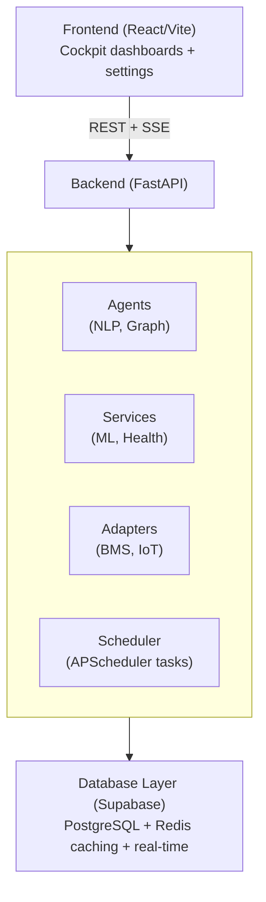

# Sentinel AI

> Your buildings talk. We help you listen.

Sentinel manages **knowledge about buildings** so that humans and AI can make **safe, evidence-based decisions**.

It is a **data-agnostic AI-powered building intelligence layer** that sits above any BMS/SCADA system. Every input — BACnet telemetry, a staff complaint, an AI prediction — follows the same closed-loop lifecycle:

```text
Observation → Evidence → Knowledge → Decision → Action → Outcome → Observation
```

| Source | Input | Evidence | Knowledge | Output |
|---|---|---|---|---|
| Building | BACnet telemetry | sensor_readings | Equipment state | Recommendation |
| Humans | Staff complaint | observation_store | Occupancy/comfort | Work order |
| Models | Prediction error | accuracy_log | Drift verdict | Retraining trigger |

Sentinel is not a BMS. It is the **intelligence layer** — observational, predictive, and trust-gated from shadow through autonomous authority.

## Architecture



Full system design: [`docs/02-architecture/system-overview.md`](docs/02-architecture/system-overview.md) and
[architecture decision records](docs/02-architecture/).

## Quick Start

```bash
git clone git@github.com:Bederf/sentinel-ai.git
cd sentinel-ai

cp .env.example .env
# Edit .env with your Supabase credentials

./quickstart.sh
```

This starts the backend (FastAPI on `:9095`) and frontend (Vite on `:5173`).

## Project Structure

```
├── backend/          # FastAPI application
│   ├── app/
│   │   ├── agents/       # NLP, recommendation, automation agents
│   │   ├── api/          # REST endpoints + SSE real-time events
│   │   ├── services/     # ML, health monitoring, integrations
│   │   ├── adapters/     # BMS protocol adapters (BACnet, Modbus)
│   │   └── database/     # Supabase client + repositories
│   └── tests/
├── frontend/         # React + Vite + TypeScript
│   ├── src/
│   │   ├── cockpit/     # Main dashboard views
│   │   ├── settings/    # Configuration UI
│   │   └── components/  # Shared UI components
│   └── e2e/             # Playwright tests
├── supabase/         # Database migrations + config
├── docs/             # Architecture, API reference, operations
├── infrastructure/   # Docker, monitoring, deployment configs
└── .github/          # CI/CD workflows
```

## Running Tests

```bash
# Backend tests
cd backend && python -m pytest

# Frontend tests
cd frontend && npm test

# End-to-end tests
cd frontend && npx playwright test
```

## Deployment

### Docker Compose (production)

```bash
docker compose -f docker-compose.prod.yml up -d
```

### Services

- `sentinel-backend.service` — systemd unit for the FastAPI backend
- `sentinel-frontend.service` — systemd unit for the frontend (Nginx)

## Environment

See `.env.example` for all required configuration:

| Variable | Description |
|----------|-------------|
| `SUPABASE_URL` | Supabase project URL |
| `SUPABASE_SERVICE_KEY` | Supabase service role key |
| `DATABASE_URL` | PostgreSQL connection string |
| `REDIS_URL` | Redis connection string (caching) |

## Key Features

- **Predictive maintenance** — ML models trained on BMS telemetry detect anomalies before failure
- **Automated diagnostics** — AI agents analyze faults and recommend actions
- **Real-time monitoring** — SSE-powered live dashboard with 30s polling
- **Multi-site** — Site-isolated data model supports any number of buildings
- **Protocol agnostic** — SIMBIOT adapter layer works with BACnet, Modbus, Desigo, Niagara
- **Human-in-loop** — All automated actions require operator approval

## Documentation

[`docs/README.md`](docs/README.md) is the full documentation index. Highlights:

- [Getting started](docs/01-getting-started/) — quick start, dev environment, local setup
- [Architecture](docs/02-architecture/) — system overview and ADRs
- [API reference](docs/03-api-reference/)
- [Security & privacy](docs/09-security/)

## Security

See [`SECURITY.md`](SECURITY.md) for how to report a vulnerability and what the automated security checks cover.

## Contributing

See [`CONTRIBUTING.md`](CONTRIBUTING.md) for local checks to run before opening a pull request.

## License

[Apache License 2.0](LICENSE).
