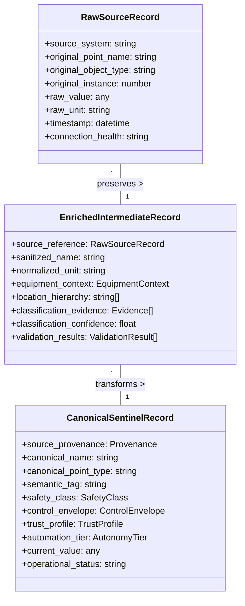

# SIMBIOT Semantic Ingestion & Canonicalization Architecture

**Status**: Active Design (Phase 162)
**Version**: 1.0
**Last Updated**: 2026-03-19
**Owners**: Data Platform Team, AI Core Team

---

## Executive Summary

**SIMBIOT is a semantic ingestion, validation, and canonicalization layer that converts heterogeneous BMS telemetry and control points into SENTINEL's trusted operational model, while preserving provenance, enforcing safety classification, and preparing data for analytics and controlled autonomy.**

### Core Principle

SIMBIOT serves as the building protocol and semantic bridge between raw BMS data and SENTINEL's canonical operational model. This architecture enables:

- **Multi-vendor interoperability**: Connect Siemens, Trane, Schneider, Niagara, and legacy systems
- **Consistent semantics**: Haystack-inspired tagging with SENTINEL extensions for control
- **Safety-first automation**: Risk-based classification before any autonomous actions
- **Provenance preservation**: Complete data lineage from source to canonical model
- **Scalable onboarding**: Template-based site integration with validation gates

### Strategic Alignment

This architecture aligns with Desigo Optic's semantic normalization principles while extending them for autonomous control:

| **Desigo Optic** | **SIMBIOT + SENTINEL** |
|------------------|------------------------|
| Haystack tagging for visualization | Haystack-inspired tagging for control |
| Operator interface focus | Autonomous decision-making focus |
| Data harmonization | Data harmonization + safety classification |
| Protocol normalization | Protocol normalization + control envelopes |
| Static templates | Dynamic templates with trust scoring |

---

## Architecture Overview

### Pipeline Flow

```mermaid
graph TD
    A[Raw BMS Data\n(BACnet, Modbus, KNX,\nDesigo Optic, etc.)] --> B[Source Adapters]
    B --> C[Raw Capture Layer]
    C --> D[Sanitization Layer]
    D --> E[Semantic Mapping Layer]
    E --> F[Validation Layer]
    F --> G[Safety Classification Layer]
    G --> H[Canonical Model Output]
    H --> I[Provenance & Audit Trail]

    style A fill:#f9f,stroke:#333
    style B fill:#bbf,stroke:#333
    style C fill:#bbf,stroke:#333
    style D fill:#bbf,stroke:#333
    style E fill:#bbf,stroke:#333
    style F fill:#bbf,stroke:#333
    style G fill:#bbf,stroke:#333
    style H fill:#9f9,stroke:#333
    style I fill:#9f9,stroke:#333
```

### Three-Layer Data Model



---

## Pipeline Stages Specification

### 1. Source Adapters Layer

**Purpose**: Protocol-specific connection and raw data extraction

**Responsibilities**:
- Maintain protocol-specific connections (BACnet, Modbus, KNX, MQTT, etc.)
- Handle connection lifecycle and health monitoring
- Extract raw point data with minimal transformation
- Preserve source system metadata and timestamps

**Implementation**:
- `backend/app/services/simbiot/adapters/`
- Protocol-specific adapter classes
- Connection pooling and health checks
- Raw data streaming with buffering

**Key Metrics**:
- Connection uptime percentage
- Data retrieval latency
- Protocol-specific error rates

### 2. Raw Capture Layer

**Purpose**: Preserve original data fidelity and provenance

**Responsibilities**:
- Store exact copies of raw protocol data
- Maintain source system identification
- Preserve original naming, units, and data types
- Capture connection state and timestamps
- Enable raw data replay for debugging

**Data Structure**:
```typescript
interface RawSourceRecord {
    // System identification
    source_system: "BACnet" | "Modbus" | "Desigo Optic" | "Niagara" | "MQTT" | "OPC UA";
    source_version: string;
    adapter_version: string;

    // Point identification
    original_point_name: string;
    original_object_type: string;  // BACnet object type, Modbus register type, etc.
    original_instance: number;     // BACnet instance number, Modbus address, etc.

    // Data characteristics
    raw_value: any;               // Exact value from source
    raw_unit: string;             // Original unit string
    raw_data_type: "float" | "integer" | "boolean" | "string" | "unknown";

    // Temporal information
    source_timestamp: string;     // Timestamp from source system
    ingestion_timestamp: string;  // When SIMBIOT received it

    // Connection context
    connection_id: string;
    connection_health: "healthy" | "degraded" | "failed" | "reconnecting";

    // Provenance
    site_id: string;
    building_id?: string;
    device_id?: string;
}
```

**Implementation**:
- `backend/app/services/simbiot/raw_capture.py`
- Time-series storage for raw data
- Provenance chain maintenance
- Raw data archive and replay

### 3. Sanitization Layer

**Purpose**: Normalize data format without losing semantic meaning

**Responsibilities**:
- Standardize naming conventions
- Normalize units and abbreviations
- Clean character sets and encodings
- Handle vendor-specific quirks
- Prepare for semantic classification

**Transformation Rules**:

| **Category** | **Before** | **After** | **Rationale** |
|--------------|-----------|-----------|--------------|
| Case | `Sa_Temp` | `sa_temp` | Consistent lowercase with underscores |
| Separators | `SA-TEMP`, `SA TEMP` | `sa_temp` | Standard separator |
| Abbreviations | `SAT`, `SUPPLY AIR TEMP` | `supply_air_temp` | Full descriptive names |
| Units | `DEG`, `Deg. C`, `°C` | `degC` | Standardized unit format |
| Vendors | `Trane-SAT-01` | `supply_air_temp` | Remove vendor prefixes |

**Implementation**:
- `backend/app/services/simbiot/sanitization_engine.py`
- Rule-based transformation pipeline
- Site-specific override dictionaries
- Sanitization audit logging

### 4. Semantic Mapping Layer

**Purpose**: Assign canonical meaning to sanitized data

**Responsibilities**:
- Canonical dictionary lookup
- Weighted evidence classification
- Equipment context assignment
- Point type determination
- Writable flag assignment
- Location hierarchy mapping

**Canonical Dictionary Structure**:
```json
{
  "version": "1.0",
  "semantic_tags": {
    "supply_air_temperature_sensor": {
      "description": "Measures temperature of air leaving AHU/supply duct",
      "applies_to": ["AHU", "FCU", "VAV", "CRAC", "SPLIT"],
      "expected_units": ["degC", "degF"],
      "point_types": ["analog_input", "analog_value"],
      "classification_rules": [
        {
          "source": "haystack_id",
          "pattern": "**supply**air**temp*",
          "weight": 0.95
        },
        {
          "source": "point_name",
          "patterns": ["SAT", "SA-TEMP", "SUPPLY-AIR-TEMP"],
          "weight": 0.85
        }
      ],
      "required_evidence": 2,
      "minimum_confidence": 0.7,
      "safety_class": "LOW"
    }
  }
}
```

**Implementation**:
- `backend/app/services/simbiot/semantic_mapper.py`
- `backend/app/data/simbiot/semantic_dictionary.json`
- Evidence-based classification engine
- Confidence scoring and thresholds

### 5. Validation Layer

**Purpose**: Ensure data quality and detect anomalies

**Responsibilities**:
- Static validation (physical bounds, unit consistency)
- Dynamic validation (rate-of-change, freshness)
- Confidence scoring
- Anomaly detection
- Quarantine management

**Validation Categories**:

**Static Validation** (metadata rules):
- Temperature range: -40°C to 120°C
- Humidity range: 0-100%
- Pressure bounds: 0-1000 kPa
- Writable flag consistency
- Unit compatibility

**Dynamic Validation** (runtime behavior):
- Freshness: Max age 5 minutes before warning
- Rate-of-change: Physical plausibility checks
- Command feedback: Write-read verification
- Conflicting states: Logical consistency
- Sensor silence: Connectivity monitoring

**Implementation**:
- `backend/app/services/simbiot/validation_engine.py`
- Static rule validator
- Dynamic anomaly detector
- Validation result logging
- Quarantine management

### 6. Safety Classification Layer

**Purpose**: Determine automation eligibility and control boundaries

**Responsibilities**:
- Assign safety classes (LOW/MEDIUM/HIGH)
- Define control envelopes
- Determine automation tiers
- Route to review queues
- Enforce safety overrides

**Safety Class Matrix**:

| **Safety Class** | **Description** | **Automation Tier** | **Review Required** |
|------------------|----------------|---------------------|---------------------|
| LOW | Monitor/presentation only | OBSERVE_ONLY | No |
| MEDIUM | Supervised control | SUPERVISED | Yes (first time) |
| HIGH | Critical safety systems | OBSERVE_ONLY | Mandatory |

**Control Envelope Structure**:
```typescript
interface ControlEnvelope {
    // Value constraints
    bounds?: {
        min: number;
        max: number;
        soft_min?: number;
        soft_max?: number;
        rationale: string;
    };

    // Temporal constraints
    min_cooldown_seconds?: number;
    max_daily_writes?: number;

    // Rate limits
    ramp_limits?: {
        max_per_second?: number;
        max_per_minute?: number;
        rationale: string;
    };

    // Safety overrides
    writable_override?: boolean;
    monitor_only?: boolean;
    requires_manual_approval?: boolean;
    alarm_on_change?: boolean;

    // Operational rules
    requires_verification?: boolean;
    verification_timeout_seconds?: number;
    rollback_on_failure?: boolean;
}
```

**Implementation**:
- `backend/app/services/simbiot/safety_classifier.py`
- `backend/app/models/control_envelope.py`
- Safety class assignment engine
- Control envelope generator
- Review queue integration

### 7. Canonical Model Output

**Purpose**: Provide standardized data to SENTINEL services

**Responsibilities**:
- Generate canonical SENTINEL records
- Enforce schema consistency
- Integrate with downstream services
- Maintain real-time updates
- Handle versioning and migrations

**Canonical Point Schema**:
```typescript
interface CanonicalSentinelPoint {
    // Provenance (immutable)
    source_provenance: {
        source_system: string;
        site_id: string;
        device_id: string;
        equipment_id: string;
        original_point_name: string;
        original_object_type: string;
        original_instance: number;
        ingestion_timestamp: string;
    };

    // Identity (normalized)
    canonical_name: string;
    canonical_point_type: "analog_input" | "analog_output" | "binary_input" | "binary_output" | "multi_state";
    semantic_tag: string;

    // Context
    equipment_id: string;
    equipment_type: string;
    location_hierarchy: string[];

    // Data characteristics
    unit: string;
    data_type: "float" | "integer" | "boolean" | "string";
    writable: boolean;

    // Quality & validation
    data_quality_score: number;  // 0.0 - 1.0
    validation_status: "passed" | "warning" | "failed" | "quarantined";
    last_validation_timestamp: string;
    last_valid_value_timestamp: string;

    // Safety & control
    safety_class: "LOW" | "MEDIUM" | "HIGH";
    control_envelope: ControlEnvelope;
    automation_tier: "OBSERVE_ONLY" | "SHADOW_DRY_RUN" | "SHADOW_LIVE" | "SUPERVISED" | "AUTOMATIC";

    // Operational state
    current_value: any;
    current_value_timestamp: string;
    operational_status: "normal" | "fault" | "override" | "maintenance" | "unknown";

    // Classification metadata
    classification_confidence: number;
    classification_evidence: {
        source: string;
        rule: string;
        weight: number;
        contribution: number;
    }[];

    // Trust & eligibility
    trust_profile: {
        stable_days: number;
        validation_runs: number;
        successful_actions: number;
        control_trust_score: number;
    };

    // Audit information
    created_at: string;
    updated_at: string;
    version: string;
}
```

**Implementation**:
- `backend/app/models/canonical_point.py`
- `backend/app/services/simbiot/canonical_output.py`
- Real-time canonical model publisher
- Schema version management

### 8. Provenance & Audit Trail

**Purpose**: Maintain complete data lineage and auditability

**Responsibilities**:
- Track transformation history
- Store classification evidence
- Log validation results
- Record safety determinations
- Enable forensic analysis
- Support compliance audits

**Audit Record Structure**:
```typescript
interface PointAuditTrail {
    point_id: string;
    site_id: string;
    equipment_id: string;

    // Source provenance
    source_history: {
        timestamp: string;
        source_system: string;
        raw_value: any;
        raw_unit: string;
    }[];

    // Transformation history
    sanitization_steps: {
        timestamp: string;
        transformation: string;
        before: string;
        after: string;
        rule_applied: string;
    }[];

    // Classification evidence
    classification_history: {
        timestamp: string;
        semantic_tag: string;
        confidence: number;
        evidence: {
            source: string;
            rule: string;
            weight: number;
            contribution: number;
        }[];
        dictionary_version: string;
    }[];

    // Validation results
    validation_history: {
        timestamp: string;
        validation_type: "static" | "dynamic";
        rule: string;
        result: "pass" | "warn" | "fail";
        value_tested: any;
        message?: string;
    }[];

    // Safety classification
    safety_history: {
        timestamp: string;
        safety_class: "LOW" | "MEDIUM" | "HIGH";
        rationale: string;
        reviewer?: string;
        control_envelope: ControlEnvelope;
    }[];

    // Automation decisions
    automation_history: {
        timestamp: string;
        previous_tier: AutonomyTier;
        new_tier: AutonomyTier;
        reason: string;
        approved_by?: string;
    }[];
}
```

**Implementation**:
- `backend/app/services/simbiot/audit_service.py`
- `backend/app/models/audit_trail.py`
- Time-series audit storage
- Forensic analysis tools
- Compliance reporting

---

## Autonomy Tier System

### Tier Definitions

| **Tier** | **Description** | **Behavior** | **Requirements** |
|-----------|----------------|--------------|------------------|
| OBSERVE_ONLY | Monitoring only | Log decisions, no suggestions | Default for unknown/low-confidence points |
| SHADOW_DRY_RUN | Simulation mode | Log would-be actions, no execution | Minimum scores + 2 days stable data |
| SHADOW_LIVE | Advisory mode | Suggest actions, show predictions | Good scores + 7 days stable + 5 actions |
| SUPERVISED | Human-in-loop | Suggest + request approval | High scores + 14 days stable + 20 actions |
| AUTOMATIC | Full autonomy | Suggest + execute automatically | Perfect scores + 30 days stable + 50 actions |

### Promotion Criteria

```python
def calculate_autonomy_tier(point: CanonicalSentinelPoint) -> AutonomyTier:
    # Safety class override
    if point.safety_class == "HIGH":
        return "OBSERVE_ONLY"

    # Template completeness
    if point.template_completeness < 0.70:
        return "OBSERVE_ONLY"

    # Classification confidence
    if point.classification_confidence < 0.70:
        return "OBSERVE_ONLY"

    # Data quality
    if point.data_quality_score < 0.70:
        return "OBSERVE_ONLY"

    # Trust history requirements
    if point.trust_profile.stable_days >= 30 and \
       point.trust_profile.validation_runs >= 1000 and \
       point.trust_profile.successful_actions >= 50:
        return "AUTOMATIC"

    elif point.trust_profile.stable_days >= 14 and \
         point.trust_profile.validation_runs >= 500 and \
         point.trust_profile.successful_actions >= 20:
        return "SUPERVISED"

    elif point.trust_profile.stable_days >= 7 and \
         point.trust_profile.validation_runs >= 100 and \
         point.trust_profile.successful_actions >= 5:
        return "SHADOW_LIVE"

    elif point.trust_profile.stable_days >= 2:
        return "SHADOW_DRY_RUN"

    else:
        return "OBSERVE_ONLY"
```

---

## Implementation Roadmap

### Phase 162A: Foundation Layer (6 weeks)

**Objective**: Build the semantic ingestion and validation foundation

| **Week** | **Focus** | **Deliverables** |
|----------|-----------|------------------|
| 1-2 | Canonical Dictionary | `semantic_dictionary.json`, tag models, dictionary service |
| 3-4 | Semantic Classifier | Classification engine, evidence scoring, confidence thresholds |
| 5 | Static Validation | Validation rules, bounds checking, unit consistency |
| 6 | Safety Classification | Safety class assignment, review queue, basic control envelopes |

**Acceptance Criteria**:
- 90% of BACnet points classified with confidence > 0.70
- 100% of impossible values caught by validation
- All writable points routed to review before control enablement
- Evidence records created for all classifications

### Phase 162B: Control Enablement Layer (4-6 weeks)

**Objective**: Add dynamic validation and trust-based control

| **Week** | **Focus** | **Deliverables** |
|----------|-----------|------------------|
| 1 | Dynamic Validation | Freshness monitoring, rate-of-change detection, command verification |
| 2 | Control Envelopes | Bounds, rate limits, cooldowns, safety overrides |
| 3 | Trust Scoring | Stable days tracking, validation runs, successful actions |
| 4 | Impact Reporting | Action logging, value tracking, ROI dashboards |
| 5-6 | Integration | End-to-end testing, performance optimization, documentation |

**Acceptance Criteria**:
- 100% of writable points have control envelopes
- Dynamic validation catches 95% of real anomalies
- Trust scoring prevents unsafe automation
- Impact reporting shows measurable value

### Phase 162C: Optimization Layer (Ongoing)

**Objective**: Refine performance, expand coverage, and improve reliability

**Focus Areas**:
- Performance tuning (latency, throughput)
- Template expansion (new equipment types)
- Site onboarding acceleration
- Continuous validation improvement
- Template completeness scoring
- Site-specific override management

**Success Metrics**:
- 95% auto-classification rate for new sites
- <100ms classification latency (p95)
- <50ms validation latency (p95)
- 0 unsafe control actions in production

---

## Key Design Principles

### 1. Preserve Provenance
**Never lose the connection to original BMS data**
- Maintain raw source records indefinitely
- Store complete transformation history
- Enable forensic analysis and debugging
- Support compliance and audit requirements

### 2. Progressive Enrichment
**Add context at each stage, don't overwrite raw data**
- Keep raw, enriched, and canonical layers separate
- Allow rollback to previous stages
- Support iterative improvement
- Enable A/B testing of classification rules

### 3. Risk-Based Automation
**Safety class dictates control eligibility, not confidence score**
- Critical systems default to OBSERVE_ONLY
- Writable points require explicit approval
- Trust must be earned through stability
- Fail-closed on any safety violation

### 4. Auditable Decisions
**Every classification and validation decision must be explainable**
- Store evidence for all classifications
- Log validation results with context
- Document safety determinations
- Enable human review and override

### 5. Graceful Degradation
**Handle unknown/messy data safely**
- Allow unknown equipment types
- Quarantine bad data
- Provide fallback behaviors
- Never force false confidence

### 6. Site-Specific Flexibility
**Accommodate unique building characteristics**
- Site override dictionaries
- Template customization
- Local naming conventions
- Building-specific validation rules

---

## Integration Points

### Upstream Dependencies

| **System** | **Integration Point** | **Data Flow** |
|------------|----------------------|---------------|
| BACnet Systems | `simbiot/adapters/bacnet_adapter.py` | Raw point data → SIMBIOT |
| Modbus Devices | `simbiot/adapters/modbus_adapter.py` | Register data → SIMBIOT |
| Desigo Optic | `simbiot/adapters/desigo_adapter.py` | Haystack-tagged data → SIMBIOT |
| Niagara Systems | `simbiot/adapters/niagara_adapter.py` | Point data → SIMBIOT |
| MQTT Brokers | `simbiot/adapters/mqtt_adapter.py` | Topic messages → SIMBIOT |

### Downstream Consumers

| **System** | **Integration Point** | **Data Flow** |
|------------|----------------------|---------------|
| Analytics Engine | `analytics/canonical_consumer.py` | SIMBIOT → Time-series analysis |
| Recommendation Engine | `ai_optimizer/canonical_input.py` | SIMBIOT → Optimization context |
| Control Services | `control_policy/canonical_points.py` | SIMBIOT → Control eligibility |
| Alerting System | `notification/canonical_monitor.py` | SIMBIOT → Anomaly detection |
| Digital Twin | `digital_twin/canonical_sync.py` | SIMBIOT → 3D model mapping |

---

## Monitoring & Observability

### Key Metrics

**Ingestion Health**:
- Points ingested per second
- Adapter connection status
- Raw data latency
- Sanitization success rate

**Classification Quality**:
- Auto-classification rate
- Average classification confidence
- Manual review rate
- Classification latency

**Validation Effectiveness**:
- Anomalies detected per hour
- False positive rate
- Quarantine rate
- Validation latency

**Safety Compliance**:
- Safety class distribution
- Review queue depth
- Approval latency
- Control envelope coverage

**Automation Performance**:
- Autonomy tier distribution
- Successful control actions
- Manual overrides
- Trust score trends

### Alerting Thresholds

| **Metric** | **Warning** | **Critical** |
|------------|------------|-------------|
| Adapter disconnect | 1 minute | 5 minutes |
| Classification failure | 5% of points | 10% of points |
| Validation failure | 1% of points | 5% of points |
| Review queue depth | 50 items | 100 items |
| Trust score drop | 10% decrease | 20% decrease |
| Control mismatch | 1 event | 3 events |

---

## Security Considerations

### Data Protection
- Encrypt sensitive metadata at rest
- Mask credentials in audit logs
- Role-based access to raw data
- Audit all classification changes

### Control Safety
- Fail-closed on safety violations
- Manual override capability
- Emergency stop integration
- Safety class immutability

### Compliance
- Complete audit trails
- Change logging
- Review approval records
- Compliance reporting

---

## References

1. **Desigo Optic Documentation**: [Siemens Digital Industries Software](https://www.siemens.com/en-us/products/desigo/optic/)
2. **Project Haystack**: [Haystack 5 Semantic Engine](https://marketing.project-haystack.org/submitted-articles/haystack-5-it-s-more-than-tagging-it-s-the-semantic-engine-for-the-future-of-smart-buildings)
3. **SIMBIOT Architecture**: `docs/02-architecture/SIMBIOT-ARCHITECTURE.md`
4. **Control Policy**: `backend/app/models/control_policy.py`
5. **Phase 162 Planning**: `.planning/phases/162-semantic-control-foundation/`

---

## Appendix: Decision Log

### Why This Architecture?

1. **Desigo Optic Alignment**: Matches Siemens' semantic normalization approach while adding control capabilities
2. **Haystack Compatibility**: Leverages proven semantic tagging patterns from Project Haystack
3. **Safety First**: Explicit safety classification before any autonomous actions
4. **Provenance Preservation**: Complete data lineage for debugging and compliance
5. **Scalable Onboarding**: Template-based approach accelerates new site integration
6. **Risk-Based Automation**: Trust must be earned, not assumed

### Key Differences from Desigo Optic

| **Aspect** | **Desigo Optic** | **SIMBIOT + SENTINEL** |
|------------|------------------|------------------------|
| Primary Use | Visualization & operator interface | Autonomous control & optimization |
| Tagging | Haystack for presentation | Haystack-inspired for control |
| Safety | Operator-driven | System-enforced with overrides |
| Automation | Manual operator actions | Risk-based autonomous actions |
| Provenance | Limited to current state | Complete transformation history |
| Trust Model | Operator judgment | Quantitative trust scoring |

### Lessons from Haystack

1. **Semantic Consistency**: Standardized tags enable cross-system interoperability
2. **Equipment Context**: Points gain meaning from their equipment relationships
3. **Unit Normalization**: Consistent units prevent calculation errors
4. **Validation Importance**: Early validation prevents downstream issues
5. **Template Reusability**: Equipment templates accelerate onboarding

This architecture provides the semantic foundation that enables SENTINEL to operate safely and effectively across diverse building systems while maintaining the flexibility to handle site-specific requirements.
