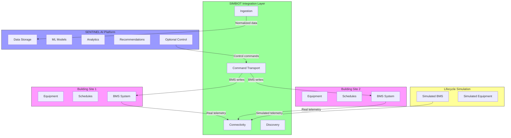
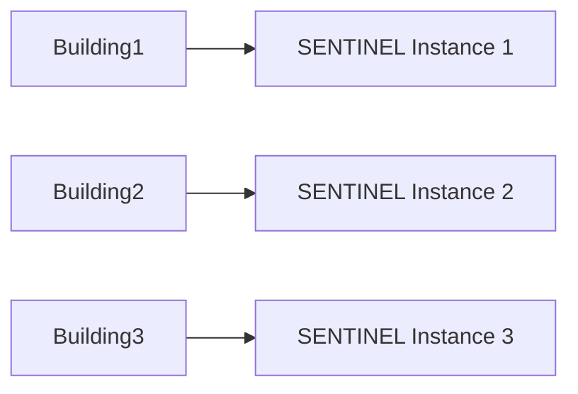
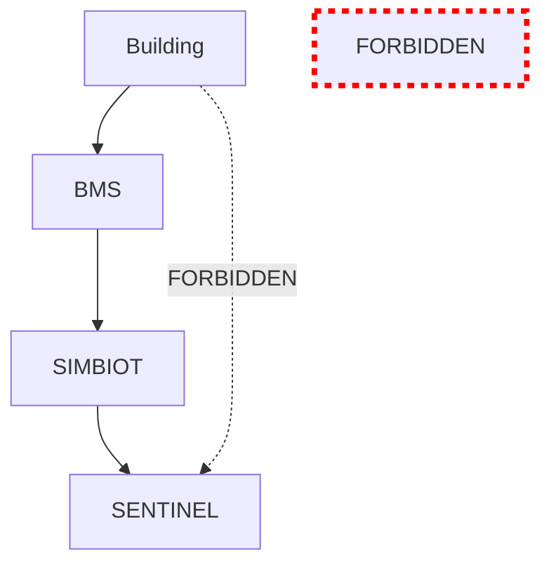
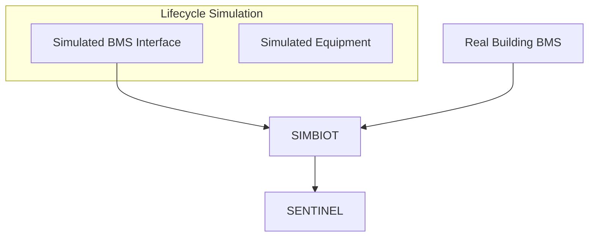
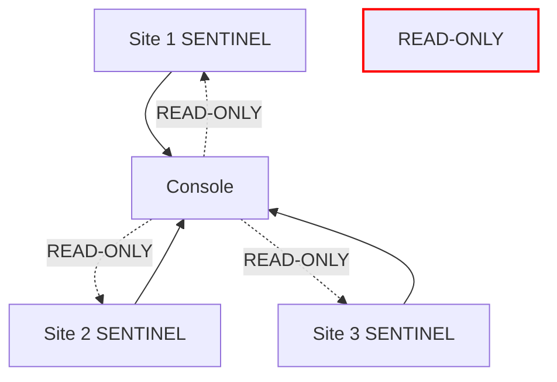
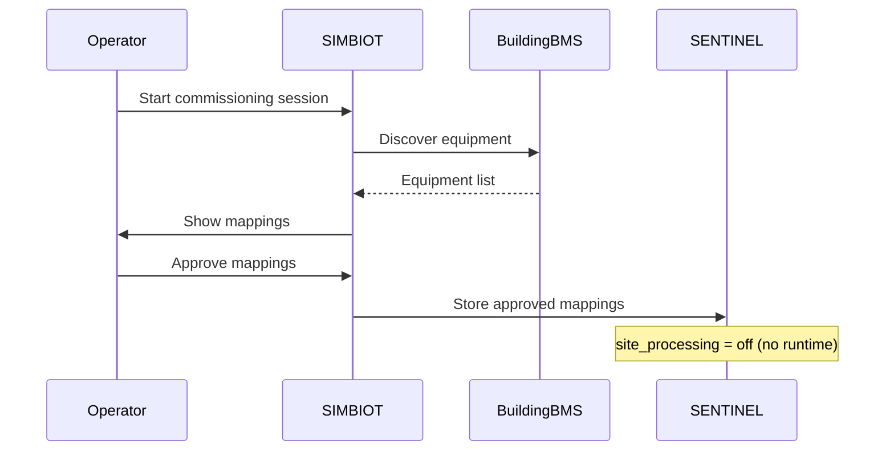
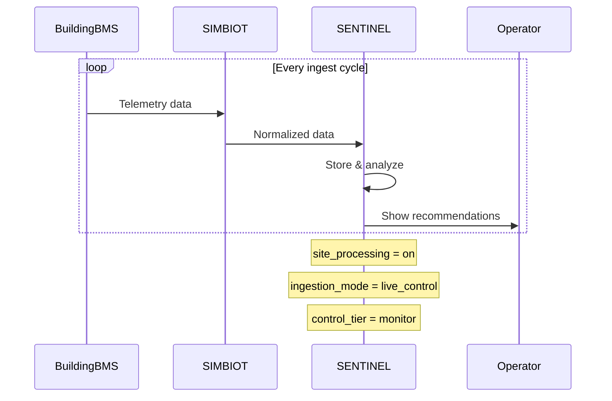
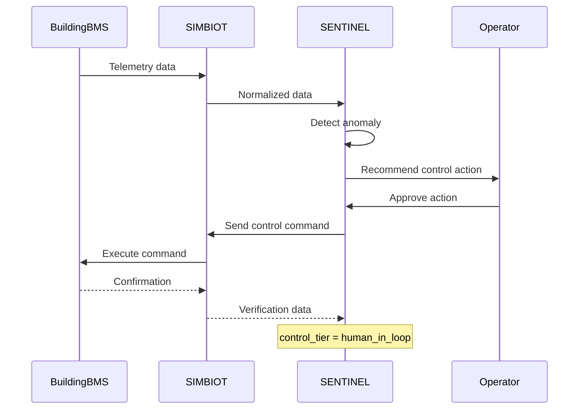

# SENTINEL-Site Separation Diagram

## Visual Representation

## Key Boundary Rules

### 1. One SENTINEL Instance Per Building

### 2. SIMBIOT is the Only Connection

### 3. Lifecycle Simulation is a BMS Source

### 4. Multi-Site Console is Read-Only

## Operational Flow Examples

### Commissioning Flow

### Production Monitoring Flow

### Supervised Control Flow

## Data Flow Boundaries

### What Crosses SIMBIOT Boundary

✅ **Allowed:**
- Telemetry readings (temperature, pressure, status, etc.)
- Equipment metadata (names, types, locations)
- Control commands (setpoints, mode changes)
- Command verification responses

❌ **Forbidden:**
- Direct database access
- Raw building network access
- Bypassing quality gates
- Unapproved control actions

### What Stays in SENTINEL

🔒 **SENTINEL-only:**
- Historical data storage
- ML model training
- Recommendation generation
- Audit logs
- User preferences
- Module configurations

### What Stays in Building

🏢 **Building-only:**
- Physical equipment state
- Local schedules
- Emergency overrides
- Building network infrastructure
- Local operator interfaces

## Related Documents

- [SENTINEL-Site Separation Principle](../principles/SENTINEL-SITE-SEPARATION.md)
- [Architecture Principles](../principles/architecture-principles.md)
- [Building Operating Lifecycle](../principles/building-operating-lifecycle.md)
