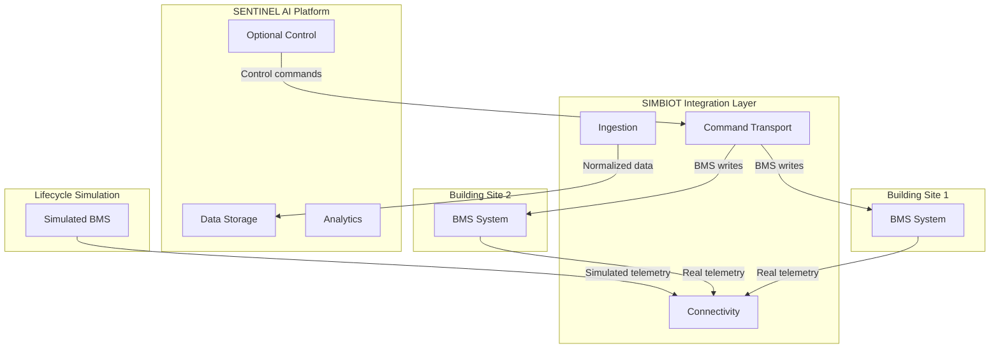
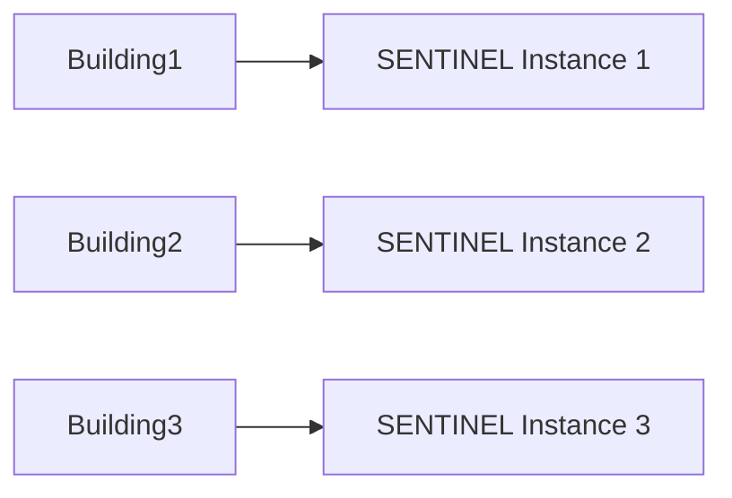
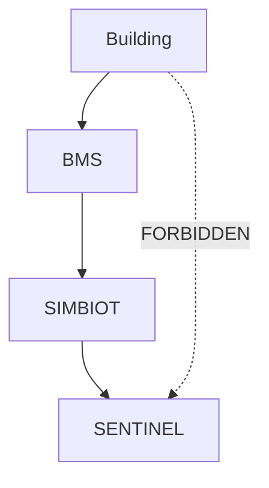
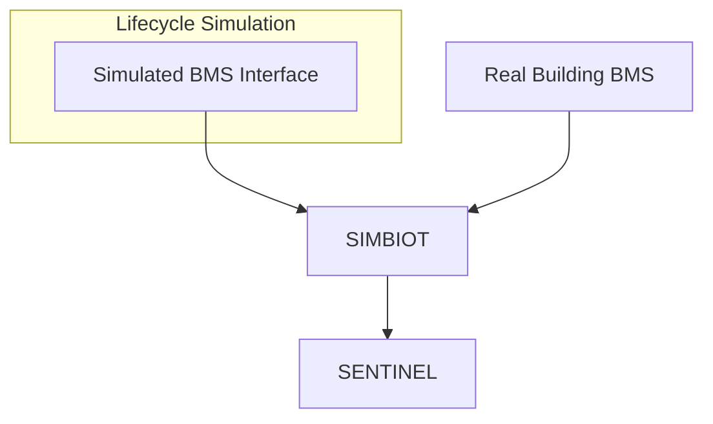
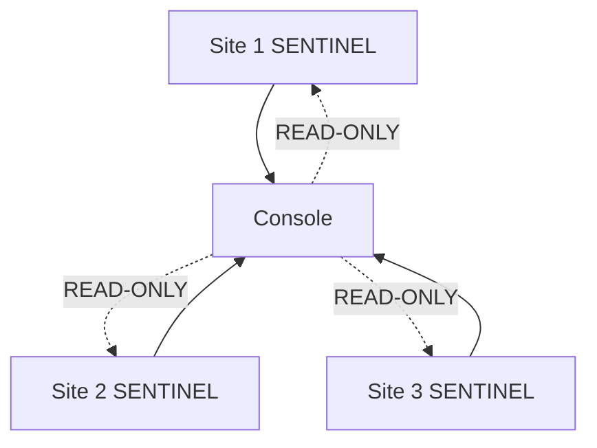
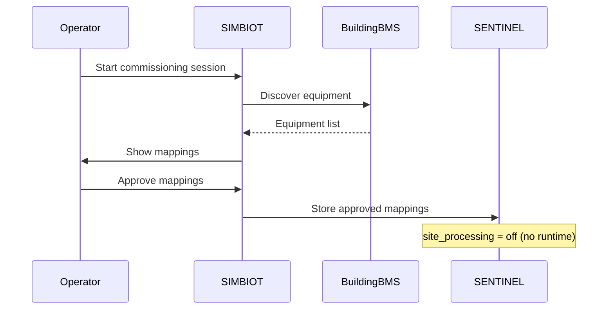
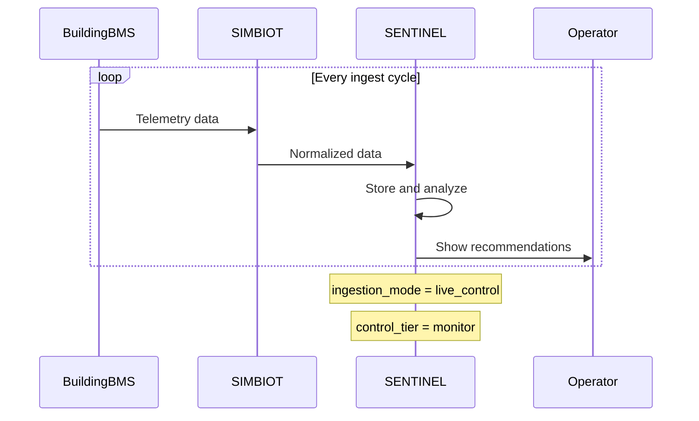
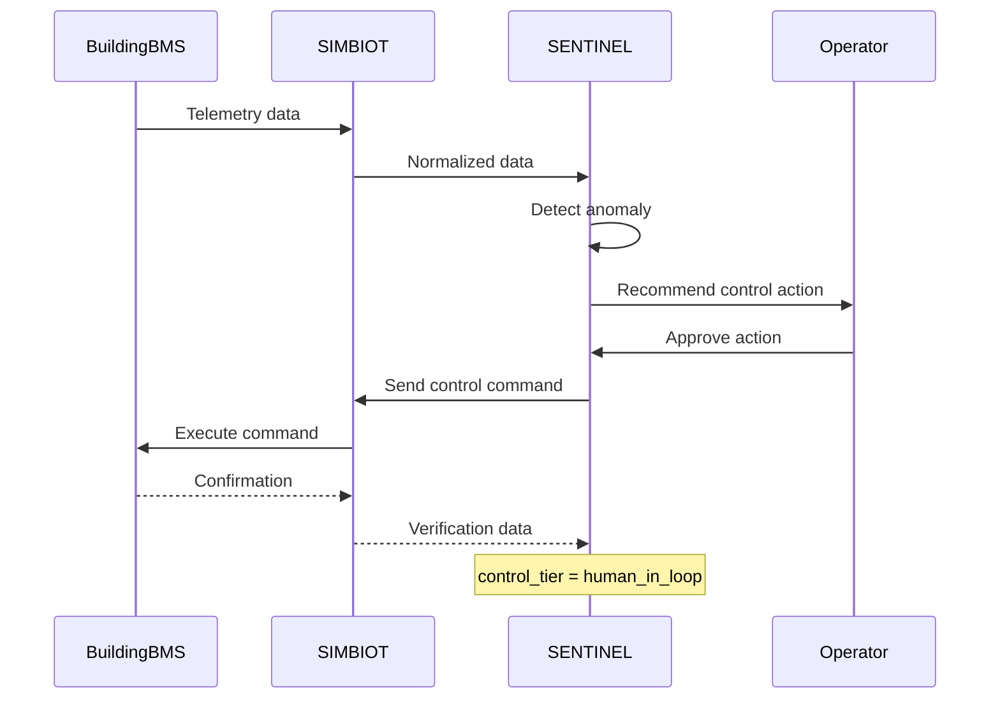

# SENTINEL and Site Separation Principle

## Core Design Principle

**SENTINEL and Sites are fundamentally separate entities, connected only through the BMS via SIMBIOT.**

### The Boundary Rule

```text
building -> BMS source -> SIMBIOT -> SENTINEL
```

This boundary must be maintained at all times. SENTINEL is an overlay, not an owner of building operations.

## Entity Definitions

### Site/Building
- Physical building with equipment, schedules, and operational state
- Owns its own BMS (Building Management System)
- Independent runtime entity
- May use real BMS or lifecycle simulation as its BMS source

### SIMBIOT
- Integration boundary layer
- Handles protocol connectivity, discovery, ingestion, and command transport
- Only connection point between buildings and SENTINEL
- Treats lifecycle simulation as just another BMS source

### SENTINEL
- AI/ML overlay system
- Provides analytics, storage, recommendations, and optional control
- Never owns building operation - only overlays it
- One SENTINEL instance per building in production
- May have read-only multi-site consoles, but operational control remains per-building

## Ownership Matrix

| Component | Owner | Responsibility |
|-----------|-------|----------------|
| Building equipment | Building | Physical systems, schedules, runtime state |
| BMS telemetry | BMS source | Telemetry and control surfaces exposed |
| Protocol connectivity | SIMBIOT | Discovery, ingestion, command transport |
| Data storage | SENTINEL | Historical data, analytics, ML models |
| Recommendations | SENTINEL | AI-generated insights and actions |
| Control decisions | SENTINEL (optional) | Approved control actions through SIMBIOT |

## Key Architectural Rules

1. **One SENTINEL instance per building** in production deployments
2. **SIMBIOT is the only connection** - no direct building-to-SENTINEL links
3. **Lifecycle simulation is a BMS source**, not part of SENTINEL
4. **site_processing = off means disconnected** - no reads, no ingest, no writes
5. **Module activation is SENTINEL-only** - unsupported building systems are ignored
6. **Multi-site consoles are read-only** - operational control remains per-building

## Operational States

### Disconnected
- Building exists but SENTINEL not attached
- `site_processing = off`
- No runtime operations

### Commissioning
- Connect through SIMBIOT
- Discover and map equipment
- Prepare for runtime operations
- No operational ML writes

### Shadow Live
- Live data ingest with no real writes
- Quality gates and baseline collection
- Recommendations generated internally only

### Live Control + Monitor
- Production-grade quality gates
- Recommendations shown to operators
- No direct BMS writes from SENTINEL

### Live Control + Human-in-Loop
- SENTINEL can suggest control actions
- Human approval required for each action
- Full audit and rollback capability

### Live Control + Auto-Execute
- Bounded autonomous control
- Only policy-allowed actions auto-execute
- Safety checks and COV verification mandatory
- Operator notifications continue

## Module Rollout

Modules expand what SENTINEL monitors and controls, but don't change the lifecycle stage:

- **No module active**: That subsystem is ignored even if BMS exposes it
- **Module activated**: Discovery, baselining, recommendations, then optional control
- **Incremental rollout**: Add subsystems (solar, water, security) independently

## ML Maturity Stages

1. **Early**: Conservative baseline models, focus on data quality
2. **Mid**: Site-specific models from building history
3. **Mature**: Closed-loop learning from approved/autonomous actions

**Rule**: Promotion depends on operational evidence, not just model availability

## Safe Operations

- **Demotion always allowed**: Bad data, safety issues, or client request can demote
- **Kill switches**: Site-level and equipment-level emergency stops
- **Rollback paths**: Mandatory for all control actions
- **Audit trails**: Complete history of all SENTINEL actions

## Visual architecture and flows

### System boundary diagram



### Boundary rule diagrams









### Operational sequences







## Implementation Checklist

For new building onboarding:

1. [ ] Connect building through SIMBIOT
2. [ ] Complete discovery and equipment mapping
3. [ ] Start passive baseline collection (shadow_live)
4. [ ] Prove data quality and mapping accuracy
5. [ ] Move to recommendation-only production (live_control + monitor)
6. [ ] Add supervised controls when client ready (human_in_loop)
7. [ ] Add autonomous controls only with evidence (auto_execute)
8. [ ] Add subsystems (solar, water, etc.) as independent modules

## Related Documents

- [Architecture Principles](architecture-principles.md)
- [Building Operating Lifecycle](building-operating-lifecycle.md)
- [SIMBIOT Concept Connector](../../05-integrations/simbiot-concept-connector.md)
- [BMS Adapter Contract](../../05-integrations/bms-adapter-contract.md)
