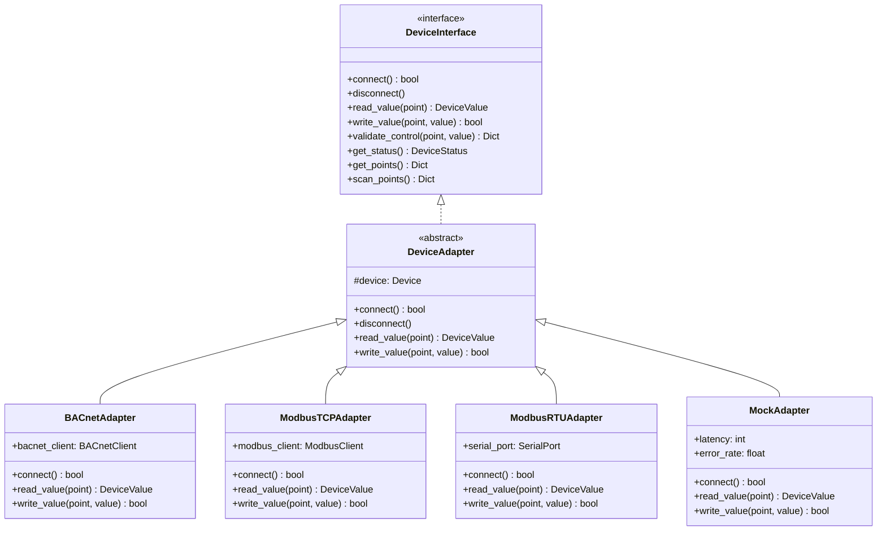

# Device Abstraction Layer Deep Dive

Protocol-agnostic device interface for BMS integration.

## Overview

The **Device Abstraction Layer** provides a unified interface for communicating with diverse BMS protocols (BACnet, Modbus, etc.). It abstracts protocol-specific details, enabling the rest of the application to work with devices without worrying about underlying communication protocols.

## Architecture



## Core Components

### 1. DeviceInterface (Protocol-Agnostic)

**Location:** `backend/app/services/device_abstraction.py`

**Purpose:** Define contract for all device implementations

**Methods:**

```python
class DeviceInterface(ABC):
    """Protocol-agnostic device interface."""

    @abstractmethod
    async def connect(self) -> bool:
        """Connect to the device."""
        pass

    @abstractmethod
    async def disconnect(self) -> None:
        """Disconnect from the device."""
        pass

    @abstractmethod
    async def read_value(self, point_name: str) -> DeviceValue:
        """Read a value from a device point."""
        pass

    @abstractmethod
    async def write_value(self, point_name: str, value: Any, priority: int = 8) -> bool:
        """Write a value to a device point."""
        pass

    async def validate_control(self, point_name: str, value: Any) -> Dict[str, Any]:
        """Validate a control action against safety rules."""
        # Default implementation uses safety engine
        pass

    @abstractmethod
    async def get_status(self) -> DeviceStatus:
        """Get device operational status."""
        pass

    @abstractmethod
    async def get_points(self) -> Dict[str, DevicePoint]:
        """Get all available points on the device."""
        pass
```

### 2. DeviceAdapter (Base Class)

**Purpose:** Provide common functionality for protocol-specific adapters

**Key Features:**
- Device metadata storage
- Safety validation integration
- Audit logging
- Error handling

```python
class DeviceAdapter(ABC):
    """Base class for protocol-specific device adapters."""

    def __init__(self, device: Device):
        self.device = device
        self.logger = logging.getLogger(f"{__name__}.{device.protocol}")

    async def write_value(self, point_name: str, value: Any, priority: int = 8) -> bool:
        """Write with safety validation and audit logging."""
        # Validate against safety rules
        validation = await self.validate_control(point_name, value)

        if not validation["allowed"]:
            self.logger.warning(f"Control blocked: {validation['reasons']}")
            return False

        # Perform write
        success = await self._perform_write(point_name, value, priority)

        # Audit log
        await self._audit_log(point_name, value, success)

        return success
```

### 3. Protocol-Specific Adapters

#### BACnetAdapter

**Protocol:** BACnet IP (ISO 16484-5)

**Key Features:**
- Object property read/write
- Device discovery (Who-Is/IAm)
- Trend log collection
- Alarm subscription

**Example:**

```python
class BACnetAdapter(DeviceAdapter):
    """BACnet IP adapter."""

    def __init__(self, device: Device):
        super().__init__(device)
        self.bacnet_client = BACnetClient()

    async def read_value(self, point_name: str) -> DeviceValue:
        """Read BACnet object property."""
        point = self.device.points[point_name]

        # BACnet read property
        value = await self.bacnet_client.read_property(
            address=self.device.address,
            object_type=point.bacnet_object_type,
            object_instance=point.bacnet_instance,
            property_id=point.bacnet_property
        )

        return DeviceValue(
            point_name=point_name,
            value=value,
            timestamp=datetime.now(),
            quality="good"
        )
```

**BACnet Object Types:**
- `analogInput` (0)
- `analogOutput` (1)
- `analogValue` (2)
- `binaryInput` (3)
- `binaryOutput` (4)
- `binaryValue` (5)

#### ModbusTCPAdapter

**Protocol:** Modbus TCP

**Key Features:**
- Register read/write
- Bit/word operations
- TCP socket communication

**Example:**

```python
class ModbusTCPAdapter(DeviceAdapter):
    """Modbus TCP adapter."""

    def __init__(self, device: Device):
        super().__init__(device)
        self.modbus_client = ModbusTCPClient(device.address)

    async def read_value(self, point_name: str) -> DeviceValue:
        """Read Modbus register."""
        point = self.device.points[point_name]

        # Modbus read holding register
        response = await self.modbus_client.read_holding_registers(
            address=point.modbus_address,
            count=point.modbus_count,
            unit=point.modbus_unit
        )

        # Convert to value
        value = self._decode_registers(response, point.data_type)

        return DeviceValue(
            point_name=point_name,
            value=value,
            timestamp=datetime.now(),
            quality="good"
        )
```

**Modbus Addressing:**
- Coils: Read/write bits (0x0000-0xFFFF)
- Discrete Inputs: Read-only bits (0x0000-0xFFFF)
- Holding Registers: Read/write words (0x0000-0xFFFF)
- Input Registers: Read-only words (0x0000-0xFFFF)

#### MockAdapter

**Purpose:** Testing and demo mode

**Key Features:**
- Realistic latency (50-200ms)
- 5% error simulation
- Pre-defined point values
- Deterministic behavior

**Example:**

```python
class MockAdapter(DeviceAdapter):
    """Mock adapter for testing."""

    def __init__(self, device: Device, latency: int = 100, error_rate: float = 0.05):
        super().__init__(device)
        self.latency = latency
        self.error_rate = error_rate
        self._values = self._initialize_mock_values()

    async def read_value(self, point_name: str) -> DeviceValue:
        """Read mock value with simulated latency."""
        # Simulate network latency
        await asyncio.sleep(random.randint(50, self.latency) / 1000)

        # Simulate occasional errors
        if random.random() < self.error_rate:
            raise DeviceCommunicationError("Simulated communication error")

        return DeviceValue(
            point_name=point_name,
            value=self._values[point_name],
            timestamp=datetime.now(),
            quality="good"
        )
```

### 4. DeviceManager (Singleton)

**Purpose:** Centralized device lifecycle management

**Key Features:**
- Device registration/discovery
- Adapter instantiation
- Connection pooling
- Health monitoring

```python
class DeviceManager:
    """Singleton device manager."""

    _instance = None

    def __new__(cls):
        if cls._instance is None:
            cls._instance = super().__new__(cls)
            cls._instance._devices = {}
            cls._instance._adapters = {}
        return cls._instance

    async def get_device(self, device_id: str) -> Optional[Device]:
        """Get device by ID, creating adapter if needed."""
        if device_id not in self._devices:
            # Load device from database/JSON
            device = await self._load_device(device_id)
            if device:
                self._devices[device_id] = device

        return self._devices.get(device_id)

    async def get_adapter(self, device_id: str) -> Optional[DeviceInterface]:
        """Get device adapter, creating if needed."""
        if device_id not in self._adapters:
            device = await self.get_device(device_id)
            if not device:
                return None

            # Create adapter based on protocol
            adapter = self._create_adapter(device)
            if adapter:
                await adapter.connect()
                self._adapters[device_id] = adapter

        return self._adapters.get(device_id)

    def _create_adapter(self, device: Device) -> DeviceInterface:
        """Create adapter based on device protocol."""
        if device.protocol == "bacnet":
            return BACnetAdapter(device)
        elif device.protocol == "modbus_tcp":
            return ModbusTCPAdapter(device)
        elif device.protocol == "modbus_rtu":
            return ModbusRTUAdapter(device)
        elif device.protocol == "mock":
            return MockAdapter(device)
        else:
            raise ValueError(f"Unsupported protocol: {device.protocol}")
```

## Usage Examples

### Reading Device Points

**GOOD: Use abstraction layer**

```python
from app.services.device_abstraction import device_manager

# Get device adapter (protocol-agnostic)
adapter = await device_manager.get_adapter("S001-CHILLER-B1-001")

# Read point (works for any protocol)
value = await adapter.read_value("chw_supply_temp")
print(f"Temperature: {value.value} {value.unit}")
```

**BAD: Direct protocol usage**

```python
# DON'T do this - ties you to specific protocol
if device.protocol == "bacnet":
    bacnet_client.read_property(...)
elif device.protocol == "modbus":
    modbus_client.read_register(...)
```

### Writing Device Points

**GOOD: Use abstraction layer with safety validation**

```python
# Get adapter
adapter = await device_manager.get_adapter("S001-CHILLER-B1-001")

# Write point (automatically validates against safety rules)
success = await adapter.write_value(
    point_name="chw_supply_temp_setpoint",
    value=7.0
)

if success:
    print("Write successful")
else:
    print("Write blocked or failed")
```

### Device Discovery

```python
# Discover all devices
devices = await device_manager.discover_devices()

for device in devices:
    print(f"Device: {device.id} ({device.name})")
    print(f"  Protocol: {device.protocol}")
    print(f"  Address: {device.address}")
    print(f"  Points: {len(device.points)}")
```

## Extension Patterns

### Adding a New Protocol

**Step 1: Create Adapter Class**

```python
class MyProtocolAdapter(DeviceAdapter):
    """Custom protocol adapter."""

    async def connect(self) -> bool:
        """Connect to device."""
        self.client = MyProtocolClient(self.device.address)
        return await self.client.connect()

    async def read_value(self, point_name: str) -> DeviceValue:
        """Read point value."""
        point = self.device.points[point_name]
        raw_value = await self.client.read_register(point.address)
        return DeviceValue(
            point_name=point_name,
            value=raw_value,
            timestamp=datetime.now(),
            quality="good"
        )

    async def write_value(self, point_name: str, value: Any, priority: int = 8) -> bool:
        """Write point value."""
        point = self.device.points[point_name]
        return await self.client.write_register(point.address, value)

    async def get_status(self) -> DeviceStatus:
        """Get device status."""
        is_online = await self.client.ping()
        return DeviceStatus(
            device_id=self.device.id,
            online=is_online,
            last_update=datetime.now()
        )

    async def get_points(self) -> Dict[str, DevicePoint]:
        """Get device points."""
        return self.device.points

    async def scan_points(self) -> Dict[str, DevicePoint]:
        """Discover points dynamically."""
        # Protocol-specific discovery logic
        points = await self.client.discover_points()
        return {p.name: p for p in points}
```

**Step 2: Register Protocol**

```python
# In DeviceManager._create_adapter()
def _create_adapter(self, device: Device) -> DeviceInterface:
    if device.protocol == "my_protocol":
        return MyProtocolAdapter(device)
    # ... existing protocols
```

**Step 3: Update Device Model**

```python
# In Device model
class Device(BaseModel):
    protocol: Literal["bacnet", "modbus_tcp", "modbus_rtu", "mock", "my_protocol"]
    # ...
```

## Anti-Patterns

### 1. Bypassing Abstraction

**BAD:**

```python
# Direct protocol usage
bacnet_client.read_property(device.address, object_type, instance)
```

**GOOD:**

```python
# Use abstraction layer
adapter = await device_manager.get_adapter(device_id)
value = await adapter.read_value(point_name)
```

### 2. Hardcoding Protocol Checks

**BAD:**

```python
if device.protocol == "bacnet":
    # BACnet-specific logic
elif device.protocol == "modbus":
    # Modbus-specific logic
```

**GOOD:**

```python
# Let adapter handle protocol differences
adapter = await device_manager.get_adapter(device_id)
value = await adapter.read_value(point_name)
```

### 3. Ignoring Safety Validation

**BAD:**

```python
# Direct write without safety check
device.adapter.write_value(point, value)
```

**GOOD:**

```python
# Use write_value which includes safety validation
success = await adapter.write_value(point, value)
```

## Testing

### Unit Tests

```python
async def test_bacnet_adapter_read():
    """Test BACnet adapter read operation."""
    device = Device(
        id="S001-CHILLER-B1-001",
        protocol="bacnet",
        address="192.168.1.100",
        points={
            "chw_supply_temp": DevicePoint(
                name="chw_supply_temp",
                bacnet_object_type="analogInput",
                bacnet_instance=0,
                bacnet_property="presentValue"
            )
        }
    )

    adapter = BACnetAdapter(device)
    await adapter.connect()

    value = await adapter.read_value("chw_supply_temp")

    assert value.value is not None
    assert value.quality == "good"
```

### Mock Adapter for Testing

```python
async def test_device_control_with_mock():
    """Test device control using mock adapter."""
    device = Device(
        id="S001-CHILLER-B1-001",
        protocol="mock",
        points={"temp_setpoint": DevicePoint(name="temp_setpoint")}
    )

    adapter = MockAdapter(device, latency=50, error_rate=0.0)

    # Test write
    success = await adapter.write_value("temp_setpoint", 7.0)
    assert success is True

    # Test read
    value = await adapter.read_value("temp_setpoint")
    assert value.value == 7.0
```

## Performance Considerations

### Connection Pooling

Adapters maintain persistent connections to devices:

```python
# Reuse adapter across multiple operations
adapter = await device_manager.get_adapter(device_id)

# Multiple operations share connection
await adapter.read_value("point1")
await adapter.read_value("point2")
await adapter.write_value("point3", value)
```

### Async Operations

All adapter operations are async for concurrent device access:

```python
# Read from multiple devices concurrently
results = await asyncio.gather(
    device_manager.get_adapter("device1").read_value("temp"),
    device_manager.get_adapter("device2").read_value("temp"),
    device_manager.get_adapter("device3").read_value("temp")
)
```

### Caching

Device metadata cached to reduce database lookups:

```python
# First call loads from database
device = await device_manager.get_device(device_id)

# Subsequent calls return cached device
device = await device_manager.get_device(device_id)
```

## Related Documentation

- [System Architecture](system-overview.md) - High-level architecture
- [Naming Conventions](NAMING_CONVENTIONS.md) - Device ID format
- [BACnet Integration](../07-integrations/bacnet-integration.md) - BACnet protocol details
- [Safety Interlocks Engine](../06-safety-compliance/safety-interlocks-engine.md) - Safety validation
