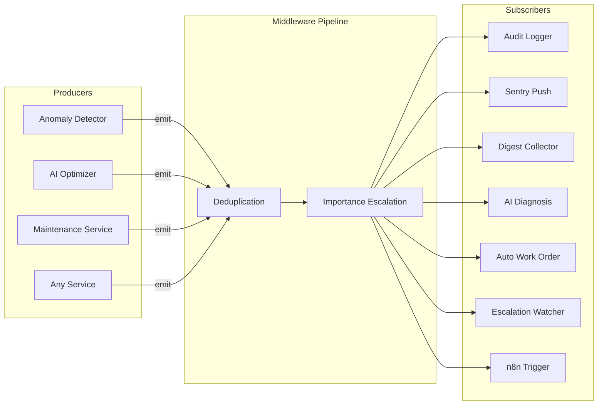

# Event bus architecture

Lightweight async pub/sub event bus for decoupling SENTINEL services. Producers emit `SentinelEvent` instances through a middleware pipeline; matching subscribers execute concurrently. Zero external dependencies -- pure asyncio, runs on SBCs.

## Overview



**Flow:** Producer calls `await bus.emit(event)`. The event passes through each middleware in order. If any middleware returns `None`, the event is suppressed. Otherwise it is delivered to all matching subscribers concurrently via `asyncio.gather` with per-handler 30-second timeouts and error isolation.

## SentinelEvent model

Events use a `domain.action` naming convention (e.g. `sensor.anomaly_detected`, `ai.diagnosis_complete`, `maintenance.work_order_created`).

| Field | Type | Description |
|-------|------|-------------|
| `event_type` | `str` | Domain-dot-action name |
| `source` | `str` | Originating service or module |
| `payload` | `dict` | Arbitrary event data |
| `importance` | `Importance` | Delivery priority (see below) |
| `site_id` | `str?` | Site identifier |
| `equipment_id` | `str?` | Equipment code |
| `building_name` | `str?` | Resolved building name (set by enrichment middleware) |
| `event_id` | `str` | Auto-generated UUID |
| `timestamp` | `str` | ISO 8601 UTC |
| `correlation_id` | `str?` | Links events in a chain |
| `caused_by` | `str?` | `event_id` of the triggering event |

The `domain` and `action` properties split `event_type` on the first dot.

### Event chaining

`event.chain(event_type, source, **kwargs)` creates a follow-up event that preserves the correlation chain:

- `correlation_id` is set to the originating event's `event_id` (or its `correlation_id` if already part of a chain).
- `caused_by` always points to the immediate parent event.
- `site_id`, `equipment_id`, `building_name`, and `importance` are inherited unless overridden.

This allows tracing a full causal sequence (e.g. anomaly detected -> diagnosis complete -> work order created) via a single `correlation_id`.

## Importance levels

Importance is an `IntEnum` that controls delivery routing and subscriber filtering.

| Level | Value | Routing behaviour |
|-------|-------|-------------------|
| `INFO` | 1 | Audit log only |
| `LOW` | 3 | Audit log only |
| `MEDIUM` | 5 | Collected for daily digest |
| `HIGH` | 7 | Immediate Sentry push notification |
| `CRITICAL` | 9 | Immediate Sentry push notification |

Conversion helpers:

- `Importance.from_severity("critical")` maps severity strings (`critical`, `high`, `warning`, `medium`, `low`, `info`).
- `Importance.from_priority(1)` maps numeric priorities (1=CRITICAL, 2=HIGH, 3=MEDIUM, 4=LOW).

## Middleware pipeline

Middleware are async callables that receive a `SentinelEvent` and return either the (possibly modified) event or `None` to suppress it. They execute sequentially in registration order.

### 1. DeduplicationMiddleware

Suppresses duplicate events within a configurable time window (default 60 seconds). Deduplication key is `event_type + equipment_id + site_id`. Auto-cleans stale entries when the cache exceeds 10,000 entries.

### 2. EnrichmentMiddleware

Pluggable site-to-building-name lookup. If `site_id` is present and `building_name` is missing, calls the lookup function and sets `building_name`. Default is no-op (no lookup configured).

### 3. ImportanceEscalationMiddleware

Tracks recurrence of the same event key (`event_type + equipment_id + site_id`) within a configurable window (default 300 seconds):

- 3 occurrences -> escalate to `HIGH`
- 5 occurrences -> escalate to `CRITICAL`

Adds `escalated: true` and `escalation_reason` to the event payload.

### Default singleton configuration

`get_event_bus()` creates the singleton with deduplication and escalation middleware. Enrichment middleware can be added manually if a site lookup function is available.

## Subscription system

Subscriptions match events using:

1. **Glob pattern** on `event_type` (via `fnmatch`). Examples: `*` (all), `sensor.*`, `maintenance.work_order_*`.
2. **Importance threshold** (`min_importance`). Events below this level are ignored.
3. **Site filter** (`site_ids`). Optional set of site IDs.
4. **Domain filter** (`domains`). Optional set of domains.
5. **Custom filter** (`filter`). Optional callable for arbitrary logic.
6. **Pause state**. Paused subscriptions do not match.

Subscriptions can be managed by ID: `unsubscribe(sub_id)`, `pause(sub_id)`, `resume(sub_id)`.

## Default subscribers

Seven subscribers are registered at startup via `register_default_subscribers()`. All are currently logging stubs with TODO markers for wiring to real services.

| # | Name | Pattern | Min importance | Purpose |
|---|------|---------|---------------|---------|
| 1 | `audit_log_all_events` | `*` | INFO | Logs every event for compliance audit trail |
| 2 | `route_high_importance_to_sentry` | `*` | HIGH | Immediate push for HIGH/CRITICAL; creates chain event `sentry.notification_sent` |
| 3 | `collect_medium_for_digest` | `*` | MEDIUM | Collects only MEDIUM events for daily digest batch |
| 4 | `trigger_ai_diagnosis` | `sensor.anomaly_detected` | INFO | Triggers AI diagnosis on anomaly detection |
| 5 | `auto_create_work_order` | `ai.diagnosis_complete` | INFO | Creates WO when `action_required` and importance >= HIGH |
| 6 | `watch_for_acknowledgement` | `sentry.notification_sent` | INFO | Escalation watcher for unacknowledged notifications |
| 7 | `trigger_n8n_workflow` | `maintenance.work_order_created` | INFO | Triggers n8n workflow for contractor dispatch |

### Reactive chain

Subscribers 4-7 form a reactive chain demonstrating event chaining:

```
sensor.anomaly_detected
  -> trigger_ai_diagnosis
    -> ai.diagnosis_complete (chained event)
      -> auto_create_work_order
        -> maintenance.work_order_created (chained event)
          -> trigger_n8n_workflow
```

Subscriber 2 also demonstrates chaining: when a HIGH/CRITICAL event is pushed, it appends a `sentry.notification_sent` chain event to the bus history (directly, to avoid recursion), which subscriber 6 then picks up for escalation tracking.

## Lifecycle

**Startup** (`backend/app/startup/events.py`):

1. `register_default_subscribers()` is called after Sentry auth init, before the background scheduler starts.
2. Skipped in `TESTING` mode (after the `if testing_mode: return` guard).

**Shutdown** (`backend/app/startup/events.py`):

1. `reset_event_bus()` is called before the scheduler stops.
2. Clears all subscriptions, middleware, history, and metrics.

## Monitoring

The bus tracks metrics accessible via `bus.metrics`:

- `events_emitted` -- total events processed
- `handlers_invoked` -- total successful handler calls
- `handler_errors` -- total handler failures (timeout or exception)
- `by_domain` -- event count per domain
- `by_importance` -- event count per importance level
- `subscription_count` -- active subscriptions
- `history_size` -- events in rolling buffer

A rolling history buffer (deque, default 1000 events) supports filtered queries and chain lookups via the monitoring API. See [Event Bus API](../03-api-reference/event-bus-api.md).

## How to add a new subscriber

Use the `@bus.on()` decorator inside `register_default_subscribers()` in `backend/app/services/event_subscribers.py`:

```python
@bus.on("sensor.anomaly_detected", min_importance=Importance.HIGH)
async def my_new_subscriber(event: SentinelEvent) -> None:
    """Handle high-importance anomalies."""
    equipment_id = event.equipment_id
    anomaly_data = event.payload
    # ... your logic here ...
```

Subscription options available as keyword arguments: `min_importance`, `site_ids`, `domains`, `filter`.

## How to emit events from existing code

Import the singleton and emit:

```python
from app.services.event_bus import SentinelEvent, Importance, get_event_bus

bus = get_event_bus()

await bus.emit(SentinelEvent(
    event_type="sensor.anomaly_detected",
    source="anomaly_detector",
    payload={"score": 0.87, "model": "autoencoder_chiller"},
    importance=Importance.HIGH,
    site_id="site-002",
    equipment_id="S002-CHILLER-B1-001",
))
```

To chain a follow-up event from within a subscriber:

```python
async def my_handler(event: SentinelEvent) -> None:
    result = await process(event)
    follow_up = event.chain(
        event_type="processing.complete",
        source="my_handler",
        payload={"result": result},
        importance=Importance.MEDIUM,
    )
    await bus.emit(follow_up)
```

## Key files

| File | Purpose |
|------|---------|
| `backend/app/services/event_bus.py` | Core engine: Importance, SentinelEvent, Subscription, 3 middleware, EventBus, singleton |
| `backend/app/services/event_subscribers.py` | 7 default subscribers, `register_default_subscribers()` |
| `backend/app/api/event_bus_monitor.py` | 4 monitoring API endpoints |
| `backend/app/startup/events.py` | Startup registration and shutdown cleanup |

## Related documents

- [Event Bus API](../03-api-reference/event-bus-api.md) -- monitoring endpoint reference
- [System Overview](system-overview.md) -- overall SENTINEL architecture
