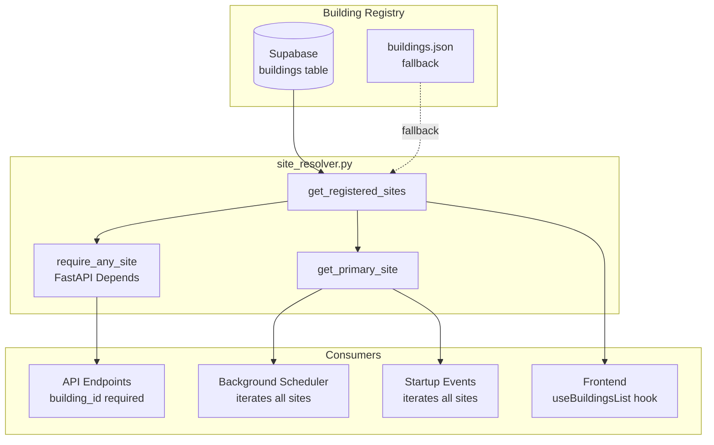

# Site resolver and multi-site architecture

SENTINEL has no hardcoded site ID. Every API endpoint, background job, and frontend
component resolves the active building dynamically from the site resolver. A fresh
SENTINEL instance starts clean with zero buildings and progressively discovers them
as data sources are connected.

## Problem

Prior to Phase 143, over 100 backend files and 37 frontend files contained the
hardcoded string `"site-002"` as a default site ID. This created three problems:

- **Single-site lock-in** -- deploying SENTINEL for a new customer required a
  find-and-replace across the codebase.
- **Silent data corruption** -- API endpoints with `Query("site-002")` would
  silently return data for the wrong building if the caller omitted the parameter.
- **Startup failures** -- a fresh instance with no buildings would crash because
  services assumed `site-002` existed.

## Architecture

### Canonical site identifier

The canonical `site_id` format is `site-###`, for example `site-002` and
`site-005`.

Equipment codes may still use the physical/building prefix, for example
`S002-AHU-B01` or `S005-AHU-301`, but that prefix is not a database `site_id`.
Application code, API parameters, recommendation rows, telemetry rows, reflex
findings, module configs, and dashboard filters should store and query `site_id`
as `site-###` only.

Legacy `S###` values are accepted only as input aliases at system edges where a
human or equipment code may provide that form. They must be normalized to
`site-###` before persistence or internal queries.

### Site resolver module

`backend/app/core/site_resolver.py` is the single source of truth for registered
buildings. It exposes four functions:

| Function | Signature | Description |
|----------|-----------|-------------|
| `get_registered_sites()` | `-> list[dict]` | All registered buildings (Supabase, then JSON fallback) |
| `get_registered_site_ids()` | `-> list[str]` | Just the building code strings |
| `get_primary_site()` | `-> dict \| None` | First registered building, or `None` if empty |
| `require_any_site()` | `async (building_id: str) -> str` | FastAPI dependency that validates a `building_id` query param |

**Fallback order:** Supabase `buildings` table, then `backend/app/data/buildings.json`.

**No default site ID.** If no buildings are registered, `get_primary_site()` returns
`None` and callers handle the empty state gracefully.

### Data flow



### Backend resolution pattern

All API endpoints now require `building_id` as an explicit query parameter with no
default value:

```python
# Before (Phase 143)
@router.get("/api/energy/consumption")
async def get_consumption(
    building_id: str = Query("site-002"),  # silent default
):
    ...

# After (Phase 143)
@router.get("/api/energy/consumption")
async def get_consumption(
    building_id: str = Query(..., description="Building code"),
):
    ...
```

For services and background jobs that need a site ID but do not receive one from an
API caller, the pattern is:

```python
from app.core.site_resolver import get_primary_site, get_registered_site_ids

# Single-site context (e.g., auth middleware fallback)
site = get_primary_site()
site_id = site["code"] if site else "unknown"

# Multi-site iteration (e.g., scheduler jobs)
for site_id in get_registered_site_ids():
    run_job_for_site(site_id)
```

### Frontend resolution pattern

The frontend follows a top-down resolution chain:

1. **`App.tsx`** fetches all buildings via `useBuildingsList()` and derives
   `primarySiteId` from the first entry.
2. **`ModuleProvider`** receives `initialSiteId` from App (or `undefined` if no
   buildings exist).
3. **Components** resolve their site ID from one of these sources, in priority order:
   - `useModules().siteId` (from `ModuleContext`)
   - `useContext(ModuleContext)?.siteId` (outside `ModuleProvider`)
   - `sessionStorage.getItem('sentinel_selected_site')` (cross-view navigation)
   - Props from parent components
4. **No hardcoded fallback.** If no buildings exist, components render an empty state.

```typescript
// Before (Phase 143)
const siteId = sessionStorage.getItem('sentinel_selected_site') || 'site-002';

// After (Phase 143)
const { siteId } = useModules();
// siteId is undefined if no buildings registered -- component shows empty state
```

### Background scheduler

All scheduled jobs that previously targeted `"site-002"` now iterate over
registered sites:

- Policy dry-runs
- AEGIS dispatch and evidence collection
- Occupancy control polling
- Drift detection metrics (Prometheus gauges)
- MIP dispatch optimizer
- Load forecast refresh
- Simulation queue processing

Each job calls `get_registered_site_ids()` at execution time, so newly registered
buildings are picked up without a restart.

## Fresh instance behavior

A clean SENTINEL deployment with no buildings:

| Layer | Behavior |
|-------|----------|
| Backend startup | Completes without errors; scheduler jobs skip iteration (empty list) |
| API endpoints | Return `404` if `building_id` is not in the registry |
| Frontend | Renders empty state; no data panels populated |
| Module system | Modules remain inactive until a building is registered |

Buildings appear once a data source is connected (Niagara CSV import, Supabase
seeding, or manual registration).

## Key files

| File | Role |
|------|------|
| `backend/app/core/site_resolver.py` | Centralized building resolution |
| `backend/app/startup/events.py` | Startup jobs iterate registered sites |
| `backend/app/services/background_scheduler.py` | Scheduled jobs iterate registered sites |
| `backend/app/middleware/auth_middleware.py` | `X-Site-Id` fallback uses `get_primary_site()` |
| `frontend/src/App.tsx` | Top-level building list fetch and context injection |
| `frontend/src/contexts/SimulationContext.tsx` | Accepts `siteId` as prop, no default |
| `frontend/src/hooks/useModuleAccess.ts` | Resolves from `ModuleContext`, not hardcoded |

## Related documents

- [Module System](module-system.md) -- bolt-on module architecture
- [System Overview](system-overview.md) -- high-level platform architecture
- [Device Abstraction Layer](device-abstraction-layer.md) -- protocol-agnostic device interface
