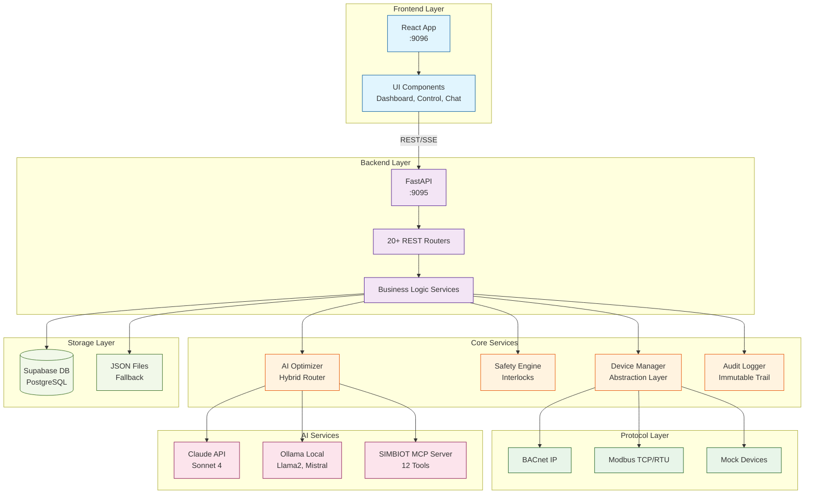
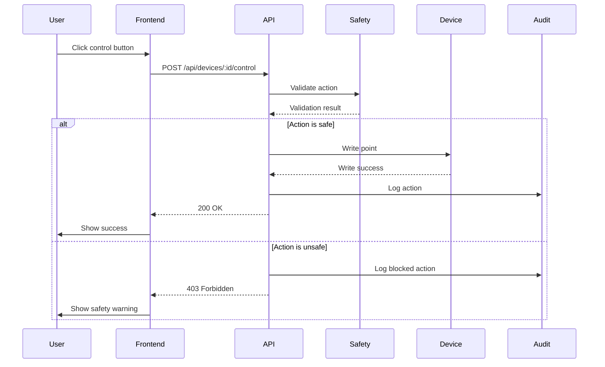
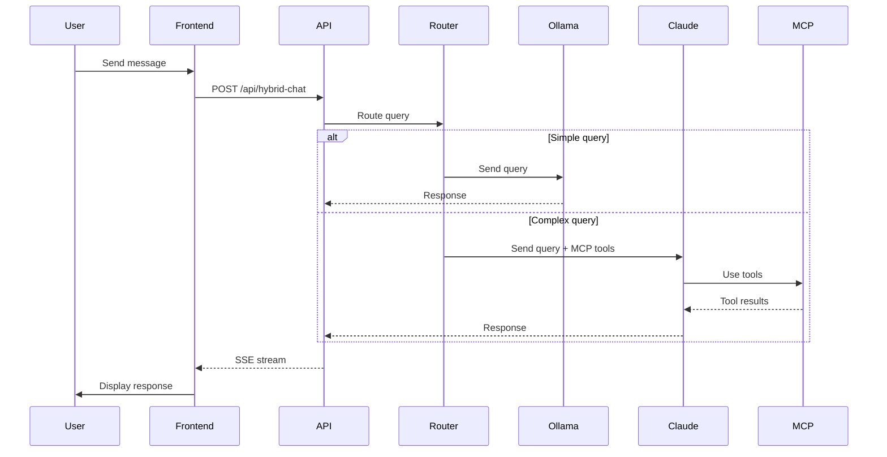

# System Architecture Overview

SENTINEL BMS Intelligence Platform architecture, components, and data flow.

## High-Level Architecture

SENTINEL is a full-stack BMS platform with:

- **FastAPI Backend** - REST API, business logic, AI integration
- **React Frontend** - Web UI for operators and technicians
- **Device Abstraction Layer** - Protocol-agnostic device control
- **Safety Engine** - Rule-based safety validation
- **AI Integration** - Claude API + Ollama hybrid routing
- **MCP Server** - Model Context Protocol for AI tools
- **Database** - Supabase with JSON fallback



## Backend Architecture

### Structure (`/backend/app/`)

```
backend/app/
├── main.py                 # FastAPI app with 20+ routers
├── api/                    # REST endpoints by domain
│   ├── devices.py         # Device discovery, monitoring, control
│   ├── safety.py          # Safety interlock validation
│   ├── audit.py           # Audit log queries
│   ├── chat.py            # Claude AI chat (SSE streaming)
│   ├── hybrid_chat.py     # Ollama/Claude routing
│   ├── optimization.py    # Load shedding thermal modeling
│   ├── predictions.py     # AI failure predictions
│   ├── vision.py          # Equipment photo analysis
│   ├── diagnosis.py       # Guided fault diagnosis
│   ├── integration.py     # BMS/CAFM data ingestion
│   ├── mcp_sse.py         # MCP server via SSE
│   └── ...
├── services/              # Business logic layer
│   ├── device_abstraction.py
│   ├── safety_interlocks.py
│   ├── audit_logger.py
│   ├── ai_optimizer.py
│   ├── hybrid_ai_service.py
│   └── ...
├── models/                # Pydantic models
├── database/repositories/ # Repository pattern
├── data/                  # JSON seed data
└── mcp/                   # MCP servers
```

### Key Components

**FastAPI Application (`main.py`)**
- 20+ REST API routers
- Audit middleware (auto-logs all requests)
- Background scheduler (recurring tasks)
- CORS configuration
- Exception handlers

**REST API Routers (`api/`)**
- Organized by domain (devices, safety, predictions, etc.)
- Request/response validation with Pydantic
- Error handling and status codes
- OpenAPI documentation

**Business Logic Services (`services/`)**
- Device abstraction (protocol-agnostic)
- Safety validation (rule-based engine)
- AI routing (Ollama/Claude hybrid)
- Thermal modeling (load shedding)
- Vision analysis (Claude Vision API)

## Frontend Architecture

### Structure (`/frontend/src/`)

```
frontend/src/
├── App.tsx                # View routing
├── lib/
│   ├── api.ts            # Centralized API client (1000+ lines)
│   └── cardDefinitions.tsx
├── components/            # React components by feature
│   ├── Control system
│   ├── Dashboard
│   ├── AI Chat
│   ├── Integration
│   └── UI components
├── hooks/                 # Custom React hooks
└── pages/                 # Full-page components
```

### Key Components

**API Client (`lib/api.ts`)**
- Centralized HTTP client
- TypeScript interfaces for all backend types
- Error handling
- SSE streaming support

**Component Organization**
- **Control System:** ControlPanel, DeviceControl, SafetyStatus
- **Dashboard:** KPICard, SiteCard, AlertFeed
- **AI Chat:** Chat, TechnicianChat, DiagnosisFlow
- **Integration:** IntegrationWizard, GoLiveChecklist

**Custom Hooks**
- `useDeviceControl` - Device control state management
- `useControlAction` - Control action feedback
- `useHealthThresholds` - Health score color coding

## Key Design Patterns

### 1. Device Abstraction Layer

**Problem:** Different BMS protocols (BACnet, Modbus, etc.)

**Solution:** Protocol-agnostic interface

```python
# GOOD: Protocol-agnostic
device = device_manager.get_device(device_id)
value = device.read_point("temperature")

# BAD: Protocol-specific
if device.protocol == "bacnet":
    bacnet_client.read_property(...)
elif device.protocol == "modbus":
    modbus_client.read_register(...)
```

**Components:**
- `DeviceInterface` - Protocol-agnostic operations
- `DeviceAdapter` - Protocol-specific implementations
- `device_manager` - Singleton lifecycle manager

### 2. Safety Interlocks Engine

**Problem:** Prevent unsafe device control actions

**Solution:** Rule-based validation before all actions

```python
# All control actions validated
def write_device_point(device_id, point, value):
    # Validate against safety rules
    validation = safety_engine.validate(device_id, point, value)

    if validation.severity == Severity.BLOCK:
        raise SafetyViolation(validation.reason)

    # Safe to proceed
    device.write_point(point, value)
```

**Rule Types:**
- `TemperatureRange` - Min/max temperature limits
- `PressureLimit` - Max pressure limits
- `Interlock` - Device interlock dependencies
- `RuntimeLimit` - Max runtime limits
- `BrightnessLimit` - Lighting brightness limits
- `Custom` - Custom validation logic

**Severity Levels:**
- `WARNING` - Allow with warning
- `BLOCK` - Prevent action
- `ALARM` - Critical alert

### 3. Audit Trail

**Problem:** Compliance requirement for control actions

**Solution:** Immutable audit logging middleware

```python
# Auto-captures all API calls
@app.middleware("audit")
async def audit_middleware(request: Request, call_next):
    # Capture before state
    before = get_current_state(request)

    # Execute request
    response = await call_next(request)

    # Capture after state
    after = get_current_state(request)

    # Log to audit trail
    audit_logger.log(
        action=request.url_path,
        user=request.headers.get("X-User"),
        before=before,
        after=after
    )

    return response
```

**Audit Fields:**
- Timestamp
- User
- Action
- Device/Asset
- Before/after values
- Result (success/failure)

### 4. Hybrid AI Routing

**Problem:** Claude API costs for simple queries

**Solution:** Route to Ollama (free) for simple queries

```python
def route_query(query: str) -> AIProvider:
    # Tier 1: Simple queries → Ollama (free)
    if is_simple_query(query):
        return Ollama()

    # Tier 2: Complex queries → Claude (paid)
    return Claude()

def is_simple_query(query: str) -> bool:
    # Lookups, status checks, data queries
    patterns = [
        r"what is (the )?temperature",
        r"list (all )?devices",
        r"show status",
    ]
    return any(re.match(p, query) for p in patterns)
```

**Cost Savings:** 40% vs all-Claude approach

### 5. MCP Server Integration

**Problem:** AI needs structured access to BMS data

**Solution:** Model Context Protocol (MCP) with 12 tools

```python
# SIMBIOT MCP Server
tools = [
    "get_buildings",
    "get_assets",
    "get_devices",
    "read_device_point",
    "write_device_point",
    "get_alarms",
    "search_alarms",
    "get_trends",
    "get_health_score",
    "get_work_orders",
    "create_work_order",
]
```

**Integration Methods:**
- **stdio** - Claude Desktop (local)
- **SSE** - Cloud Claude (remote)
- **REST** - Traditional web apps

## Data Flow

### 1. Device Control Flow



### 2. AI Chat Flow



### 3. BMS Integration Flow


## Technology Stack

### Backend

- **Framework:** FastAPI (Python 3.11)
- **Validation:** Pydantic v2
- **Database:** Supabase (PostgreSQL) with JSON fallback
- **Protocols:** BACnet IP, Modbus TCP/RTU
- **AI:** Claude API (Sonnet 4), Ollama
- **Testing:** Pytest
- **Scheduling:** APScheduler

### Frontend

- **Framework:** React 18 + TypeScript
- **Build:** Vite
- **State:** React hooks (no Redux)
- **UI:** Tailwind CSS + Tremor
- **Testing:** Vitest
- **Linting:** ESLint

### Infrastructure

- **Ports:** Backend 9095, Frontend 9096
- **Deployment:** Docker (optional)
- **Monitoring:** Health endpoints, audit logs
- **Backup:** JSON seed data for demo mode

## Key Decisions & Rationale

### 1. Demo Mode with JSON Data

**Decision:** Default to JSON files instead of database

**Rationale:**
- Faster demo setup (no database provisioning)
- Consistent demo experience (pre-seeded data)
- Interview reliability (no external dependencies)
- Easy reset (delete JSON files)

### 2. Local Dev vs Docker

**Decision:** Prioritize local development over Docker

**Rationale:**
- Faster iteration (no rebuilds)
- Better debugging (native tools)
- Lower resource usage
- Easier onboarding for new developers

### 3. SSE Streaming for AI Chat

**Decision:** Server-Sent Events for AI responses

**Rationale:**
- Real-time streaming (better UX)
- Lower latency (no polling)
- Simple protocol (text-based)
- Built-in reconnection

### 4. Hybrid AI Routing

**Decision:** Route to Ollama for simple queries

**Rationale:**
- 40% cost savings
- Faster response (local vs cloud)
- Privacy (data stays local)
- Fallback to Claude on failures

### 5. Device Abstraction Layer

**Decision:** Protocol-agnostic device interface

**Rationale:**
- Easy protocol addition (new adapters)
- Testability (mock devices)
- Safety validation (single point)
- Unified audit trail

## Related Documentation

- [Device Abstraction Layer](device-abstraction-layer.md) - Deep dive
- [Safety Interlocks Engine](../06-safety-compliance/safety-interlocks-engine.md) - Safety system
- [Database Schema](database-schema.md) - Data model
- [REST API Endpoints](../03-api-reference/rest-api-endpoints.md) - API reference
