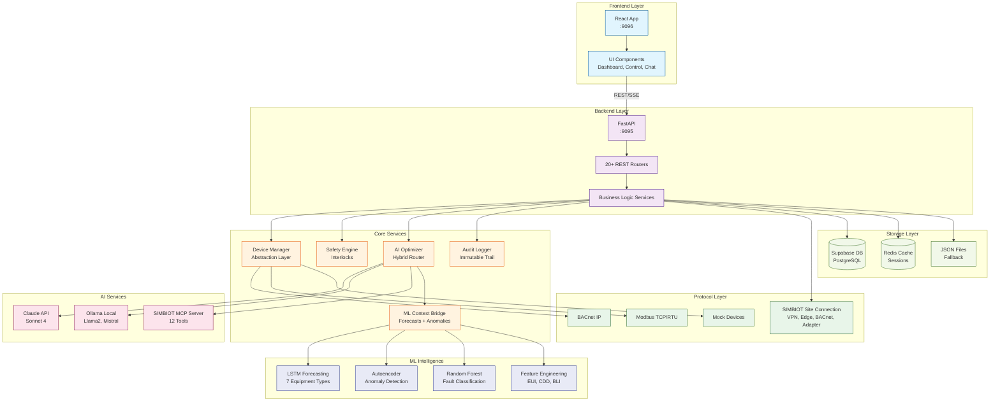
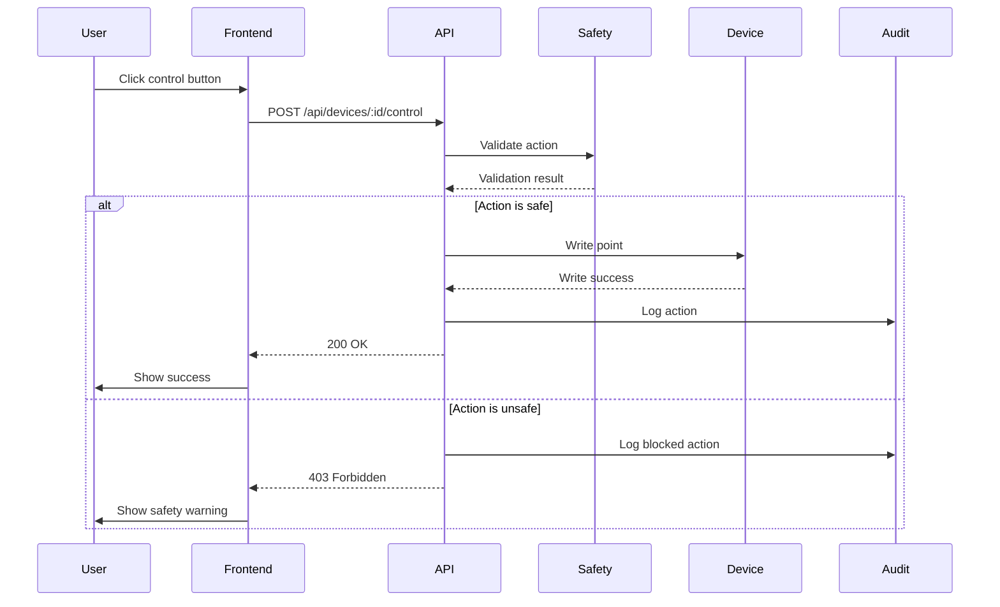
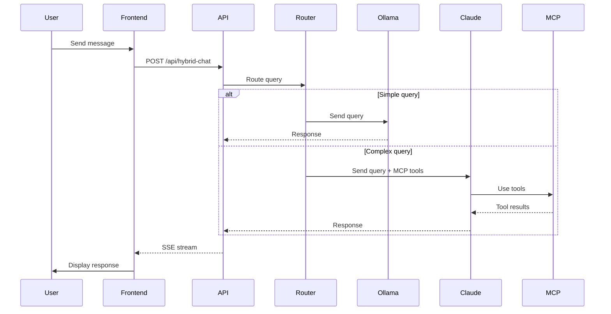
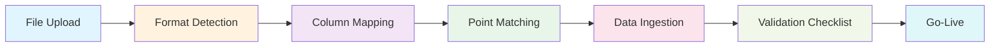

# System Architecture Overview

SENTINEL BMS Intelligence Platform architecture, components, and data flow.

## High-Level Architecture

SENTINEL is a full-stack BMS platform with:

- **FastAPI Backend** - REST API, business logic, AI integration
- **React Frontend** - Web UI for operators and technicians
- **Device Abstraction Layer** - Protocol-agnostic device control
- **Safety Engine** - Rule-based safety validation
- **AI Integration** - Claude API + Ollama hybrid routing
- **MCP Server** - Model Context Protocol for AI tools
- **Database** - Supabase with JSON fallback

In the current production topology, SENTINEL can also run as an island deployment:
- SENTINEL backend/frontend on one VM or Jetson
- SIMBIOT connects SENTINEL to building-operational data over one of several transport paths
- supported connection paths include WireGuard/VPN bridge, edge/local adapter, BACnet, and other site-specific adapters
- SENTINEL consumes the building view exposed through SIMBIOT rather than remote lifecycle internals
- SENTINEL remains the canonical writer to Supabase



### Remote Site Data Boundary

From SENTINEL's perspective, SIMBIOT is the connection boundary to the building.

- SENTINEL may reach a site over WireGuard/VPN, edge/local adapter, BACnet, or another supported integration path
- the upstream may be a real BMS such as Desigo, or another remote site endpoint that exposes the building view
- SENTINEL consumes telemetry, equipment state, zone state, and site-operational health
- lifecycle/orchestrator internals are not part of SENTINEL's required contract

## Backend Architecture

### Structure (`/backend/app/`)

```
backend/app/
├── main.py                 # FastAPI app with 20+ routers
├── api/                    # REST endpoints by domain
│   ├── devices.py         # Device discovery, monitoring, control
│   ├── safety.py          # Safety interlock validation
│   ├── audit.py           # Audit log queries
│   ├── chat.py            # Claude AI chat (SSE streaming)
│   ├── hybrid_chat.py     # Ollama/Claude routing
│   ├── optimization.py    # Load shedding thermal modeling
│   ├── predictions.py     # AI failure predictions
│   ├── vision.py          # Equipment photo analysis
│   ├── diagnosis.py       # Guided fault diagnosis
│   ├── integration.py     # BMS/CAFM data ingestion
│   ├── mcp_sse.py         # MCP server via SSE
│   └── ...
├── services/              # Business logic layer
│   ├── device_abstraction.py
│   ├── safety_interlocks.py
│   ├── audit_logger.py
│   ├── ai_optimizer.py
│   ├── hybrid_ai_service.py
│   └── ...
├── models/                # Pydantic models
├── database/repositories/ # Repository pattern
├── data/                  # JSON seed data
└── mcp/                   # MCP servers
```

### Key Components

**FastAPI Application (`main.py`)**
- 70+ REST API routers (decomposed into 4 startup modules — v14.0)
- Audit middleware (auto-logs all requests, encrypted at rest — v14.0)
- Background scheduler (recurring tasks)
- CORS configuration
- Exception handlers

**REST API Routers (`api/`)**
- Organized by domain (devices, safety, predictions, etc.)
- Request/response validation with Pydantic
- Error handling and status codes
- OpenAPI documentation

**Business Logic Services (`services/`)**
- Device abstraction (protocol-agnostic)
- Safety validation (rule-based engine)
- AI routing (Ollama/Claude hybrid)
- Thermal modeling (load shedding)
- Vision analysis (Claude Vision API)
- **Demand-Aware Coordinator** (Phase 081) - Peak demand monitoring and multi-module coordination
- **PARASITE Decision Pipeline** (v14.0) - Tier 1/2/3 autonomy with audit trail, COV verification, auto-rollback
- **PARASITE Observability** (v14.0) - End-to-end decision traceability with correlation_id threading, structured lifecycle events via `decision_event_logger`, Promtail → Loki ingestion, and Grafana dashboard for pipeline analysis
- **Optimization Tier Router** (v14.0) - Confidence-based recommendation routing (blocked/advisory/approval/auto-execute)
- **Energy Validation Engines** (v14.0) - Power meter validation, cost validation, lighting simulation, water consumption, AI recommendations with ROI
  - Runs every 5 minutes
  - Monitors current demand vs NMD limit from database
  - Generates AI recommendations for peak shaving
  - Coordinates Solar BESS discharge with HVAC adjustments
  - Integrates with Tier 2 approval workflow
- **Energy Rules Engine** (Phase 084) - Rule-based energy optimization
  - 5 conditional optimization rules (Chiller Staging, Thermal Pre-Cooling, Occupancy HVAC, Daylight Harvesting, Peak Load Shaving)
  - Dynamic savings 0-35% based on building conditions
  - Learning curve confidence 78%→92% over 12 months
  - Module-conditional logic (DALI rule only fires when module active)
  - System breakdown allocating savings to HVAC/Lighting/Power
- **IAQ Intelligence** - Indoor air quality scoring per zone (CO2/humidity/temp/VOC/PM2.5 weighted composite), threshold alerts, WELL v2 and ESG compliance reports. Reads from existing HVAC zone telemetry.
- **Agent Memory Service** - Persistent AI institutional knowledge
  - Building quirks, equipment notes, operator preferences, seasonal patterns, safety notes
  - Injected into Claude system prompts (both tool and non-tool paths) so AI doesn't re-discover known facts
  - Supabase table with JSON fallback, CRUD API at `/api/agent-memory`
- **Redis Session Store** - Write-through session persistence
  - Generic `RedisSessionStore` used by DiagnosisFlowEngine (1h TTL) and FeedbackCollectionService (4h TTL)
  - Write-through: always update in-memory + Redis; read: Redis first, memory fallback
  - Lazy connection with 2s timeouts, graceful degradation to in-memory-only
- **ML Context Bridge** (Phase 132) - Connects 20 trained ML models to Claude's recommendation engine
  - `_gather_ml_context()` collects: LSTM forecasts (24/48/72h), anomaly scores (>0.5), fault classifications (>0.4 confidence), health trend slopes, building-level features
  - `_format_ml_context_section()` formats ML data as readable section in Claude's optimisation prompt
  - Enables PREDICTIVE recommendations based on future equipment behaviour, not just current state
  - See: [ML Data Architecture](ML-DATA-ARCHITECTURE.md)
- **Feature Engineering Service** (Phase 132) - Building-level derived metrics
  - Energy Use Intensity (EUI): `kWh / m²`
  - Base Load Index: off-hours consumption / total daily
  - Cooling Degree Days (CDD): SA climate normalisation (base 18°C)
  - Building Efficiency Score: composite 0-100 (EUI 35%, BLI 25%, setpoint deviation 25%, CDD-adjusted 15%)
- **Inspection Priority Scoring** (Phase 132) - Weighted inspection priority per asset
  - Formula: `days_overdue×0.25 + anomaly×0.25 + fault_history×0.20 + rul_inverse×0.15 + criticality×0.15`
  - Levels: critical (80+), high (60+), medium (40+), low (20+), routine (<20)
  - Feeds work order prioritisation and maintenance scheduling
- **Auto-Dashboard Generator** (Phase 141) - Equipment-driven dashboard configuration
  - Classifies equipment into 25 categories from ID prefix (37 mappings, longest-first)
  - Generates tailored dashboard cards (15 templates), monitoring rules (21 defaults), health weights, module suggestions (7 add-ons with savings hints), and AI chat context
  - Event-driven: auto-triggers on `system.site_onboarded` and `system.equipment_discovered` events
  - 3-tier equipment loading: Supabase, JSON files, graceful empty fallback
  - See: [Auto-Dashboard Generator](../04-features/141-auto-dashboard-generator.md)

## Frontend Architecture

### Structure (`/frontend/src/`)

```
frontend/src/
├── App.tsx                # View routing
├── lib/
│   ├── api.ts            # Centralized API client (1000+ lines)
│   ├── api/              # Domain-specific API modules (solar, security, energy, compliance)
│   ├── cardDefinitions.tsx  # KPI + intelligence card section definitions
│   ├── hvacApi.ts        # HVAC API client
│   └── waterApi.ts       # Water API client
├── components/            # React components by feature
│   ├── intelligence/     # Discipline intelligence cards (HVAC, Energy, Solar, Water, Fire, Security)
│   ├── solar/            # Solar & BESS dashboard components
│   ├── hvac/             # HVAC dashboard
│   ├── water/            # Water monitoring
│   ├── fire/             # Fire safety
│   ├── security/         # Security dashboard
│   ├── lighting/         # Lighting control
│   ├── digital-twin/     # Digital twin
│   ├── optimization/     # Energy optimization
│   ├── validation/       # Power/cost validation cards
│   ├── CardLibrary.tsx   # Inline card visibility toggle
│   ├── SiteDetail.tsx    # Building detail page (10-tab)
│   └── ...               # Dashboard, AI Chat, Integration, UI components
├── hooks/                 # Custom React hooks
├── contexts/              # React contexts (auth, simulation, modules)
└── pages/                 # Full-page components (OptimizationPage, OccupancyAnalytics, etc.)
```

### Key Components

**API Client (`lib/api.ts`)**
- Centralized HTTP client
- TypeScript interfaces for all backend types
- Error handling
- SSE streaming support

**Component Organization**
- **Intelligence Cards:** `intelligence/` — HVACIntelligenceCard, EnergyIntelligenceCard, SolarIntelligenceCard, WaterIntelligenceCard, FireIntelligenceCard, SecurityIntelligenceCard (compact overview cards, one per discipline)
- **Control System:** ControlPanel, DeviceControl, SafetyStatus
- **Dashboard:** KPICard, SiteCard, AlertFeed, ExpandableRiskList, RiskDetailModal, CardLibrary (inline toggle)
- **AI Chat:** Chat, TechnicianChat, DiagnosisFlow
- **Integration:** IntegrationWizard, GoLiveChecklist

**Custom Hooks**
- `useDeviceControl` - Device control state management
- `useControlAction` - Control action feedback
- `useHealthThresholds` - Health score color coding

## Key Design Patterns

### 1. Device Abstraction Layer

**Problem:** Different BMS protocols (BACnet, Modbus, etc.)

**Solution:** Protocol-agnostic interface

```python
# GOOD: Protocol-agnostic
device = device_manager.get_device(device_id)
value = device.read_point("temperature")

# BAD: Protocol-specific
if device.protocol == "bacnet":
    bacnet_client.read_property(...)
elif device.protocol == "modbus":
    modbus_client.read_register(...)
```

**Components:**
- `DeviceInterface` - Protocol-agnostic operations
- `DeviceAdapter` - Protocol-specific implementations
- `device_manager` - Singleton lifecycle manager

### 2. Safety Interlocks Engine

**Problem:** Prevent unsafe device control actions

**Solution:** Rule-based validation before all actions

```python
# All control actions validated
def write_device_point(device_id, point, value):
    # Validate against safety rules
    validation = safety_engine.validate(device_id, point, value)

    if validation.severity == Severity.BLOCK:
        raise SafetyViolation(validation.reason)

    # Safe to proceed
    device.write_point(point, value)
```

**Rule Types:**
- `TemperatureRange` - Min/max temperature limits
- `PressureLimit` - Max pressure limits
- `Interlock` - Device interlock dependencies
- `RuntimeLimit` - Max runtime limits
- `BrightnessLimit` - Lighting brightness limits
- `Custom` - Custom validation logic

**Severity Levels:**
- `WARNING` - Allow with warning
- `BLOCK` - Prevent action
- `ALARM` - Critical alert

### 3. Audit Trail

**Problem:** Compliance requirement for control actions

**Solution:** Immutable audit logging middleware

```python
# Auto-captures all API calls
@app.middleware("audit")
async def audit_middleware(request: Request, call_next):
    # Capture before state
    before = get_current_state(request)

    # Execute request
    response = await call_next(request)

    # Capture after state
    after = get_current_state(request)

    # Log to audit trail
    audit_logger.log(
        action=request.url_path,
        user=request.headers.get("X-User"),
        before=before,
        after=after
    )

    return response
```

**Audit Fields:**
- Timestamp
- User
- Action
- Device/Asset
- Before/after values
- Result (success/failure)

### 4. Hybrid AI Routing

**Problem:** Claude API costs for simple queries

**Solution:** Route to Ollama (free) for simple queries

```python
def route_query(query: str) -> AIProvider:
    # Tier 1: Simple queries → Ollama (free)
    if is_simple_query(query):
        return Ollama()

    # Tier 2: Complex queries → Claude (paid)
    return Claude()

def is_simple_query(query: str) -> bool:
    # Lookups, status checks, data queries
    patterns = [
        r"what is (the )?temperature",
        r"list (all )?devices",
        r"show status",
    ]
    return any(re.match(p, query) for p in patterns)
```

**Cost Savings:** 40% vs all-Claude approach

### 5. MCP Server Integration

**Problem:** AI needs structured access to BMS data

**Solution:** Model Context Protocol (MCP) with 12 tools

```python
# SIMBIOT MCP Server
tools = [
    "get_buildings",
    "get_assets",
    "get_devices",
    "read_device_point",
    "write_device_point",
    "get_alarms",
    "search_alarms",
    "get_trends",
    "get_health_score",
    "get_work_orders",
    "create_work_order",
]
```

**Integration Methods:**
- **stdio** - Claude Desktop (local)
- **SSE** - Cloud Claude (remote)
- **REST** - Traditional web apps

## Data Flow

### 1. Device Control Flow



### 2. AI Chat Flow



### 3. BMS Integration Flow



### 4. Building Risk Cards Flow

Dashboard SiteCards expand to show at-risk equipment with drill-down to control and risk detail views.

```mermaid
flowchart TB
    subgraph Dashboard["Dashboard"]
        SiteCard[SiteCard<br/>Sandton Building]
        Stats[Stats Row<br/>Equipment | Safe | Risks]
    end

    subgraph Expandable["Expandable Risk List"]
        Toggle[Click to Expand]
        RiskList[At-Risk Equipment<br/>Sorted: Critical → Warning → Health]
        EquipRow[Equipment Row<br/>Status | Name | Health % | Arrow]
    end

    subgraph Actions["User Actions"]
        ClickRow[Click Row]
        ClickBadge[Click Status Badge]
    end

    subgraph Targets["Navigation Targets"]
        ControlDash[ControlDashboard<br/>Pre-selected Equipment]
        RiskModal[RiskDetailModal<br/>Health Factors Breakdown]
    end

    SiteCard --> Stats
    Stats -->|Has Alerts| Toggle
    Toggle --> RiskList
    RiskList --> EquipRow

    EquipRow --> ClickRow
    EquipRow --> ClickBadge

    ClickRow -->|sessionStorage| ControlDash
    ClickBadge --> RiskModal

    RiskModal -->|Open Control Panel| ControlDash

    style SiteCard fill:#e1f5fe
    style RiskList fill:#fff3e0
    style RiskModal fill:#fce4ec
    style ControlDash fill:#e8f5e9
```

**Components:**
- **SiteCard** - Building card with expandable risk list (when `alert_count > 0`)
- **ExpandableRiskList** - Collapsible list of warning/critical equipment, lazy-loaded
- **RiskDetailModal** - Equipment health factors breakdown with action buttons

**Health Factors Displayed:**
- Age Score (equipment age vs expected lifespan)
- Service Status (days since/until service)
- Runtime Hours (accumulated operating hours)
- Fault History (recent fault count)

**Navigation:**
- Click equipment row → ControlDashboard with equipment pre-selected via sessionStorage
- Click status badge → RiskDetailModal with health factors and recommended action

## Technology Stack

### Backend

- **Framework:** FastAPI (Python 3.11)
- **Validation:** Pydantic v2
- **Database:** Supabase (PostgreSQL) with Redis cache + JSON fallback
- **Protocols:** BACnet IP, Modbus TCP/RTU
- **AI:** Claude API (Sonnet 4), Ollama
- **Testing:** Pytest
- **Scheduling:** APScheduler

### Frontend

- **Framework:** React 18 + TypeScript
- **Build:** Vite
- **State:** React hooks (no Redux)
- **UI:** Tailwind CSS + Tremor
- **Testing:** Vitest
- **Linting:** ESLint

### Infrastructure

- **Ports:** Backend 9095, Frontend 9096
- **Deployment:** Docker (optional)
- **Monitoring:** Health endpoints, audit logs, Grafana dashboards (PARASITE Decision Pipeline, Security Operations)
- **Logging:** Structured JSON → RotatingFileHandler → Promtail → Loki (sentinel-audit, sentinel-security, sentinel-decisions)
- **Backup:** JSON seed data for demo mode

## Key Decisions & Rationale

### 1. Demo Mode with JSON Data

**Decision:** Default to JSON files instead of database

**Rationale:**
- Faster demo setup (no database provisioning)
- Consistent demo experience (pre-seeded data)
- Interview reliability (no external dependencies)
- Easy reset (delete JSON files)

### 2. Local Dev vs Docker

**Decision:** Prioritize local development over Docker

**Rationale:**
- Faster iteration (no rebuilds)
- Better debugging (native tools)
- Lower resource usage
- Easier onboarding for new developers

### 3. SSE Streaming for AI Chat

**Decision:** Server-Sent Events for AI responses

**Rationale:**
- Real-time streaming (better UX)
- Lower latency (no polling)
- Simple protocol (text-based)
- Built-in reconnection

### 4. Hybrid AI Routing

**Decision:** Route to Ollama for simple queries

**Rationale:**
- 40% cost savings
- Faster response (local vs cloud)
- Privacy (data stays local)
- Fallback to Claude on failures

### 5. Device Abstraction Layer

**Decision:** Protocol-agnostic device interface

**Rationale:**
- Easy protocol addition (new adapters)
- Testability (mock devices)
- Safety validation (single point)
- Unified audit trail

### 6. Demand-Aware Coordinator (Phase 081)

**Decision:** Centralized background service for peak demand monitoring and multi-module coordination

**Rationale:**
- Single source of truth for NMD monitoring (consistent decisions)
- Module-agnostic design (works with any combination of Solar, HVAC, Energy, etc.)
- Automatic NMD extraction from municipal bills (no manual updates)
- Real-time demand forecasting with multi-module cost-benefit analysis
- Integration with Tier 2 approval for operator sign-off on high-risk changes
- 5-minute monitoring cycle (responsive without overwhelming system)

**Key Features:**
- Queries `buildings.nmd_limit_kva` from Supabase (with fallback defaults)
- Multi-module recommendations (Solar BESS + HVAC + Load Deferral)
- Cost savings calculation per module
- Coordinator works independently of any active modules (graceful degradation)
- Automatic cache invalidation on bill upload

## Related Documentation

- [Device Abstraction Layer](device-abstraction-layer.md) - Deep dive
- [Safety Interlocks Engine](../06-safety-compliance/safety-interlocks-engine.md) - Safety system
- [Database Schema](database-schema.md) - Data model
- [REST API Endpoints](../03-api-reference/rest-api-endpoints.md) - API reference
- [Peak Demand Management API](../03-api-reference/peak-demand-api.md) - Demand monitoring and NMD coordination (Phase 081)
- [Municipal Billing API](../03-api-reference/municipal-billing.md) - Bill ingestion and NMD extraction
- [Solar & BESS API](../03-api-reference/solar-api.md) - BESS dispatch coordination with demand management
- [ML Data Architecture](ML-DATA-ARCHITECTURE.md) - ML models, feature engineering, recommendation engine
- [ML Registry Architecture](ml-registry-architecture.md) - Model versioning and lifecycle
- [ML Equipment Support](ml-equipment-support.md) - Per-equipment ML capabilities
- [Optimization API](../03-api-reference/optimization.md) - AI optimisation endpoints with ML context injection
- [Inspection API](../03-api-reference/inspection.md) - Inspection workflows and priority scoring
- [Dashboard Generator API](../03-api-reference/dashboard-generator-api.md) - Auto-dashboard generation from discovered equipment
- [Auto-Dashboard Generator](../04-features/141-auto-dashboard-generator.md) - Equipment classification, card templates, monitoring rules
- [Brick Ontology Layer](brick-ontology-layer.md) - Semantic building model for equipment/point/location relationships
- [Hybrid Knowledge Layer](hybrid-knowledge-layer.md) - Context assembly combining RAG + asset graph + telemetry
- [Drive Intake Pipeline](../05-integrations/drive-intake-pipeline.md) - MRI Evolution document ingestion via Google Drive
- [IAQ Intelligence](../04-features/iaq-intelligence.md) - Indoor air quality scoring, alerts, and WELL/ESG compliance
- [IAQ API](../03-api-reference/iaq-api.md) - IAQ zone scores, alerts, and compliance report endpoints
