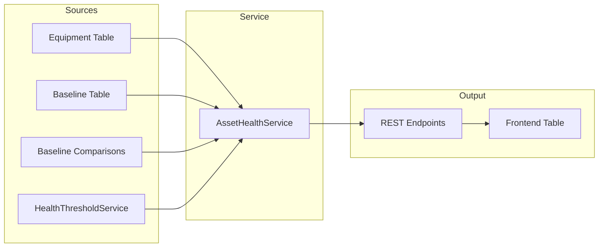

# Phase 109A: Asset health baseline recording

Surfaces equipment health scores and baseline status in a single unified view per
site. Operators can see which equipment has baselines, when they were captured,
whether deviations are occurring, and the current health status — without
navigating to per-equipment detail endpoints.

## Overview

Phase 109A bridges two previously independent subsystems:

- **Health scoring** (via `HealthThresholdService`) — score-to-status mapping
- **Baseline management** (via `BaselineRepository`) — capture, comparison, deviation

The result is a single `AssetHealthBaseline` contract consumed by both the REST API
and the frontend equipment table.



## Data contract

Every equipment item is represented by an `AssetHealthBaseline` record:

| Field | Type | Source |
|-------|------|--------|
| `equipment_id` | `str` | `equipment.code` |
| `equipment_name` | `str` | `equipment.name` |
| `equipment_type` | `str` | Extracted from code |
| `category` | `str` | `equipment.category` |
| `health_score` | `int` | `equipment.health_score` |
| `health_status` | `str` | `HealthThresholdService.get_health_status()` |
| `health_source` | `str` | `"simulation"` or `"equipment_table"` |
| `health_updated_at` | `str?` | `equipment.updated_at` |
| `has_active_baseline` | `bool` | `equipment_baselines` query |
| `last_baseline_at` | `str?` | Most recent active baseline date |
| `total_baselines` | `int` | Count of all baselines for this equipment |
| `baseline_source` | `str?` | `"manual"` / `"bms_average"` / `"mobile_sensor"` |
| `max_deviation_percent_24h` | `float?` | Max deviation in last 24 hours |
| `deviation_status` | `str?` | `"normal"` / `"warning"` / `"critical"` |

### Health status

Health status is **always** computed via `HealthThresholdService` — no hardcoded
thresholds exist in this feature. The service maps a numeric score to one of:

- `"healthy"` — score above the healthy threshold
- `"warning"` — score between warning and healthy thresholds
- `"critical"` — score below the warning threshold

### Deviation status

Deviation status is baseline-specific and independent of health thresholds:

| Deviation | Status |
|-----------|--------|
| No comparisons in 24h | `null` |
| Max deviation <= 15% | `"normal"` |
| 15% < max deviation < 30% | `"warning"` |
| Max deviation >= 30% | `"critical"` |

## Architecture

### Aggregation service

`AssetHealthService` (`backend/app/services/asset_health_service.py`) combines data
from three sources using bulk queries to avoid N+1 patterns:

```python
class AssetHealthService:
    def __init__(self):
        self._equipment_repo = get_equipment_repository()
        self._baseline_repo = BaselineRepository()
        self._threshold_svc = get_health_threshold_service()

    async def get_site_assets(self, site_code: str) -> list[AssetHealthBaseline]:
        """Bulk: 1 equipment query + 2 baseline queries = 3 queries total."""

    async def get_equipment_detail(self, equipment_id: str) -> AssetHealthBaseline | None:
        """Single-equipment variant."""
```

### Bulk repository methods

Two methods on `BaselineRepository` prevent N+1 queries:

- `get_bulk_baseline_status(equipment_ids)` — single query on `equipment_baselines`,
  returns `has_active_baseline`, `last_baseline_at`, `total_baselines`,
  `baseline_source` per equipment.

- `get_bulk_max_deviation_24h(equipment_ids)` — single query on
  `baseline_comparisons` filtered to last 24 hours, returns `max_deviation_percent`
  and `deviation_status` per equipment.

### Onboarding integration

When equipment is approved via Niagara discovery (`POST /api/niagara/mappings/{id}/approve`),
baseline captures are automatically enqueued:

- **Simulation/demo mode:** Auto-captures synthetic baselines via
  `BaselineCaptureService` using `BMS_AVERAGE` source.
- **Live mode:** Logs as pending — technician must capture manually.

## Frontend integration

The SiteDetail equipment table gains two new columns and filtering capabilities:

### New columns

| Column | Content |
|--------|---------|
| **Baseline** | "Active" badge (green) if `has_active_baseline`, "None" (muted) otherwise |
| **Deviation** | Percentage badge colored by `deviation_status` |

### Filter chips

Two filter chips appear below existing category filters:

- **No Baseline** — shows only equipment without active baselines
- **Critical Deviation** — shows only equipment with `deviation_status === "critical"`

### KPI card

A "Baseline Coverage" KPI card shows `X / Y` equipment with active baselines,
using a cyan accent color.

## API endpoints

See [Asset Health API Reference](../03-api-reference/asset-health-api.md) for
full endpoint documentation.

| Method | Path | Description |
|--------|------|-------------|
| `GET` | `/api/sites/{site_id}/assets/health-baseline` | List all equipment with health + baseline snapshot |
| `GET` | `/api/equipment/{equipment_id}/health-baseline` | Single equipment detail |

## Testing

13 backend tests in 4 groups:

| Group | Tests | Coverage |
|-------|-------|----------|
| A: Endpoint contract | 4 | Response shape, 200/404, all equipment returned |
| B: Health threshold | 3 | Threshold delegation, threshold changes, health source |
| C: Baseline + deviation | 4 | Active/inactive baseline, warning/critical deviation |
| D: Mode behavior | 2 | Simulation auto-capture, live mode pending |

11 frontend tests covering:

- BaselineBadge rendering (active/inactive)
- DeviationBadge rendering (normal/warning/critical/null)
- FilterChips filtering behavior

Run tests:

```bash
# Backend
cd backend && ./venv/bin/python -m pytest tests/api/test_asset_health.py -v

# Frontend
cd frontend && npx vitest run src/components/__tests__/AssetHealthBaseline.test.tsx
```

## Files

| File | Action |
|------|--------|
| `backend/app/models/asset_health.py` | Created — Pydantic response model |
| `backend/app/services/asset_health_service.py` | Created — Aggregation service |
| `backend/app/api/asset_health.py` | Created — REST endpoints |
| `backend/app/api/registrars/operations.py` | Modified — Router registration |
| `backend/app/database/repositories/baseline_repository.py` | Modified — Bulk query methods |
| `backend/app/api/niagara_discovery.py` | Modified — Onboarding baseline capture |
| `frontend/src/lib/api/sites.ts` | Modified — TypeScript types + API functions |
| `frontend/src/components/SiteDetail.tsx` | Modified — Table columns, filters, KPI |
| `backend/tests/api/test_asset_health.py` | Created — 13 tests |
| `frontend/src/components/__tests__/AssetHealthBaseline.test.tsx` | Created — 11 tests |

## Related documents

- [Health Scoring System](health-scoring-system.md) — Score calculation and threshold configuration
- [Equipment Baseline Assessment](54-equipment-baseline-assessment.md) — Baseline capture and comparison (Phase 54)
- [Asset Health API Reference](../03-api-reference/asset-health-api.md) — Endpoint documentation
