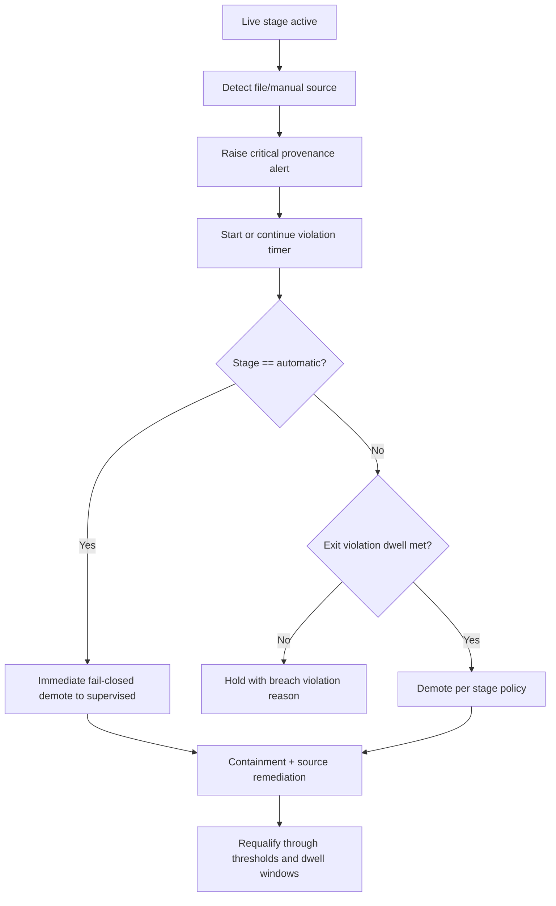

# Data provenance breach flow

Defines response when non-live provenance (file/manual) appears in live stages.

## Entry condition

Current stage is `shadow_live`, `supervised`, or `automatic` and:

- `file_manual_sources > 0`, or
- quality gate fails provenance-related rules.

## Deterministic actions

1. Flag provenance breach.
2. Emit critical alert (`json_in_live` semantics).
3. Mark stage violation timer.
4. Evaluate stage-specific demotion rule:
- `shadow_live`: demote to `commissioning` after sustained exit violation.
- `supervised`: demote to `shadow_live` after sustained exit violation.
- `automatic`: immediate fail-closed demotion to `supervised`.
5. Log containment outcome and pending recovery actions.

## Recovery actions

1. Remove or disable non-live source(s).
2. Reconfirm live protocol sources active.
3. Re-run policy evaluations through dwell + stability windows.

## Flow diagram

