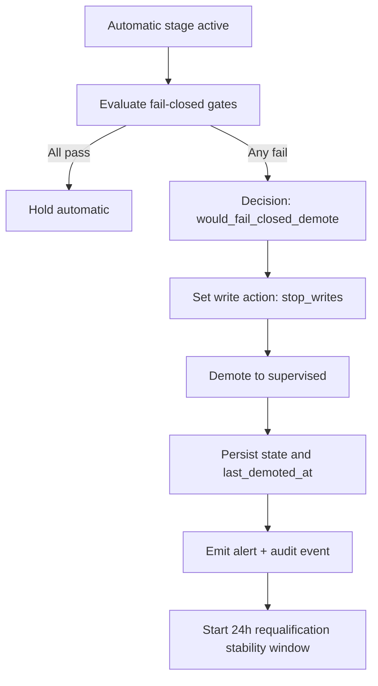

# Automatic fail-closed demotion flow

Defines deterministic behavior when automatic mode violates hard safety/data quality gates.

## Entry condition

Current stage is `automatic` and one or more fail-closed gates fail:

- freshness threshold fail
- coverage threshold fail
- provenance threshold fail
- conflict threshold fail
- quality gate status not allowed

## Deterministic actions

1. Evaluate fail-closed rules.
2. Emit decision `would_fail_closed_demote`.
3. Set target stage to `supervised`.
4. Set write action to `stop_writes`.
5. Persist stage state and demotion timestamp.
6. Emit operational alert and audit event.
7. Start requalification window (anti-flap timer).

## Exit condition

System remains in `supervised` until supervised stage promotion rules pass continuously for required dwell + stability windows.

## Audit expectations

- Decision event with failed rule IDs
- Stage transition event (`automatic` -> `supervised`)
- Control action status set to stop writes

## Flow diagram

