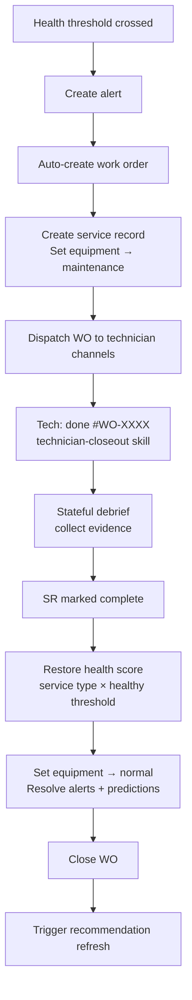

# Maintenance closed-loop flow

Defines end-to-end loop from equipment degradation alert to post-work health update.

## Entry condition

Equipment state transitions to warning or critical health threshold.

## Deterministic steps

1. Create equipment alert.
2. Generate work order with technician assignment → service record created → equipment status set to `maintenance`.
3. Deliver WO reference to technician channels (mobile, email, bot).
4. Technician taps "✅ Done" or sends `done #WO-XXXX` → backend routes via `▶closeout WO-XXXX` to bypass engine's built-in handler → LLM invokes `technician-closeout` skill with 3-tier branching.
5. **3-tier closeout** based on WO data:
   - **Tier 1** (no equipment_code): one question — "What did you do?" → close. No FM notification, reporter notified by backend.
   - **Tier 2** (comfort complaint with equipment): two questions — "Was it resolved?" + optional temp reading → close. Same notification rules as Tier 1.
   - **Tier 3** (equipment fault): full equipment-specific checklist (4-8 items), AI diagnosis, FM notification.
6. Stateful multi-step debrief (Tier 3 only) collects evidence via inspection checklist, persisted to `sentry_inspection_sessions` table for resume on restart.
7. On completion: equipment status → `normal`; health score restored from service type + configured healthy threshold; alerts and predictions resolved.
8. Emit closure event and recommendation refresh trigger.

## Site-002 guided inspection scope (major-equipment-first)

Full guided inspection and OEM detail capture are enabled only for major and high-impact equipment by default.

| Tier | Guided inspection level | Deterministic inclusion rule |
|---|---|---|
| Tier A | Full guided inspection | `type` in `CHILLER, CHWP, CWP, CT, BOILER, AHU, GEN, UPS, ATS, MSB, INCOMER` |
| Tier B | Guided-lite (conditional) | `type` in `FCU, VAV, DALI_CONTROLLER, METER` and (`health_score <= 70` or `>= 2` warning/critical transitions in 30 days) |
| Tier C | Generic WO only | All remaining low-impact endpoints/devices |

### Hard overrides

- Always include in Tier A: life-safety, backup power, whole-floor/whole-building comfort assets, or `criticality=high`.
- Always exclude from guided inspection: telemetry-only points, virtual points, software-only assets, single endpoint sensors/luminaires.

### Site-002 fast matcher

Treat these prefixes as Tier A by default:

- `S002-CHILLER-`
- `S002-CHWP-`
- `S002-CWP-`
- `S002-CT-`
- `S002-BOILER-`
- `S002-AHU-`
- `S002-GEN-`
- `S002-UPS-`
- `S002-ATS-`
- `S002-MSB-`
- `S002-INCOMER-`

## Exit condition

Work order closed with evidence and updated health state reflected in monitoring/recommendation views.

## Required records

- Alert record with threshold-crossing context
- WO record with assignment and timestamps
- Evidence bundle (notes, media, measurements)
- Post-maintenance health delta
- Guided inspection scope decision (`tier`, `rule_match`, `override_reason`)

## Acceptance checks

- Tier A work orders include guided inspection payload and technician evidence prompts.
- Tier B assets remain guided-lite unless escalation condition is met.
- Tier C assets never block on full guided inspection requirements.
- Monitoring publishes `% Tier A with manufacturer+model discovered`.

## Flow diagram

