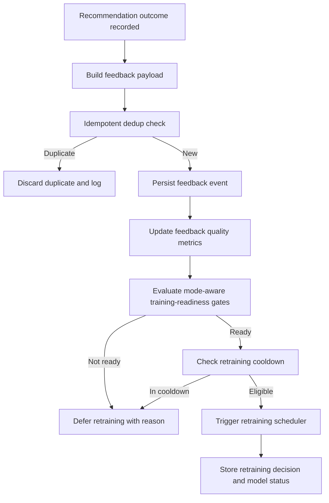

# ML feedback and training-readiness flow

Defines how recommendation outcomes become ML feedback and retraining signals.

## Entry condition

Recommendation reaches a terminal operational outcome:

- applied and verified
- rejected
- rolled back
- expired

## Deterministic steps

1. Capture outcome event and context payload.
2. Deduplicate feedback event by idempotency key.
3. Aggregate feedback quality metrics (coverage, lag, success rate).
4. Evaluate training-readiness gates by mode.
5. If readiness passes and cooldown rules allow, trigger retraining scheduler.
6. Store retraining decision and model health outcome.

## Exit condition

- Feedback accepted and retraining deferred, or
- feedback accepted and retraining triggered with traceable reason code.

## Flow diagram

