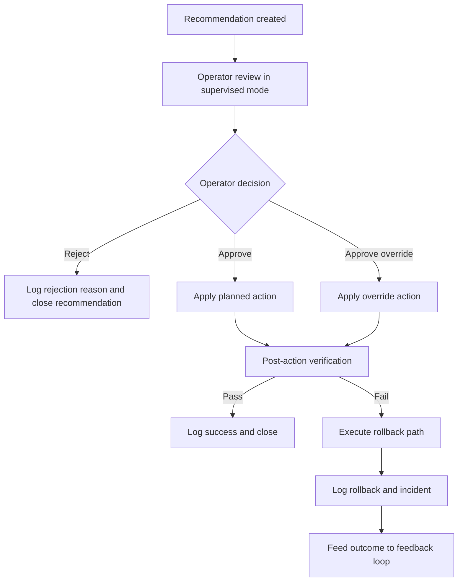

# Operator override and rollback flow

Defines supervised decisioning when recommended changes require operator confirmation.

## Entry condition

- Recommendation mode is supervised, and
- recommendation is eligible for operator review.

## Decision path

1. Recommendation generated with context and confidence.
2. Operator reviews impact, risk, and reason codes.
3. Operator action:
- approve
- reject
- approve with override parameters
4. System logs approval decision.
5. If applied and post-action verification fails, rollback path executes.

## Rollback path

1. Detect verification failure or safety violation.
2. Execute rollback action (or schedule rollback work order when direct revert not available).
3. Emit rollback audit and incident event.
4. Feed outcome into recommendation and feedback scoring.

## Exit condition

- Recommendation resolved as applied, rejected, or rolled back with evidence attached.

## Flow diagram

