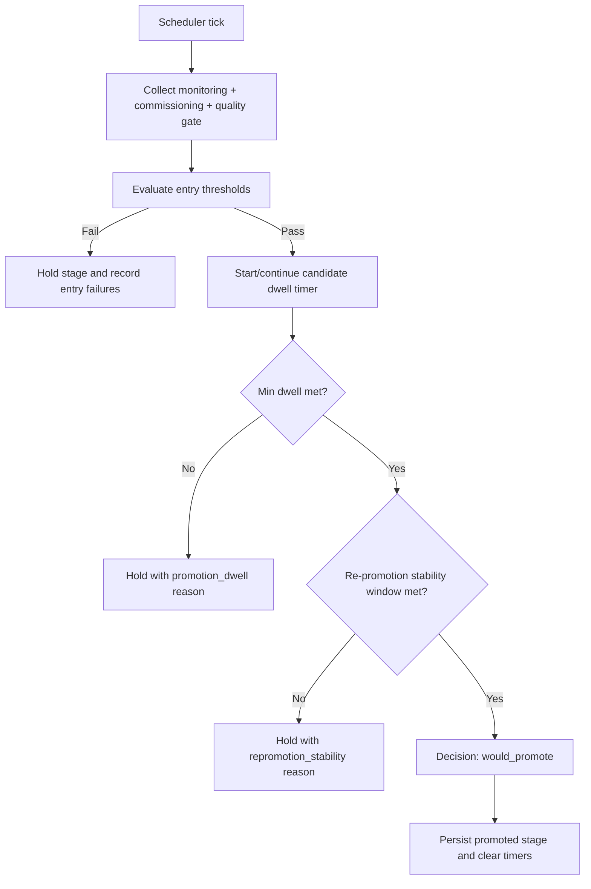

# Stage promotion evidence flow

Defines how promotion decisions are formed from measured telemetry and commissioning state.

## Entry condition

System runs scheduled policy evaluation for current stage with a configured next stage.

## Evidence sources

- Monitoring snapshot ingestion KPIs
- Control KPI conflict counters
- Commissioning scorecard state
- Quality gate status
- State tracker dwell timestamps

## Deterministic steps

1. Collect snapshot and derive metric bundle.
2. Evaluate all entry thresholds for next stage.
3. If any threshold fails, clear candidate stage and hold.
4. If all pass, start or continue candidate dwell timer.
5. Enforce minimum dwell duration.
6. Enforce anti-flap re-promotion stability window.
7. If all conditions hold, emit `would_promote`.
8. Persist new stage and clear candidate/violation timers.

## Exit condition

- Promotion decision emitted and state updated, or
- Hold decision emitted with blocking reason code(s).

## Flow diagram

