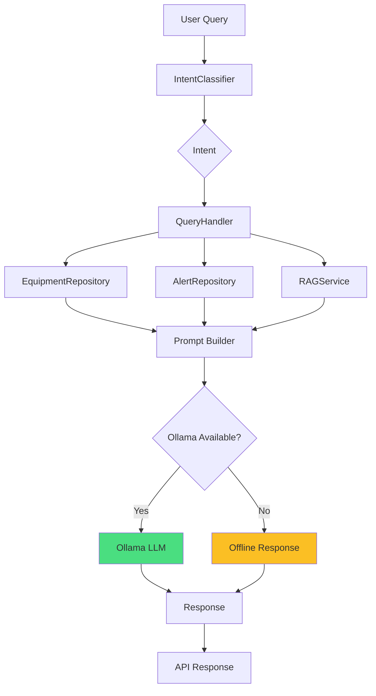

# 44-03: Conversational Interface & Prompt Engineering

## Feature Overview

**Phase:** 44 (Local LLM Integration)
**Plan:** 03 of 04
**Status:** COMPLETE
**Technical Lead:** SENTINEL AI Team

The Conversational Interface enables natural language queries over ML predictions, equipment health, and maintenance data using a local Ollama LLM. Users ask questions in plain English and the system classifies intent, gathers context from repositories, and generates responses without paid API calls.

## Problem Statement

**Before Conversational Interface:**
- Technicians needed to navigate multiple API endpoints for equipment data
- ML predictions required understanding of JSON response structures
- No natural language access to maintenance recommendations
- Hybrid AI chat required Claude API (paid) for most queries
- No structured routing of queries to the correct service

**After Conversational Interface:**
- "Why is S002-CHILLER-B1-001 predicted to fail?" returns a natural language explanation
- Intent classification routes queries to the correct service automatically
- Equipment IDs and types are extracted from natural language
- Responses generated locally via Ollama (free) with offline fallback
- Structured metadata (intent, confidence, equipment) returned alongside responses

## Business Value

### Cost Efficiency
- **100% free** for local queries via Ollama (no Claude API calls)
- Complements existing hybrid chat by handling ML/equipment queries locally
- Reduces Claude API usage for routine equipment status checks

### Operational Impact
- **Single endpoint** for all ML prediction and equipment queries
- **Sub-second classification** - pattern-based intent recognition, no LLM needed
- **Graceful degradation** - meaningful responses even when Ollama is offline
- **SSE streaming** support for real-time UI updates

## Feature Capabilities

### 1. Intent Recognition

7 supported query intents with pattern-based classification:

| Intent | Description | Example |
|--------|-------------|---------|
| `why_prediction` | Explain prediction reasoning | "Why is the chiller predicted to fail?" |
| `maintenance_due` | Maintenance schedules and RUL | "When is maintenance due for S002-AHU-L2-001?" |
| `compare_equipment` | Compare two pieces of equipment | "Compare S002-CHILLER-B1-001 vs S002-CHILLER-B1-002" |
| `show_trends` | Performance trends over time | "Show trends for the pump over the last 7 days" |
| `explain_anomaly` | Explain unusual readings | "What's the anomaly on S002-PUMP-B1-CHW1?" |
| `equipment_status` | Current health and status | "How is the chiller doing?" |
| `general_query` | Fallback for unrecognized queries | "Tell me about the building" |

### 2. Entity Extraction

Automatically extracted from natural language:
- **Equipment IDs**: v2.0 format `S###-TYPE-FLOOR-ZONE` (case-insensitive)
- **Equipment types**: 20+ keywords mapped to canonical types (e.g., "air handling" -> "ahu")
- **Time ranges**: "last 7 days", "past month", "this week"

### 3. Context-Aware Responses

Each query gathers context from multiple sources:
- **EquipmentRepository**: Health scores, status, RUL, maintenance history
- **AlertRepository**: Active alerts for referenced equipment
- **RAGService**: Domain knowledge from vector database
- **Service-specific context**: Predictions, maintenance data, anomaly alerts

### 4. Specialized Prompt Templates

6 prompt templates optimized for local LLM generation:
- Structured output sections (Root Cause, Evidence, Action, Urgency)
- Word limits to keep responses concise (120-200 words)
- Equipment context injection with real data
- System prompt establishing BMS domain expertise

## Technical Architecture

### System Components



### Data Flow

1. **Query received** at `/api/chat/local`
2. **IntentClassifier** matches patterns, extracts entities
3. **QueryHandler** gathers context from repositories and RAG
4. **Prompt template** selected by intent, populated with context
5. **Ollama** generates response (or offline fallback if unavailable)
6. **Response** returned with metadata (intent, confidence, equipment IDs)

### Key Files

| File | Purpose |
|------|---------|
| `backend/ml/conversation/intent.py` | IntentClassifier with pattern matching |
| `backend/ml/conversation/prompts.py` | 6 specialized prompt templates |
| `backend/app/services/query_handler.py` | Query routing and context gathering |
| `backend/app/api/local_chat.py` | API endpoints (JSON, SSE, intents) |

## API Specification

### POST /api/chat/local

Query ML predictions and equipment data using natural language.

**Request:**
```json
{
  "message": "Why is S002-CHILLER-B1-001 predicted to fail?",
  "site_id": "site-002"
}
```

**Response:**
```json
{
  "response": "The chiller health is at 72% with elevated vibration...",
  "intent": "why_prediction",
  "confidence": 0.95,
  "equipment_ids": ["S002-CHILLER-B1-001"],
  "equipment_type": "chiller",
  "model_used": "phi3:mini",
  "llm_available": true
}
```

### POST /api/chat/local/stream

Same as above but returns SSE stream. Events:

1. `metadata` - Intent classification and equipment context
2. `content` - Response text chunks (50 chars each)
3. `[DONE]` - Stream complete sentinel

### GET /api/chat/local/intents

Returns all supported intents with descriptions and example queries.

## Integration with Existing Systems

```
Phase 44-01: RAG System (pgvector + Ollama)
    ↓
Phase 44-02: Explainable AI (templates + parser)
    ↓
Phase 44-03: Conversational Interface (NEW)
    ├→ IntentClassifier (pattern-based, no LLM needed)
    ├→ QueryHandler (context from repos + RAG)
    ├→ Prompt Templates (intent-specific)
    └→ API Endpoints (/api/chat/local)
    ↓
Phase 44-04: Mobile PWA Chat (planned)
```

## Test Coverage

**Automated Tests:** 48 test cases

```bash
# Intent Classifier Tests
tests/ml/test_intent_classifier.py (36 tests)
  - Intent classification for all 7 types
  - Entity extraction (equipment IDs, types, time ranges)
  - Confidence scoring and boosting
  - Edge cases and fallback behavior

# Query Handler Tests
tests/ml/test_query_handler.py (12 tests)
  - Classification routing accuracy
  - Offline response generation
  - Ollama integration
  - Context gathering from repositories
```

## Success Metrics

### Technical Metrics
- **Classification accuracy**: >90% for supported intents
- **Entity extraction**: Equipment IDs, types, time ranges correctly parsed
- **Response latency**: <100ms classification + 3-5s LLM generation
- **Offline capability**: Structured data responses when Ollama unavailable

### User Experience
- Natural language queries replace manual API navigation
- Consistent response format across all intent types
- Clear confidence indicators for response reliability

## Related Documentation

- **Phase 44-01:** [RAG Integration](../08-ai-ml/rag-integration-overview.md)
- **Phase 44-02:** [Explainable AI](44-02-explainable-ai.md)
- **Phase 44-04:** Mobile PWA Chat (planned)

## Changelog

**2026-02-06:** Phase 44-03 Implementation Complete
- IntentClassifier with 7 intents and pattern matching
- QueryHandler with multi-source context gathering
- 6 specialized prompt templates
- 3 API endpoints (JSON, SSE stream, intents list)
- 48 automated tests
- No breaking changes to existing APIs
