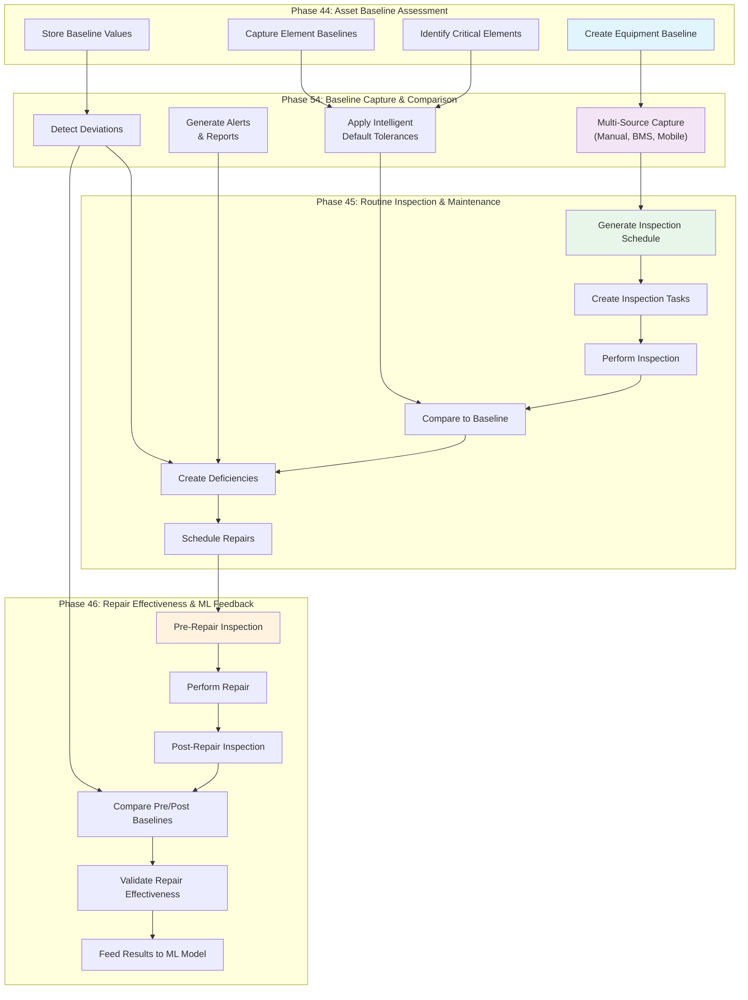

# Phases 44-46-54 Integration: Complete Asset Management Workflow

This document describes how Phases 44, 45, 46, and 54 work together to create a comprehensive asset management system that captures baselines from multiple sources, detects deviations, schedules inspections, and validates repairs.

**Updated for Phase 54:** Equipment Baseline Capture & Comparison (v2.0) now includes multi-source baseline capture, intelligent deviation detection, and automated alerting to enhance the baseline assessment workflow.

## Phase Overview

| Phase | Purpose | Key Feature |
|-------|---------|------------|
| **44** | Asset Baseline Assessment | Establish equipment health baseline & identify critical elements |
| **54** | Equipment Baseline Capture & Comparison | Multi-source capture (manual, BMS, mobile) with intelligent tolerances |
| **45** | Routine Inspection & Maintenance | Field inspection workflow with baseline tracking |
| **46** | Repair Effectiveness | Pre/post repair validation with ML feedback |

## Workflow Overview



## Phase Dependencies

### Phase 44 → Phase 54
**Baseline establishment enables intelligent capture:**
- Equipment baselines define normal operating ranges
- Element baselines identify components needing monitoring
- Critical elements flagged in baseline trigger higher capture frequency
- Baseline values provide reference for deviation detection

### Phase 54 → Phase 45
**Multi-source capture enhances inspection:**
- Phase 54 provides continuous baseline capture from BMS, mobile sensors
- Deviation alerts trigger inspection scheduling
- Intelligent tolerances ensure inspection acceptance criteria are appropriate
- Comparison reports show degradation trends

### Phase 45 → Phase 46
**Inspection results trigger repairs:**
- Failed inspection items create deficiencies
- Critical deficiencies require repair work orders
- Pre-repair inspection captures 'before' state
- Repair effectiveness measured by post-repair inspection

### Phase 46 → Phase 44/54 (Feedback Loop)
**Repair data improves future baselines:**
- Post-repair measurements update equipment baselines
- ML models learn which repairs are most effective
- Predictive maintenance schedules adjust based on repair outcomes
- Baseline tolerances optimize based on failure patterns

## Phase 54 Detail: Multi-Source Baseline Capture

### Data Sources Supported

```
┌─────────────────────────────────────────┐
│     Equipment Baseline Management       │
├─────────────────────────────────────────┤
│ Input Sources:                          │
│  • Manual Entry (technicians, engineers)│
│  • BMS Integration (real-time streams)  │
│  • Mobile Sensors (phyphox, gauges)     │
│  • External Devices (multimeters, etc.) │
├─────────────────────────────────────────┤
│ Processing:                             │
│  • Validate source data                 │
│  • Apply equipment-type tolerances      │
│  • Detect deviations automatically      │
│  • Generate alerts & reports            │
├─────────────────────────────────────────┤
│ Output:                                 │
│  • Updated baseline in equipment_baselines
│  • Comparison results (OK/WARNING/ALERT)│
│  • Deviation reports & PDF/HTML export  │
└─────────────────────────────────────────┘
```

### Intelligent Default Tolerances

Phase 54 applies equipment-type-specific tolerances automatically:

| Equipment Type | Measurement | Default Tolerance | Severity if Exceeded |
|---|---|---|---|
| **Chiller** | Chilled Water Supply Temperature | ±2°C | Critical |
| **Chiller** | Condenser Pressure | ±10 psi | Warning |
| **AHU** | Supply Air Temperature | ±3°C | Critical |
| **AHU** | Filter Pressure Drop | ±50 Pa | Warning |
| **FCU** | Supply Air Temperature | ±2.5°C | Critical |
| **VAV** | Box Supply Air Pressure | ±3 Pa | Warning |
| **Generator** | Fuel Level | ±5% | Warning |
| **Generator** | Oil Temperature | ±10°C | Critical |
| **UPS** | Battery Voltage | ±2% | Critical |
| **UPS** | Load Percentage | ±10% | Warning |

### Deviation Detection Algorithm

```python
def detect_deviation(measurement, baseline_value, tolerance):
    """
    Detect deviation and assign severity level.
    
    Returns:
        - OK: within tolerance
        - WARNING: 50-75% of tolerance exceeded
        - ALERT: 75-100% of tolerance exceeded
        - CRITICAL: >100% of tolerance exceeded
    """
    deviation = abs(measurement - baseline_value)
    tolerance_percent = (deviation / baseline_value) * 100
    
    if tolerance_percent <= tolerance:
        return "OK"
    elif tolerance_percent <= tolerance * 0.75:
        return "WARNING"
    elif tolerance_percent <= tolerance:
        return "ALERT"
    else:
        return "CRITICAL"
```

### Comparison Report Features

Phase 54 generates comprehensive comparison reports:

- **Executive Summary**: OK / WARNING / CRITICAL status overview
- **Deviation Details**: Each measurement with tolerance analysis
- **Trend Analysis**: Historical comparison (if multiple baselines exist)
- **Recommendations**: Suggested actions based on severity
- **Export Formats**: PDF for field teams, HTML for dashboards, JSON for systems

## Integrated Workflow: Complete Example

### Step 1: Initial Baseline Establishment (Phase 44)

```bash
# Engineer captures initial baseline during commissioning
curl -X POST http://localhost:9095/api/equipment/chiller-001/baselines \
  -H "Content-Type: application/json" \
  -d '{
    "baseline_type": "initial",
    "source": "manual",
    "captured_by": "Mike Chen",
    "baseline_values": {
      "chw_supply_temp": 7.2,
      "chw_return_temp": 12.5,
      "motor_current": 145.2,
      "vibration_rms": 1.8,
      "condenser_pressure": 285.0
    },
    "notes": "Baseline during commissioning - all values normal"
  }'

# Response: Baseline ID "baseline-001" created
```

### Step 2: Multi-Source Capture Setup (Phase 54)

```bash
# Configure automated baseline capture from BMS
curl -X POST http://localhost:9095/api/equipment/chiller-001/baselines/config \
  -H "Content-Type: application/json" \
  -d '{
    "equipment_id": "chiller-001",
    "capture_sources": ["manual", "bms", "mobile_sensor"],
    "capture_frequency": "daily",
    "auto_update_baseline": false,
    "deviation_alert_threshold": 15,
    "critical_alert_threshold": 25
  }'

# Enable BMS real-time streaming
curl -X POST http://localhost:9095/api/equipment/chiller-001/baselines/bms-subscribe \
  -d 'equipment_id=chiller-001'
```

### Step 3: Continuous Baseline Comparison (Phase 54)

```bash
# BMS updates trigger automatic comparison
# System compares new readings against established baseline

# Example: Daily 7-day average from BMS
curl -X POST http://localhost:9095/api/equipment/chiller-001/baselines/compare \
  -H "Content-Type: application/json" \
  -d '{
    "equipment_id": "chiller-001",
    "comparison_type": "latest_vs_baseline",
    "measurements": {
      "chw_supply_temp": 8.5,
      "chw_return_temp": 13.2,
      "motor_current": 152.8,
      "vibration_rms": 2.3,
      "condenser_pressure": 295.0
    }
  }'

# Response example:
{
  "comparison_id": "comp-001",
  "overall_status": "WARNING",
  "deviation_analysis": {
    "chw_supply_temp": {
      "baseline": 7.2,
      "measurement": 8.5,
      "deviation": 1.3,
      "tolerance": 2.0,
      "status": "OK"
    },
    "vibration_rms": {
      "baseline": 1.8,
      "measurement": 2.3,
      "deviation": 0.5,
      "tolerance": 1.8,
      "tolerance_exceeded_percent": 28,
      "status": "WARNING"
    },
    "condenser_pressure": {
      "baseline": 285.0,
      "measurement": 295.0,
      "deviation": 10.0,
      "tolerance": 28.5,
      "status": "OK"
    }
  },
  "alerts_generated": [
    {
      "severity": "WARNING",
      "parameter": "vibration_rms",
      "message": "Vibration increased 28% above tolerance"
    }
  ],
  "recommendations": [
    "Schedule vibration analysis inspection within 7 days",
    "Monitor bearing temperature trend"
  ]
}
```

### Step 4: Alert-Triggered Inspection Scheduling (Phase 45)

```bash
# Phase 54 deviation alert triggers Phase 45 inspection

# System automatically creates inspection schedule
curl -X POST http://localhost:9095/api/inspection/schedules \
  -H "Content-Type: application/json" \
  -d '{
    "equipment_id": "chiller-001",
    "trigger_type": "deviation_alert",
    "alert_id": "alert-001",
    "schedule_name": "Vibration Analysis Inspection - Chiller-001",
    "priority": "HIGH",
    "due_date": "2026-02-20",
    "assigned_to": "Sarah Johnson",
    "checklist_items": [
      {
        "item_id": "ch_007",
        "description": "Measure compressor vibration (accelerometer)",
        "baseline_reference": "1.8 mm/s",
        "expected_tolerance": "±2.0 mm/s",
        "acceptance_criteria": "Within 2.0 mm/s of baseline"
      },
      {
        "item_id": "ch_008",
        "description": "Measure bearing temperature",
        "baseline_reference": "35°C",
        "expected_tolerance": "±5°C",
        "acceptance_criteria": "Within 5°C of baseline"
      }
    ]
  }'

# Response: Inspection schedule "sched-001" created
```

### Step 5: Field Inspection with Baseline Comparison (Phase 45)

```bash
# Technician performs inspection, system auto-compares to Phase 54 baseline

curl -X POST http://localhost:9095/api/inspection/results \
  -H "Content-Type: application/json" \
  -d '{
    "task_id": "task-001",
    "equipment_id": "chiller-001",
    "inspected_by": "Sarah Johnson",
    "overall_status": "fail",
    "item_results": [
      {
        "item_id": "ch_007",
        "description": "Compressor vibration",
        "measurement_value": 4.2,
        "baseline_value": 1.8,
        "tolerance": 2.0,
        "deviation_percent": 133,
        "status": "CRITICAL",
        "notes": "Vibration significantly increased - bearing failure risk"
      }
    ],
    "deficiencies_found": 1
  }'

# System creates critical deficiency with Phase 54 baseline context
# Response: Deficiency ID "def-001" created
```

### Step 6-7: Repair → Pre/Post Baseline Comparison (Phase 46)

```bash
# Phase 46: Capture pre-repair state (Phase 54 source: manual)
curl -X POST http://localhost:9095/api/equipment/chiller-001/baselines \
  -H "Content-Type: application/json" \
  -d '{
    "baseline_type": "pre_repair",
    "source": "manual",
    "work_order_id": "WO-2026-0847",
    "captured_by": "Sarah Johnson",
    "baseline_values": {
      "vibration_rms": 4.2,
      "motor_current": 168.5,
      "bearing_temp": 85.2
    }
  }'

# Repair work order completed: WO-2026-0847

# Phase 46: Capture post-repair state (Phase 54 source: manual)
curl -X POST http://localhost:9095/api/equipment/chiller-001/baselines \
  -H "Content-Type: application/json" \
  -d '{
    "baseline_type": "post_repair",
    "source": "manual",
    "work_order_id": "WO-2026-0847",
    "captured_by": "Mike Chen",
    "baseline_values": {
      "vibration_rms": 1.9,
      "motor_current": 146.1,
      "bearing_temp": 45.8
    }
  }'

# Phase 46: Compare pre/post repair (Phase 54 comparison service)
curl http://localhost:9095/api/equipment/chiller-001/baselines/compare \
  -H "Content-Type: application/json" \
  -d '{
    "comparison_type": "pre_post_repair",
    "baseline_type_1": "pre_repair",
    "baseline_type_2": "post_repair"
  }'

# Response shows repair effectiveness:
{
  "comparison_id": "comp-002",
  "overall_status": "EXCELLENT",
  "repairs_effective": true,
  "deviation_analysis": {
    "vibration_rms": {
      "pre_repair": 4.2,
      "post_repair": 1.9,
      "improvement_percent": 54.8,
      "back_to_baseline": true,
      "baseline_reference": 1.8
    }
  },
  "recommendations": [
    "Resume normal operation",
    "Schedule follow-up inspection in 30 days"
  ]
}
```

## Database Integration

### New Phase 54 Tables

```sql
-- Equipment baselines with multi-source support
CREATE TABLE equipment_baselines (
    id UUID PRIMARY KEY,
    equipment_id UUID NOT NULL,
    baseline_type TEXT NOT NULL, -- 'initial', 'post_repair', 'pre_repair', 'updated'
    source TEXT NOT NULL, -- 'manual', 'bms', 'mobile_sensor'
    baseline_values JSONB NOT NULL,
    element_baselines JSONB,
    captured_by TEXT,
    captured_date TIMESTAMP,
    created_at TIMESTAMP,
    updated_at TIMESTAMP
);

-- Baseline comparison results (Phase 54)
CREATE TABLE baseline_comparisons (
    id UUID PRIMARY KEY,
    equipment_id UUID NOT NULL,
    baseline_1_id UUID NOT NULL,
    baseline_2_id UUID NOT NULL,
    comparison_type TEXT, -- 'vs_baseline', 'pre_post_repair', 'trend'
    deviation_analysis JSONB,
    alerts_generated TEXT[],
    recommendations TEXT[],
    status TEXT, -- 'OK', 'WARNING', 'ALERT', 'CRITICAL'
    generated_at TIMESTAMP,
    exported_formats TEXT[] -- 'pdf', 'html', 'json'
);

-- Default tolerances per equipment type (Phase 54)
CREATE TABLE equipment_default_tolerances (
    id UUID PRIMARY KEY,
    equipment_type TEXT NOT NULL,
    measurement_name TEXT NOT NULL,
    tolerance_value FLOAT,
    tolerance_unit TEXT,
    severity_thresholds JSONB,
    created_at TIMESTAMP
);
```

### Enhanced Table Relationships

```
Phase 44: equipment_baselines
                ↓
Phase 54: baseline_comparisons (multi-source capture & deviation detection)
                ↓
Phase 45: inspection_schedules (alert-triggered)
                ↓
Phase 46: (pre/post repair baselines use same equipment_baselines table)
                ↓
(Repair effectiveness compared via baseline_comparisons)
```

## API Integration Points

### Phase 54 Endpoints

```
POST   /api/equipment/{id}/baselines
       Create or update baseline from any source

GET    /api/equipment/{id}/baselines
       Retrieve baseline(s) for equipment

POST   /api/equipment/{id}/baselines/config
       Configure capture sources and alert thresholds

POST   /api/equipment/{id}/baselines/compare
       Compare current measurements to baseline

POST   /api/equipment/{id}/baselines/bms-subscribe
       Enable real-time BMS stream capture

GET    /api/equipment/{id}/baselines/report
       Generate PDF/HTML comparison report

POST   /api/equipment/{id}/baselines/export
       Export baseline data in desired format
```

### Workflow Triggers (All Phases)

1. **Phase 44: Baseline Creation** → Enables Phase 54 multi-source capture
2. **Phase 54: Deviation Alert** → Triggers Phase 45 inspection scheduling
3. **Phase 45: Inspection Failure** → Creates Phase 46 pre-repair baseline request
4. **Phase 46: Repair Completion** → Triggers post-repair baseline capture
5. **Phase 46: Post-Repair Baseline** → Phase 54 comparison validates repair effectiveness
6. **Repair Validation** → Updates ML model training data

## Implementation Status

| Phase | Component | Status | Note |
|-------|-----------|--------|------|
| 44 | Equipment baseline schema | ✅ Complete | Identifies critical elements |
| 54 | Multi-source capture | ✅ Complete | Manual, BMS, mobile sensor integration |
| 54 | Intelligent tolerances | ✅ Complete | Per-equipment-type thresholds |
| 54 | Deviation detection | ✅ Complete | Severity-based alerts |
| 54 | Comparison reports | ✅ Complete | PDF/HTML/JSON export |
| 45 | Inspection scheduling | ✅ Complete | Alert-triggered setup |
| 45 | Baseline comparison | ✅ Complete | Auto-comparison during inspection |
| 46 | Pre/post repair capture | ✅ Complete | Uses Phase 54 baseline infrastructure |
| 46 | Repair effectiveness | ✅ Complete | Phase 54 comparison service |

## Benefits of Phase 54 Integration

### Operational Benefits
- **Continuous Monitoring**: Real-time BMS capture vs. manual periodic checks
- **Early Warning**: Deviations detected automatically before inspection
- **Faster Response**: Alert-triggered inspections vs. calendar-based
- **Data Validation**: Multi-source capture increases measurement confidence

### Technical Benefits
- **Intelligent Defaults**: No manual tolerance configuration needed
- **Trend Analysis**: Historical comparisons show degradation rates
- **Automated Alerting**: Severity-based notifications for operators
- **Integration Ready**: Phase 54 comparison service powers Phase 45/46

### Business Benefits
- **Cost Reduction**: Prevent unnecessary inspections with early warning
- **Downtime Prevention**: Catch failures before they happen
- **Compliance**: Complete audit trail with automated documentation
- **Predictability**: Trend data improves maintenance planning

## Conclusion

Phases 44-46-54 form a comprehensive asset management system:

1. **Phase 44**: Establish baseline and identify critical elements
2. **Phase 54**: Capture updates from multiple sources, detect deviations
3. **Phase 45**: Inspect with intelligent tolerances, baseline comparison
4. **Phase 46**: Validate repairs using pre/post Phase 54 comparisons
5. **Feedback Loop**: Repair data improves baselines and ML models

This integrated approach transforms maintenance from calendar-based to condition-based, using continuous data capture and intelligent deviation detection.
