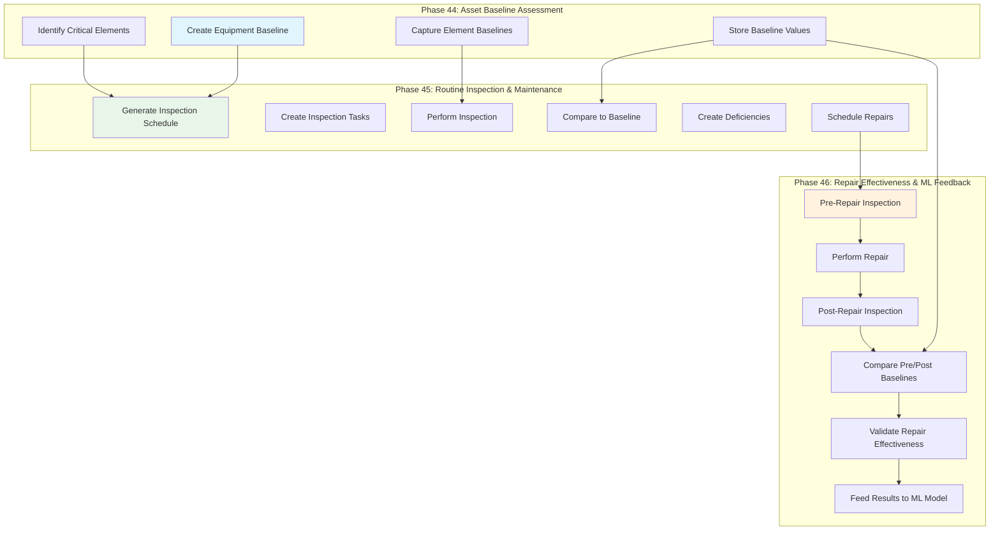

# Phases 44-46 Integration: Complete Asset Management Workflow

This document describes how Phases 44, 45, and 46 work together to create a comprehensive asset management system that captures baselines, schedules inspections, and validates repairs.

## Workflow Overview



## Phase Dependencies

### Phase 44 → Phase 45
**Baseline data drives inspection scheduling:**
- Equipment baselines define normal operating conditions
- Element baselines identify components needing monitoring
- Critical elements flagged in baseline trigger higher inspection frequency
- Baseline values provide pass/fail criteria for inspections

### Phase 45 → Phase 46
**Inspection results trigger repairs:**
- Failed inspection items create deficiencies
- Critical deficiencies require repair work orders
- Pre-repair inspection captures 'before' state
- Repair effectiveness measured by post-repair inspection

### Phase 46 → Phase 44/45 (Feedback Loop)
**Repair data improves future baselines:**
- Post-repair measurements update equipment baselines
- ML models learn which repairs are most effective
- Predictive maintenance schedules adjust based on repair outcomes
- Inspection frequencies optimize based on failure patterns

## Data Flow Between Phases

### 1. Baseline → Inspection Integration

```json
{
  "phase_44_baseline": {
    "equipment_id": "chiller-001",
    "baseline_values": {
      "chw_supply_temp": 7.2,
      "motor_current": 145.2,
      "vibration_rms": 1.8
    },
    "critical_elements": [
      {
        "element_id": "compressor_bearing_1",
        "criticality": "high",
        "baseline_vibration": 1.8
      }
    ]
  },
  "phase_45_schedule": {
    "frequency": "monthly",
    "is_critical": true,
    "checklist_items": [
      {
        "item_id": "ch_007",
        "description": "Measure compressor vibration",
        "baseline_reference": "compressor_bearing_1",
        "acceptance_criteria": "Within 15% of baseline (1.8 mm/s)"
      }
    ]
  }
}
```

### 2. Inspection → Deficiency → Repair Integration

```json
{
  "inspection_result": {
    "task_id": "inspect-001",
    "equipment_id": "chiller-001",
    "findings": [
      {
        "item_id": "ch_007",
        "status": "fail",
        "measurement_value": "4.2 mm/s",
        "baseline_value": "1.8 mm/s",
        "deviation_percent": 133
      }
    ],
    "deficiency_created": {
      "severity": "critical",
      "title": "Excessive compressor vibration",
      "recommended_action": "Replace compressor bearing",
      "estimated_cost": "$5,000 - $8,000"
    }
  }
}
```

### 3. Pre/Post Repair Comparison

```json
{
  "pre_repair_state": {
    "inspection_id": "inspect-001",
    "vibration_rms": 4.2,
    "status": "critical",
    "date": "2026-03-01"
  },
  "repair_work_order": {
    "work_order_id": "WO-2026-0847",
    "description": "Replace compressor bearing",
    "completion_date": "2026-03-15"
  },
  "post_repair_state": {
    "inspection_id": "inspect-002",
    "vibration_rms": 1.9,
    "status": "normal",
    "date": "2026-03-16"
  },
  "repair_effectiveness": {
    "vibration_reduction": 54.8,
    "back_to_baseline": true,
    "repair_successful": true
  }
}
```

## Database Integration

### Table Relationships

```sql
-- Phase 44 Baseline Tables
equipment_baselines (equipment_id, baseline_values)
  ↓ (identifies critical elements)
equipment_elements (id, equipment_id, criticality, element_type)
  ↓ (stores baseline measurements)
element_baselines (element_id, baseline_values)

-- Phase 45 Inspection Tables
inspection_schedules (equipment_id, frequency, is_critical)
  ↓ (generates)
inspection_tasks (schedule_id, equipment_id, due_date)
  ↓ (produces)
inspection_results (task_id, equipment_id, overall_status)
  ↓ (creates)
inspection_deficiencies (result_id, equipment_id, severity)

-- Phase 46 Repair Tables (Future)
repair_work_orders (deficiency_id, equipment_id, work_description)
  ↓ (validated by)
post_repair_inspections (work_order_id, equipment_id, results)
  ↓ (compares to)
repair_effectiveness (work_order_id, pre_repair_state, post_repair_state)
```

## Complete Workflow Example

### Step 1: Asset Baseline Capture (Phase 44)

```bash
# Engineer captures initial baseline during commissioning
curl -X POST http://localhost:9095/api/equipment/chiller-001/baseline \
  -d '{
    "captured_by": "Mike Chen",
    "baseline_type": "initial",
    "baseline_values": {
      "chw_supply_temp": 7.2,
      "chw_return_temp": 12.5,
      "motor_current": 145.2,
      "vibration_rms": 1.8,
      "suction_pressure": 4.2
    },
    "notes": "Baseline during commissioning - all values normal"
  }'

# Response: Baseline ID "baseline-001" created
```

### Step 2: Inspection Schedule Setup (Phase 45)

```bash
# Create monthly inspection schedule based on baseline
curl -X POST http://localhost:9095/api/inspection/schedules \
  -d '{
    "equipment_id": "chiller-001",
    "schedule_name": "Monthly Chiller Inspection",
    "frequency_type": "monthly",
    "assigned_to": "Sarah Johnson",
    "created_by": "admin"
  }'

# System automatically:
# 1. Marks schedule as critical (based on critical elements from baseline)
# 2. Includes vibration check referencing "baseline-001"
# 3. Sets next due date 30 days out
```

### Step 3: First Inspection - Degradation Detected (Phase 45)

```bash
# Generate and perform first inspection
curl -X POST http://localhost:9095/api/inspection/tasks/generate \
  -d 'equipment_id=chiller-001'

# Inspection results show degradation
curl -X POST http://localhost:9095/api/inspection/results \
  -d '{
    "task_id": "task-001",
    "equipment_id": "chiller-001",
    "inspected_by": "Sarah Johnson",
    "overall_status": "fail",
    "item_results": [
      {
        "item_id": "ch_007",
        "status": "fail",
        "measurement_value": "4.2 mm/s",
        "baseline_value": "1.8 mm/s",
        "deviation_percent": 133,
        "notes": "Vibration significantly increased"
      }
    ],
    "deficiencies_found": 1
  }'

# System automatically creates critical deficiency
# Response: Deficiency ID "def-001" created with severity "critical"
```

### Step 4: Pre-Repair Inspection (Phase 46)

```bash
# Schedule pre-repair inspection to document current state
curl -X POST http://localhost:9095/api/equipment/chiller-001/baseline \
  -d '{
    "captured_by": "Sarah Johnson",
    "baseline_type": "pre_repair",
    "baseline_values": {
      "vibration_rms": 4.2,
      "motor_current": 168.5,
      "bearing_temp": 85.2
    },
    "notes": "Pre-repair baseline - bearing failure imminent"
  }'

# Response: Pre-repair baseline captured
```

### Step 5: Work Order Creation (Integration Point)

```bash
# Create work order for deficiency (in actual system, this would be automatic)
# Work order system creates: WO-2026-0847
# Description: Replace compressor bearing on chiller-001
# Priority: Critical
# Estimated cost: $5,000 - $8,000
```

### Step 6: Post-Repair Inspection (Phase 46)

```bash
# After repair completion, capture post-repair state
curl -X POST http://localhost:9095/api/equipment/chiller-001/baseline \
  -d '{
    "captured_by": "Mike Chen",
    "baseline_type": "post_repair",
    "baseline_values": {
      "vibration_rms": 1.9,
      "motor_current": 146.1,
      "bearing_temp": 45.8
    },
    "notes": "Post-repair baseline - bearing replaced, vibration normal"
  }'

# Response: Post-repair baseline captured
```

### Step 7: Repair Effectiveness Validation (Phase 46)

```bash
# Compare pre and post repair baselines automatically
curl http://localhost:9095/api/equipment/chiller-001/baseline/compare

# Response shows repair effectiveness:
{
  "comparison_id": "comp-002",
  "overall_status": "normal",
  "deviation_analysis": {
    "vibration_rms": {
      "pre_repair": 4.2,
      "post_repair": 1.9,
      "improvement_percent": 54.8,
      "back_to_baseline": true
    }
  },
  "repair_successful": true,
  "effectiveness_rating": "excellent"
}
```

## Integration Implementation Details

### Automatic Baseline Comparison in Inspections

```python
# In inspection_service.py
async def perform_inspection_comparison(inspection_result):
    """Automatically compare inspection to baseline."""

    # Get active baseline for equipment
    baseline = await baseline_service.get_active_equipment_baseline(
        inspection_result.equipment_id
    )

    if not baseline:
        return  # No baseline to compare against

    # Compare each measurement to baseline
    for item in inspection_result.item_results:
        baseline_value = baseline.baseline_values.get(item.measurement_type)
        current_value = item.measurement_value

        if baseline_value and current_value:
            deviation = calculate_deviation(current_value, baseline_value)
            item.baseline_deviation_percent = deviation

            # Auto-flag if deviation exceeds threshold
            if deviation > 20:
                item.status = "critical"
                # Create deficiency automatically
                await create_deficiency_from_inspection(item, inspection_result)
```

### Critical Element Detection for Scheduling

```python
# In inspection_scheduler.py
async def detect_critical_elements(equipment_id):
    """Check if equipment has critical elements from baseline."""

    elements = await baseline_service.get_equipment_elements(equipment_id)

    for element in elements:
        if element.criticality in ["high", "critical"]:
            return True

    return False
```

### Pre/Post Repair Comparison Service

```python
# In repair_effectiveness_service.py (Phase 46)
async def validate_repair_effectiveness(work_order_id):
    """Validate repair effectiveness by comparing pre/post baselines."""

    # Get pre and post repair baselines
    pre_baseline = await baseline_service.get_baseline_by_type(
        work_order.equipment_id,
        baseline_type="pre_repair"
    )

    post_baseline = await baseline_service.get_baseline_by_type(
        work_order.equipment_id,
        baseline_type="post_repair"
    )

    if not pre_baseline or not post_baseline:
        return {"error": "Missing pre or post repair baseline"}

    # Calculate improvements
    improvements = {}
    for metric, pre_value in pre_baseline.baseline_values.items():
        post_value = post_baseline.baseline_values.get(metric)
        if post_value:
            improvement = ((pre_value - post_value) / pre_value) * 100
            improvements[metric] = improvement

    # Determine overall effectiveness
    avg_improvement = sum(improvements.values()) / len(improvements)

    return {
        "work_order_id": work_order_id,
        "effectiveness_score": avg_improvement,
        "improvements": improvements,
        "repair_successful": avg_improvement > 50,  # >50% improvement
        "recommendations": generate_repair_recommendations(improvements)
    }
```

## API Integration Points

### Endpoint Dependencies

```
Phase 44 Endpoints:
  POST /api/equipment/{id}/baseline
  GET  /api/equipment/{id}/baseline
  ↓ (used by)
Phase 45 Endpoints:
  POST /api/inspection/schedules
  POST /api/inspection/tasks/generate
  POST /api/inspection/results
  ↓ (triggers)
Phase 46 Endpoints:
  GET  /api/equipment/{id}/baseline/compare
  POST /api/inspection/{id}/pre-repair
  POST /api/inspection/{id}/post-repair
```

### Workflow Triggers

1. **Baseline Creation** → Triggers inspection schedule generation
2. **Inspection Failure** → Triggers deficiency creation
3. **Critical Deficiency** → Triggers work order creation
4. **Work Order Completion** → Triggers post-repair inspection request
5. **Post-Repair Baseline** → Triggers effectiveness calculation
6. **Repair Validation** → Updates ML model training data

## Data Model Integration

### Unified Asset Data Model

```typescript
interface AssetLifecycle {
  // Phase 44: Baseline
  baseline: {
    id: string;
    equipment_id: string;
    baseline_values: Record<string, number>;
    critical_elements: Element[];
    captured_date: Date;
  };

  // Phase 45: Inspections
  inspections: {
    schedule: InspectionSchedule;
    tasks: InspectionTask[];
    results: InspectionResult[];
    deficiencies: InspectionDeficiency[];
  };

  // Phase 46: Repairs
  repairs: {
    work_orders: WorkOrder[];
    pre_repair_baseline: Baseline;
    post_repair_baseline: Baseline;
    effectiveness: RepairEffectiveness;
  };
}

interface Element {
  id: string;
  equipment_id: string;
  element_type: string;
  criticality: "low" | "medium" | "high" | "critical";
  baseline_values: Record<string, number>;
}

interface RepairEffectiveness {
  work_order_id: string;
  pre_repair_state: Record<string, number>;
  post_repair_state: Record<string, number>;
  improvement_percentage: number;
  validation_successful: boolean;
  ml_feedback_score: number;
}
```

## Benefits of Integration

### 1. Complete Asset Visibility
- Track equipment from installation through entire lifecycle
- Understand how equipment degrades over time
- Identify patterns in failure modes

### 2. Data-Driven Maintenance
- Maintenance triggered by actual condition vs. calendar
- Repair effectiveness validates maintenance strategies
- ML models learn from real outcomes

### 3. Cost Optimization
- Prevent over-maintenance with condition monitoring
- Validate repair costs against effectiveness
- Optimize spare parts inventory based on failure patterns

### 4. Compliance and Documentation
- Complete audit trail from baseline to repair
- Photo documentation at each stage
- Automated reporting for regulatory compliance

## Implementation Checklist

- [x] Phase 44: Asset baselines (equipment and element level)
- [x] Phase 45: Inspection scheduling and execution
- [ ] Phase 46: Pre/post repair baselines
- [ ] Phase 46: Repair effectiveness calculation
- [ ] Phase 46: ML model feedback integration
- [ ] Cross-phase reporting dashboard
- [ ] Automated workflow triggers
- [ ] Mobile app for field technicians

## Conclusion

The integration of Phases 44, 45, and 46 creates a powerful asset management system that:

1. **Establishes Baseline** (Phase 44) - Know your starting point
2. **Monitors Condition** (Phase 45) - Detect degradation early
3. **Validates Repairs** (Phase 46) - Ensure fixes work
4. **Learns and Improves** (Integration) - Get smarter over time

This closed-loop system transforms maintenance from reactive to predictive, using real data to continuously improve asset performance and reduce costs.
