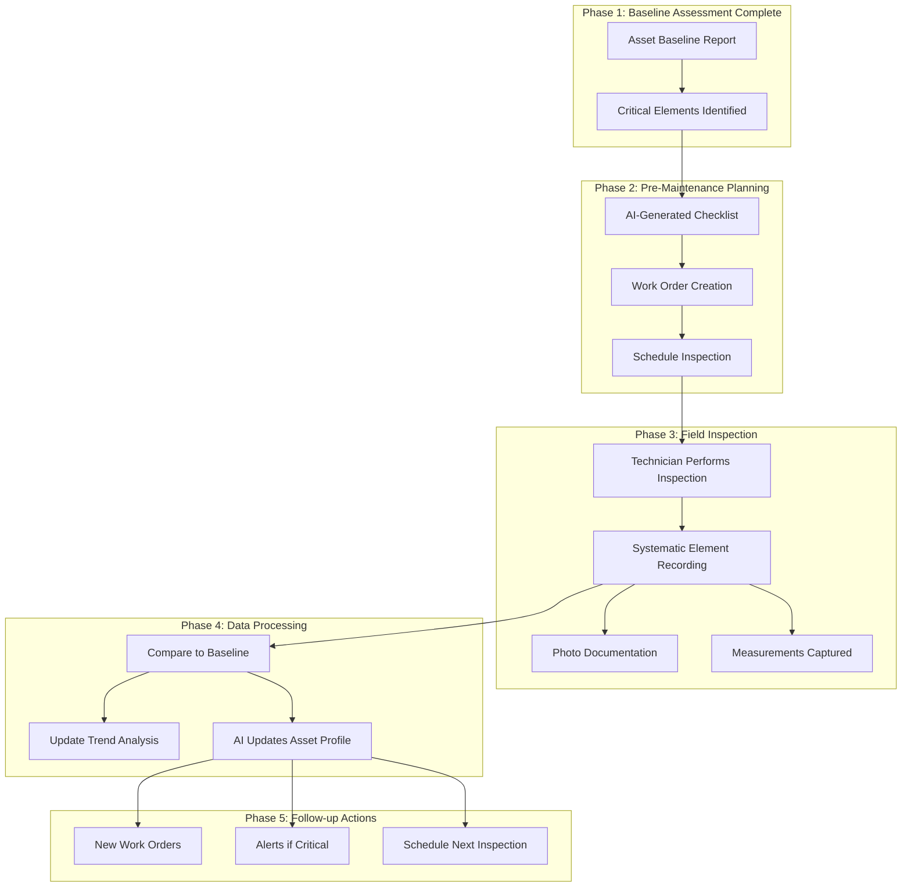

# Routine Inspection & Maintenance Workflow

Phase 45 documents the routine inspection and maintenance workflow that builds upon the asset baseline assessment (Phase 44). During weekly/monthly inspections and scheduled maintenance, technicians systematically record equipment elements based on the critical requirements identified during baseline assessment.

## Overview



## Workflow Steps

### Step 1: Baseline Assessment Completion

Before routine inspections begin, the asset baseline assessment (Phase 44) identifies critical elements for each piece of equipment.

**Example: Generator Baseline Findings**

```json
{
  "equipment_id": "GEN-SAN-001",
  "equipment_type": "generator",
  "baseline_date": "2026-02-01",

  "critical_elements": [
    {
      "element_id": "oil_system_leak",
      "component": "engine_oil_system",
      "issue": "oil_leak_at_pan_gasket",
      "baseline_status": "leak_observed",
      "method": "visual_inspection",
      "frequency": "monthly",
      "repair_urgency": "medium"
    },
    {
      "element_id": "exhaust_temperature",
      "component": "exhaust_system",
      "issue": "exhaust_gas_temperature_elevated",
      "baseline_value": "425_celsius",
      "spec_limit": "450_celsius",
      "baseline_deviation": "15%_above_normal",
      "method": "thermal_measurement",
      "frequency": "weekly"
    },
    {
      "element_id": "vibration_signature",
      "component": "engine_bearings",
      "issue": "combustion_pattern_variance",
      "baseline_rms": "1.8_mm_s",
      "method": "vibration_analyzer",
      "frequency": "monthly",
      "ml_detected": true
    }
  ],

  "standard_elements": [
    "battery_voltage",
    "coolant_level",
    "fuel_pressure",
    "engine_hours",
    "oil_pressure",
    "coolant_temperature"
  ]
}
```

### Step 2: AI-Generated Inspection Checklist

Before each inspection, AI generates a customized checklist based on the baseline findings:

```python
# Generated automatically by AI
inspection_checklist = {
  "work_order_id": "WO-2026-0847",
  "equipment_id": "GEN-SAN-001",
  "inspection_type": "monthly_routine",
  "generated_date": "2026-03-15",
  "based_on_baseline": "baseline-sandton-20260201",
  "generating_ai": "maintenance_recommender_v2.1",

  "critical_elements_section": {
    "title": "⚠️ CRITICAL ELEMENTS - Requires Special Attention",
    "instructions": "These elements were flagged during baseline assessment. Document thoroughly.",

    "checks": [
      {
        "element_id": "oil_system_leak",
        "description": "Check for oil leak at pan gasket",
        "method": "visual_inspection",
        "baseline_reference": "Leak observed during baseline (2 drops/min)",
        "acceptance_criteria": "No new leaks, existing leak not worsened",
        "recording_required": ["photo", "severity_rating", "drip_rate_if_applicable"],
        "if_worsened": "Immediately notify supervisor and create urgent work order"
      },
      {
        "element_id": "exhaust_temperature",
        "description": "Measure exhaust gas temperature at full load",
        "method": "thermal_gun_measurement",
        "baseline_reference": "425°C (15% above normal)",
        "specification_limit": "450°C maximum",
        "frequency": "Record at 25%, 50%, 75%, 100% load",
        "recording_required": ["temperature_readings", "load_percentage", "ambient_temp"],
        "if_exceeded": "Reduce load immediately and investigate cooling system"
      },
      {
        "element_id": "vibration_signature",
        "description": "Capture vibration reading at engine operating speed",
        "method": "vibration_analyzer",
        "baseline_reference": "1.8 mm/s RMS baseline",
        "measurement_points": ["drive_end", "non_drive_end", "top_of_engine"],
        "recording_required": ["rms_value", "peak_values", "frequency_spectrum", "measurement_point"],
        "alert_threshold": "> 2.5 mm/s or > 30% increase from baseline"
      }
    ]
  },

  "standard_inspection_section": {
    "title": "Standard Inspection Items",
    "checks": [
      {"item": "battery_voltage", "method": "multimeter", "expected_range": "24-28V"},
      {"item": "coolant_level", "method": "visual", "expected": "within_normal_range"},
      {"item": "fuel_pressure", "method": "gauge", "expected_range": "3.0-3.5 bar"},
      {"item": "engine_hours", "method": "controller_display", "record_value": true},
      {"item": "oil_pressure", "method": "gauge", "expected_range": "40-60 psi at idle"},
      {"item": "coolant_temperature", "method": "thermal_gun", "expected_max": "85°C"}
    ]
  },

  "additional_findings_section": {
    "title": "Additional Findings",
    "instructions": "Document any unexpected issues or observations not in baseline"
  }
}
```

### Step 3: Field Inspection Execution

Technician performs inspection using the AI-generated checklist, recording each element systematically:

```json
{
  "inspection_record": {
    "work_order_id": "WO-2026-0847",
    "equipment_id": "GEN-SAN-001",
    "date": "2026-03-15",
    "technician": "Mike Johnson",
    "technician_id": "tech-0156",
    "inspection_duration_minutes": 45,
    "weather_conditions": "sunny_24c",

    "critical_elements_recorded": [
      {
        "element_id": "oil_system_leak",
        "inspection_time": "2026-03-15T08:30:00Z",
        "status": "unchanged",
        "photo_taken": true,
        "photo_id": "img_20260315_084723.jpg",
        "photo_metadata": {
          "timestamp": "2026-03-15T08:30:15Z",
          "gps_location": "-26.1076,28.0567"
        },
        "measurements": {
          "leak_severity": "moderate",
          "drip_rate_per_minute": 2,
          "oil_level_status": "normal",
          "oil_condition": "clean"
        },
        "comparison_to_baseline": "no_change",
        "action_taken": "documented_for_next_pm",
        "parts_needed": ["oil_pan_gasket_kit_GEN001"],
        "estimated_repair_time_hours": 4,
        "next_inspection_recommended": "2026-04-15"
      },
      {
        "element_id": "exhaust_temperature",
        "inspection_time": "2026-03-15T08:45:00Z",
        "status": "normal",
        "photo_taken": false,
        "measurements": {
          "temp_at_25_load": 380,
          "temp_at_50_load": 405,
          "temp_at_75_load": 425,
          "temp_at_100_load": 440,
          "ambient_temperature": 24
        },
        "comparison_to_baseline": "improved",
        "trend_notes": "Temperatures lower than last month (was 450°C at 100% load)",
        "action_taken": "monitoring_reduced_priority",
        "next_inspection_recommended": "2026-04-15"
      },
      {
        "element_id": "vibration_signature",
        "inspection_time": "2026-03-15T09:00:00Z",
        "status": "concerning",
        "photo_taken": false,
        "measurements": {
          "drive_end_rms": 2.3,
          "non_drive_end_rms": 2.1,
          "top_of_engine_rms": 1.9,
          "dominant_frequency": 25,
          "harmonic_content": [50, 75, 100]
        },
        "comparison_to_baseline": "worsening",
        "percent_increase_from_baseline": 28,
        "trend_rate_per_week": 0.1,
        "ml_anomaly_score": 0.00082,
        "anomaly_threshold": 0.00068,
        "status": "above_threshold",
        "action_taken": "created_urgent_work_order_for_bearing_analysis",
        "parts_needed": ["main_bearing_kit_GEN001", "thrust_bearing_GEN001"],
        "estimated_repair_time_hours": 8,
        "next_inspection_recommended": "2026-03-22",
        "ai_prediction": "bearing_failure_risk_65_percent_within_30_days"
      }
    ],

    "standard_elements_recorded": {
      "battery_voltage": 27.4,
      "coolant_level": "normal",
      "fuel_pressure": 3.2,
      "engine_hours": 3280,
      "oil_pressure": 45,
      "coolant_temperature": 78
    },

    "additional_findings": [
      {
        "finding": "Crack in control panel mounting bracket",
        "severity": "low",
        "photo_taken": true,
        "photo_id": "img_20260315_090512.jpg",
        "action_taken": "documented_for_repair"
      }
    ]
  }
}
```

### Step 4: AI Processing & Analysis

The system automatically processes inspection data and compares to baseline:

```python
# Automatic processing by BaselineComparator
from app.services.baseline_comparator import BaselineComparator
from app.services.condition_scorer import ConditionScorer

class InspectionProcessor:
    def process_inspection_record(self, inspection_record):
        equipment_id = inspection_record["equipment_id"]

        # Retrieve baseline for comparison
        baseline = self.get_baseline(equipment_id)

        # Process each critical element
        for element in inspection_record["critical_elements_recorded"]:
            element_id = element["element_id"]
            baseline_element = self.find_baseline_element(baseline, element_id)

            # Compare current reading to baseline
            comparison = BaselineComparator().compare_to_baseline(
                current=element["measurements"],
                baseline=baseline_element["measurements"],
                measurement_type=element.get("measurement_type", "vibration")
            )

            # Score condition
            condition_score = ConditionScorer().calculate_score(
                current_readings=element["measurements"],
                baseline_readings=baseline_element["measurements"],
                equipment_type=inspection_record["equipment_type"]
            )

            # Generate alerts if needed
            if comparison["overall_status"] in ["warning", "critical"]:
                alert = self.create_alert(
                    equipment_id=equipment_id,
                    element_id=element_id,
                    severity=comparison["overall_status"],
                    deviation=comparison["deviations"],
                    recommendation=self.generate_recommendation(comparison)
                )

            # Update asset profile
            self.update_asset_profile(
                equipment_id=equipment_id,
                element_id=element_id,
                new_reading=element,
                comparison=comparison,
                condition_score=condition_score
            )
```

**Comparison Output Example:**

```json
{
  "element_id": "vibration_signature",
  "comparison_result": {
    "baseline_date": "2026-02-01",
    "baseline_condition": "poor",
    "deviations": [
      {
        "metric": "rms_vibration",
        "baseline": 1.8,
        "current": 2.3,
        "change_pct": 27.8
      }
    ],
    "alerts": [
      {
        "severity": "warning",
        "metric": "rms_vibration",
        "message": "Vibration +27.8% from baseline - concerning trend"
      }
    ],
    "overall_status": "warning",
    "trend_direction": "increasing",
    "ai_recommendation": "bearing_failure_predicted_30_days"
  }
}
```

### Step 5: AI Updates Asset Profile

The AI system updates the asset profile with new inspection data:

```python
from app.services.asset_profiler import AssetProfiler

class InspectionDataIntegrator:
    def update_asset_after_inspection(self, inspection_record):
        profiler = AssetProfiler()

        # 1. Update critical element tracking
        for element in inspection_record["critical_elements_recorded"]:
            profiler.update_element_history(
                equipment_id=inspection_record["equipment_id"],
                element_id=element["element_id"],
                new_status=element["status"],
                measurement=element["measurement"],
                comparison=element["comparison_to_baseline"],
                inspection_date=inspection_record["date"]
            )

        # 2. Recalculate health score
        new_health_score = profiler.recalculate_health_score(
            equipment_id=inspection_record["equipment_id"],
            weights={
                "baseline_condition": 0.4,
                "recent_inspections": 0.4,
                "trend_direction": 0.2
            }
        )

        # 3. Update maintenance recommendations
        profiler.update_recommendations(
            equipment_id=inspection_record["equipment_id"],
            recent_findings=inspection_record["critical_elements_recorded"]
        )

        # 4. Generate work orders if needed
        for element in inspection_record["critical_elements_recorded"]:
            if element["status"] == "concerning":
                work_order = profiler.create_work_order(
                    equipment_id=inspection_record["equipment_id"],
                    element_id=element["element_id"],
                    priority="high",
                    description=element["ai_prediction"],
                    parts_needed=element["parts_needed"],
                    estimated_hours=element["estimated_repair_time_hours"]
                )

        # 5. Schedule next inspection
        profiler.schedule_next_inspection(
            equipment_id=inspection_record["equipment_id"],
            based_on_findings=inspection_record["critical_elements_recorded"]
        )
```

**Updated Asset Profile:**

```json
{
  "equipment_id": "GEN-SAN-001",
  "last_inspection_date": "2026-03-15",

  "critical_elements_status": {
    "oil_system_leak": {
      "last_checked": "2026-03-15",
      "status": "unchanged",
      "trend": "stable",
      "days_since_baseline": 42,
      "repair_urgency": "medium",
      "next_inspection": "2026-04-15"
    },
    "exhaust_temperature": {
      "last_checked": "2026-03-15",
      "status": "improved",
      "trend": "decreasing",
      "notes": "Returned to normal after Load Bank test",
      "next_inspection": "2026-04-15"
    },
    "vibration_signature": {
      "last_checked": "2026-03-15",
      "status": "worsening",
      "trend": "increasing",
      "current_vs_baseline": "+28%",
      "trend_rate_per_week": 0.1,
      "predicted_threshold_crossing": "2026-04-15",
      "next_inspection": "2026-03-22",
      "ai_prediction": "bearing_failure_risk_65_percent_within_30_days"
    }
  },

  "health_score_evolution": [
    {"date": "2026-02-01", "score": 58, "source": "baseline_assessment"},
    {"date": "2026-03-01", "score": 60, "source": "monthly_inspection"},
    {"date": "2026-03-15", "score": 62, "source": "routine_inspection"}
  ],

  "work_orders_generated": [
    {
      "wo_id": "WO-2026-0876",
      "element": "vibration_signature",
      "priority": "high",
      "description": "Bearing analysis required - vibration trending upward",
      "parts_needed": ["main_bearing_kit_GEN001", "thrust_bearing_GEN001"],
      "estimated_hours": 8,
      "schedule_before": "2026-04-15"
    }
  ],

  "next_inspection_recommended": {
    "date": "2026-03-22",
    "reason": "vibration_trend_monitoring",
    "focus_elements": ["vibration_signature"]
  }
}
```

## API Reference

### Create Inspection Checklist

```http
POST /api/inspection/generate-checklist

Request:
{
  "equipment_id": "GEN-SAN-001",
  "inspection_type": "monthly_routine",
  "baseline_reference": "baseline-sandton-20260201",
  "include_standard_elements": true
}

Response:
{
  "checklist_id": "chk-20260315-001",
  "equipment_id": "GEN-SAN-001",
  "generated_date": "2026-03-15",
  "critical_elements_section": {...},
  "standard_inspection_section": {...}
}
```

### Submit Inspection Record

```http
POST /api/inspection/submit-record

Request:
{
  "work_order_id": "WO-2026-0847",
  "inspection_date": "2026-03-15",
  "technician_id": "tech-0156",
  "critical_elements_recorded": [...],
  "standard_elements_recorded": {...},
  "additional_findings": [...]
}

Response:
{
  "inspection_id": "insp-20260315-0892",
  "status": "processed",
  "comparisons_generated": 3,
  "alerts_generated": 1,
  "work_orders_created": 1,
  "asset_profile_updated": true
}
```

### Get Element Comparison

```http
POST /api/inspection/compare-to-baseline

Request:
{
  "equipment_id": "GEN-SAN-001",
  "element_id": "vibration_signature",
  "current_reading": {
    "drive_end_rms": 2.3,
    "non_drive_end_rms": 2.1,
    "dominant_frequency": 25
  }
}

Response:
{
  "comparison_result": {
    "baseline_date": "2026-02-01",
    "deviations": [...],
    "alerts": [...],
    "overall_status": "warning",
    "trend_direction": "increasing"
  }
}
```

### Get Inspection History

```http
GET /api/inspection/history/{equipment_id}

Query Parameters:
  start_date: 2026-02-01
  end_date: 2026-03-15
  element_id: vibration_signature (optional)

Response:
{
  "equipment_id": "GEN-SAN-001",
  "inspection_count": 3,
  "inspections": [
    {
      "date": "2026-03-15",
      "technician": "Mike Johnson",
      "elements_checked": [...]
    },
    {
      "date": "2026-03-01",
      "technician": "Sarah Williams",
      "elements_checked": [...]
    },
    {
      "date": "2026-02-01",
      "technician": "John Smith",
      "elements_checked": [...],
      "type": "baseline_assessment"
    }
  ]
}
```

## Best Practices

### 1. Technician Training

**Before First Inspection:**
- Review baseline report for each asset
- Understand critical elements and why they were flagged
- Practice with AI-generated checklist in training mode
- Know when to escalate (critical alerts, safety issues)

### 2. Consistent Recording

**Standardized Measurements:**
- Always use same measurement points (e.g., drive-end bearing, 90° angle)
- Record at same equipment state (e.g., full load, stable temperature)
- Use calibrated tools (thermal gun, vibration analyzer)
- Include ambient conditions (temperature, humidity, runtime hours)

**Photo Documentation:**
- Same angle and lighting for repeat measurements
- Include measurement device in photo when possible
- Timestamp and GPS automatically captured
- Minimum 2 photos per critical element

### 3. Baseline Refresh

**When to Update Baseline:**
- After major repairs or component replacement
- When health score improves by > 15 points
- Annually for critical equipment
- After significant operating condition changes

**API to Refresh:**
```http
POST /api/inspection/refresh-baseline
{
  "equipment_id": "GEN-SAN-001",
  "reason": "major_overhaul_completed",
  "new_baseline_date": "2026-06-01"
}
```

### 4. Trend Monitoring

**AI-Optimized Intervals:**
- Stable elements: Reduce frequency (save time)
- Degrading elements: Increase frequency (catch issues early)
- Critical elements: Never skip, maintain frequency

**Example Optimization:**
```
Original:        Monthly (all elements)
AI Optimized:    Monthly (critical) + Quarterly (stable)
Time Savings:    40% reduction in inspection time
Risk Impact:     No increase (focused on what matters)
```

### 5. Work Order Integration

**Auto-Creation Rules:**
- Critical status → Auto-create HIGH priority work order
- Warning status → Create MEDIUM priority, supervisor reviews
- Stable with minor issues → Add to next scheduled PM
- Parts identified → Auto-add to parts procurement queue

## Troubleshooting

### Inspection Record Not Processing

**Symptom:** Inspection submitted but asset profile not updating

**Check:**
1. Baseline exists for equipment
2. Element IDs match baseline
3. Measurement units consistent with baseline
4. API response for errors

**Resolution:**
```http
GET /api/inspection/processing-status/{inspection_id}
```

### False Positive Alerts

**Symptom:** AI generating alerts for normal variations

**Causes:**
- Baseline captured during abnormal operation
- Measurement technique inconsistent
- Environmental factors not recorded

**Resolution:**
1. Review baseline quality
2. Retrain with engineer override
3. Adjust alert thresholds
4. Document context in inspection notes

### Missing Critical Elements

**Symptom:** New issue arises that wasn't in baseline

**Process:**
1. Document in "additional_findings"
2. Create ad-hoc work order if needed
3. Add to baseline during next refresh
4. AI will track going forward

## Integration with Existing Systems

### Work Order Management

```python
# Auto-create work order from inspection finding
from app.services.work_order_service import work_order_service

if element["status"] == "concerning":
    work_order = work_order_service.create_work_order(
        description=f"{element['element_id']} requires attention",
        equipment_ref=equipment_id,
        category="corrective_maintenance",
        priority="high",
        reported_by=f"AI_Inspection_{inspection_id}"
    )
```

### CMMS Integration

Export inspection data to external systems:

```http
POST /api/inspection/export-to-cmms
{
  "cmms_system": "fiix",
  "inspection_id": "insp-20260315-0892",
  "include_photos": true,
  "create_wo_if_critical": true
}
```

### Clawd Bot Notifications

Technician can trigger notifications:

```python
from app.services.clawd_integration.work_order_notifier import WorkOrderNotifier

notifier = WorkOrderNotifier()

if element["ai_prediction"] == "bearing_failure_risk":
    notifier.notify_technician(
        equipment_id=equipment_id,
        message="Bearing failure predicted - schedule analysis",
        priority="high",
        suggested_actions=["vibration_analysis", "oil_analysis"]
    )
```

## Examples by Equipment Type

### Generator Set Example

**Critical Elements (from baseline):**
- Oil leak at pan gasket
- Exhaust temperature elevation
- Vibration signature variance
- Battery voltage trend
- Coolant condition

**Inspection Frequency:**
- Weekly: Exhaust temp, battery voltage
- Monthly: Vibration, oil leak check, visual inspection
- Quarterly: Load bank test, full analysis

**Data Recording:**
```json
{
  "inspection_type": "monthly",
  "duration": "45_minutes",
  "measurements_recorded": 15,
  "photos_taken": 4,
  "critical_elements_checked": 3,
  "alerts_generated": 1,
  "work_orders_created": 1
}
```

### HVAC AHU Example

**Critical Elements (from baseline):**
- Filter differential pressure
- Fan bearing vibration
- Supply air temperature deviation
- VFD current draw
- Damper operation

**Inspection Frequency:**
- Weekly: Filter DP, temperature readings
- Monthly: Vibration, VFD parameters
- Quarterly: Full inspection, belt check

### Chiller Example

**Critical Elements (from baseline):**
- Approach temperatures
- Refrigerant approach
- Compressor current
- Oil level and pressure
- Vibration at compressor

**Inspection Frequency:**
- Daily: Approach temps, run status
- Weekly: Oil levels, vibration trend
- Monthly: Full analysis, performance metrics

## Related Documentation

- [Asset Baseline Assessment](44-asset-baseline-assessment.md) - Establish initial equipment condition
- [Maintenance Recommender](../services/maintenance_recommender.py) - AI-powered maintenance suggestions
- [Condition Scorer](../services/condition_scorer.py) - Equipment health scoring
- [Baseline Comparator](../services/baseline_comparator.py) - Compare readings to baseline
- [Technician Chat](19-sentinel-chat-core.md) - Field diagnosis and guided troubleshooting

## Support

For inspection workflow issues:

1. Check logs: `logs/inspection_processor.log`
2. Verify baseline exists: `GET /api/onboarding/baseline-report/{equipment_id}`
3. Review API docs: `/docs/inspection-api`
4. Test comparison: Use `POST /api/inspection/compare-to-baseline` endpoint
