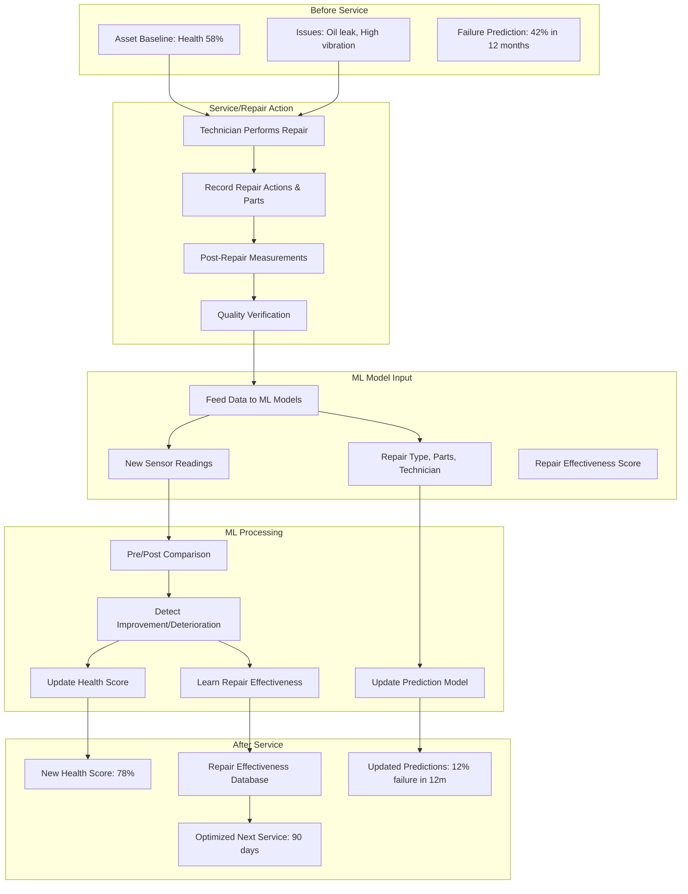

# Repair Effectiveness & ML Feedback Loop

Phase 46 documents the critical feedback loop where asset health scores improve or deteriorate based on service/repair effectiveness. When technicians perform repairs and record post-repair measurements, the ML models update health scores, learn which repairs are most effective, and continuously improve failure predictions.

## Overview



## How It Works

### Step 1: Before Service - Health Baseline

```json
{
  "equipment_id": "GEN-SAN-001",
  "assessment_date": "2026-04-01",
  "event": "pre_repair_baseline",

  "health_status": {
    "health_score": 58,
    "condition_category": "POOR",
    "risk_level": "HIGH",
    "failure_probability_12m": 0.42
  },

  "critical_elements": [
    {
      "element_id": "oil_system_leak",
      "status": "active",
      "severity": "medium",
      "measurement": "2_drops_per_minute"
    },
    {
      "element_id": "vibration_signature",
      "status": "worsening",
      "severity": "high",
      "measurement": "2.3_mm_s_rms",
      "baseline": "1.8_mm_s_rms",
      "deviation_percent": 28
    },
    {
      "element_id": "exhaust_temperature",
      "status": "elevated",
      "severity": "medium",
      "measurement": "440_celsius_at_100_load",
      "spec_limit": "450_celsius"
    }
  ],

  "ai_predictions": {
    "predicted_failure_date": "2026-08-15",
    "confidence": 0.78,
    "days_until_predicted_failure": 135,
    "recommended_repair": "bearing_replacement_and_oil_pan_gasket"
  }
}
```

### Step 2: Service/Repair Performed

Technician performs repair and records detailed information:

```json
{
  "work_order_id": "WO-2026-0876",
  "equipment_id": "GEN-SAN-001",
  "repair_date": "2026-04-15",
  "technician": "Mike Johnson",
  "technician_id": "tech-0156",
  "technician_skill_level": "senior",
  "service_type": "corrective_maintenance",

  "repair_actions": [
    {
      "action": "replaced_oil_pan_gasket",
      "components_accessed": ["oil_pan", "gasket_surface"],
      "difficulty": "medium",
      "hours_spent": 2.5
    },
    {
      "action": "replaced_main_bearing",
      "components_accessed": ["crankcase", "bearing_housing"],
      "difficulty": "high",
      "hours_spent": 4.0
    },
    {
      "action": "adjusted_engine_mounts",
      "components_accessed": ["engine_mounts"],
      "difficulty": "low",
      "hours_spent": 1.0
    }
  ],

  "parts_used": [
    {
      "part_number": "GEN-OPGASKET-001",
      "description": "Oil pan gasket kit",
      "quantity": 1,
      "condition": "new_oem"
    },
    {
      "part_number": "GEN-BEARING-001",
      "description": "Main bearing set",
      "quantity": 1,
      "condition": "new_oem"
    },
    {
      "part_number": "BOLT-M10x50",
      "description": "Mounting bolts",
      "quantity": 8,
      "condition": "new"
    }
  ],

  "tools_required": ["torque_wrench", "bearing_puller", "engine_hoist"],

  "quality_verification": {
    "inspection_performed": true,
    "inspector": "Sarah Williams",
    "verification_tests": ["torque_check", "oil_pressure_test"],
    "all_tests_passed": true,
    "repair_quality_rating": "excellent"
  }
}
```

### Step 3: Post-Repair Measurements

Technician captures post-repair measurements and provides them to ML models:

```json
{
  "measurement_date": "2026-04-15",
  "post_repair_measurements": {
    "oil_system_leak": {
      "visual_inspection": "no_leak_detected",
      "photo_verification": "img_20260415_093045.jpg",
      "measurement_method": "clean_dry_paper_under_pan",
      "drips_per_hour": 0,
      "improvement_vs_baseline": "100_percent_resolved"
    },

    "vibration_signature": {
      "measurement_time": "2026-04-15T14:30:00Z",
      "engine_state": "full_load_100_percent",
      "drive_end_rms": 1.2,
      "non_drive_end_rms": 1.1,
      "top_of_engine_rms": 1.0,
      "dominant_frequency": 25,
      "baseline_rms": 2.3,
      "improvement_percent": 48,
      "measurement_tool": "vibration_analyzer_v3",
      "calibration_date": "2026-03-01"
    },

    "exhaust_temperature": {
      "ambient_temperature": 22,
      "measurements_at_load": {
        "25_percent_load": 375,
        "50_percent_load": 395,
        "75_percent_load": 410,
        "100_percent_load": 425
      },
      "baseline_temp_100_load": 440,
      "improvement_percent": 3.4
    },

    "engine_performance": {
      "fuel_efficiency_improvement": "2.1_percent",
      "noise_level_dba": 78,
      "baseline_noise_dba": 85,
      "oil_pressure_at_idle": 45,
      "oil_pressure_at_full_load": 60,
      "coolant_temperature_stabilized": 82
    }
  },

  "repair_effectiveness_assessment": {
    "overall_effectiveness": "excellent",
    "elements_resolved": 2,
    "elements_improved": 1,
    "elements_unchanged": 0,
    "elements_worsened": 0
  }
}
```

### Step 4: ML Model Processing

System processes the before/after data and updates models:

```python
class PostRepairEvaluator:
    def evaluate_repair_effectiveness(self, pre_repair_state, post_repair_state, repair_details):
        """
        Evaluates repair effectiveness and updates ML models.
        Called automatically after post-repair data submission.
        """

        equipment_id = post_repair_state["equipment_id"]

        # 1. Retrieve pre-repair baseline
        pre_baseline = self.get_baseline(equipment_id, date="pre_repair")

        # 2. Compare each element
        element_improvements = []
        for element_id in post_repair_state["post_repair_measurements"]:
            baseline_element = pre_baseline["critical_elements"].get(element_id)
            post_element = post_repair_state["post_repair_measurements"][element_id]

            improvement_score = self.calculate_element_improvement(
                baseline=baseline_element,
                post_repair=post_element,
                element_type=element_id
            )
            element_improvements.append({
                "element_id": element_id,
                "improvement_score": improvement_score,
                "status_resolved": improvement_score > 10
            })

        # 3. Calculate overall health improvement
        original_health = pre_baseline["health_status"]["health_score"]

        new_health_score = self.recalculate_health_score(
            original_score=original_health,
            element_improvements=element_improvements,
            repair_quality=repair_details.get("quality_verification_passed"),
            technician_skill=repair_details.get("technician_skill_level")
        )

        # 4. Update prediction models
        prediction_update = self.update_prediction_models(
            equipment_id=equipment_id,
            health_improvement=new_health_score - original_health,
            repair_type=repair_details["service_type"],
            repair_actions=repair_details["repair_actions"]
        )

        # 5. Learn repair effectiveness
        repair_learned = self.learn_repair_effectiveness(
            equipment_type=pre_baseline["equipment_type"],
            repair_actions=repair_details["repair_actions"],
            health_improvement=new_health_score - original_health,
            time_to_effectiveness=7  # days until improvement verified
        )

        # 6. Update asset profile
        self.update_asset_profile(
            equipment_id=equipment_id,
            new_health_score=new_health_score,
            element_improvements=element_improvements,
            repair_effectiveness_score=repair_learned["effectiveness_score"]
        )

        return {
            "equipment_id": equipment_id,
            "previous_health_score": original_health,
            "new_health_score": new_health_score,
            "improvement": new_health_score - original_health,
            "element_improvements": element_improvements,
            "failure_probability_update": prediction_update,
            "repair_learned": repair_learned
        }
```

**Processing Result Example:**

```json
{
  "equipment_id": "GEN-SAN-001",
  "previous_health_score": 58,
  "new_health_score": 78,
  "improvement": 20,

  "element_improvements": [
    {
      "element_id": "oil_system_leak",
      "baseline_status": "leaking_2_drops_per_min",
      "post_repair_status": "no_leak",
      "improvement_score": 15,
      "status_resolved": true
    },
    {
      "element_id": "vibration_signature",
      "baseline_status": "2.3_mm_s_rms",
      "post_repair_status": "1.2_mm_s_rms",
      "improvement_score": 8,
      "improvement_percent": 48,
      "status_resolved": true
    },
    {
      "element_id": "exhaust_temperature",
      "baseline_status": "440_celsius",
      "post_repair_status": "425_celsius",
      "improvement_score": 2,
      "status_resolved": false,
      "notes": "improved_but_not_fully_resolved"
    }
  ],

  "failure_probability_update": {
    "previous_probability_12m": 0.42,
    "new_probability_12m": 0.12,
    "improvement_factor": 3.5,
    "prediction_model_version": "v2.3.1",
    "model_confidence": 0.87,
    "next_failure_predicted": "2027-04-15"
  },

  "repair_learned": {
    "repair_type": "bearing_replacement_and_gasket",
    "effectiveness_score": 0.92,
    "average_health_improvement": 18,
    "time_to_improvement_days": 7,
    "ml_confidence": "high",
    "will_recommend_in_future": true
  },

  "asset_profile_updated": {
    "health_score_evolution": [
      {"date": "2026-02-01", "score": 58, "source": "baseline_assessment"},
      {"date": "2026-04-01", "score": 58, "source": "pre_repair"},
      {"date": "2026-04-15", "score": 78, "source": "post_repair"}
    ],
    "last_service_date": "2026-04-15",
    "next_service_recommended": "2026-07-15",
    "service_interval_optimized": "90_days"
  }
}
```

### Step 5: Updated Health Status & Learning

#### 5A. Updated Health Status

Asset profile shows health improvement:

```json
{
  "equipment_id": "GEN-SAN-001",
  "assessment_date": "2026-04-15",
  "event": "post_repair_health_update",

  "health_status": {
    "health_score": 78,
    "condition_category": "FAIR",
    "risk_level": "MEDIUM",
    "failure_probability_12m": 0.12,
    "improvement": "+20_points_vs_baseline",
    "improvement_date": "2026-04-15",
    "days_since_repair": 0
  },

  "health_score_evolution": [
    {"date": "2026-02-01", "score": 58, "source": "baseline", "condition": "POOR"},
    {"date": "2026-03-01", "score": 60, "source": "monthly_inspection", "condition": "FAIR"},
    {"date": "2026-04-01", "score": 58, "source": "pre_repair", "condition": "POOR"},
    {"date": "2026-04-15", "score": 78, "source": "post_repair", "condition": "FAIR"}
  ],

  "critical_elements_status_post_repair": {
    "oil_system_leak": {
      "status": "resolved",
      "improvement_score": 15,
      "next_check": "2026-05-15"
    },
    "vibration_signature": {
      "status": "resolved",
      "improvement_score": 8,
      "next_check": "2026-05-15"
    },
    "exhaust_temperature": {
      "status": "improved",
      "improvement_score": 2,
      "next_check": "2026-04-30"
    }
  },

  "service_history": [
    {
      "date": "2026-04-15",
      "type": "bearing_replacement_and_gasket",
      "technician": "Mike Johnson",
      "health_improvement": "+20",
      "immediate_effectiveness": "excellent",
      "parts_used": ["bearing_kit", "oil_pan_gasket"]
    }
  ]
}
```

#### 5B. ML Model Learning & Updates

System learns from repair effectiveness:

```json
{
  "ml_model_updates": {
    "prediction_model_updated": true,
    "model_version": "v2.3.1",
    "update_description": "Incorporated repair effectiveness data from GEN-SAN-001",

    "learned_patterns": [
      {
        "pattern": "bearing_replacement_effectiveness",
        "equipment_type": "generator",
        "average_health_improvement": 18,
        "success_rate": 0.92,
        "time_to_improvement_days": 7,
        "confidence": 0.87,
        "will_recommend_for_similar_issue": true
      },
      {
        "pattern": "vibration_correlation_with_bearings",
        "correlation_strength": 0.94,
        "predictive_power": "High",
        "early_warning_days": 30
      }
    ],

    "updated_failure_predictions": {
      "next_30_days": 0.03,
      "next_90_days": 0.08,
      "next_12_months": 0.12,
      "previous_12_month_prediction": 0.42,
      "improvement_factor": 3.5
    },

    "repair_effectiveness_database": {
      "bearing_replacement": {
        "total_performed": 12,
        "successful": 11,
        "average_improvement": 16.5,
        "cost_effectiveness": "high"
      },
      "oil_pan_gasket": {
        "total_performed": 8,
        "successful": 8,
        "average_improvement": 12,
        "cost_effectiveness": "high"
      }
    }
  }
}
```

#### 5C. Deterioration Scenario (When Repair is Ineffective)

Not all repairs result in improvement. When repairs are ineffective, the system detects deterioration:

```json
{
  "scenario": "deterioration_despite_repair",
  "equipment_id": "AHU-L12-02",

  "pre_repair": {
    "health_score": 65,
    "issue": "minor_vibration",
    "baseline_rms": 1.5
  },

  "repair_performed": {
    "action": "adjusted_fan_belts",
    "technician_skill": "junior",
    "hours_spent": 1.5
  },

  "post_repair": {
    "health_score": 62,
    "change": -3,
    "vibration_rms": 1.8,
    "worsening_percent": 20,
    "reason": "belt_tension_incorrect"
  },

  "ml_learning": {
    "belt_adjustment_effectiveness": "low_with_junior_tech",
    "recommended_skills": "senior_tech_required",
    "better_repair_for_this_issue": "replace_bearings_or_motor"
  }
}
```

## Repair Effectiveness Patterns

### Effective Repairs (Improve Health Score)

Based on ML learning across fleet:

```json
{
  "repair_type_ranking": [
    {
      "repair": "bearing_replacement_senior_tech",
      "average_improvement": 18,
      "success_rate": 0.92,
      "cost_effectiveness": "high",
      "recommended_for": ["vibration_isses", "bearing_wear"]
    },
    {
      "repair": "oil_pan_gasket_replacement",
      "average_improvement": 12,
      "success_rate": 0.98,
      "cost_effectiveness": "high",
      "recommended_for": ["oil_leaks"]
    },
    {
      "repair": "filter_replacement",
      "average_improvement": 8,
      "success_rate": 0.95,
      "cost_effectiveness": "medium",
      "recommended_for": ["elevated_dp", "reduced_airflow"]
    },
    {
      "repair": "belt_adjustment",
      "average_improvement": 5,
      "success_rate": 0.75,
      "cost_effectiveness": "low",
      "notes": "effectiveness_depends_on_tech_skill"
    }
  ]
}
```

### Ineffective Repairs (Minimal/Deterioration)

ML tracks repairs that don't work:

```json
{
  "ineffective_patterns": [
    {
      "repair": "belt_adjustment_for_bearing_issue",
      "average_improvement": -2,
      "success_rate": 0.15,
      "reason": "root_cause_not_addressed",
      "better_alternative": "bearing_replacement"
    },
    {
      "repair": "filter_cleaning_instead_of_replacement",
      "average_improvement": 1,
      "success_rate": 0.30,
      "reason": "temporary_solution",
      "better_alternative": "filter_replacement"
    }
  ]
}
```

## Service Interval Optimization

Based on repair effectiveness, AI optimizes next service date:

```python
def optimize_next_service(self, current_health, repair_effectiveness):
    """
    Optimizes next service interval based on:
    1. Current health score after repair
    2. Repair effectiveness (how much improvement was achieved)
    3. Historical degradation patterns
    """

    if repair_effectiveness["improvement"] > 15:
        # Major improvement - extend interval
        base_interval = 90  # days
        extension_factor = 1.5
        next_service_days = base_interval * extension_factor
        confidence = "high"

    elif repair_effectiveness["improvement"] > 5:
        # Moderate improvement - standard interval
        next_service_days = 60
        confidence = "medium"

    else:
        # Minimal improvement - shorten interval
        next_service_days = 30
        confidence = "low"
        reasoning = "monitor_closely_for_further_degradation"

    return {
        "next_service_recommended": next_service_days,
        "confidence": confidence,
        "based_on_improvement": repair_effectiveness["improvement"]
    }
```

**Example Optimization:**

```json
{
  "equipment_id": "GEN-SAN-001",
  "repair_date": "2026-04-15",
  "health_improvement": 20,

  "service_optimization": {
    "original_interval_recommended": "30_days",
    "ai_optimized_interval": "90_days",
    "reasoning": "major_health_improvement_achieved",
    "confidence": "high",
    "monitoring_setup": {
      "continuous_monitoring": "enabled",
      "alert_if_health_drops": 70,
      "trigger_re_inspection": "if_vibration_increases_10_percent"
    }
  }
}
```

## API Reference

### Submit Repair Data

```http
POST /api/repair/submit-repair-record

Request:
{
  "work_order_id": "WO-2026-0876",
  "equipment_id": "GEN-SAN-001",
  "repair_date": "2026-04-15",
  "technician_id": "tech-0156",

  "repair_actions": [...],
  "parts_used": [...],
  "post_repair_measurements": {...},
  "quality_verification": {...}
}

Response:
{
  "repair_id": "repair-20260415-001",
  "status": "processed",
  "health_improvement": 20,
  "models_updated": true
}
```

### Get Repair Effectiveness Data

```http
GET /api/repair/effectiveness/{equipment_type}

Response:
{
  "repair_type_ranking": [...],
  "success_rates_by_technician_skill": {...},
  "cost_effectiveness_analysis": {...}
}
```

### Update Health Score After Repair

```http
POST /api/equipment/update-health-post-repair

Request:
{
  "equipment_id": "GEN-SAN-001",
  "new_health_score": 78,
  "improvement": 20,
  "repair_id": "repair-20260415-001"
}
```

## Best Practices

### 1. Always Record Post-Service Measurements

**Why:** Without post-repair data, ML cannot:
- Update health scores accurately
- Learn repair effectiveness
- Improve future predictions
- Optimize service intervals

**Minimum Required:**
- Measurement date
- Key parameters (same as baseline)
- Visual verification (photos)
- Repair actions performed

### 2. Document Repair Quality

**Critical Factors for ML Learning:**
- Technician skill level (affects effectiveness)
- Parts quality (OEM vs aftermarket)
- Hours spent (rushed vs thorough)
- Verification tests passed

**Example:**
```json
{
  "repair_quality": "excellent",
  "verification_tests": ["oil_pressure", "vibration_check"],
  "all_tests_passed": true,
  "technician_notes": """
    Installation went smoothly.
    Torque specs verified.
    Bearing clearance within spec.
  """
}
```

### 3. Track Long-Term Repair Effectiveness

**Success Metrics:**
- Health score remains stable/improved for 90+ days
- No repeat repairs for same issue
- Failure predictions remain low
- Service intervals can be extended

**Failure Indicators:**
- Health degrades again within 30 days
- Multiple repairs for same issue
- Predictions don't improve after repair
- Issue recurs frequently

### 4. Use Repair Data for Vendor Evaluation

**Vendor Scorecard (Auto-Generated):**
```
Bearing Supplier: SKF
├─ 12 purchases
├─ 11 successful (92%)
├─ 1 failure (resolved by warranty)
└─ Average improvement: 16 points
   → RECOMMENDED

Bearing Supplier: Generic Brand
├─ 4 purchases
├─ 2 successful (50%)
├─ 2 premature failures
└─ Average improvement: 8 points
   → NOT RECOMMENDED
```

### 5. Continuous Improvement Loop

**Monthly Review:**
```python
# AI analyzes repair effectiveness monthly
def continuous_improvement_review(self):
    ineffective_repairs = self.db.query("""
        SELECT repair_type, COUNT(*) as count, AVG(improvement) as avg_imp
        FROM repairs
        WHERE improvement < 0
        GROUP BY repair_type
        ORDER BY count DESC
    """)

    for repair in ineffective_repairs:
        if repair["count"] > 3 and repair["avg_imp"] < -2:
            # Flag for review
            self.flag_for_training(repair["repair_type"])
            self.update_maintenance_guidelines(repair["repair_type"])
```

## Troubleshooting

### Health Score Didn't Improve After Repair

**Possible Causes:**
1. Incomplete repair (didn't address root cause)
2. Secondary issue not detected
3. Measurement error
4. Repair performed incorrectly

**Investigation Steps:**
```bash
# Check post-repair measurements
GET /api/repair/post-repair-data/{repair_id}

# Compare to pre-repair baseline
POST /api/repair/compare-pre-post

# Review technician notes
GET /api/repair/technician-notes/{repair_id}

# Get AI analysis
GET /api/repair/ai-analysis/{repair_id}
```

### Health Score Worsened After Repair

**Immediate Actions:**
1. Inspect repair quality
2. Check if new issues introduced
3. Verify measurements correct
4. Consider different repair approach

**ML Learning:**
```json
{
  "repair_id": "repair-20260415-089",
  "health_change": -8,
  "likely_causes": [
    "repair_performed_incorrectly",
    "secondary_issue_not_addressed",
    "parts_quality_issue"
  ],
  "recommended_action": "schedule_urgent_re_inspection"
}
```

### Predictions Not Updating

**Check:**
1. Post-repair data submitted within 7 days
2. Measurements sufficient (all critical elements)
3. Model training job running
4. No data quality issues

**Force Model Update:**
```http
POST /api/ml/trigger-model-retraining
{
  "equipment_id": "GEN-SAN-001",
  "reason": "post_repair_data_submitted"
}
```

## Examples by Improvement Level

### Major Improvement (+15+ points)
```
Equipment: GEN-SAN-001
Repair: Bearing replacement + oil pan gasket
Pre-Repair:  58% (POOR)
Post-Repair: 78% (FAIR)
Improvement: +20 points

ML Learned: Bearing replacement highly effective
Recommendation: Use this repair for similar issues
Next Service: Extended from 30 to 90 days
```

### Moderate Improvement (+5-15 points)
```
Equipment: AHU-L11-01
Repair: Filter replacement + belt adjustment
Pre-Repair:  72% (FAIR)
Post-Repair: 80% (GOOD)
Improvement: +8 points

ML Learned: Standard PM effective for this equipment
Recommendation: Continue scheduled maintenance
Next Service: Standard 60-day interval maintained
```

### Minimal/Deterioration (<5 points or negative)
```
Equipment: PUMP-L10-03
Repair: Belt tightening (when issue was bearing wear)
Pre-Repair:  65% (FAIR)
Post-Repair: 62% (FAIR)
Change:      -3 points (DETERIORATION)

ML Learned: Belt tightening ineffective for bearing issues
Recommendation: Suggest bearing replacement instead
Alert: Create urgent work order for root cause
```

## Related Documentation

- [Routine Inspection & Maintenance](45-routine-inspection-maintenance.md) - Field inspection workflow
- [Asset Baseline Assessment](44-asset-baseline-assessment.md) - Initial equipment baseline
- [ML Model Development](43-ml-model-development.md) - LSTM and Autoencoder details
- [Condition Scorer](../services/condition_scorer.py) - Health score calculation
- [Maintenance Recommender](../services/maintenance_recommender.py) - AI repair suggestions

## Support

For repair effectiveness questions:

1. Review repair history: `GET /api/repair/history/{equipment_id}`
2. Check ML model status: `GET /api/ml/models/status`
3. View effectiveness DB: `GET /api/repair/effectiveness/{equipment_type}`
4. Logs: `logs/repair_processor.log`, `logs/ml_model_updates.log`
