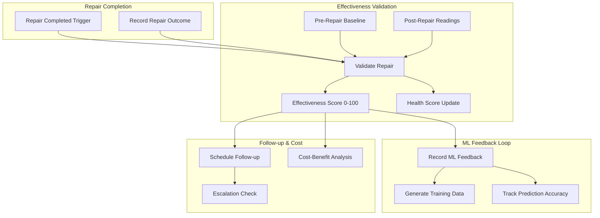
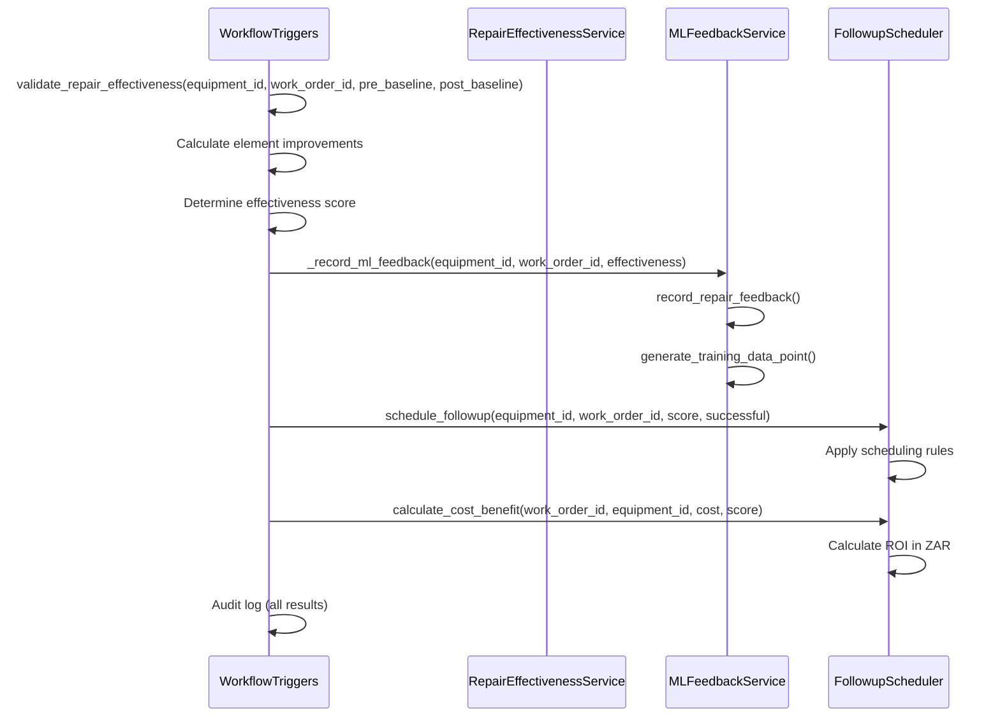

# Repair Effectiveness & ML Feedback Loop

Phase 57 closes the feedback loop between repairs and ML predictions. When a repair is completed, the system validates whether it was effective, feeds the outcome back into ML models for continuous learning, schedules appropriate follow-ups, and calculates cost-benefit in ZAR.

## Overview

The system implements a full automated pipeline:

1. **Repair Verification** - Compare pre/post-repair baselines to produce effectiveness scores
2. **ML Feedback** - Feed repair outcomes into ML models for continuous learning
3. **Follow-up Scheduling** - Auto-schedule re-inspections or escalations based on outcome
4. **Cost-Benefit Analysis** - Calculate ROI in ZAR by equipment type



## Architecture

### Backend Components

| File | Responsibility |
|------|---------------|
| `backend/app/models/repair_effectiveness.py` | Pydantic models: RepairOutcome, EffectivenessScore, ElementImprovement, HealthScoreUpdate, RepairHistoryEntry |
| `backend/app/services/repair_effectiveness_service.py` | Core service: validate_repair, health scoring, repair history, fleet summary |
| `backend/app/models/ml_feedback.py` | Pydantic models: MLFeedbackRecord, TrainingDataPoint, PredictionAccuracy, MLFeedbackSummary |
| `backend/app/services/ml_feedback_service.py` | ML feedback: record outcomes, generate training data, track accuracy |
| `backend/app/services/followup_scheduler.py` | Follow-up scheduling, cost-benefit analysis, escalation management |
| `backend/app/api/repair_effectiveness.py` | 8 REST endpoints for repair effectiveness |
| `backend/app/api/ml_feedback.py` | 5 REST endpoints for ML feedback |
| `backend/app/services/workflow_triggers.py` | Automated trigger integration (calls ML feedback + follow-up on repair validation) |
| `backend/app/services/workflow_orchestrator.py` | Orchestrator integration (calls ML feedback on repair validation) |

### Service Integration

All services use the singleton pattern with factory functions:

```python
from app.services.repair_effectiveness_service import get_repair_effectiveness_service
from app.services.ml_feedback_service import get_ml_feedback_service
from app.services.followup_scheduler import get_followup_scheduler
```

Integration with existing services:
- **BaselineComparisonService** - Element-by-element deviation detection
- **ElementTrendService** - Trend-based health scoring (stable/degrading/improving)
- **BaselineRepository** - Fetch pre/post repair baselines
- **WorkflowTriggerEngine** - Automated pipeline trigger after repair completion

## Repair Effectiveness Service

### Effectiveness Scoring

The `validate_repair()` method compares pre-repair baselines to post-repair readings:

1. Fetch pre-repair baseline from repository (baseline_type=PRE_REPAIR)
2. Get post-repair readings (from API or simulated for demo)
3. Calculate per-element improvement as percentage of deviation recovered
4. Overall effectiveness = average of element improvements, capped at 0-100

```json
{
  "work_order_id": "WO-2026-0876",
  "equipment_id": "S002-CHILLER-B1-001",
  "effectiveness_score": 78.5,
  "repair_successful": true,
  "back_to_baseline": false,
  "health_score_before": 60.0,
  "health_score_after": 90.0,
  "health_improvement": 30.0,
  "element_improvements": {
    "chw_supply_temp": {
      "element_name": "chw_supply_temp",
      "pre_value": 9.5,
      "post_value": 7.8,
      "baseline_value": 7.2,
      "improvement_percent": 73.9,
      "back_to_baseline": true,
      "status": "improved"
    },
    "vibration_rms": {
      "element_name": "vibration_rms",
      "pre_value": 3.2,
      "post_value": 1.5,
      "baseline_value": 1.2,
      "improvement_percent": 85.0,
      "back_to_baseline": false,
      "status": "improved"
    }
  }
}
```

**Success threshold:** effectiveness_score >= 50% is considered a successful repair.

### Health Score Calculation

Equipment health scores are calculated from element trend directions using the ElementTrendService:

| Trend Direction | Score |
|----------------|-------|
| stable | 100 |
| improving | 90 |
| degrading | 70 |
| rapid_degrading | 30 |

The overall health score is the weighted average across all tracked elements.

Deviation-based scoring (used during repair validation):
- Base score: 100
- Critical deviation (>30% from baseline): -20 points per element
- Warning deviation (>15% from baseline): -10 points per element
- Minimum score: 0

## ML Feedback Service

### Feedback Recording

When a repair is validated, the outcome is recorded for ML learning:

```json
{
  "id": "fb-a1b2c3d4",
  "equipment_id": "S002-CHILLER-B1-001",
  "work_order_id": "WO-2026-0876",
  "feedback_type": "repair_outcome",
  "repair_successful": true,
  "effectiveness_score": 78.5,
  "prediction_was_correct": true,
  "recorded_at": "2026-02-04T14:30:00Z"
}
```

### Training Data Generation

The service generates `TrainingDataPoint` records for ML model retraining:

```json
{
  "equipment_id": "S002-CHILLER-B1-001",
  "equipment_type": "chiller",
  "features": {"chw_supply_temp": 9.5, "vibration_rms": 3.2},
  "label": "failed",
  "failure_type": "compressor_bearing",
  "repair_effectiveness": 78.5,
  "source": "repair_outcome"
}
```

### Prediction Accuracy Tracking

Per-model accuracy metrics are tracked:

```json
{
  "model_type": "lstm",
  "total_predictions": 45,
  "correct_predictions": 38,
  "false_positives": 4,
  "false_negatives": 3,
  "accuracy_percent": 84.4,
  "precision": 0.90,
  "recall": 0.93
}
```

## Follow-up Scheduling

### Scheduling Rules

The `FollowupSchedulerService` uses 4 rules based on repair outcome:

| Condition | Follow-up Type | Schedule | Priority |
|-----------|---------------|----------|----------|
| Successful, score >= 80% | re_inspection | 30 days | low |
| Successful, score < 80% | re_inspection | 7 days | medium |
| Failed (1st failure) | re_repair | 3 days | high |
| Failed (2nd+ failure) | escalation | 1 day | critical |

### Cost-Benefit Analysis (ZAR)

Equipment-type-specific failure cost estimates:

| Equipment Type | Estimated Failure Cost (ZAR) |
|---------------|------|
| Chiller | R50,000 |
| AHU | R30,000 |
| FCU | R15,000 |
| Generator | R40,000 |
| Pump | R10,000 |
| VAV | R8,000 |
| DALI | R5,000 |

**Calculation:**
```
cost_avoidance = failure_cost × (effectiveness_score / 100) - repair_cost
roi_percent = (cost_avoidance / repair_cost) × 100
cost_effective = roi_percent > 0
```

**Example:**
```json
{
  "work_order_id": "WO-2026-0876",
  "equipment_id": "S002-CHILLER-B1-001",
  "repair_cost": 5000.0,
  "estimated_failure_cost": 50000.0,
  "cost_avoidance": 37500.0,
  "roi_percent": 750.0,
  "effectiveness_score": 85.0,
  "cost_effective": true
}
```

### Escalation Levels

For recurring repair failures:

| Level | Trigger | Recommended Action |
|-------|---------|-------------------|
| 1 | 1 failed repair | Re-repair with different approach |
| 2 | 2 failed repairs | Specialist review |
| 3 | 3+ failed repairs | Replacement assessment |

## API Reference

### Repair Effectiveness Endpoints (8)

#### POST /api/repair-effectiveness/validate

Validate repair effectiveness by comparing pre/post baselines.

```http
POST /api/repair-effectiveness/validate
Content-Type: application/json

{
  "equipment_id": "S002-CHILLER-B1-001",
  "work_order_id": "WO-2026-0876",
  "post_repair_readings": {
    "chw_supply_temp": 7.8,
    "vibration_rms": 1.5
  }
}
```

Returns `EffectivenessScore` with element-level improvements and health scores.

#### POST /api/repair-effectiveness/record-outcome

Record repair outcome metadata before validation.

```http
POST /api/repair-effectiveness/record-outcome
Content-Type: application/json

{
  "equipment_id": "S002-CHILLER-B1-001",
  "work_order_id": "WO-2026-0876",
  "repair_type": "compressor_bearing_replacement",
  "repair_date": "2026-02-04T10:00:00Z",
  "technician": "John Smith",
  "parts_used": ["bearing_kit", "oil_seal"],
  "labor_hours": 6.0,
  "repair_cost": 5000.0,
  "fault_description": "Excessive vibration from compressor bearing wear",
  "actions_taken": "Replaced main bearing and resealed oil system"
}
```

#### GET /api/repair-effectiveness/health/{equipment_id}

Get current equipment health score calculated from element trend directions.

```http
GET /api/repair-effectiveness/health/S002-CHILLER-B1-001
```

Returns `HealthScoreUpdate` with previous/new score and contributing factors.

#### GET /api/repair-effectiveness/history/{equipment_id}

Get repair history sorted by date (newest first).

```http
GET /api/repair-effectiveness/history/S002-CHILLER-B1-001
```

Returns list of `RepairHistoryEntry` with effectiveness scores and costs.

#### GET /api/repair-effectiveness/summary

Fleet-wide effectiveness summary.

```http
GET /api/repair-effectiveness/summary
```

```json
{
  "total_repairs": 12,
  "avg_effectiveness": 72.3,
  "success_rate": 83.3,
  "total_cost": 45000.0,
  "repairs_by_type": {
    "compressor_bearing_replacement": 3,
    "filter_replacement": 5,
    "belt_adjustment": 4
  }
}
```

#### GET /api/repair-effectiveness/followups

Get pending follow-up tasks with optional filters.

```http
GET /api/repair-effectiveness/followups?equipment_id=S002-CHILLER-B1-001&status=scheduled
```

Returns list of `FollowupTask` sorted by scheduled date.

#### GET /api/repair-effectiveness/cost-benefit/{work_order_id}

Get cost-benefit analysis for a specific repair.

```http
GET /api/repair-effectiveness/cost-benefit/WO-2026-0876
```

Returns `CostBenefitAnalysis` with ROI in ZAR. Returns 404 if no analysis exists.

#### GET /api/repair-effectiveness/escalations/{equipment_id}

Check escalation status for equipment.

```http
GET /api/repair-effectiveness/escalations/S002-CHILLER-B1-001
```

Returns `EscalationRecord` or `{"escalation_level": 0, "message": "No escalation needed"}`.

### ML Feedback Endpoints (5)

#### POST /api/ml-feedback/record

Record repair feedback for ML learning.

```http
POST /api/ml-feedback/record
Content-Type: application/json

{
  "equipment_id": "S002-CHILLER-B1-001",
  "work_order_id": "WO-2026-0876",
  "effectiveness_score": 78.5,
  "repair_successful": true,
  "failure_type": "compressor_bearing",
  "prediction_id": "pred-001"
}
```

#### GET /api/ml-feedback/training-data

Generate training dataset for ML model retraining.

```http
GET /api/ml-feedback/training-data?equipment_type=chiller
```

Returns list of `TrainingDataPoint` records.

#### GET /api/ml-feedback/accuracy/{model_type}

Get prediction accuracy for a specific ML model.

```http
GET /api/ml-feedback/accuracy/lstm
```

Returns `PredictionAccuracy` with accuracy, precision, and recall metrics.

#### GET /api/ml-feedback/equipment/{equipment_id}

Get all ML feedback records for an equipment.

```http
GET /api/ml-feedback/equipment/S002-CHILLER-B1-001
```

#### GET /api/ml-feedback/summary

Get overall ML feedback summary for dashboard display.

```http
GET /api/ml-feedback/summary
```

```json
{
  "total_feedback_records": 45,
  "repair_outcomes_recorded": 38,
  "predictions_evaluated": 32,
  "avg_prediction_accuracy": 84.4,
  "model_accuracies": {
    "lstm": {"accuracy_percent": 86.2, "precision": 0.91, "recall": 0.88},
    "autoencoder": {"accuracy_percent": 82.1, "precision": 0.85, "recall": 0.90}
  },
  "training_data_points": 152
}
```

## Workflow Integration

The repair effectiveness pipeline is triggered automatically via `WorkflowTriggerEngine.validate_repair_effectiveness()`:



The `_record_ml_feedback()` stubs in both `workflow_triggers.py` and `workflow_orchestrator.py` have been replaced with real calls to `MLFeedbackService.record_repair_feedback()`, wrapped in try/except for graceful degradation.

## Data Models

### RepairOutcome
Records repair event metadata: equipment_id, work_order_id, repair_type, repair_date, technician, parts_used, labor_hours, repair_cost, fault_description, actions_taken.

### EffectivenessScore
Computed validation result: pre/post baseline IDs, effectiveness_score (0-100), element_improvements dict, repair_successful, back_to_baseline, health_score_before/after.

### ElementImprovement
Per-element detail: pre_value, post_value, baseline_value, improvement_percent, back_to_baseline, status (improved/unchanged/worsened).

### MLFeedbackRecord
ML feedback entry: feedback_type (repair_outcome/prediction_accuracy/anomaly_confirmation), prediction linkage, predicted vs actual failure comparison.

### TrainingDataPoint
Flattened feature+label format for ML retraining: features dict (sensor readings), label (failed/repaired/healthy), failure_type, days_to_failure.

### FollowupTask
Scheduled follow-up: followup_type (re_inspection/re_repair/escalation), scheduled_date, priority (low/medium/high/critical), status (scheduled/completed/cancelled).

### CostBenefitAnalysis
ROI calculation: repair_cost, estimated_failure_cost, cost_avoidance, roi_percent, cost_effective boolean.

### EscalationRecord
Escalation for recurring failures: escalation_level (1-3), failed_repair_count, total_repair_cost, recommended_action.

## Best Practices

### 1. Always Record Repair Outcomes

Without post-repair data, the system cannot:
- Calculate effectiveness scores
- Update health scores accurately
- Learn which repairs work
- Schedule appropriate follow-ups
- Calculate cost-benefit

### 2. Use the Full Pipeline

The recommended flow is:
1. `POST /api/repair-effectiveness/record-outcome` - Record repair details
2. `POST /api/repair-effectiveness/validate` - Validate effectiveness
3. Check `/api/repair-effectiveness/followups` - Review scheduled follow-ups
4. Check `/api/repair-effectiveness/cost-benefit/{wo_id}` - Review ROI

### 3. Monitor Escalations

Equipment with recurring failures will escalate automatically. Review escalations regularly:
- Level 1: Standard re-repair, may need different approach
- Level 2: Bring in specialist, root cause likely missed
- Level 3: Consider equipment replacement - repair is no longer cost-effective

### 4. Review Cost-Benefit Trends

Track ROI by equipment type to identify:
- Which equipment types are most cost-effective to repair
- When replacement becomes cheaper than repeated repairs
- Which repair types deliver best ROI

## Troubleshooting

### Health Score Not Updating
- Verify ElementTrendService has data for the equipment
- Check that trend summaries return element_trends (not empty)
- Fallback: health score returns previous value if trends unavailable

### ML Feedback Not Recording
- Check logs for "ML feedback recording failed (non-critical)" warnings
- Service uses graceful degradation - failures don't block the pipeline
- Verify MLFeedbackService imports correctly: `from app.services.ml_feedback_service import get_ml_feedback_service`

### Follow-ups Not Scheduling
- Check logs for "Follow-up scheduling failed (non-critical)" warnings
- Verify FollowupSchedulerService imports: `from app.services.followup_scheduler import get_followup_scheduler`
- Follow-up scheduling is non-blocking - failures don't affect effectiveness validation

### Cost-Benefit Shows R0 Repair Cost
- Default repair_cost is 0.0 when called from workflow triggers (cost not always available from trigger context)
- For accurate ROI, record repair cost via `POST /record-outcome` before validation

## Related Documentation

- [Asset Baseline Assessment](44-asset-baseline-assessment.md) - Pre-repair baseline capture
- [Routine Inspection & Maintenance](45-routine-inspection-maintenance.md) - Inspection workflow
- [Integration Workflow](../05-integrations/44-46-integration-workflow.md) - End-to-end baseline-to-repair workflow
- [Health Scoring System](health-scoring-system.md) - Health score calculation details
- [ML Model Development](43-ml-model-development.md) - LSTM and Autoencoder models

## Changelog

| Version | Date | Changes |
|---------|------|---------|
| 1.0.0 | 2026-02-01 | Initial conceptual design document |
| 2.0.0 | 2026-02-04 | Updated to reflect Phase 57 implementation: 13 real API endpoints, 3 services, workflow integration, ZAR cost-benefit |
