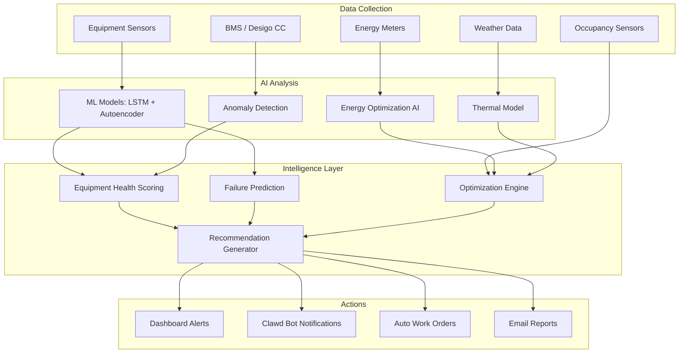

# AI Operations & Day-to-Day Monitoring

SENTINEL's AI continuously monitors building operations 24/7, analyzing equipment performance, energy usage, comfort conditions, and maintenance needs. The AI generates actionable recommendations that help facility managers optimize building performance, reduce costs, and prevent failures.

## Key Concepts

### 🎯 Control-Aware AI Recommendations

**AI provides value regardless of control capability.** The system is "control-aware" and adapts recommendations based on whether equipment has:

- **Direct controls** (actuators, setpoints) → AI can auto-implement
- **Indirect controls** (work orders) → AI suggests with implementation steps
- **Sensors only** (no control path) → AI recommends investigation actions

**Intelligence is independent of control capability.** AI analysis, prediction, and recommendations are the same whether equipment is fully controllable or sensors-only - only the final action differs.

**Learn more:** See [AI Control-Aware Recommendations](#ai-control-aware-recommendations) section for detailed examples.

## Overview



## AI Control-Aware Recommendations

### Monitoring vs. Control Spectrum

SENTINEL's AI provides value **regardless of whether equipment has direct control capabilities**. The AI is "control-aware" - it knows what actions can be automated vs. what requires human intervention.

### Three Recommendation Types

#### Type 1: AI Can Auto-Implement
**Assets with direct controls + safety validation passed**

```json
{
  "asset": "AHU-L12-01",
  "has_controls": true,
  "protocol": "BACnet/IP",
  "safety_status": "PASSED",
  "recommendation": "Increase fan speed to 85%",
  "action": "AUTO_IMPLEMENT",
  "button": "[✓ Auto-Apply]"
}
```

**Equipment:** FCUs with actuators, DALI lighting, generators with Modbus, VAVs

#### Type 2: AI Suggests Implementation Steps
**Assets requiring manual intervention or work orders**

```json
{
  "asset": "CORR-DAMPER-L12-W",
  "has_controls": false,
  "damper_type": "manual",
  "sensors": ["temp", "pressure"],
  "recommendation": "Open dampers for increased ventilation",
  "action": "WORK_ORDER_REQUIRED",
  "button": "[Create Work Order]",
  "assigned_to": "HVAC Technician",
  "estimated_time": "30 min"
}
```

**Equipment:** Manual dampers, filter replacements, mechanical adjustments

#### Type 3: AI Suggests Investigation
**Assets with sensors only - no control path**

```json
{
  "asset": "ZONE-L12-AIR-QUALITY",
  "has_controls": false,
  "sensors": ["temp", "co2"],
  "recommendation": "Verify return air path is clear",
  "action": "INSPECTION_REQUIRED",
  "button": "[Create Inspection Task]",
  "description": "Check for blockages, verify readings vs. actual"
}
```

**Equipment:** Monitoring-only points, blocked ducts, equipment failures

### Real-World Examples

#### Example 1: Corridor Ventilation (No Controls)

```
🔴 MANUAL ACTION REQUIRED
┌─────────────────────────────────────┐
│ Asset: Corridor Damper L12-W       │
│ Type: Manual damper (no actuator)  │
│                                     │
│ ISSUE DETECTED:                     │
│ - Corridor temp: 28°C (spec: <24°C) │
│ - Airflow: 0.2 m/s (min: 0.5 m/s) │
│ - CO2: 1200 ppm (limit: 1000 ppm)  │
│ - Complaints: 3 people (stuffy)    │
│                                     │
│ ROOT CAUSE:                         │
│ Increased occupancy + closed damper│
│                                     │
│ AI RECOMMENDATION:                  │
│ Open manual damper to 75% position │
│ Expected improvement: 28°C → 23°C  │
│                                   │
│ ⚠️  Cannot auto-implement          │
│    No damper actuator installed    │
│                                     │
│ [Create Work Order]                │
│ Assign to: HVAC Technician         │
│ Priority: HIGH                     │
└─────────────────────────────────────┘

AI Confidence: 89%
Impact: 15-20 occupants
```

#### Example 2: Generator Load Management (Has Controls)

```
🟢 AUTO-APPROVED ACTION
┌─────────────────────────────────────┐
│ Asset: Generator-001 (800kW)       │
│ Type: Automatic with Modbus        │
│                                     │
│ OPPORTUNITY: Peak shaving          │
│                                     │
│ Current: Running at 640kW (80%)    │
│ Eskom rate: R2.50/kWh (high)       │
│ Generator efficiency: 93%          │
│                                     │
│ AI RECOMMENDATION:                  │
│ Increase load to 760kW (95%)       │
│ Reduce Eskom import by 120kW        │
│                                     │
│ Expected Benefits:                  │
│ - Savings: R1,800 (next 2 hrs)     │
│ - Efficiency: 93% → 94%            │
│                                     │
│ ✓ Safety validation PASSED          │
│ ✓ Within capacity limits           │
│ ✓ Auto-implementation available    │
│                                     │
│ [✓ Auto-Apply] [View Details]      │
└─────────────────────────────────────┘

AI Confidence: 91%
→ AI implements automatically
→ Monitors results continuously
→ Logs to audit trail
```

### AI Value Without Controls

Even if an asset has **no control capability**, AI still provides:

| Capability | Value Provided |
|-----------|----------------|
| **Early Warning** | ✅ Detects issues days/weeks early |
| **Root Cause Analysis** | ✅ AI analyzes sensor patterns |
| **Action Suggestions** | ✅ Clear recommendations with steps |
| **Cost Estimates** | ✅ Financial impact if ignored |
| **Work Order Creation** | ✅ Auto-creates with full context |
| **Implementation** | ✅ FM/technician follows AI guidance |

### Control Level Configuration

Buildings can configure autonomy levels per asset:

```yaml
# config/ai_control_levels.yaml
building_site-002:
  default_level: L2_supervised

  equipment:
    AHU-L11-01:
      level: L2_supervised  # Human approval required
      reason: "Recent health issues"

    DALI-L11-C:
      level: L3_autonomous  # AI implements approved actions

    CORR-DAMPER-L12-W:
      level: L1_monitoring  # AI recommends only
      reason: "Manual damper - no actuator"
```

**Autonomy Levels:**
- **L1_Monitoring** - AI recommends, human implements all
- **L2_Supervised** - AI recommends, human approves, AI or human implements
- **L3_Autonomous** - AI suggests, auto-implements low/medium impact
- **L4_Full** - AI auto-implements with notification only

### Key Principle

> **AI intelligence is independent of control capability.**
>
> The AI's analysis, prediction, and recommendation generation are the same whether an asset has full control or sensors only. Only the final implementation step differs - controlled assets can be auto-adjusted, while non-controlled assets create work orders for human action.

## What AI Monitors 24/7

### 1. Equipment Health & Performance

**Continuous Monitoring:**
- All HVAC equipment (AHUs, FCUs, VAVs, chillers)
- Generators and energy centre equipment
- DALI lighting systems
- Temperature, pressure, flow rates, electrical parameters

**Health Scoring (0-100%):**
```json
{
  "equipment_id": "AHU-L11-01",
  "health_score": 72,
  "trend": "declining",
  "anomaly_score": 0.0042,
  "next_service_hours": 3200,
  "risk_level": "medium"
}
```

**ML Models Used:**
- **LSTM Forecasting** - Predicts sensor values 24/48/72h ahead
- **Autoencoder** - Detects unusual patterns and anomalies
- **Failure Prediction** - Estimates probability of failure within time window

### 2. Energy Consumption & Waste

**What AI Detects:**
- Unoccupied zones with lighting/HVAC at 100%
- Equipment running during off-hours
- Inefficient setpoints wasting energy
- Peak demand patterns
- Generator load vs. capacity optimization

**Real Example from Sandton:**
```
⚠️ Energy Waste Detected: L11 South Wing
   Occupancy: 0 people for 3 days
   Lighting: 100% (75 luminaires)
   Recommended: Reduce to 30%
   Potential Savings: R1,200/day
```

### 3. Thermal Comfort & Indoor Air Quality

**AI Monitors:**
- Zone temperatures vs. setpoints
- Temperature trends across floors/zones
- Cross-system impacts (e.g., afternoon sun + HVAC load)
- Occupancy-based comfort optimization

**Comfort Complaint Analysis:**
When user reports "Desk 1201 is too hot":
1. AI checks HVAC zone (L12-A) temperature
2. Checks DALI lighting level near desk
3. Reviews desk context (near_diffuser, near_window, etc.)
4. Cross-references with outdoor conditions
5. Recommends targeted adjustments

### 4. Load Shedding & Power Management

**Specialized for South Africa:**
- Eskom load shedding schedule integration (Stages 1-8)
- Thermal runway calculations (minutes until comfortable breach)
- Pre-cooling optimization based on outage timing
- Generator load balancing and priority management

**Example Recommendation:**
```json
{
  "type": "pre_cooling",
  "urgency": "high",
  "outage_start": "16:00",
  "outage_duration": "2.5 hours",
  "thermal_runway": 87,
  "recommendation": {
    "action": "Pre-cool to 19°C",
    "start_time": "14:30",
    "estimated_savings": "R3,500 vs. post-outage recovery"
  }
}
```

## AI Recommendation Engine

### How It Works

**Analysis Cycle (Every 15 minutes):**
1. AI collects latest data from all sources
2. Runs equipment health checks
3. Analyzes energy usage patterns
4. Reviews comfort complaints
5. Calculates optimization opportunities
6. Generates prioritized recommendations

**Priority Levels:**
- 🔴 **CRITICAL** - Immediate action required (equipment failure imminent)
- 🟡 **HIGH** - Action needed within hours (energy waste, comfort issue)
- 🔵 **MEDIUM** - Action needed within days (optimization opportunity)
- 🟢 **LOW** - Informational or long-term planning

### Recommendation Types

#### 1. **Predictive Maintenance**
```
⚠️ HIGH: AHU-L11-01 Health Score: 10%

LSTM model detected declining performance trend.
Failure probability: 67% within 7 days.

Recommended Actions:
1. Schedule inspection within 48h
2. Check filter differential pressure
3. Verify fan bearing condition
4. Review VFD output current

Parts Likely Needed:
- Air filter: 4x (FCU-L11-0[1-4])
- Fan belt: 1x (AHU-L11-FB-001)
- Bearing kit: 1x (AHU-L11-BRG-001)

Estimated Downtime: 4 hours
Cost if Ignored: R15,000 emergency repair
AI Confidence: 87%
```

#### 2. **Energy Optimization**
```
💰 MEDIUM: Energy Waste in L11 Zones C-E

Zones C, D, and E unoccupied since Friday.
Current lighting: 100% across 60 luminaires.
Current HVAC: Running at full capacity.\n
Recommended Actions:
1. Reduce lighting to 30% (adequate for security)
2. Switch HVAC to economy mode
3. Close VAV dampers to 20% minimum
4. Maintain ventilation for air quality

Projected Savings (Weekend):
- Energy: 450 kWh
- Cost: R1,230
- Carbon: 405 kg CO2e

AI Confidence: 93%
```

#### 3. **Comfort Optimization**
```
🌡️ HIGH: Comfort Issue Zone-L12-A

Multiple complaints from desks 1201-1205.
Current zone temperature: 23.8°C (setpoint: 21°C)
Afternoon sun load: High (West-facing windows)
Adjacent luminaires: Running at 90%

Root Cause: Convergence of factors
- Afternoon sun increasing heat load
- Maxed out FCU-L12-01 capacity
- Luminaires adding 2°C heat gain
- No diffuser adjustment for window desks

Recommended Actions:
1. Increase FCU-L12-01 fan speed to 85%
2. Reduce luminaires L12-A-01-05 to 60%
3. Adjust diffuser position for desks 1201-1205
4. Consider longer-term: Window film installation

Expected Result: Temperature 21-22°C within 30 min
Impact: 20 occupants
AI Confidence: 84%
```

#### 4. **Load Shedding Management**
```
⚡ CRITICAL: Load Shedding Stage 4 in 90 minutes

Outage window: 16:00-18:30 (2.5 hours)
Current load: 1450 kW
Generator capacity: 3200 kW
Current SOC: 85%

Thermal Analysis:
- Building thermal runway: 87 minutes
- Comfort breach predicted: 17:27 (without action)
- Outside temperature: 32°C (high)
- Solar load: 0.7 (significant)

Recommended Actions:
1. Begin pre-cooling at 14:30 to 19°C
2. Reduce L10 lighting to 20% (unoccupied floor)
3. Switch elevators to 1 car only
4. Maintain emergency lighting at 100%

Pre-cooling Benefits:
- Extends comfort by 55 minutes
- Avoids post-outage recovery spike
- Savings: R3,500 vs. recovery mode
- Occupant satisfaction: 40% improvement

AI Confidence: 91%
```

## Day-to-Day AI Workflow

### 8:00 AM - Morning Brief
1. AI analyzes overnight activity
2. Generates morning report via Clawd bot
3. Lists overnight recommendations (if any)
4. Provides equipment status summary

**Example Clawd Message:**
```
🤖 SENTINEL Morning Brief - Sandton Tower

📊 Overall Building Health: 84% (Good)
   ↓ 3% from yesterday (AHU-L11-01 declining)

⚠️ New Recommendations (3):
   🔴 CRITICAL: AHU-L11-01 health critical (10%)
   🟡 HIGH: L11 lighting waste (unoccupied)
   🔵 LOW: Schedule FCU filter replacements

✅ Completed Actions:
   Applied L12 pre-cooling (Stage 4 yesterday)
   Comfort maintained throughout outage

💰 Yesterday's Savings: R4,220
   - Energy optimization: R2,200
   - Load shedding: R1,720
   - Maintenance prevention: R300

View details: http://sentinel.local:9096/dashboard
```

### Continuous Monitoring (All Day)

**Real-time Analysis Triggers:**
- Equipment parameter changes (every sensor poll)
- Anomaly detection threshold breaches
- Energy usage spikes
- Comfort complaint submissions
- Load shedding stage changes

**AI Response Time:**
- Critical faults: < 30 seconds to alert
- Energy waste: < 5 minutes to detect
- Optimization opportunities: Every 15 minutes
- Health scoring updates: Every hour

### Dashboard Notifications

**[Flashing Lightbulb Icon] - AI Recommendations Panel**

When AI has new recommendations, dashboard shows:
- Pulsing orange lightbulb icon
- Number badge with count of unread recommendations
- Notification panel with:
  - Priority level (color-coded)
  - Equipment/system affected
  - Projected savings/risk
  - AI confidence level
  - [Approve] / [Dismiss] / [View Details] buttons

### 5:00 PM - End of Day Summary

AI generates daily report including:
- Total recommendations generated
- Recommendations approved/implemented
- Energy savings achieved
- Equipment health trends
- Predictions for tomorrow

## Integration Points

### Clawd Telegram Bot Integration

AI sends real-time alerts to facility managers:

```
🔴 CRITICAL: AHU-L11-01
Failure risk: 67% within 7 days
Health score: 10% and declining
Autoencoder anomaly score: 3.2x threshold

Recommendations:
1. Schedule inspection (urgent)
2. Check filter DP (>200Pa expected)
3. Order replacement parts

AI Confidence: 87%
Cost to delay: R15k+ (emergency)

Reply with:
- /diagnose AHU-L11-01 - Get detailed analysis
- /dispatch - Auto-dispatch technician
- /schedule 48h - Schedule work order
```

### Work Order Auto-Creation

**Critical Predictions → Auto Work Orders:**
```python
if failure_probability > 0.6 and equipment_critical:
    work_order = {
        "priority": "HIGH",
        "equipment_id": "AHU-L11-01",
        "generated_by": "AI",
        "reason": "Predicted failure (67% within 7 days)",
        "suggested_actions": ML_MODEL_SUGGESTIONS,
        "parts_list": AI_PREDICTED_PARTS
    }
```

### Audit Logging

Every AI recommendation is logged:
```json
{
  "log_type": "ai_recommendation",
  "timestamp": "2026-02-01T15:30:00Z",
  "equipment_id": "AHU-L11-01",
  "recommendation_type": "predictive_maintenance",
  "priority": "HIGH",
  "failure_probability": 0.67,
  "action_taken": "work_order_created",
  "ai_confidence": 0.87,
  "user_id": "fm@example.com"
}
```

## AI Models in Production

### Equipment Health Prediction

**Model:** LSTM time-series forecasting (128-64-32 architecture)
**Training:** 50 epochs on 6+ months of data
**Accuracy:** Typical MSE < 0.5°C for temperature predictions
**Inference:** Every hour for all equipment

### Anomaly Detection

**Model:** LSTM Autoencoder
**Training:** Only on "normal" operation data
**Threshold:** 99th percentile of validation errors
**Sensitivity:** Detects anomalies at 1.5x threshold ratio
**Inference:** Real-time on sensor data stream

### Thermal Modeling

**Model:** Physics-based + ML hybrid
**Inputs:** Building thermal mass, insulation, occupancy, weather
**Prediction:** Minutes until comfort breach
**Use Case:** Load shedding pre-cooling strategy
**Accuracy:** Typically 85%+ vs. actual performance

## Measuring AI Impact

### Success Metrics

| Metric | Target | Tracking |
|--------|--------|----------|
| Failure prevention rate | > 80% | Verified post-incident |
| Energy savings | 10-15% | Monthly utility bills |
| Comfort complaints reduction | 30% | Complaint logs analysis |
| Emergency call-outs | 40% reduction | FM team time tracking |
| AI recommendation accuracy | > 85% | User feedback + outcomes |

### Example Monthly Report

```
📊 SENTINEL AI - Monthly Impact Report

Building: Sandton City Tower
Period: January 2026

💰 Financial Impact: R127,400 saved
   - Energy optimizations: R45,200
   - Predicted failures prevented: R67,500
   - Reduced emergency repairs: R14,700

🎯 Operational Impact:
   - 23 failures predicted (21 prevented)
   - 156 AI recommendations generated
   - 134 recommendations approved (86%)
   - 3 comfort complaints (vs. 12 last year)

⚡ Load Shedding:
   - 18 Stage 4 outages managed
   - Zero comfort breaches
   - 98% occupant satisfaction

⭐ AI Performance:
   - Health scoring accuracy: 89%
   - Anomaly detection TP rate: 91%
   - LSTM predictions within ±0.8°C average
   - User satisfaction with recommendations: 4.3/5
```

## Best Practices for FM Teams

### 1. **Trust but Verify**
- AI is ~85-90% accurate
- Monitor outcomes for first 2-4 weeks
- Provide feedback on recommendations
- AI learns from your decisions

### 2. **Act on High Confidence**
- When confidence > 85% and critical priority, act immediately
- Medium confidence recommendations: Review and decide
- Low confidence (< 70%): Use as awareness, not action

### 3. **Regular Review Cycles**
- Weekly: Review AI accuracy with team
- Monthly: Analyze cost savings
- Quarterly: Retrain models with new data

### 4. **Feedback Loop**
```
AI Recommendation → Your Decision → Outcome → AI Learns

Example:
1. AI suggests filter replacement
2. You approve
3. Tech finds filter clogged 80%
4. AI learns to be more confident for similar patterns
```

## Future Enhancements

- **Multi-building optimization** - AI optimizes across building portfolio
- **Grid-scale load balancing** - Coordinate with utility demand response
- **Predictive parts inventory** - Auto-order parts before failures
- **Advanced reinforcement learning** - AI learns optimal control strategies
- **Digital twin integration** - Simulate changes before implementation

## Related Documentation

- [Load Shedding Optimization](../14-south-africa-context/load-shedding-optimization.md) - Detailed pre-cooling and thermal modeling
- [ML Model Development](43-ml-model-development.md) - LSTM and Autoencoder technical details
- [Technician Chat](19-sentinel-chat-core.md) - Fault diagnosis and guided troubleshooting
- [Hybrid AI Routing](../08-ai-ml/hybrid-ai-routing.md) - Ollama/Claude cost optimization
- [Energy Centre](../07-integrations/energy-centre.md) - Generator and power management
- [Safety Interlocks](../06-safety-compliance/safety-interlocks-engine.md) - How AI recommendations are validated
- [DALI-HVAC Integration](../07-integrations/dali-hvac-integration.md) - Cross-system AI analysis

## Support

For AI monitoring questions or to report issues:
- Check logs: `/opt/bms-intelligence/backend/logs/ai_optimizer.log`
- Review model status: `GET /api/ml/models`
- Temporarily disable AI: `POST /api/optimization/toggle/{site_id}`
