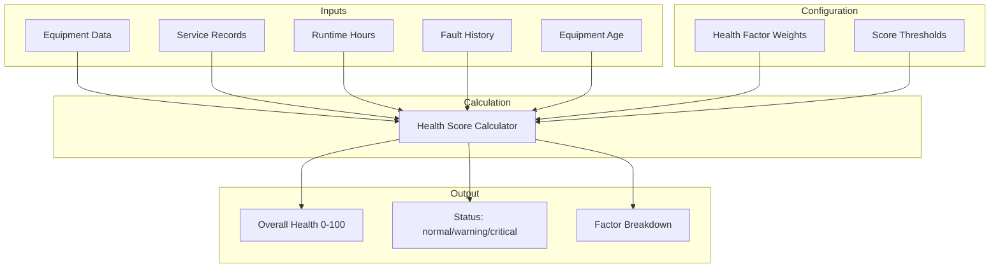

# Health Scoring System

SENTINEL's Health Scoring System calculates equipment health scores based on configurable factors including age, service history, runtime hours, and fault history. The system provides real-time equipment condition monitoring and supports dynamic threshold configuration per equipment type.

## Overview



## Architecture

### Backend Components

| Component | File | Responsibility |
|-----------|------|----------------|
| **Health Config API** | `backend/app/api/health_config.py` | Threshold configuration CRUD |
| **Prediction Service** | `backend/app/api/predictions.py` | Health calculation endpoints |
| **Health Config Service** | `backend/app/services/health_threshold_service.py` | Threshold management |

### Frontend Components

| Component | File | Responsibility |
|-----------|------|----------------|
| **Health Config Editor** | `frontend/src/components/HealthThresholdEditor.tsx` | Threshold configuration UI |
| **Dashboard Cards** | `frontend/src/components/Dashboard.tsx` | Health score display |

---

## Health Factor Calculation

### Health Score Formula

```python
health_score = (
    (age_factor.score * age_factor.weight) +
    (service_factor.score * service_factor.weight) +
    (runtime_factor.score * runtime_factor.weight) +
    (fault_factor.score * fault_factor.weight)
) / total_weight
```

### Factor Scores

| Factor | Score Calculation | Weight |
|--------|-------------------|--------|
| **Age** | `max(0, 100 - (equipment_age_years / expected_life_years) * 100)` | 0.25 |
| **Service** | `100 - min(100, (days_since_last_service / service_interval_days) * 100)` | 0.30 |
| **Runtime** | `100 - min(100, (runtime_hours / expected_runtime_hours) * 100)` | 0.25 |
| **Faults** | `100 - min(100, (fault_count_90days / fault_threshold) * 100)` | 0.20 |

### Example Calculation

```python
# Chiller with:
# - Age: 8 years (expected 15 years)
# - Service: 60 days ago (90-day interval)
# - Runtime: 45,000 hours (expected 60,000 hours)
# - Faults: 2 in last 90 days (threshold: 5)

age_score = max(0, 100 - (8/15) * 100) = 47
service_score = 100 - min(100, (60/90) * 100) = 33
runtime_score = 100 - min(100, (45000/60000) * 100) = 25
fault_score = 100 - min(100, (2/5) * 100) = 60

health_score = (
    (47 * 0.25) +
    (33 * 0.30) +
    (25 * 0.25) +
    (60 * 0.20)
) / 1.0 = 39.1
```

---

## Health Status Classification

### Score Ranges

| Score Range | Status | Color | Action Required |
|-------------|--------|-------|-----------------|
| 80-100 | `normal` | Green | Normal operation |
| 60-79 | `normal` | Green | Normal operation |
| 40-59 | `warning` | Amber | Schedule maintenance |
| 20-39 | `warning` | Amber | Investigate soon |
| 0-19 | `critical` | Red | Immediate attention |

### Status Determination

```python
def get_health_status(health_score: int) -> str:
    if health_score >= 60:
        return "normal"
    elif health_score >= 20:
        return "warning"
    else:
        return "critical"
```

---

## Health Threshold Configuration

### Configuration Structure

Health thresholds are stored per equipment type in `health_calculation_config.json`:

```json
{
  "equipment_type": "chiller",
  "display_name": "Chiller",
  "weights": {
    "age": 0.25,
    "service": 0.30,
    "runtime": 0.25,
    "fault_history": 0.20
  },
  "thresholds": {
    "expected_life_years": 15,
    "service_interval_days": 90,
    "expected_runtime_hours": 60000,
    "fault_count_threshold_90days": 5
  },
  "status_ranges": {
    "critical": {"min": 0, "max": 19},
    "warning": {"min": 20, "max": 59},
    "normal": {"min": 60, "max": 100}
  }
}
```

### Available Equipment Types

| Type | Expected Life | Service Interval | Expected Runtime | Fault Threshold |
|------|---------------|------------------|------------------|-----------------|
| `chiller` | 15 years | 90 days | 60,000 hrs | 5 faults |
| `ahu` | 20 years | 180 days | 80,000 hrs | 10 faults |
| `fcu` | 15 years | 365 days | 40,000 hrs | 3 faults |
| `pump` | 12 years | 90 days | 50,000 hrs | 5 faults |
| `cooling_tower` | 15 years | 180 days | 60,000 hrs | 8 faults |
| `vav` | 20 years | 365 days | 70,000 hrs | 5 faults |
| `split_unit` | 12 years | 180 days | 30,000 hrs | 5 faults |
| `boiler` | 20 years | 90 days | 70,000 hrs | 8 faults |
| `ups` | 10 years | 30 days | 40,000 hrs | 3 faults |
| `generator` | 25 years | 30 days | 50,000 hrs | 10 faults |
| `transformer` | 30 years | 365 days | 100,000 hrs | 5 faults |
| `ats` | 20 years | 90 days | 50,000 hrs | 5 faults |

---

## API Endpoints

### Get Health Configuration

```bash
GET /api/health-config
```

**Response:**
```json
{
  "configs": [
    {
      "equipment_type": "chiller",
      "display_name": "Chiller",
      "weights": {
        "age": 0.25,
        "service": 0.30,
        "runtime": 0.25,
        "fault_history": 0.20
      },
      "thresholds": {
        "expected_life_years": 15,
        "service_interval_days": 90,
        "expected_runtime_hours": 60000,
        "fault_count_threshold_90days": 5
      },
      "status_ranges": {
        "critical": {"min": 0, "max": 19},
        "warning": {"min": 20, "max": 59},
        "normal": {"min": 60, "max": 100}
      }
    }
  ]
}
```

### Update Health Configuration

```bash
PUT /api/health-config/{equipment_type}
Content-Type: application/json

{
  "weights": {
    "age": 0.30,
    "service": 0.25,
    "runtime": 0.25,
    "fault_history": 0.20
  },
  "thresholds": {
    "expected_life_years": 20,
    "service_interval_days": 120,
    "expected_runtime_hours": 70000,
    "fault_count_threshold_90days": 8
  }
}
```

**Response:**
```json
{
  "equipment_type": "chiller",
  "updated_at": "2026-02-02T10:00:00Z"
}
```

### Get Equipment Health

```bash
GET /api/equipment/{equipment_id}/health
```

**Response:**
```json
{
  "equipment_id": "002-snd-chiller-001",
  "equipment_name": "Chiller 1",
  "equipment_type": "chiller",
  "health_score": 65,
  "status": "normal",
  "factors": {
    "age": {
      "score": 47,
      "value": "8 years",
      "weight": 0.25
    },
    "service": {
      "score": 33,
      "value": "60 days ago",
      "weight": 0.30
    },
    "runtime": {
      "score": 75,
      "value": "45,000 hours",
      "weight": 0.25
    },
    "fault_history": {
      "score": 80,
      "value": "2 faults in 90 days",
      "weight": 0.20
    }
  },
  "last_updated": "2026-02-02T10:00:00Z"
}
```

---

## Configuration Management

### Adding New Equipment Types

To add health scoring for a new equipment type:

1. **Define the type in backend:**

```python
# backend/app/models/health_config.py
class EquipmentType(str, Enum):
    CHILLER = "chiller"
    AHU = "ahu"
    # ... existing types ...
    NEW_TYPE = "new_type"  # Add new type
```

2. **Add default configuration:**

```json
{
  "equipment_type": "new_type",
  "display_name": "New Equipment Type",
  "weights": {
    "age": 0.25,
    "service": 0.30,
    "runtime": 0.25,
    "fault_history": 0.20
  },
  "thresholds": {
    "expected_life_years": 15,
    "service_interval_days": 180,
    "expected_runtime_hours": 50000,
    "fault_count_threshold_90days": 5
  },
  "status_ranges": {
    "critical": {"min": 0, "max": 19},
    "warning": {"min": 20, "max": 59},
    "normal": {"min": 60, "max": 100}
  }
}
```

3. **Update frontend selector:**

```typescript
// frontend/src/components/HealthThresholdEditor.tsx
const EQUIPMENT_TYPES = [
  { value: 'chiller', label: 'Chiller' },
  // ... existing types ...
  { value: 'new_type', label: 'New Equipment Type' },
];
```

### Modifying Weights

Weights must sum to 1.0 for all factors:

```json
{
  "weights": {
    "age": 0.25,
    "service": 0.30,
    "runtime": 0.25,
    "fault_history": 0.20
  }
}
```

**Weight validation:**
```python
total_weight = sum(config.weights.values())
assert abs(total_weight - 1.0) < 0.01, f"Weights must sum to 1.0, got {total_weight}"
```

### Custom Status Ranges

Per-equipment-type status ranges allow fine-tuning:

```json
{
  "status_ranges": {
    "critical": {"min": 0, "max": 19},
    "warning": {"min": 20, "max": 59},
    "normal": {"min": 60, "max": 100}
  }
}
```

**Example - Stricter ranges for critical equipment:**

```json
{
  "equipment_type": "server_room_ups",
  "status_ranges": {
    "critical": {"min": 0, "max": 49},
    "warning": {"min": 50, "max": 79},
    "normal": {"min": 80, "max": 100}
  }
}
```

---

## Frontend Configuration Editor

### Health Threshold Editor

Located in `HVACDashboard.tsx` (Health Config tab), the editor provides:

- Equipment type selector
- Weight sliders (real-time validation)
- Threshold input fields
- Status range configuration
- Preview of health score calculation

### Usage

1. Select equipment type from dropdown
2. Adjust weight sliders (must sum to 100%)
3. Configure threshold values
4. Set status ranges
5. Click "Save Configuration" to persist

---

## Integration with Equipment Data

### Data Sources

| Factor | Data Source | Field |
|--------|-------------|-------|
| **Age** | Equipment table | `install_date`, `manufacture_year` |
| **Service** | Service records | `last_service_date` |
| **Runtime** | Telemetry | `runtime_hours` (accumulated) |
| **Faults** | Audit log | `fault_history` (last 90 days) |

### Automatic Updates

Health scores recalculate when:

1. Equipment is added/modified
2. Service record is updated
3. Fault is logged
4. Runtime hours updated
5. Health configuration changes

---

## Best Practices

### 1. Weight Configuration

Set weights based on equipment type characteristics:

```python
# Age-sensitive equipment (e.g., electronics)
weights = {"age": 0.40, "service": 0.20, "runtime": 0.20, "fault_history": 0.20}

# Service-sensitive equipment (e.g., chillers)
weights = {"age": 0.20, "service": 0.40, "runtime": 0.20, "fault_history": 0.20}

# Runtime-sensitive equipment (e.g., pumps)
weights = {"age": 0.20, "service": 0.20, "runtime": 0.40, "fault_history": 0.20}

# Fault-sensitive equipment (e.g., UPS)
weights = {"age": 0.20, "service": 0.20, "runtime": 0.20, "fault_history": 0.40}
```

### 2. Threshold Calibration

Calibrate thresholds using historical data:

```python
# Analyze failure history to find optimal thresholds
failures = get_equipment_failures(equipment_type="chiller")

# Find common age at failure
avg_failure_age = sum(f.age_at_failure for f in failures) / len(failures)

# Set expected life to 80% of average failure age
expected_life_years = avg_failure_age * 0.8
```

### 3. Status Range Tuning

Adjust status ranges based on operational priorities:

```python
# Conservative (more warnings)
{"critical": [0, 29], "warning": [30, 69], "normal": [70, 100]}

# Balanced (default)
{"critical": [0, 19], "warning": [20, 59], "normal": [60, 100]}

# Aggressive (fewer warnings)
{"critical": [0, 9], "warning": [10, 49], "normal": [50, 100]}
```

### 4. Regular Review

Review and update configurations quarterly:

- Analyze prediction accuracy (health score vs actual failures)
- Adjust weights based on failure patterns
- Update thresholds based on new equipment data
- Fine-tune status ranges based on feedback

---

## Troubleshooting

### Incorrect Health Scores

**Symptom:** Health score doesn't match expected condition

**Solutions:**
1. Verify equipment data is complete (age, service date, runtime)
2. Check weight configuration sums to 1.0
3. Review threshold values are appropriate for equipment type
4. Validate status ranges are correct

### Configuration Save Fails

**Symptom:** Unable to save health configuration

**Solutions:**
1. Check weights sum to 100% (1.0)
2. Verify threshold values are positive numbers
3. Ensure status ranges don't overlap
4. Confirm equipment_type exists in system

### Missing Equipment Type

**Symptom:** Equipment type not available in dropdown

**Solutions:**
1. Add equipment type to backend enum
2. Create default configuration in JSON
3. Update frontend selector options
4. Restart backend to load changes

---

## Service Record Health Impact

Health score and equipment status are automatically updated at two points in the service record lifecycle. The recovery target is always derived live from the **configured healthy threshold** (Settings page → Health Thresholds), so changing the threshold automatically changes post-service recovery.

### On service record creation (WO → SR notified)

Equipment status is set to `maintenance` to surface the active service in the dashboard. Health score is left unchanged — it already reflects the degraded state that triggered the work order.

### On technician closeout (`done #WO-XXXX` → SR complete)

Equipment status is restored to `normal`. Health score is recovered based on service type:

| Service type | Recovery score |
|---|---|
| `breakdown` | `healthy` threshold (full reset) |
| `major` | `healthy` threshold (full reset) |
| `minor` | `warning + 70% of (healthy − warning)` |
| `callout` | `warning + 30% of (healthy − warning)` — investigation only |

**Example** with default thresholds (`healthy=90`, `warning=70`, gap=20):

| Service type | Recovery score |
|---|---|
| breakdown / major | 90 |
| minor | 70 + (20 × 0.7) = 84 |
| callout | 70 + (20 × 0.3) = 76 |

Active alerts and predictions for the equipment are also resolved at closeout.

**Implementation:** `backend/app/services/sentry_integration/work_order_notifier.py` — `_restore_equipment_health()`

---

## Related Documents

- [Device Abstraction Layer](../02-architecture/device-abstraction-layer.md) - Device data model
- [Safety Interlocks Engine](../06-safety-compliance/safety-interlocks-engine.md) - Safety validation
- [Asset Baseline Assessment](asset-baseline-assessment.md) - Equipment condition monitoring
- [Routine Inspection & Maintenance](45-routine-inspection-maintenance.md) - Preventative maintenance
- [Equipment Naming Convention](../02-architecture/EQUIPMENT_NAMING.md) - Zone-based naming standard

---

## 2026-05-16 Updates: Age-Only Baselines, Scoreability Gating, and Deferred Baseline Capture

### Age-Only Baseline Calculation

For equipment with only `commissioning_date` available, health is calculated from age alone:

```
health = 100 - age_penalty
age_penalty tiers: 0-2yr @ 1.5%/yr, 2-5yr @ 2.5%/yr, 5-10yr @ 4%/yr, 10+yr @ 5%/yr
Cap at 40% (floor = 60)
Confidence: 0.30 (base) + 0.15 for <2yr, +0.05 for 2-5yr, -0.05 for 10+yr
```

**Implementation:** `backend/app/services/health/baseline_calculator.py`

### Equipment Scoreability Classification

Equipment types are classified in `health_config.py` with per-type scoreability:

| Category | Method | Types |
|----------|--------|-------|
| Large serviceable | `age_only` | chiller, ahu, pump, generator, cooling_tower, ups, bess |
| Energy equipment | `age_only` | inverter, meter, zone |
| VAV/FCU | `synthetic_fallback` | vav, fcu (seeded 82, conf 0.25, skipped by scorer) |
| Not scoreable | excluded | lighting_zone, luminaire, dali, sensor, general |

**Source of truth:** Supabase `equipment_type_config` table (runtime overrides, empty by default, falls back to hardcoded `health_config.py`)

### Deferred Baseline Capture

Equipment discovered by SIMBIOT bridge/shadow polling is created with `health_score=NULL`. An APScheduler task runs every 5 minutes (`baseline_capture_task.py`) to:

1. Find unscored equipment
2. Look up `equipment_service_history` by FK
3. Calculate age-only baseline
4. Update equipment record

**Replacement flow:** Admin clicks "Mark as Replaced" on equipment detail → `replaced_on` set, `health_score` reset to NULL → baseline capture task detects it → recalculates from new commissioning date

### Alert Generation from Health Scoring

When `store_snapshot()` updates equipment status to `warning` or `critical`, an alert is created in the `alerts` table (deduplicated — won't create duplicate active alerts for the same equipment).

### Daily Retention Cleanup

SQL fallback in `background_scheduler.py` runs daily:

| Table | Retention |
|-------|-----------|
| equipment_fault_events | 7 days |
| recommendations | 7 days |
| predictions | 14 days |
| asset_health_snapshots | 30 days |
| adapter_health | 7 days |

---

## Changelog

| Version | Date | Changes |
|---------|------|---------|
| 1.0.0 | 2026-02-02 | Initial documentation |
