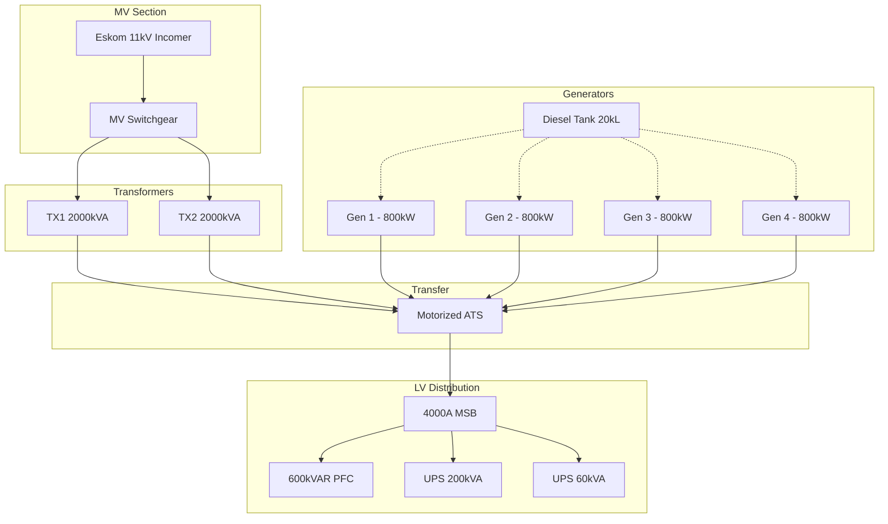

# Energy Centre Integration

Complete integration guide for the SENTINEL Energy Centre module, covering generators, ATS, power metering, UPS systems, and electrical distribution monitoring.

## Overview

The Energy Centre module provides SCADA-style monitoring for data centre and commercial building electrical infrastructure:



## Components

### Generators (DeepSea DSE8610)

4x 800kW generators with N+1 redundancy:

| Generator | Controller | Priority | Status |
|-----------|------------|----------|--------|
| SAN-GEN-001 | DSE8610 | 1 | Primary |
| SAN-GEN-002 | DSE8610 | 2 | Primary |
| SAN-GEN-003 | DSE8610 | 3 | Standby |
| SAN-GEN-004 | DSE8610 | 4 | Standby |

**Telemetry Points:**
- Engine: RPM, oil pressure, coolant temp, fuel level, run hours
- Electrical: Voltage (L-L, L-N), current, kW, kVA, PF, frequency
- Battery: Voltage, charger status
- Alarms: Emergency stop, low oil, high temp, overspeed, etc.

**Predictive Maintenance:**
- Battery voltage trending (alert < 25V, critical < 24V)
- Oil pressure monitoring (alert < 2.5 bar when running)
- Run hours for service scheduling

### ATS (Socomec ATyS)

Motorized ACB with closed-transition transfer:

| Parameter | Value |
|-----------|-------|
| Type | Motorized ACB |
| Transfer Mode | Closed-transition |
| Transfer Time | 85ms |
| Rating | 4000A |

**Status Points:**
- Position: Mains / Generator / Transitioning / Parallel
- Source availability: Mains healthy, Generator ready
- Breaker states: Open / Closed / Tripped
- Interlocks: Mechanical OK, Electrical OK

### Power Metering

| Meter | Location | Protocol | Features |
|-------|----------|----------|----------|
| ION9000 | Main Incomer | Modbus TCP | Revenue-grade, PQ analysis |
| PM180 | Generator Output | Modbus RTU | kWh, demand |
| A1800 | Tenant Sub-meters | Modbus RTU | TOU billing |

**Telemetry:**
- Power: kW, kVA, kVAR, PF
- Voltage: L1-N, L2-N, L3-N, L1-L2, L2-L3, L3-L1
- Current: L1, L2, L3, Neutral
- Energy: kWh import/export, kVARh
- Quality: THD-V, THD-I, voltage unbalance
- Demand: Max demand kW, timestamp

**TOU Tariff (Eskom Megaflex):**
- Peak: 07:00-10:00, 18:00-20:00 (weekdays)
- Standard: 06:00-07:00, 10:00-18:00, 20:00-22:00
- Off-peak: 22:00-06:00, weekends

### Transformers

2x 2000kVA oil-filled transformers:

| Parameter | Value |
|-----------|-------|
| Rating | 2000kVA |
| Vector Group | Dyn11 |
| Primary | 11kV |
| Secondary | 400V |

**Monitoring:**
- Oil temperature
- Winding temperature
- Load percentage
- Buchholz relay status

### PFC Bank

600kVAR automatic power factor correction:

| Parameter | Value |
|-----------|-------|
| Total Capacity | 600kVAR |
| Steps | 12 |
| Controller | Varlogic NR12 |
| Target PF | 0.95 |

### UPS Systems

| UPS | Capacity | Protocol | Critical Load |
|-----|----------|----------|---------------|
| Eaton 93PM | 200kVA | SNMP | IT Infrastructure |
| APC Symmetra | 60kVA | Modbus | Building Services |

**Telemetry:**
- Mode: Online / Battery / Bypass / Standby
- Battery: Charge %, runtime minutes, health
- Load: kW, kVA, percentage
- Alarms: On battery, low battery, overload, fault

## API Reference

### SCADA Overview

```http
GET /api/energy-centre/scada/{site_id}
```

Returns complete energy centre status:

```json
{
  "timestamp": "2026-01-31T10:00:00Z",
  "centre": {
    "centre_id": "sandton-ec",
    "name": "Sandton Energy Centre"
  },
  "status": {
    "mains_healthy": true,
    "on_generator": false,
    "all_systems_normal": true,
    "active_alarms": 0
  },
  "generators": {
    "groups": [...],
    "total_available_kw": 3200,
    "total_running_kw": 0
  },
  "ats": {
    "position": "mains",
    "mains_available": true,
    "generator_available": true
  },
  "power_metering": {
    "total_kw": 1250,
    "power_factor": 0.94,
    "tou_period": "standard"
  },
  "transformers": {
    "count": 2,
    "avg_load_percent": 45
  },
  "ups": {
    "systems": [...],
    "any_on_battery": false,
    "all_healthy": true
  }
}
```

### Generator Endpoints

```http
# List generators
GET /api/generators/{site_id}

# Get generator group status
GET /api/generators/groups/{group_id}

# Get generator health (predictive)
GET /api/generators/{generator_id}/health

# Get fuel status
GET /api/generators/groups/{group_id}/fuel

# Simulate state change (testing)
POST /api/generators/{generator_id}/simulate
{
  "engine_running": true,
  "load_kw": 600
}
```

### ATS Endpoints

```http
# List ATS units
GET /api/energy-centre/ats/{site_id}

# Get ATS status
GET /api/energy-centre/ats/{ats_id}/status
```

### Power Metering Endpoints

```http
# Get meters by type
GET /api/energy-centre/meters/{site_id}?meter_type=main

# Get power summary
GET /api/energy-centre/power/{site_id}
```

### UPS Endpoints

```http
# Get UPS summary
GET /api/energy-centre/ups/{site_id}
```

### Single-Line Diagram

```http
GET /api/energy-centre/sld/{site_id}
```

Returns SLD data for visualization:

```json
{
  "nodes": [
    {
      "id": "mv-incomer",
      "type": "mv_incomer",
      "name": "Eskom 11kV",
      "status": "healthy",
      "energized": true,
      "telemetry": {"voltage_kv": 11.2}
    },
    {
      "id": "tx-1",
      "type": "transformer",
      "name": "TX1 2000kVA",
      "status": "healthy",
      "energized": true,
      "telemetry": {"load_pct": 45, "temp_c": 65}
    }
  ],
  "connections": [
    {"from": "mv-incomer", "to": "tx-1", "energized": true}
  ],
  "status": {
    "mains_healthy": true,
    "on_generator": false
  }
}
```

## Frontend Components

### EnergyCentreDashboard

Main dashboard combining all energy centre views:

```tsx
import { EnergyCentreDashboard } from '@/components/energy-centre';

<EnergyCentreDashboard
  siteId="sandton"
  enabledModules={['energy', 'hvac']}
  onAIRecommendation={(rec) => handleRecommendation(rec)}
/>
```

### GeneratorSynoptic

SCADA-style generator fleet visualization:

```tsx
import { GeneratorSynoptic } from '@/components/energy-centre';

<GeneratorSynoptic
  siteId="sandton"
  onHealthAlert={(gen, health) => {
    console.log(`Generator ${gen.name} health: ${health.overall_score}%`);
  }}
/>
```

### SingleLineDiagram

Visual electrical distribution diagram:

```tsx
import { SingleLineDiagram } from '@/components/energy-centre';

<SingleLineDiagram siteId="sandton" />
```

### ATSStatusPanel

Transfer switch status and history:

```tsx
import { ATSStatusPanel } from '@/components/energy-centre';

<ATSStatusPanel
  siteId="sandton"
  onTransferEvent={(ats, previousPosition) => {
    console.log(`ATS transferred from ${previousPosition} to ${ats.position}`);
  }}
/>
```

### UPSStatusPanel

UPS fleet monitoring:

```tsx
import { UPSStatusPanel } from '@/components/energy-centre';

<UPSStatusPanel
  siteId="sandton"
  onBatteryAlert={(ups) => {
    console.log(`${ups.name} on battery! Runtime: ${ups.runtime_min} min`);
  }}
/>
```

### PowerMeteringCard

Real-time power metrics:

```tsx
import { PowerMeteringCard } from '@/components/energy-centre';

<PowerMeteringCard siteId="sandton" compact={false} />
```

## AI Features

The Energy module provides these AI capabilities:

### Predictive Maintenance

- **Battery Degradation**: Monitors generator battery voltage trends
- **Oil Pressure Trending**: Detects degradation before failure
- **Service Scheduling**: Based on run hours and condition

### Load Shedding Optimization

When on generator power:
- Recommends HVAC load reduction
- Suggests lighting dimming
- Calculates optimal runtime based on fuel

### Power Quality Analysis

- THD monitoring with alerts
- Voltage unbalance detection
- Power factor optimization recommendations

### Fuel Forecasting

- Consumption rate tracking
- Delivery scheduling recommendations
- Runtime estimation based on load

## Cross-Module Integration

### Energy → HVAC

When `hvac_energy_loadshed` integration is active:

```json
{
  "trigger": "ats_position == 'generator'",
  "action": {
    "type": "setpoint_adjust",
    "target": "all_zones",
    "value": {"temp_offset": +2}
  }
}
```

### Energy → Lighting

When `energy_lighting_loadshed` integration is active:

```json
{
  "trigger": "ats_position == 'generator'",
  "action": {
    "type": "dim_all",
    "target": "non_essential",
    "value": {"level": 50}
  }
}
```

## Data Files

### Generator Configuration

`backend/app/data/buildings/sandton/generators.json`:

```json
{
  "generators": [
    {
      "generator_id": "SAN-GEN-001",
      "name": "Generator 1",
      "controller": {
        "manufacturer": "DeepSea",
        "model": "DSE8610",
        "protocol": "modbus_tcp"
      },
      "rated_power_kw": 800,
      "rated_power_kva": 1000
    }
  ],
  "groups": [
    {
      "group_id": "sandton-gen-group",
      "redundancy_mode": "n_plus_1",
      "min_running": 2
    }
  ],
  "tanks": [
    {
      "tank_id": "SAN-TANK-001",
      "capacity_litres": 20000,
      "current_level_pct": 85
    }
  ]
}
```

### Energy Centre Configuration

`backend/app/data/buildings/sandton/energy_centre.json`:

```json
{
  "centre_id": "sandton-ec",
  "name": "Sandton Energy Centre",
  "mv_incomers": [...],
  "transformers": [...],
  "ats_units": [...],
  "lv_switchboards": [...],
  "meters": [...],
  "pfc_banks": [...],
  "ups_systems": [...]
}
```

## Troubleshooting

### Generator Not Showing Status

1. Check Modbus connectivity to DSE controller
2. Verify register mapping in `deepsea_register_map.csv`
3. Check generator service logs

### ATS Position Incorrect

1. Verify ATS controller communication
2. Check interlock status
3. Review transfer history

### Power Meter Data Stale

1. Check Modbus/SNMP polling interval
2. Verify meter IP/address configuration
3. Check network connectivity

### UPS Not Reporting

1. Verify SNMP community string
2. Check Modbus address
3. Confirm UPS is in monitoring mode

## Related Documentation

- [Generator SCADA](./generator-scada.md)
- [Module Registry](../13-modules/module-registry.md)
- [Load Shedding Optimization](../14-south-africa-context/load-shedding-optimization.md)
