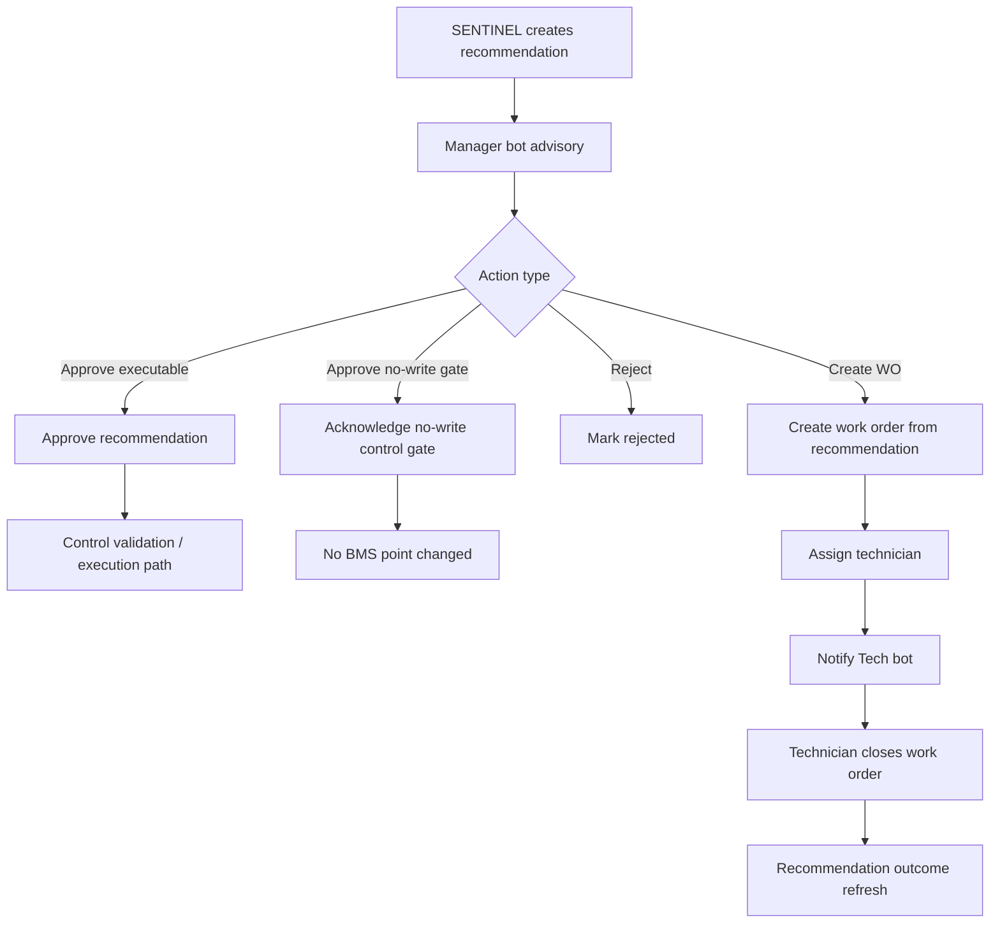
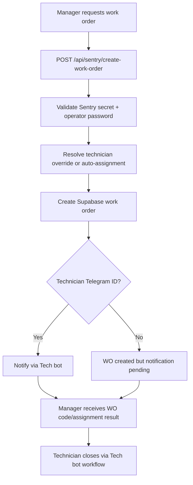

# Sentry Manager Bot Workflow

## Purpose

The Manager bot is the facilities-manager control and accountability channel. It surfaces advisories, approval requests, manager exceptions, work-order actions, technician follow-ups, and reassignment actions.

It is not the technician closeout channel. Manager-generated work orders must still be closed by the technician workflow.

## Manager Entry Points

Manager actions may come from:

- Morning digest
- SENTRY AI operational advisory
- AI recommendation `Approve`, `Reject`, or `Create WO`
- Prediction `Create Work Order`
- Manual Sentry-authenticated `create-work-order` tool
- Technician follow-up message
- Work-order reassignment

## Manager Bot Tools

The Manager bot exposes control and accountability tools for facilities managers:

| Tool | Purpose | Backend path |
| --- | --- | --- |
| Morning digest | Read-only daily operational summary with alerts, WOs, exceptions, advisories, and recommendations | `background_scheduler.py` digest generation |
| Supervised approve | Approves a pending executable recommendation after write-path validation | `approve:rec_id:{recommendation_id}` |
| Supervised reject | Rejects a pending recommendation without taking control action | `reject:rec_id:{recommendation_id}` |
| No-write gate approval | Acknowledges a control gate or advisory boundary without changing any BMS point | `approve:rec_id:{recommendation_id}` |
| Coordinated optimization decision | Approves/rejects coordinated recommendation bundles through the dedicated coordinated path | `coord:approve:{id}` / `coord:reject:{id}` |
| Recommendation acknowledgement | Accepts, dismisses, or marks a recommendation reviewed from digest/advisory buttons | `rec:accept:{id}`, `rec:dismiss:{id}`, `rec:review:{id}` |
| Create work order | Creates an explicit manager-requested WO and assigns/notifies a technician | `POST /api/sentry/create-work-order` |
| Recommendation work order | Creates or reuses a WO from a recommendation/prediction button | `wo:*` / `pred_wo:*` callbacks |
| Technician follow-up | Sends a manager-approved instruction through the Tech bot | `POST /api/sentry/send-technician-message` |
| Work-order reassignment | Moves a WO to another active technician and optionally sends a Tech bot notice | `PATCH /api/sentry/work-order/reassign` |
| Certified acknowledgement | Records notification acknowledgements where delivery confirmation is required | `ack:*` callbacks |
| Prediction acknowledgement | Records prediction acknowledgement without creating a WO | `pred_ack:*` callbacks |

## Recommendation Workflow

No-write control gates:

- represent a decision boundary, not a device write
- approval acknowledges the gate and must not change a BMS point
- stale/superseded buttons must fail closed and ask the manager to use the latest recommendation

## Manager-Created Work Order Workflow

Manager-generated work orders use the same closeout path as staff and AI-generated work orders.

## Work-Order Actions

Create explicit work order:

- `POST /api/sentry/create-work-order`
- requires Sentry secret and operator password
- supports `assigned_to` override
- otherwise auto-assigns by equipment/specialty
- sends technician notification after creation

Create work order from recommendation button:

- callback prefix: `wo:rec_id:{recommendation_id}`
- handled by `NotificationService.handle_work_order_request(...)`
- deduplicates exact equipment/point/value work orders
- marks the recommendation approved with external ticket reference
- notifies assigned technician through `WorkOrderNotifier`

Prediction work-order button:

- callback prefix: `pred_wo:{prediction_id}`
- creates a work order from prediction context

Send technician follow-up:

- `POST /api/sentry/send-technician-message`
- resolves technician by Telegram ID or active technician name
- sends through `SENTRY_TECH_BOT_TOKEN`
- writes a notification delivery audit row

Reassign work order:

- `PATCH /api/sentry/work-order/reassign`
- updates `assigned_to`, `assigned_team`, `assigned_at`, milestone, and notes
- optionally sends a reassignment notice through the Tech bot

## Morning Digest Role

The morning digest is read-only. It should summarize:

- building health
- active alert groups
- open work orders
- manager exceptions
- overnight advisories
- pending AI recommendations

The digest itself should not be the closeout surface. It points the manager to active advisories, Cockpit, or follow-up actions.

## Boundaries

- Manager can create, approve, reject, reassign, and follow up.
- Manager does not perform technician evidence closeout.
- Technician closes the WO through the Tech bot.
- Staff receives status/completion only for staff-created reports.
- BMS writes require approval/execution validation; no-write gates never write.

## Source Files

| Area | File |
| --- | --- |
| Telegram callbacks | `backend/app/api/sentry_webhooks.py` |
| Recommendation approval/rejection | `backend/app/api/sentry_webhooks.py` |
| Recommendation-created work orders | `backend/app/services/notification_service.py` |
| Explicit manager WO creation | `backend/app/api/sentry_webhooks.py` |
| Technician follow-up/reassignment | `backend/app/api/sentry_webhooks.py` |
| Morning digest | `backend/app/services/background_scheduler.py` |
| Technician notification | `backend/app/services/sentry_integration/work_order_notifier.py` |

## Acceptance Checks

- Manager `Create WO` creates a Supabase work order and returns the WO code.
- Work orders are assigned when an active site technician can be resolved.
- Technician notification uses the Tech bot token.
- Duplicate recommendation work orders are blocked or reused.
- Reassignment updates the work order and notifies the new technician when possible.
- No-write gate approval records acknowledgement and applies no BMS write.
- Stale recommendation buttons fail closed.
- Technician closeout completes manager-generated work orders through the same Tech bot workflow.
