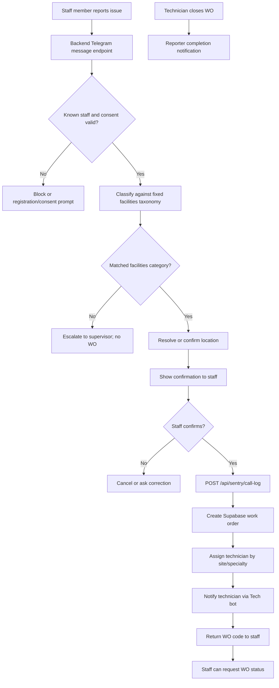

# Sentry Staff Bot Workflow

## Purpose

The Staff bot lets non-technical building users report facilities issues and receive a work-order reference without entering the manager or technician workflow.

It is a reporting channel only. It does not approve control actions, close work orders, or assign operational authority to staff users.

## Scope

Current scope is `site-002`.

Supported channels:

- Telegram Staff bot now
- WhatsApp or custom app later, using the same call-log contract

## Staff Bot Tools

The Staff bot exposes staff-safe tools only:

| Tool | Purpose | Backend path |
| --- | --- | --- |
| Report a facilities issue | Guided complaint intake that creates a work order after location and confirmation | `POST /api/sentry/telegram/message` then `POST /api/sentry/call-log` or internal WO creation |
| Report an ad-hoc fault | Short issue + location intake for simple faults such as furniture or door issues | `POST /api/sentry/telegram/message` |
| Check work-order progress | Lets the same staff reporter check the progress of a work order they logged | `GET /api/sentry/wo-status` |
| Reuse last location | Prefills the reporter's previously confirmed desk/floor for faster logging | `GET /api/sentry/call-log/location-memory` |
| Save confirmed location | Stores the reporter's confirmed location after successful logging | `POST /api/sentry/call-log/location-memory` |
| Escalate unmatched complaint | Sends unmatched facilities complaints to supervisor review without creating a WO | `POST /api/sentry/call-log/escalate` |
| Orientation menu | Shows staff-safe actions: report problem, equipment info/start inspection path, check WO | `POST /api/sentry/telegram/callback` |

## Workflow

## Deterministic Rules

- Classification uses a closed facilities taxonomy, not an open-ended LLM decision.
- IT requests are rejected or redirected unless they also contain a facilities keyword such as `power`, `socket`, or `light`.
- Location must be confirmed before work-order creation.
- Repeat reporters may use saved location memory, but confirmation is still required.
- Duplicate final confirmations are suppressed by a short-lived call-log dedupe key.
- Staff-created work orders notify the technician through `SENTRY_TECH_BOT_TOKEN`, not the staff bot token.

## Work-Order Creation Contract

Primary endpoint:

- `POST /api/sentry/call-log`

The endpoint:

- builds `created_by` as `sentry:call_log:{reporter_telegram_id|reported_by|unknown}`
- resolves site `code` to the Supabase site UUID
- assigns `assigned_to` and `assigned_team` when a technician is found
- creates the work order in `work_orders`
- calls `WorkOrderNotifier.notify_technician(...)`
- saves reporter location memory when location information is present

Technician notification payload includes:

- work order code/id
- site, zone, desk, and free-text location
- reported-by/contact context
- category/specialty/priority
- problem description and original message
- optional equipment code for HVAC desk-derived issues

## Staff Status Loop

Staff can check progress on a work order they logged by code. This is not a closeout action and it does not change the work order.

Relevant endpoint:

- `GET /api/sentry/wo-status`

Privacy rule:

- if a reporter Telegram ID is supplied, the backend only returns work orders whose `created_by` contains that reporter ID.

Reporter completion notification:

- when technician close-out marks the work order completed/resolved, staff-created work orders can notify the original reporter.

Staff-facing progress states:

- `Open`: work order is still being handled.
- `Resolved`: technician has resolved the issue; manager closure is still pending.
- `Closed`: the work order has been formally closed.

## Source Files

| Area | File |
| --- | --- |
| Backend Telegram routing | `backend/app/api/sentry_webhooks.py` |
| Staff call-log endpoint | `backend/app/api/sentry_webhooks.py` |
| Staff flow handlers | `backend/app/services/telegram_flow_handlers.py` |
| Technician notification | `backend/app/services/sentry_integration/work_order_notifier.py` |
| Work-order persistence | `backend/app/database/repositories/work_order_repository.py` |
| Technician lookup | `backend/app/database/repositories/technician_repository.py` |

## Acceptance Checks

- Staff report creates exactly one work order after confirmation.
- Duplicate final confirmation does not create a second work order.
- Work order is assigned when an active site technician exists.
- Technician receives the work order in the Tech bot, not in the Staff bot.
- Staff receives the WO reference.
- Staff status lookup is privacy-filtered.
- Staff receives completion notification when the technician closeout resolves the work order.
