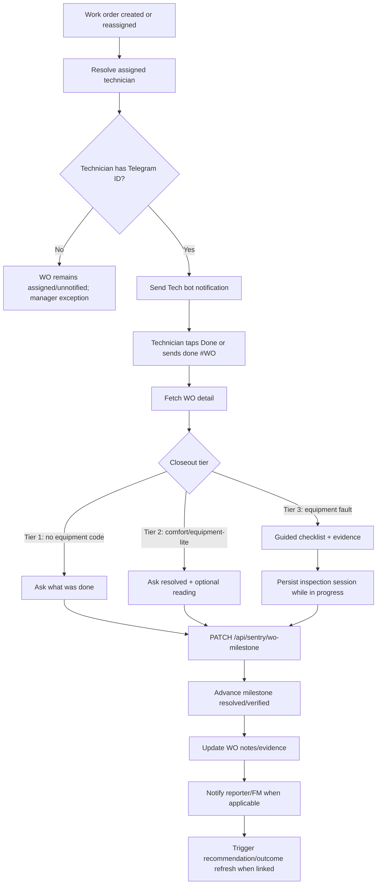

# Sentry Technician Bot Workflow

## Purpose

The Technician bot receives work-order assignments, guides closeout, collects evidence when needed, and advances the work-order lifecycle.

It is the operational completion channel. Work orders created by staff, manager actions, alerts, or AI recommendations all converge here for technician action and closeout.

## Assignment Sources

Technician work orders may originate from:

- Staff bot call-log reports
- Manager bot explicit work-order creation
- Manager/SENTRY AI recommendation `Create WO` action
- Prediction or alert work-order actions
- Cockpit issue `create_work_order` action
- Reassignment from the manager bot

All paths should produce a Supabase `work_orders` row before notification.

## Technician Bot Tools

The Technician bot exposes operational tools for assigned technicians:

| Tool | Purpose | Backend path |
| --- | --- | --- |
| Assignment notification | Sends a WO card to the assigned technician with `Info`, `Notes`, and `Done` actions where available | `WorkOrderNotifier.notify_technician(...)` |
| Open work-order queue | Lists actionable WOs for a technician and excludes resolved/closed/completed items | `GET /api/sentry/work-order/open` |
| Work-order detail | Fetches the WO and closeout tier after `done #WO-...` | `GET /api/sentry/work-order/detail` |
| Inspection checklist | Provides structured checklist items for equipment closeout | `GET /api/sentry/inspection-checklist/{equipment_type}` |
| Inspection session save | Persists in-progress Tier 3 checklist state after each answer | `POST /api/sentry/inspection-session` |
| Inspection session resume | Restores an in-progress checklist after bot/process restart | `GET /api/sentry/inspection-session` |
| Inspection result submit | Writes final checklist results and deficiencies | `POST /api/sentry/inspection-result` |
| Milestone closeout | Advances `assigned`, `in_progress`, `resolved`, or `verified` and appends notes | `PATCH /api/sentry/wo-milestone` |
| Technician lookup | Resolves technician display name from Telegram ID during closeout | `GET /api/sentry/technician` |
| Manager follow-up | Sends manager-approved follow-up text to the technician | `POST /api/sentry/send-technician-message` |
| Reassignment notice | Updates WO assignment and optionally notifies the new technician | `PATCH /api/sentry/work-order/reassign` |
| Document/photo intake | Captures technician-uploaded documents/photos for controlled metadata intake | `POST /api/sentry/telegram/message` plus document intake service |

## Workflow

## Technician Notification

Notification sender:

- `WorkOrderNotifier.notify_technician(...)`

Telegram bot token:

- callout work orders use `SENTRY_TECH_BOT_TOKEN`
- fallback paths may use the client bot token only when a tech token is not configured

Notification content should include:

- work order reference
- priority
- reporter and contact when available
- location
- equipment code when available
- problem statement
- closeout expectations

Standard buttons:

- `Info` when an equipment/desk reference is available
- `Notes` when an equipment reference is available
- `Done` with callback/text target `done #WO-...`

## Closeout Tiers

Tier 1: Generic work order

- no `equipment_code`
- ask one closeout question: what was done?
- close without full guided inspection
- reporter can be notified by backend

Tier 2: Comfort or equipment-lite work order

- has equipment/location context but not a major fault
- ask whether the issue was resolved
- optionally capture a temperature or reading
- close with concise notes

Tier 3: Equipment fault / major equipment

- major equipment or fault-led work order
- fetch equipment details and build checklist
- persist progress in `sentry_inspection_sessions`
- collect findings, readings, photos/documents when required
- advance milestone only after the closeout package is complete

## Lifecycle Updates

Key endpoints:

- `GET /api/sentry/work-order/detail`
- `GET /api/sentry/inspection-session`
- `POST /api/sentry/inspection-session`
- `PATCH /api/sentry/wo-milestone`

Generic status handler:

- messages like `done #WO-2026-0001` can call the WO update flow
- `completed` writes `completed_at`
- linked recommendations are marked executed and outcome verification can be scheduled

Milestone handler:

- valid milestones: `assigned`, `in_progress`, `resolved`, `verified`
- appends technician notes
- notifies reporter/FM when applicable

## Source Files

| Area | File |
| --- | --- |
| Technician notification | `backend/app/services/sentry_integration/work_order_notifier.py` |
| Telegram flow handlers | `backend/app/services/telegram_flow_handlers.py` |
| Sentry work-order detail/milestone endpoints | `backend/app/api/sentry_webhooks.py` |
| Work-order persistence | `backend/app/database/repositories/work_order_repository.py` |
| Inspection sessions | `backend/app/api/sentry_webhooks.py` |
| Technician document intake | `backend/app/services/telegram_document_intake_service.py` |

## Acceptance Checks

- Every assigned work order with a technician Telegram ID sends one Tech bot notification.
- The Tech bot notification includes a working `Done` path.
- `done #WO-...` resolves to the correct work order.
- Tier 1 closeout does not block on equipment evidence.
- Tier 3 closeout persists progress and can resume after restart.
- Closeout advances the WO milestone and appends technician notes.
- Linked AI recommendations are moved forward when their manual work order is completed.
- Staff reporters are notified when their staff-created issue is resolved.
