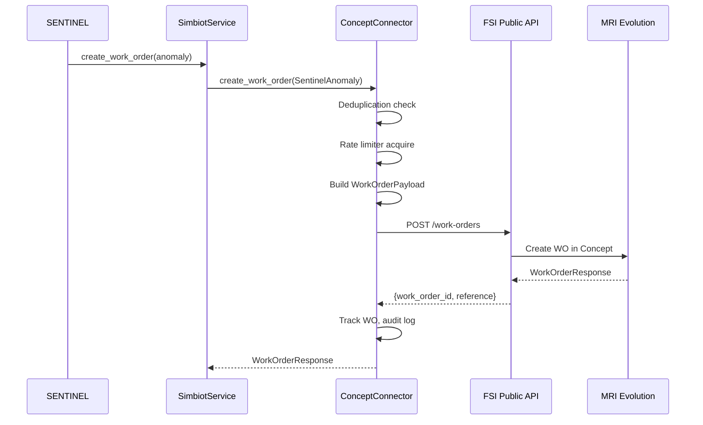
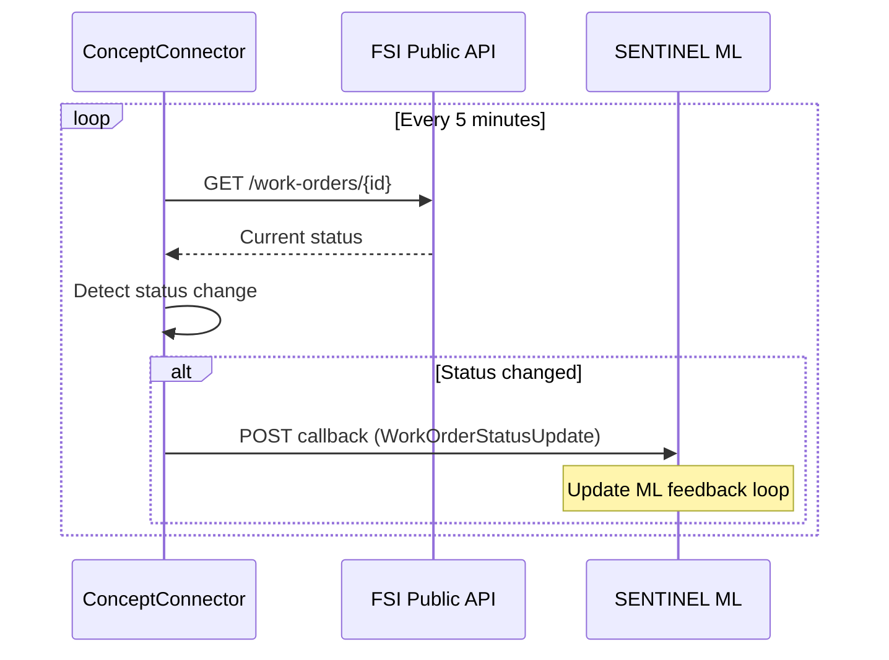

# SIMBIOT Concept Evolution Connector

## Platform Boundary

The repository uses one canonical operational boundary:

```text
building -> BMS source -> SIMBIOT -> SENTINEL
```

Where:

- `building` is the real site and its equipment, schedules, and operational state.
- `BMS source` is either the live BMS or the lifecycle simulation acting as a simulated BMS for that building.
- `SIMBIOT` is the integration boundary for connection setup, discovery, ingestion, mapping, and command transport.
- `SENTINEL` is the overlay that stores data, runs ML, produces recommendations, and optionally issues control actions through SIMBIOT.

Operational rules:

- The lifecycle simulation engine is not part of SENTINEL. It is one possible BMS source.
- `site_processing = off` means disconnected from the building from SENTINEL's perspective.
- Production deployment is one SENTINEL instance per building.
- Any future multi-site console is read-only and not the operational control plane.

The stage-by-stage operating model for this boundary is defined in
[building-operating-lifecycle.md](/opt/bms-intelligence/docs/architecture-repository/principles/building-operating-lifecycle.md).

## Overview

The SIMBIOT Concept Connector bridges SENTINEL's AI anomaly detection to MRI Evolution (Concept Evolution) CAFM via the FSI Public API. When SENTINEL detects an equipment anomaly, the connector auto-creates a work order in MRI Evolution that technicians receive on their iPads via FSI GO. Status updates flow back into SENTINEL for ML feedback.

**Status:** Integrated and ready. Activates when FSI API credentials are configured.

```
SENTINEL AI Engine                    MRI Evolution (Concept)
┌─────────────────┐                  ┌──────────────────────┐
│ Anomaly Detection│                  │  FSI Public API      │
│ Workflow Triggers│──── SIMBIOT ────▶│  Work Order Creation │
│ Escalation Engine│    Connector     │  Asset Sync          │
│                  │◀── Polling ──────│  Status Updates      │
│ ML Feedback Loop │                  │  FSI GO (iPad)       │
└─────────────────┘                  └──────────────────────┘
```

## Architecture

### Package Structure

```
simbiot_concept/                          # Standalone Python package
├── __init__.py                           # Public exports
├── connectors/
│   └── concept_connector.py              # Core connector (work orders, polling, asset sync)
├── models/
│   ├── config.py                         # ConceptConfig, SegmentConfig, mappings
│   ├── anomaly.py                        # SentinelAnomaly input model
│   └── work_order.py                     # WorkOrderPayload, Response, StatusUpdate
├── services/
│   └── auth.py                           # FSIAuthService (JWT token management)
└── utils/
    ├── resilience.py                     # RateLimiter, CircuitBreaker, DeduplicationCache
    └── audit.py                          # AuditEntry with sensitive field masking
```

### SENTINEL Integration

| File | Role |
|------|------|
| `simbiot_concept/` | Standalone connector package (symlinked into backend) |
| `backend/app/services/simbiot_service.py` | Singleton wrapper for FastAPI lifecycle |
| `backend/app/main.py` | Startup/shutdown hooks (commented until credentials configured) |
| `backend/app/services/workflow_triggers.py` | Future: call `simbiot_service.create_work_order()` on anomalies |
| `backend/app/services/concept_loader.py` | Existing Concept data loader (read-only, job cards/assets) |
| `backend/app/api/concept.py` | Existing `/api/concept` router (health, assets, job cards) |

## Data Flow

### Anomaly to Work Order



### Status Polling (Background)



## Configuration

### ConceptConfig

```python
from simbiot_concept import ConceptConfig

config = ConceptConfig(
    # FSI API Connection
    api_base_url="https://developer.fsiservices.com",
    subscription_key="your-ocp-apim-subscription-key",
    api_username="sentinel@client.co.za",
    api_password="...",
    customer_site_code="SANDTON",

    # Facility segments
    segments=[
        SegmentConfig(
            segment_id="S002",
            site_name="Sandton City Office Tower",
            cost_center_id=1001,
            enabled=True
        )
    ],

    # Severity mapping (SENTINEL 0.0-1.0 → MRI priority)
    severity_mapping=SeverityMapping(
        critical_threshold=0.9,   # → P1
        high_threshold=0.7,       # → P2
        medium_threshold=0.5,     # → P3
        low_threshold=0.3,        # → P4
        p1_priority_id=101,
        p2_priority_id=102,
        p3_priority_id=103,
        p4_priority_id=104
    ),

    # Trade mapping (asset type → MRI trade ID)
    trade_mapping=TradeMapping(
        hvac=201, electrical=202, plumbing=203,
        fire=204, lifts=205, building_fabric=206,
        cleaning=207, security=208, general=209
    ),

    # Operational
    environment="PRODUCTION",
    sentinel_callback_url="https://sentinel.example.com/api/simbiot/callback",
    dedup_cooldown_minutes=30
)
```

### Severity Mapping

SENTINEL's ML severity scores (0.0-1.0) map to MRI Evolution priority levels:

| SENTINEL Score | Priority | Label | Description |
|---------------|----------|-------|-------------|
| >= 0.9 | P1 | Critical | Immediate response required |
| >= 0.7 | P2 | High | Same-day response |
| >= 0.5 | P3 | Medium | Within 48 hours |
| >= 0.3 | P4 | Low | Scheduled maintenance |

### Trade Mapping

| SENTINEL Asset Type | MRI Trade |
|--------------------|-----------|
| hvac, chiller, ahu, fcu, vav | HVAC |
| electrical, generator, ups | Electrical |
| plumbing, pump | Plumbing |
| fire | Fire |
| lifts | Lifts |

## SentinelAnomaly Model

The input model for creating work orders from SENTINEL detections:

```python
from simbiot_concept import SentinelAnomaly

anomaly = SentinelAnomaly(
    # Identity
    correlation_id=uuid4(),                          # Links SENTINEL ↔ MRI
    source="BMS_ANOMALY",                            # or OCCUPANT_REQUEST, PPM_CONDITION, etc.
    detected_at=datetime.utcnow(),

    # Location
    segment_id="S002",
    building_id="site-002",
    building_name="Sandton City Office Tower",
    location_id=5001,
    location_description="Level 1, Zone A, Plant Room",

    # Asset
    asset_id=1234,
    asset_tag="S002-CHILLER-B1-001",
    asset_type="hvac",
    asset_name="Primary Chiller",

    # Severity
    severity_score=0.85,                              # Maps to P2 (High)

    # Diagnostics (from SENTINEL AI)
    summary="Chiller compressor bearing wear detected",
    diagnostics="Vibration RMS increased from 1.2 to 3.2 mm/s over 14 days...",
    sensor_readings={"vibration_rms": 3.2, "motor_current": 168.0},
    trend_summary="Exponential degradation pattern, 85% failure probability in 30 days",
    recommended_action="Replace compressor bearing assembly"
)
```

### Anomaly Sources

| Source | Description | Example |
|--------|-------------|---------|
| `BMS_ANOMALY` | Detected from BMS telemetry by ML models | Vibration spike, temperature drift |
| `OCCUPANT_REQUEST` | Via WhatsApp/Telegram (Sentry bot) | "It's too hot on Level 2" |
| `PPM_CONDITION` | Condition-based preventive maintenance trigger | RUL below threshold |
| `MANUAL_ESCALATION` | Manually created by operator | Technician reports issue |
| `SYSTEM_ALERT` | Infrastructure alert | Network failure, sensor offline |

## Resilience Features

### Circuit Breaker

3-state circuit breaker protects against FSI API failures:

- **CLOSED** (normal): Requests flow through. Failures counted.
- **OPEN** (after 5 consecutive failures): Requests queued locally. Waits 60s recovery.
- **HALF_OPEN** (after recovery): One test request allowed. Success → CLOSED, Failure → OPEN.

Work orders created while circuit is OPEN are queued in memory and drained when the circuit recovers.

### Rate Limiting

Token bucket algorithm stays at 200 calls/min (below FSI's 250/min limit) to avoid throttling.

### Deduplication

Prevents duplicate work orders for the same asset within a 30-minute cooldown window. Key: `(segment_id, asset_id)`.

### Token Management

- FSI issues 7-day JWT tokens
- Auto-refresh at 80% expiry (~day 5.6)
- Thread-safe via asyncio.Lock
- Tokens never persisted to disk

## Audit Trail

All API interactions are logged with sensitive field masking:

```
API POST /work-orders → 201 (245ms) [create_work_order] corr=a1b2c3d4
```

Sensitive fields automatically masked: `authorization`, `password`, `access_token`, `token`, `api_key`, `subscription_key`.

## Activation

The connector is integrated but dormant. To activate:

1. **Obtain FSI API credentials** from MRI Evolution team at FirstRand
2. **Configure environment variables** in `backend/.env`:
   ```bash
   FSI_API_BASE_URL=https://developer.fsiservices.com
   FSI_SUBSCRIPTION_KEY=your-key
   FSI_USERNAME=sentinel@client.co.za
   FSI_PASSWORD=...
   FSI_CUSTOMER_SITE_CODE=SANDTON
   ```
3. **Uncomment startup lines** in `backend/app/main.py` (search for "SIMBIOT Concept"):
   ```python
   from simbiot_concept import ConceptConfig
   config = ConceptConfig(api_base_url=os.getenv("FSI_API_BASE_URL"), ...)
   await simbiot_service.initialise(config)
   ```
4. **Wire anomaly sources** - Add `simbiot_service.create_work_order()` calls to:
   - `workflow_triggers.py` - On ML anomaly detection
   - `anomaly_reporter.py` - On critical anomaly reports
   - Escalation engine - On repair escalation (Level 3)

## Integration Points

### Existing Concept Integration

SENTINEL already has a read-only Concept integration:
- `backend/app/services/concept_loader.py` - Loads job cards and assets from Concept data
- `backend/app/api/concept.py` - `/api/concept` endpoints (health, assets, job cards, stats)

The SIMBIOT connector adds **bidirectional** capability: SENTINEL can now write work orders back to Concept, not just read data from it.

### SIMBIOT MCP Server

The existing SIMBIOT MCP Server (`backend/app/mcp/simbiot_server.py`) provides 23 tools for building management via Claude Desktop/Cloud. The Concept Connector is a separate integration path - MCP for AI tool use, Concept Connector for CAFM work order automation.

### ML Feedback Loop

When a work order created by SIMBIOT is completed in MRI Evolution:
1. Polling detects status change (COMPLETED/CLOSED)
2. `WorkOrderStatusUpdate` sent to SENTINEL callback URL
3. SENTINEL's ML Feedback Service records the outcome
4. Repair effectiveness is calculated
5. ML models learn from the result

This closes the full loop: **AI detects → WO created → Technician repairs → Outcome fed back to AI**.

## Related Documentation

- [SIMBIOT MCP Server](simbiot-mcp-server.md) - MCP protocol tools for Claude AI
- [CAFM Schema](cafm-schema.md) - CAFM data model and integration schema
- [Workflow Triggers](../05-integrations/workflow-triggers.md) - Automated trigger pipeline
- [Repair Effectiveness](../04-features/46-repair-effectiveness-ml-feedback.md) - Post-repair ML feedback loop

## Changelog

| Version | Date | Changes |
|---------|------|---------|
| 1.0.0 | 2026-02-04 | Initial integration: connector package, service wrapper, main.py hooks |
