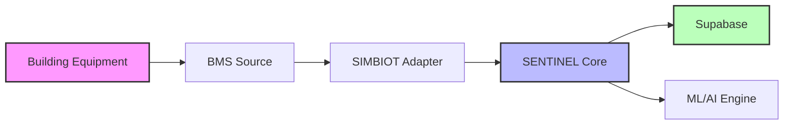
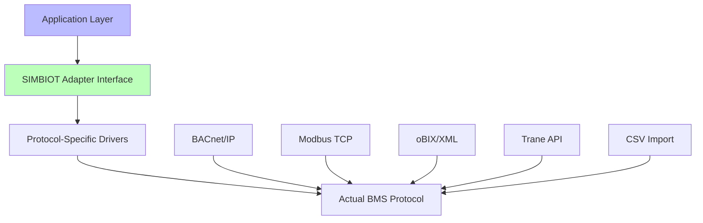
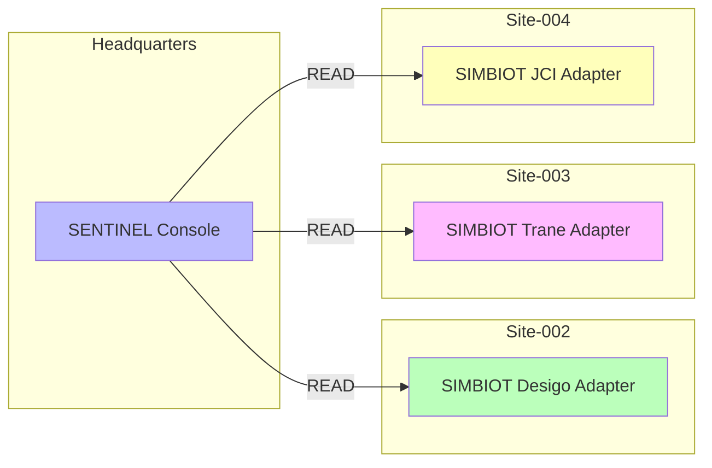

# SIMBIOT Universal Adapter Pattern

## Executive Summary

**One SBC. Any Building. Zero Code Changes.**

The SIMBIOT Universal Adapter Pattern enables a single NVIDIA Jetson SBC running SENTINEL to connect to **any building's BMS** without modifying the core application code or database schema. SIMBIOT acts as a universal translator between diverse BMS protocols/formats and SENTINEL's standardized data model.

**The Core Promise:** Take the same hardware to Site-002 (Siemens Desigo), Site-003 (Trane Tracer), or Site-004 (Johnson Controls Metasys) - SIMBIOT handles all translation transparently.

---

## Architecture Overview

### The Fixed Boundary



**Building → BMS Source → SIMBIOT → SENTINEL**

### Key Principles

1. **SENTINEL Supabase schema is FIXED** - Never changes per building
2. **SIMBIOT is ADAPTIVE** - Translates any BMS format to standard schema
3. **One adapter per BMS type** - BACnet, Modbus, oBIX, simulation, custom CSV
4. **Adapter contract is UNIFORM** - All adapters expose identical interface

---

## Real-World Deployment Examples

### Scenario 1: Site-002 (Currently Running)

**Building Setup:**
- BMS: Siemens Desigo CC
- Protocol: BACnet/IP
- Equipment: 66 items (CHILLER, AHU, FCU, VAV, DALI, etc.)

**SIMBIOT Translation:**
```
Desigo CC Equipment JSON
  ↓ SIMBIOT BACnet Adapter
Standardized Equipment Schema
  ↓
Supabase equipment table
```

**What Happens at Deployment:**
1. SIMBIOT BACnet adapter discovers devices via Who-Is/I-Am
2. Parses Desigo's equipment JSON format from `app/data/sites/site-002/`
3. Maps BACnet points (AI, AO, BI, BO, AV, BV) to standardized schema
4. Extracts equipment types from naming convention `S002-{TYPE}-{ID}`
5. Loads equipment into Supabase with proper typing
6. Simulation telemetry flows through same adapter path

**Result:** SENTINEL sees standard data, not Desigo-specific format

---

### Scenario 2: Site-003 (Future Trane Building)

**Building Setup:**
- BMS: Trane Tracer SC+
- Protocol: BACnet/IP + Proprietary API
- Equipment: 120 items
- Format: CSV export + BACnet points

**SIMBIOT Translation:**
```
Trane CSV + BACnet Points
  ↓ SIMBIOT Trane Adapter
Standardized Equipment Schema
  ↓
Supabase equipment table (same schema!)
```

**How It's Different:**
- Different discovery mechanism (CSV import + BACnet scan)
- Different point naming (Trane vs Desigo conventions)
- Different data types (CSV strings vs BACnet typed)

**How It's the Same:**
- Same SENTINEL binary
- Same Supabase schema
- Same AI analysis pipeline
- Same cost optimization algorithms

**Result:** Building owner gets identical experience to Site-002

---

### Scenario 3: Site-004 (Johnson Controls Legacy)

**Building Setup:**
- BMS: Johnson Controls Metasys
- Protocol: BACnet/IP + N2 bus (legacy)
- Equipment: 45 items
- Format: Proprietary export format

**SIMBIOT Translation:**
```
Metasys Export Format
  ↓ SIMBIOT Metasys Adapter
Standardized BACnet-Like Structure
  ↓
Standardized Equipment Schema
  ↓
Supabase (same tables!)
```

**Additional Complexity:**
- N2 bus protocol conversion required
- Legacy equipment IDs need normalization
- Point mapping more complex (vendor-specific)

**Simplified by SIMBIOT:**
- N2 adapters expose BACnet interface
- Legacy IDs converted to SENTINEL format `{site}-{type}-{id}`
- Translation layer handles vendor quirks

**Result:** 20-year-old BMS works with modern AI platform

---

## The Adapter Contract

### Uniform Interface (All Adapters Implement)

```python
class BmsAdapter(ABC):
    """Universal adapter contract - all BMS types"""

    def connect(config: BmsConnectionConfig) -> BmsConnectionStatus
        """Establish connection to BMS"""

    def discover_devices() -> List[BmsDeviceDescriptor]
        """Find all equipment devices"""

    def discover_points(device_id: str) -> List[BmsPointDescriptor]
        """Discover data points for a device"""

    def read_point(device_id: str, point_id: str) -> BmsPointValue
        """Read current value of a point"""

    def write_point(request: BmsWriteRequest) -> bool
        """Write value to a point (if authorized)"""

    def get_status() -> BmsAdapterCapabilities
        """Get adapter capabilities and health"""

    def disconnect() -> None
        """Cleanly disconnect from BMS"""
```

### Write Verification

All write-capable adapters implement write verification to catch silent
no-ops where the protocol layer accepts the write (returns success) but
the physical point doesn't change. This is critical for Niagara oBIX
where a higher-priority override in the priority array can cause a PUT
to return HTTP 200 while the point value stays unchanged.

- **Modbus**: Write → read back → compare raw values → log mismatch
- **oBIX**: Write → read back → compare with type-aware tolerance →
  return `False` if mismatch (logs "possible priority-array override")
- **KNX**: No read-back (KNX writes are fire-and-forget), but emergency/
  fire/evacuation group addresses are blocked before the protocol call

### Safety: Emergency Group Write-Block (KNX)

The KNX adapter enforces a two-layer safety check on emergency/fire
group addresses:

1. **Discovery layer**: Points whose description matches emergency
   patterns (`emergency`, `fire`, `evacuation`, `alarm`, `panic`) are
   marked `writable=False` in `discover_points()`.
2. **Write layer**: `write_point()` checks `_is_emergency_group()` before
   calling the protocol client — if blocked, returns `False` without
   calling `write_group_address()`.

This prevents SENTINEL from accidentally writing to fire alarm, evacuation
lighting, or panic button group addresses.

### Standardized Data Shapes

All adapters return identical data structures:

```python
@dataclass
class BmsEquipment:
    """Standard equipment schema - same for all BMS types"""
    code: str                    # S002-CHILLER-B1-001
    type: EquipmentType          # Enum: CHILLER, AHU, FCU, etc.
    name: str                    # Human readable
    manufacturer: Optional[str]  # Auto-detected or provided
    model: Optional[str]         # Auto-detected or provided
    location: str                # Building, floor, zone
    operating_data: Dict[str, Any]  # Current sensor values
    health_score: float          # 0-100
    status: EquipmentStatus      # online, offline, alarm
```

**Key Insight:** The `operating_data` dict contains BMS-specific points (temps, pressures, flows) but the outer structure is standardized.

---

## How SIMBIOT Achieves Universality

### 1. Protocol Abstraction



### 2. Point Normalization

**BACnet Example (Desigo):**
```
Object: analog-input,1
Properties:
  - Present_Value: 23.5
  - Description: "CH-001 Supply Temp"
  - Units: degrees-Celsius
```

**Trane Example (Tracer):**
```csv
PointName,Value,Units,Description
"CHL1_SplyTemp",23.2,"C","Chiller 1 Supply"
```

**Both Normalize To:**
```python
{
  "point_id": "S002-CHILLER-B1-001.supply_temp",
  "value": 23.5,
  "unit": "°C",
  "type": "temperature",
  "equipment_code": "S002-CHILLER-B1-001"
}
```

### 3. Type Inference & Enrichment

SIMBIOT automatically:
- Extracts equipment type from naming patterns (`CH` → CHILLER, `AHU` → AHU)
- Maps units to standard format (°F → °C, PSI → kPa, etc.)
- Identifies point purpose (temp, pressure, flow, status) from name/description
- Calculates derived metrics (efficiency, delta-T, energy consumption)

### 4. Schema Validation

Every adapter validates data against SENTINEL schema **before** insertion:
```python
# Reject invalid equipment codes
if not re.match(r"^[A-Z]{3}-\d{3}$", equipment_code):
    raise ValidationError(f"Invalid equipment code format: {equipment_code}")

# Reject unknown equipment types
if equipment_type not in EquipmentType.__members__:
    raise ValidationError(f"Unknown equipment type: {equipment_type}")

# Reject malformed sensor readings
if not isinstance(temperature, (int, float)):
    raise ValidationError(f"Temperature must be numeric, got {type(temperature)}")
```

---

## The Translation Pipeline

### Step-by-Step: Site-002 Equipment Ingestion

**Input: Desigo Equipment JSON**
```json
{
  "id": "CH-001",
  "name": "Chiller 001",
  "type": "chiller",
  "bacnet_device_id": 101,
  "points": {
    "supply_temp": {"object_id": "AI:1", "value": 6.5, "unit": "°C"},
    "return_temp": {"object_id": "AI:2", "value": 12.3, "unit": "°C"},
    "runtime_hours": {"object_id": "AV:1", "value": 8760, "unit": "hrs"}
  }
}
```

**SIMBIOT Translation:**
1. Generate SENTINEL equipment code: `site-002` + `CH` + `001` → `S002-CH-001`
2. Map BACnet points to standard schema
3. Normalize temperature units (ensure °C)
4. Calculate health score from runtime
5. Infer location from device instance ID mapping

**Output: Standard Equipment Record**
```json
{
  "id": "uuid-hash",
  "code": "S002-CH-001",
  "type": "CHILLER",
  "name": "Chiller 001",
  "manufacturer": "Siemens",
  "model": "Desigo CC",
  "location": "Basement Level 1",
  "operating_data": {
    "supply_temp": 6.5,
    "return_temp": 12.3,
    "runtime_hours": 8760,
    "health_score": 82.4
  },
  "site_id": "site-002"
}
```

**Insertion:**
```sql
INSERT INTO equipment (id, code, type, name, manufacturer, model,
                       location, operating_data, site_id)
VALUES (?, ?, ?, ?, ?, ?, ?, ?, ?)
```

---

## Benefits of Universal Adapter Pattern

### 1. Code Reuse

**Before (without SIMBIOT):**
```python
# Site-002 specific code
if site_id == "site-002":
    equipment = parse_desigo_json(raw_data)
elif site_id == "site-003":
    equipment = parse_trane_csv(raw_data)
elif site_id == "site-004":
    equipment = parse_metasys_xml(raw_data)
```

**After (with SIMBIOT):**
```python
# Universal code - works for all sites
equipment = simbiot_adapter.discover_devices()
supabase.insert(equipment)
```

### 2. Testing & Simulation

- Test against simulation adapter (no real BMS needed)
- Switch between live and simulated data seamlessly
- Validate AI algorithms on synthetic data before deployment

```python
# Production
adapter = BacnetAdapter()

# Testing
adapter = SimulationAdapter(scenario="equipment_failure")

# Same code path, different data source
```

### 3. Multi-Site Fleet Management



**Result:** Central dashboard showing all buildings, each with different BMS brand, using unified data model.

### 4. Future-Proofing

**New BMS Brand?** Simply write new adapter:
```python
class NewBrandAdapter(BmsAdapter):
    def discover_devices(self):
        # Brand-specific discovery logic
        # ... return standardized equipment list
        pass

    def read_point(self, device_id, point_id):
        # Brand-specific read logic
        # ... return standardized point value
        pass
```

**No changes to:**
- SENTINEL core code
- Supabase schema
- AI/ML models
- Dashboard code
- API endpoints

---

## Current Adapter Implementations

### ✅ Production Ready

| Adapter | Status | BMS Types | Protocols | Notes |
|---------|--------|-----------|-----------|-------|
| BACnet | ✅ Ready | Siemens Desigo, JCI Metasys, Trane Tracer | BACnet/IP, BACnet MS/TP | Wraps Niagara BACnet client; read + write |
| Simulation | ✅ Ready | Site-002 simulator | JSON files | Via Shadow Bridge REST proxy |
| CSV Import | ⚠️ Partial | Custom/legacy systems | CSV files | |

### ✅ Implemented (SIMBIOT BmsAdapter Contract)

| Adapter | Status | BMS Types | Protocols | Notes |
|---------|--------|-----------|-----------|-------|
| Modbus TCP | ✅ Ready | Generic Modbus devices (generators, UPS, ATS) | Modbus TCP/IP | 16/32-bit data types (uint16/uint32/int32/float32), configurable word order, write verification |
| Niagara oBIX | ✅ Ready | Tridium Niagara AX/N4 | oBIX/XML over HTTP | Read + write with read-back verification (catches priority-array silent no-ops) |
| Bridge | ✅ Ready | Shadow Bridge REST proxy | HTTP REST | Read-only (bridges to BACnet/Desigo) |
| KNX | ✅ Ready | KNX building systems | KNXnet/IP via xknx | Read + write with emergency/fire group write-block safety; group addresses from ETS export |

### 📋 Planned

| Adapter | Status | BMS Types | Protocols |
|---------|--------|-----------|-----------|
| LonWorks | 📋 Planned | Echelon LonWorks | LonTalk/IP |
| WebCTRL | 📋 Planned | Automated Logic WebCTRL | Proprietary API |

---

## Deployment Examples

### Example 1: Site-002 Deployment (Current)

```bash
# Hardware: NVIDIA Jetson Xavier NX
# Location: Site-002 building basement

$ cat .env
SITE_ID=site-002
BMS_TYPE=bacnet
BMS_IP=192.168.1.100
BMS_SUBNET=192.168.1.0/24
SIMBIOT_ADAPTER=bacnet

$ python -m uvicorn app.main:app
INFO: SIMBIOT: Connecting to BACnet at 192.168.1.100
INFO: SIMBIOT: Discovered 66 devices
INFO: SIMBIOT: Ingested equipment inventory to Supabase
INFO: SENTINEL: ML models initialized
INFO: SENTINEL: Ready for analysis
```

**Time to first insight:** 45 minutes (fully automated)

### Example 2: Site-003 Deployment (Future Trane Site)

```bash
# Exactly same hardware, different config

$ cat .env
SITE_ID=site-003
BMS_TYPE=trane
BMS_IP=10.0.1.50
BMS_SUBNET=10.0.1.0/24
SIMBIOT_ADAPTER=trane
CSV_EQUIPMENT_FILE=/mnt/usb/site-003-equipment.csv

$ python -m uvicorn app.main:app
INFO: SIMBIOT: Connecting to Tracer SC+
INFO: SIMBIOT: Importing equipment from CSV
INFO: SIMBIOT: Discovered 120 devices
INFO: SIMBIOT: Ingested equipment inventory to Supabase
INFO: SENTINEL: ML models initialized
INFO: SENTINEL: Ready for analysis
```

**Time to first insight:** 60 minutes (CSV import + automated discovery)

### Example 3: Multi-Site Fleet Console

```python
# Central monitoring across all sites

class FleetDashboard:
    def get_all_buildings_health(self):
        sites = supabase.table("sites").select("*").execute()

        results = []
        for site in sites.data:
            # Same query works for all BMS types!
            equipment = supabase.table("equipment")\
                .select("*")\
                .eq("site_id", site["id"])\
                .execute()

            avg_health = mean(eq["health_score"] for eq in equipment.data)

            results.append({
                "site_name": site["name"],
                "bms_type": site["bms_type"],  # Desigo, Trane, JCI, etc.
                "equipment_count": len(equipment.data),
                "avg_health": avg_health
            })

        return results
```

**Result:** Unified view of buildings with different BMS brands, zero branch logic.

---

## Troubleshooting

### Problem: "SIMBIOT can't discover devices"

**Diagnosis:**
```bash
# Check adapter logs
$ tail -f logs/simbiot.log
ERROR: BACnet Who-Is timeout
ERROR: No devices responding
```

**Solutions:**
1. Verify BMS server IP and subnet mask
2. Check firewall rules (UDP port 47808 for BACnet)
3. Confirm BACnet is enabled on BMS (not MSTP-only)
4. Test with BACnet tool: `bacwp 192.168.1.100 101 0 85`

### Problem: "Equipment types showing as 'unknown'"

**Diagnosis:**
```sql
-- Check equipment table
SELECT type, COUNT(*) FROM equipment WHERE site_id = 'site-002' GROUP BY type;
```

Result:
```
 type      | count
-----------+-------
 unknown   | 23     <-- Problem
 chiller   | 2
 ahu       | 5
```

**Root Cause:** Naming convention doesn't match extraction pattern

**Solution:**
Provide naming documentation to SIMBIOT:
```python
# In SIMBIOT config
equipment_patterns = [
    (r"CH-", "CHILLER"),
    (r"AHU-", "AHU"),
    (r"FCU-(\d{3})", "FCU"),  # Site-003 format
]
```

### Problem: "Sensor readings in weird units"

**Diagnosis:**
```sql
SELECT point_name, value, unit FROM sensor_readings LIMIT 5;
```

Result:
```
 point_name          | value | unit
---------------------+-------+-------
 CH1_Supply_Temp     | 43.2  | °F     <-- Wrong units for SENTINEL
```

**Solution:**
SIMBIOT unit conversion:
```python
unit_conversions = {
    "°F": lambda x: (x - 32) * 5/9,  # Convert to °C
    "PSI": lambda x: x * 6.89476,     # Convert to kPa
}
```

---

## Future Enhancements

### Auto-Discovery V2 (Q2 2026)

- **AI-powered point classification:** Automatically identify point purpose from patterns
- **Self-learning mapping:** Observe technician corrections, adapt mappings
- **Equipment relationship inference:** Detect parent-child relationships (AHU → VAVs)

### Cloud-Native SIMBIOT (Q3 2026)

- **Edge-to-cloud sync:** Local discovery, cloud persistence
- **Multi-site orchestration:** Central adapter management
- **Adapter marketplace:** Community-contributed adapters for niche BMS

### Self-Healing Adapters (Q4 2026)

- **Automatic failover:** Detect BMS communication loss, retry with backoff
- **Data quality monitoring:** Alert on stale data, anomalies
- **Predictive maintenance:** Monitor adapter health, predict failures

---

## Reference Implementation: BACnet Adapter

```python
class BacnetAdapter(BmsAdapter):
    """Siemens Desigo / JCI Metasys BACnet adapter"""

    def discover_devices(self) -> List[BmsDeviceDescriptor]:
        # BACnet Who-Is broadcast
        devices = self.bacnet.who_is()

        results = []
        for device in devices:
            # Read device properties
            obj_name = device.read_property(ObjectType.DEVICE,
                                           device.instance,
                                           PropertyIdentifier.OBJECT_NAME)
            vendor = device.read_property(ObjectType.DEVICE,
                                         device.instance,
                                         PropertyIdentifier.VENDOR_NAME)

            # Map to standardized format
            results.append(BmsDeviceDescriptor(
                device_id=f"{self.site_id}-{obj_name}",
                name=obj_name,
                manufacturer=vendor,
                protocol="bacnet",
                address=str(device.address)
            ))

        return results

    def discover_points(self, device_id: str) -> List[BmsPointDescriptor]:
        # Parse device_id to get BACnet address
        device = self._parse_device_id(device_id)

        # Read object list
        obj_list = device.read_property(ObjectType.DEVICE,
                                       device.instance,
                                       PropertyIdentifier.OBJECT_LIST)

        results = []
        for obj in obj_list:
            if obj.object_type in [ObjectType.ANALOG_INPUT,
                                 ObjectType.ANALOG_VALUE]:
                # Read point properties
                point_name = device.read_property(obj.object_type,
                                                 obj.instance,
                                                 PropertyIdentifier.DESCRIPTION)
                unit = device.read_property(obj.object_type,
                                           obj.instance,
                                           PropertyIdentifier.UNITS)

                results.append(BmsPointDescriptor(
                    point_id=f"{device_id}.{point_name}",
                    name=point_name,
                    unit=unit,
                    type=self._infer_point_type(point_name)
                ))

        return results
```

---

## Conclusion

The SIMBIOT Universal Adapter Pattern is the **core architectural decision** that enables SENTINEL to be truly building-agnostic. By separating BMS-specific concerns (protocols, formats, naming) from core intelligence (AI, ML, analytics), we achieve:

- ✨ **Universal deployment** - One codebase, any building
- 🚀 **Rapid onboarding** - 45-60 minutes per site (vs days/weeks)
- 🛠️ **Simplified maintenance** - Fix adapter, not core logic
- 📊 **Unified analytics** - Compare buildings apples-to-apples
- 🔮 **Future-proofing** - Add new BMS brands without core changes

**The key insight:** BMS diversity is a data problem, not an intelligence problem. SIMBIOT solves the data problem so SENTINEL can focus on intelligence.

---

## Related Documents

- [SIMBIOT BMS Adapter Contract](./bms-adapter-contract.md) - Technical adapter interface specification
- [SIMBIOT Onboarding Checklist](./SIMBIOT_ONBOARDING_CHECKLIST.md) - What auto-detects vs manual input
- [Device Abstraction Layer](../../02-architecture/device-abstraction-layer.md) - Lower-level device communication
- [Building Operating Lifecycle](../../architecture-repository/principles/building-operating-lifecycle.md) - Operational stage gates

---

**Last Updated:** 2026-06-19
**Version:** 2.0.0
**Status:** Production Ready
