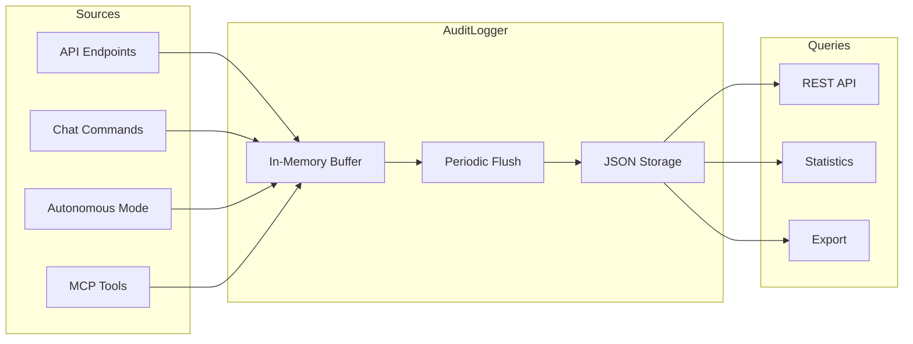

# Audit Logging

SENTINEL maintains an immutable audit trail of all control actions, safety validations, and system events. This ensures regulatory compliance, enables incident investigation, and provides accountability for all changes to building systems.

## Overview

The audit system captures:

- **Device control actions**: Who changed what, when, and why
- **Safety validations**: All safety rule checks and their outcomes
- **System events**: Service starts, configuration changes, escalations
- **Before/after values**: Complete state history for forensic analysis
- **Login events**: All authentication attempts with user, IP, and outcome



## Core concepts

### Audit log entry

Each audit event creates an `AuditLogEntry` with the following structure:

```python
@dataclass
class AuditLogEntry:
    id: str                           # Unique entry ID (UUID)
    timestamp: datetime               # When the action occurred
    action: AuditActionType           # Type of action
    user: str                         # User/system identifier
    device_id: Optional[str]          # Device affected (if applicable)
    point_name: Optional[str]         # Point changed (if applicable)
    old_value: Optional[Any]          # Previous value
    new_value: Optional[Any]          # New value
    result: AuditResultType           # Outcome of the action
    safety_validation: Optional[Dict] # Safety check details
    error_message: Optional[str]      # Error details (if failed)
    correlation_id: Optional[str]     # Links related actions
    metadata: Dict[str, Any]          # Additional context
```

### Action types

| Action Type | Description | Example |
|-------------|-------------|---------|
| `DEVICE_CONTROL` | Direct device point change | Set temperature to 22°C |
| `SAFETY_VALIDATION` | Safety rule evaluation | Check if value is in range |
| `SYSTEM_EVENT` | Service or configuration event | Autonomous mode started |
| `USER_ACTION` | User-initiated non-control action | Login, settings change |
| `ESCALATION` | Safety boundary approach | Temperature approaching limit |

### Result types

| Result | Description |
|--------|-------------|
| `SUCCESS` | Action completed successfully |
| `BLOCKED` | Action prevented by safety rules |
| `WARNING` | Action allowed with warnings |
| `FAILURE` | Action failed due to error |
| `PENDING` | Action queued for execution |

## Architecture

### Thread-safe singleton

The `AuditLogger` is a thread-safe singleton that manages all audit operations:

```python
from app.services.audit_logger import AuditLogger

# Get singleton instance
audit_logger = AuditLogger()

# Log a control action
entry_id = audit_logger.log_control_action(
    device_id="S001-CHILLER-B1-001",
    point_name="chw_setpoint",
    user="operator@example.com",
    old_value=7.0,
    new_value=8.0,
    result=AuditResultType.SUCCESS,
    safety_validation={
        "allowed": True,
        "warnings": [],
        "rule_results": [...]
    }
)
```

### Buffer and persistence

For performance, the audit logger uses a buffered write strategy:

1. **In-memory buffer**: New entries are added to a thread-safe buffer
2. **Periodic flush**: Buffer is flushed to disk every 10 entries
3. **JSON storage**: Entries are persisted to `backend/app/data/audit_log.json`
4. **Rotation**: Oldest entries are removed when exceeding 1000 entries

```python
class AuditLogger:
    def __init__(self):
        self.buffer: List[AuditLogEntry] = []
        self.buffer_size = 10      # Flush after 10 entries
        self.max_entries = 1000    # Rotate oldest entries

    def _flush_buffer(self) -> None:
        """Flush buffer to disk."""
        with self._write_lock:
            # Load existing, combine with buffer, save
            ...
```

### Correlation IDs

Related actions can be linked using correlation IDs:

```python
# Start a correlated sequence
correlation_id = str(uuid.uuid4())

# Log the initial request
audit_logger.log_control_action(
    device_id="S001-CHILLER-B1-001",
    point_name="chw_setpoint",
    user="operator",
    old_value=7.0,
    new_value=8.0,
    result=AuditResultType.PENDING,
    correlation_id=correlation_id
)

# Log the safety validation
audit_logger.log_safety_validation(
    device_id="S001-CHILLER-B1-001",
    user="system",
    validation_result={"allowed": True, ...},
    result=AuditResultType.SUCCESS,
    correlation_id=correlation_id
)

# Log the final result
audit_logger.log_control_action(
    device_id="S001-CHILLER-B1-001",
    point_name="chw_setpoint",
    user="operator",
    old_value=7.0,
    new_value=8.0,
    result=AuditResultType.SUCCESS,
    correlation_id=correlation_id
)
```

## API reference

### Endpoints

| Method | Endpoint | Description |
|--------|----------|-------------|
| `GET` | `/api/audit/logs` | Get audit logs with filtering |
| `GET` | `/api/audit/logs/{id}` | Get specific audit entry |
| `GET` | `/api/audit/stats` | Get audit statistics |

### Query logs

```bash
# Get recent logs
curl "http://localhost:9095/api/audit/logs?limit=50"

# Filter by device
curl "http://localhost:9095/api/audit/logs?device_id=S001-CHILLER-B1-001"

# Filter by action type
curl "http://localhost:9095/api/audit/logs?action=device_control"

# Filter by user
curl "http://localhost:9095/api/audit/logs?user=operator@example.com"

# Filter by result
curl "http://localhost:9095/api/audit/logs?result=blocked"

# Filter by time range
curl "http://localhost:9095/api/audit/logs?start_time=2026-01-30T00:00:00&end_time=2026-01-30T23:59:59"
```

Response:
```json
{
  "entries": [
    {
      "id": "audit_550e8400-e29b-41d4-a716-446655440000",
      "timestamp": "2026-01-30T10:30:00Z",
      "action": "device_control",
      "user": "operator@example.com",
      "device_id": "S001-CHILLER-B1-001",
      "point_name": "chw_setpoint",
      "old_value": 7.0,
      "new_value": 8.0,
      "result": "success",
      "safety_validation": {
        "allowed": true,
        "warnings": [],
        "reasons": []
      },
      "correlation_id": "req_abc123"
    }
  ],
  "count": 1,
  "total": 116
}
```

### Get statistics

```bash
curl "http://localhost:9095/api/audit/stats"
```

Response:
```json
{
  "total_entries": 116,
  "by_action": {
    "device_control": 45,
    "safety_validation": 38,
    "system_event": 33
  },
  "by_result": {
    "success": 98,
    "blocked": 12,
    "warning": 6
  },
  "by_user": {
    "system": 50,
    "operator@example.com": 40,
    "demo@sentinel.com": 26
  },
  "recent_activity_count": 24,
  "last_updated": "2026-01-30T10:30:00Z"
}
```

## Integration with other systems

### Device control integration

The device control layer automatically creates audit entries:

```python
# In app/api/devices.py
@router.post("/{device_id}/control")
async def control_device(device_id: str, request: ControlRequest):
    device = await device_manager.get_device(device_id)

    # Read current value for audit
    old_value = await device_manager.read_point(device_id, request.point)

    # Validate against safety rules
    validation = await safety_engine.validate_control(
        device, request.point, request.value
    )

    if not validation["allowed"]:
        # Log blocked action
        audit_logger.log_control_action(
            device_id=device_id,
            point_name=request.point,
            user=request.user or "anonymous",
            old_value=old_value,
            new_value=request.value,
            result=AuditResultType.BLOCKED,
            safety_validation=validation
        )
        raise HTTPException(403, "Safety validation failed")

    # Execute control
    result = await device_manager.write_point(
        device_id, request.point, request.value
    )

    # Log successful action
    audit_logger.log_control_action(
        device_id=device_id,
        point_name=request.point,
        user=request.user or "anonymous",
        old_value=old_value,
        new_value=request.value,
        result=AuditResultType.SUCCESS,
        safety_validation=validation
    )

    return result
```

### AuditMiddleware

The `AuditMiddleware` automatically captures all API calls:

```python
# In app/main.py
from app.middleware.audit_middleware import AuditMiddleware

app = FastAPI()
app.add_middleware(AuditMiddleware)
```

The middleware captures:
- Request path and method
- Request body (for POST/PUT/PATCH)
- Response status code
- Processing time
- User identity (from headers/tokens)

### MCP tool integration

MCP tools include audit logging for device writes:

```python
# In app/mcp/simbiot_stdio.py
async def write_device_point(self, device_id: str, point: str, value: Any):
    """Write device point with audit logging."""

    # Get current value for audit
    old_value = await device_manager.read_point(device_id, point)

    # Perform write
    result = await device_manager.write_point(device_id, point, value)

    # Create audit entry
    audit_logger.log_control_action(
        device_id=device_id,
        point_name=point,
        user="mcp_tool",
        old_value=old_value,
        new_value=value,
        result=AuditResultType.SUCCESS if result["success"] else AuditResultType.FAILURE,
        metadata={"source": "mcp", "tool": "write_device_point"}
    )

    return result
```

## Storage format

Audit logs are stored in JSON format for easy querying and export:

```json
{
  "updated_at": "2026-01-30T10:30:00Z",
  "entry_count": 116,
  "entries": [
    {
      "id": "audit_550e8400-e29b-41d4-a716-446655440000",
      "timestamp": "2026-01-30T10:30:00Z",
      "action": "device_control",
      "user": "operator@example.com",
      "device_id": "S001-CHILLER-B1-001",
      "point_name": "chw_setpoint",
      "old_value": 7.0,
      "new_value": 8.0,
      "result": "success",
      "safety_validation": {
        "allowed": true,
        "reasons": [],
        "warnings": [],
        "rule_results": [
          {
            "rule_id": "temp_chw_setpoint_range",
            "allowed": true,
            "message": "Temperature 8.0°C is within safe range"
          }
        ]
      },
      "error_message": null,
      "correlation_id": "req_abc123",
      "metadata": {
        "source": "api",
        "endpoint": "/api/devices/S001-CHILLER-B1-001/control"
      }
    }
  ]
}
```

## Compliance considerations

### Immutability

Audit entries are append-only by design:
- No update endpoints are exposed
- Deletion requires direct file access (logged as system event)
- Buffer is flushed on service shutdown

### Retention

Default configuration keeps 1000 entries. For production:

```python
# Increase retention for compliance
audit_logger.max_entries = 100000  # ~3 months at high activity

# Or implement archival to external storage
audit_logger.archive_to_s3(bucket="sentinel-audit-archive")
```

### Data protection

Audit entries may contain sensitive data:
- User identities (email addresses)
- Device control values
- System state information

Ensure appropriate access controls are in place for audit data.

## Best practices

### 1. Always include user context

```python
# Good: Include user identity
audit_logger.log_control_action(
    user=request.headers.get("X-User-Id", "anonymous"),
    ...
)

# Bad: Anonymous logging
audit_logger.log_control_action(
    user="system",  # Loses accountability
    ...
)
```

### 2. Use correlation IDs for related actions

```python
# Good: Link related actions
correlation_id = str(uuid.uuid4())
audit_logger.log_safety_validation(..., correlation_id=correlation_id)
audit_logger.log_control_action(..., correlation_id=correlation_id)

# Bad: Unlinked actions
audit_logger.log_safety_validation(...)  # No correlation
audit_logger.log_control_action(...)      # Can't trace relationship
```

### 3. Include meaningful metadata

```python
# Good: Rich metadata
audit_logger.log_control_action(
    metadata={
        "source": "autonomous_mode",
        "optimization_id": "opt_123",
        "recommendation_reason": "Load shedding preparation"
    }
)

# Bad: No metadata
audit_logger.log_control_action(
    metadata={}
)
```

### 4. Log both success and failure

```python
try:
    result = await device_manager.write_point(device_id, point, value)
    audit_logger.log_control_action(
        ...,
        result=AuditResultType.SUCCESS
    )
except Exception as e:
    audit_logger.log_control_action(
        ...,
        result=AuditResultType.FAILURE,
        error_message=str(e)
    )
    raise
```

## Troubleshooting

### Missing audit entries

1. Check buffer hasn't been flushed: Call `audit_logger.flush()` manually
2. Verify file permissions on `audit_log.json`
3. Check for JSON serialization errors in logs

### Slow queries

1. Reduce time range in queries
2. Use specific filters (device_id, action)
3. Consider implementing database storage for large deployments

### Disk space issues

1. Monitor `audit_log.json` file size
2. Reduce `max_entries` or implement archival
3. Set up log rotation at the OS level

## Login Audit Log

In addition to device control auditing, SENTINEL maintains a separate login audit log for security compliance and threat detection.

### Login audit table

All authentication attempts are logged to the `login_audit` table:

| Column | Type | Description |
|--------|------|-------------|
| `id` | UUID | Unique entry ID |
| `user_email` | TEXT | Email of the user attempting login |
| `user_id` | TEXT | User's internal ID |
| `user_role` | TEXT | Role assigned (admin, operator, auditor) |
| `source_ip` | TEXT | Client IP address |
| `user_agent` | TEXT | Browser/client user agent string |
| `login_at` | TIMESTAMPTZ | When the login occurred |
| `is_new_user` | BOOLEAN | Whether this was a first-time login |
| `success` | BOOLEAN | Whether the login succeeded |
| `failure_reason` | TEXT | Reason for failure (if applicable) |

### Login audit API

Admin-only endpoints for security monitoring:

```bash
# Get recent logins (with optional filters)
curl "http://localhost:9095/api/admin/login-audit/recent?limit=100"
curl "http://localhost:9095/api/admin/login-audit/recent?user_email=operator@example.com"
curl "http://localhost:9095/api/admin/login-audit/recent?source_ip=192.168.1.100"
curl "http://localhost:9095/api/admin/login-audit/recent?success_only=false"  # Failed logins only
curl "http://localhost:9095/api/admin/login-audit/recent?hours=24"

# Get login statistics
curl "http://localhost:9095/api/admin/login-audit/stats?hours=24"

# Get login history for specific user
curl "http://localhost:9095/api/admin/login-audit/user/operator@example.com"

# Detect suspicious activity
curl "http://localhost:9095/api/admin/login-audit/suspicious?hours=24"
```

### Suspicious activity detection

The `/suspicious` endpoint analyzes login patterns to identify:

- **Multiple failed logins from same IP**: IPs with 5+ failures in the time period
- **Multi-IP users**: Users logging in from 5+ different IPs
- **New user surge**: More than 10 new user registrations in the time period

Response example:
```json
{
  "period_hours": 24,
  "failed_ips": [
    {"ip": "192.168.1.100", "count": 12}
  ],
  "multi_ip_users": [
    {"email": "user@example.com", "ip_count": 7}
  ],
  "new_user_surge": false,
  "new_user_count": 3
}
```

### Log retention

Login logs can be pruned using the database function:

```sql
-- Keep last 90 days of logs (default)
SELECT cleanup_old_login_logs(90);

-- Keep last 30 days
SELECT cleanup_old_login_logs(30);
```

## Related documents

- [Safety Interlocks Engine](safety-interlocks-engine.md) - Safety validation logging
- [Device Abstraction Layer](../02-architecture/device-abstraction-layer.md) - Device control logging
- [MCP Tools Reference](../03-api-reference/mcp-tools-reference.md) - MCP tool audit integration
