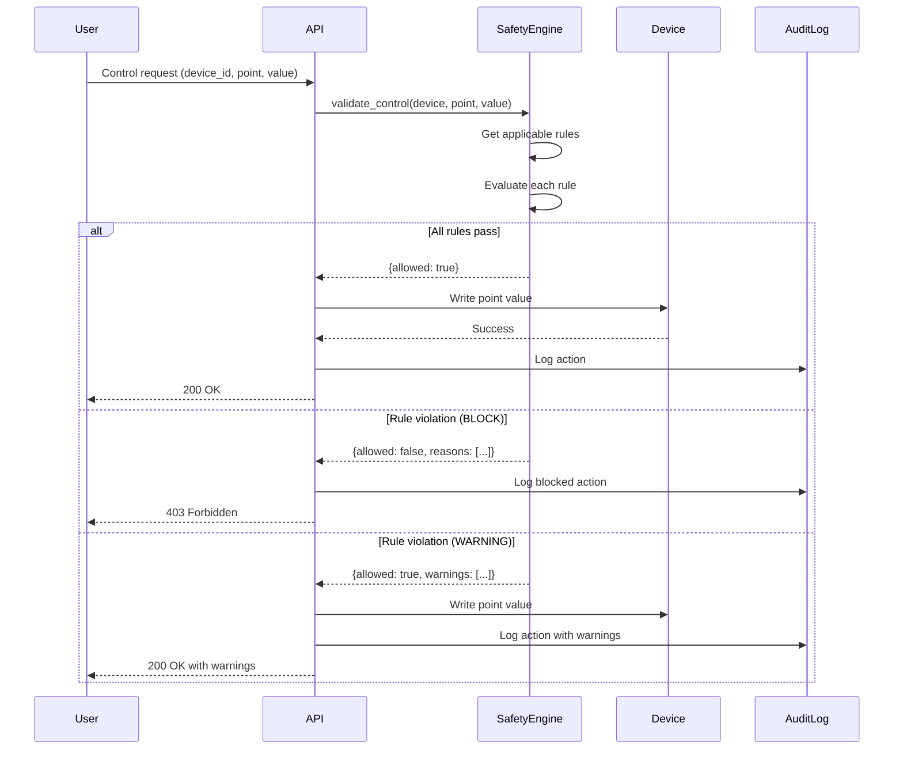
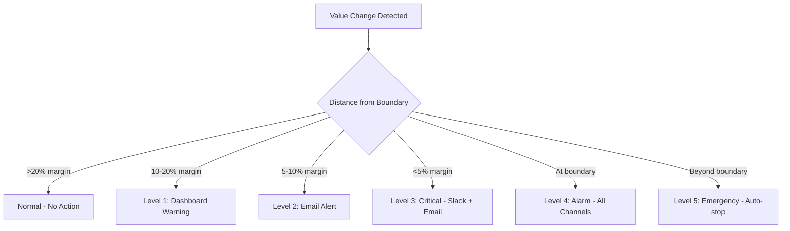

# Safety Interlocks Engine

The Safety Interlocks Engine is a critical component of SENTINEL that validates all device control operations against configurable safety rules before execution. This ensures occupant safety, equipment protection, and regulatory compliance.

## Overview

Every control action in SENTINEL flows through the Safety Engine before reaching physical devices:



## Core concepts

### Severity levels

Safety rules have three severity levels that determine the system's response to violations:

| Severity | Behavior | Use Case |
|----------|----------|----------|
| `WARNING` | Allow operation, show warning | Energy efficiency, minor deviations |
| `BLOCK` | Prevent operation entirely | Equipment damage, safety hazards |
| `ALARM` | Trigger alarm, may allow with override | Critical conditions requiring attention |

### Rule types

SENTINEL supports six rule types, each designed for specific safety scenarios:

#### 1. Temperature range (`temperature_range`)

Validates that temperature setpoints remain within safe bounds.

```json
{
  "id": "temp_zone_safe_range",
  "name": "Zone Temperature Safe Range",
  "rule_type": "temperature_range",
  "severity": "block",
  "description": "Zone temperature setpoints must be within 16-28°C",
  "device_type": "hvac",
  "point_name": "cooling_setpoint",
  "min_temp": 16.0,
  "max_temp": 28.0,
  "unit": "°C"
}
```

**Common applications:**
- Zone comfort temperatures: 16-28°C (occupant comfort)
- Chilled water supply: 5-12°C (equipment protection)
- Data center cooling: 18-27°C (IT equipment)

#### 2. Pressure limit (`pressure_limit`)

Prevents pressure values from exceeding safe operating limits.

```json
{
  "id": "chiller_pressure_max",
  "name": "Chiller Maximum Pressure",
  "rule_type": "pressure_limit",
  "severity": "block",
  "description": "Chiller pressure must not exceed 1200 kPa",
  "device_type": "hvac",
  "point_name": "compressor_pressure",
  "max_pressure": 1200.0,
  "min_pressure": 0.0,
  "unit": "kPa"
}
```

**Common applications:**
- Chiller compressor discharge pressure
- Boiler pressure limits
- Ductwork static pressure

#### 3. Interlock (`interlock`)

Enforces relationships between devices where one device's state affects another's operation.

```json
{
  "id": "fire_alarm_hvac_interlock",
  "name": "Fire Alarm HVAC Interlock",
  "rule_type": "interlock",
  "severity": "block",
  "description": "When fire alarm is active, disable HVAC",
  "device_type": "hvac",
  "trigger_device_id": "001-gwc-fire-001",
  "trigger_point": "fire_alarm_status",
  "trigger_value": true,
  "action": "disable"
}
```

**Common applications:**
- Fire alarm → HVAC shutdown (prevent smoke spread)
- Power failure → Emergency lighting activation
- Chiller fault → Pump shutdown
- Freeze protection → Valve lockout

#### 4. Runtime limit (`runtime_limit`)

Protects equipment from excessive cycling that causes wear.

```json
{
  "id": "chiller_runtime_limit",
  "name": "Chiller Minimum Runtime",
  "rule_type": "runtime_limit",
  "severity": "block",
  "description": "Chiller must run for at least 5 minutes before restart",
  "device_type": "hvac",
  "point_name": "chiller_status",
  "min_runtime_minutes": 5,
  "max_starts_per_hour": 4
}
```

**Common applications:**
- Compressor protection (minimum 5-minute runtime)
- Motor anti-cycling (maximum 4 starts/hour)
- Cooling tower fan sequencing

#### 5. Brightness limit (`brightness_limit`)

Controls lighting levels for energy efficiency and occupant comfort.

```json
{
  "id": "lighting_brightness_max",
  "name": "Maximum Brightness Limit",
  "rule_type": "brightness_limit",
  "severity": "warning",
  "description": "Lighting brightness should not exceed 90%",
  "device_type": "lighting",
  "point_name": "brightness",
  "max_brightness": 90,
  "min_brightness": 0
}
```

**Common applications:**
- Energy savings (cap at 90%)
- Daylight harvesting minimums
- Emergency lighting overrides

#### 6. Custom (`custom`)

Allows arbitrary validation logic for complex scenarios.

```json
{
  "id": "vav_minimum_airflow",
  "name": "VAV Minimum Airflow",
  "rule_type": "custom",
  "severity": "warning",
  "description": "VAV boxes must maintain minimum airflow",
  "device_type": "hvac",
  "point_name": "airflow_setpoint",
  "validation_logic": "value >= 20.0"
}
```

## Architecture

### SafetyEngine class

The `SafetyEngine` is a singleton that manages all safety rules:

```python
from app.services.safety_interlocks import safety_engine

# Initialize with rules from repository/JSON
await safety_engine.initialize()

# Validate a control action
result = await safety_engine.validate_control(
    device=device,
    point_name="cooling_setpoint",
    value=25.0
)

if result["allowed"]:
    # Proceed with control action
    pass
else:
    # Handle blocked action
    for reason in result["reasons"]:
        logger.warning(f"Safety violation: {reason}")
```

### Rule matching

Rules are matched to devices using a hierarchical approach:

1. **Device ID match**: Rule applies to specific device only
2. **Device type match**: Rule applies to all devices of type (hvac, lighting, etc.)
3. **Point name match**: Rule applies to specific point (cooling_setpoint, brightness, etc.)

**Rule precedence:** Specific rules (with `point_name`) override generic rules of the same type.

```python
# Example: Chiller has specific CHW setpoint rule (5-12°C)
# Generic HVAC rule (16-28°C) is excluded to prevent conflicts
applicable_rules = await safety_engine.get_rules_for_device(
    device=chiller_device,
    point_name="chw_setpoint"
)
# Returns only the specific CHW rule, not the generic HVAC rule
```

### Validation result structure

```python
{
    "allowed": True,              # Overall result
    "reasons": [],                # BLOCK violations (empty if allowed)
    "warnings": ["Brightness exceeds 90%"],  # WARNING violations
    "alarms": [],                 # ALARM violations
    "rule_results": [             # Detailed per-rule results
        {
            "allowed": True,
            "severity": "warning",
            "message": "Brightness 95% exceeds maximum (90%)",
            "rule_id": "lighting_brightness_max",
            "rule_name": "Maximum Brightness Limit"
        }
    ],
    "device_id": "001-gwc-lighting-001",
    "point_name": "brightness",
    "value": 95,
    "timestamp": "2026-01-30T10:30:00Z"
}
```

## API reference

### Endpoints

| Method | Endpoint | Description |
|--------|----------|-------------|
| `GET` | `/api/safety/health` | Check safety service health |
| `GET` | `/api/safety/rules` | List all safety rules |
| `GET` | `/api/safety/rules/{rule_id}` | Get specific rule |
| `POST` | `/api/safety/rules` | Create new rule |
| `PUT` | `/api/safety/rules/{rule_id}` | Update rule |
| `DELETE` | `/api/safety/rules/{rule_id}` | Delete rule |
| `PATCH` | `/api/safety/rules/{rule_id}/toggle` | Enable/disable rule |
| `POST` | `/api/safety/validate` | Validate control action |
| `GET` | `/api/safety/devices/{device_id}/status` | Get device safety status |
| `GET` | `/api/safety/devices/{device_id}/applicable-rules` | Get rules for device |

### Validate control action

```bash
curl -X POST http://localhost:9095/api/safety/validate \
  -H "Content-Type: application/json" \
  -d '{
    "device_id": "001-gwc-chiller-001",
    "point_name": "chw_setpoint",
    "value": 7.0
  }'
```

Response (allowed):
```json
{
  "validation": {
    "allowed": true,
    "reasons": [],
    "warnings": [],
    "alarms": [],
    "message": "Safety validation complete"
  },
  "device_id": "001-gwc-chiller-001",
  "point_name": "chw_setpoint",
  "value": 7.0
}
```

Response (blocked):
```json
{
  "validation": {
    "allowed": false,
    "reasons": ["Temperature 3.0°C is outside safe range (5-12°C)"],
    "warnings": [],
    "alarms": [],
    "message": "Safety validation complete"
  },
  "device_id": "001-gwc-chiller-001",
  "point_name": "chw_setpoint",
  "value": 3.0
}
```

### Create safety rule

```bash
curl -X POST http://localhost:9095/api/safety/rules \
  -H "Content-Type: application/json" \
  -d '{
    "id": "custom_temp_rule",
    "name": "Custom Temperature Rule",
    "rule_type": "temperature_range",
    "severity": "block",
    "description": "Custom rule for specific equipment",
    "device_type": "hvac",
    "point_name": "discharge_temp",
    "min_temp": 10.0,
    "max_temp": 35.0,
    "unit": "°C",
    "enabled": true
  }'
```

## Integration with device control

The Device Abstraction Layer automatically integrates with the Safety Engine:

```python
from app.services.device_abstraction import device_manager
from app.services.safety_interlocks import safety_engine

async def control_device_safely(
    device_id: str,
    point: str,
    value: float,
    user: str
) -> dict:
    """Control a device with safety validation."""

    # Get device
    device = await device_manager.get_device(device_id)
    if not device:
        return {"success": False, "error": "Device not found"}

    # Validate against safety rules
    validation = await safety_engine.validate_control(device, point, value)

    if not validation["allowed"]:
        return {
            "success": False,
            "error": "Safety violation",
            "reasons": validation["reasons"]
        }

    # Proceed with control (warnings are logged but don't block)
    if validation["warnings"]:
        logger.warning(f"Control with warnings: {validation['warnings']}")

    # Execute control action
    result = await device_manager.write_point(device_id, point, value)

    return {
        "success": result["success"],
        "warnings": validation["warnings"]
    }
```

## Escalation system

When safety boundaries are approached (not yet violated), the escalation system provides early warning:



### Escalation levels

| Level | Name | Trigger | Notifications |
|-------|------|---------|---------------|
| 1 | INFO | >80% to boundary | Dashboard only |
| 2 | WARNING | >90% to boundary | Dashboard + Email |
| 3 | ALERT | >95% to boundary | Dashboard + Email + Slack |
| 4 | CRITICAL | At boundary | All channels |
| 5 | EMERGENCY | Beyond boundary | All channels + Auto-stop |

### Emergency stop

In critical situations, operators can trigger an immediate emergency stop:

```bash
curl -X POST http://localhost:9095/api/safety/escalation/emergency-stop
```

This will:
1. Stop autonomous mode immediately
2. Restore all devices to safe state values
3. Send emergency notifications to all channels
4. Log the event for compliance audit

## Configuration

### Default rules

SENTINEL ships with sensible default rules in `backend/app/data/safety_rules.json`:

| Rule | Type | Severity | Limits |
|------|------|----------|--------|
| Zone Temperature | temperature_range | block | 16-28°C |
| CHW Supply Temp | temperature_range | block | 5-12°C |
| Chiller Runtime | runtime_limit | block | 5 min, 4 starts/hr |
| Chiller Pressure | pressure_limit | block | 0-1200 kPa |
| Lighting Brightness | brightness_limit | warning | 0-90% |
| Fire Alarm Interlock | interlock | block | Fire → HVAC off |
| Power Failure Lighting | interlock | block | Power fail → Lights on |
| VAV Minimum Airflow | custom | warning | ≥20% |

### Customizing rules

Rules can be customized via API or by editing `safety_rules.json`:

```json
[
  {
    "id": "your_custom_rule_id",
    "name": "Your Custom Rule Name",
    "rule_type": "temperature_range",
    "severity": "block",
    "description": "Description of what this rule protects",
    "device_type": "hvac",
    "device_id": null,
    "point_name": "your_point_name",
    "enabled": true,
    "min_temp": 10.0,
    "max_temp": 30.0,
    "unit": "°C"
  }
]
```

### Rule targeting

Rules can be targeted at different levels:

| Scope | device_type | device_id | point_name | Example Use |
|-------|-------------|-----------|------------|-------------|
| All HVAC | "hvac" | null | null | Generic HVAC limits |
| Specific device type + point | "hvac" | null | "chw_setpoint" | All chillers, specific point |
| Specific device | "hvac" | "001-gwc-chiller-001" | null | One chiller, all points |
| Specific device + point | "hvac" | "001-gwc-chiller-001" | "chw_setpoint" | One point on one device |

## Best practices

### 1. Layer your rules

Create rules at multiple levels for defense in depth:

```json
[
  {
    "id": "generic_hvac_temp",
    "device_type": "hvac",
    "point_name": null,
    "min_temp": 16,
    "max_temp": 28,
    "enabled": false,
    "description": "Generic fallback - disabled when specific rules exist"
  },
  {
    "id": "chiller_chw_setpoint",
    "device_type": "hvac",
    "point_name": "chw_setpoint",
    "min_temp": 5,
    "max_temp": 12,
    "enabled": true,
    "description": "Specific rule for chiller setpoint"
  }
]
```

### 2. Use appropriate severity

- **BLOCK** for safety-critical limits (equipment damage, occupant harm)
- **WARNING** for efficiency recommendations (energy savings)
- **ALARM** for conditions requiring operator attention

### 3. Document your rules

Always include descriptive `description` fields explaining:
- What the rule protects against
- Why the limits were chosen
- Any relevant standards or regulations

### 4. Test before deployment

Use the validation endpoint to test rules before enabling:

```bash
# Test a control action against current rules
curl -X POST http://localhost:9095/api/safety/validate \
  -H "Content-Type: application/json" \
  -d '{"device_id": "test-device", "point_name": "test-point", "value": 25}'
```

### 5. Monitor and adjust

Review safety violations in the audit log to identify:
- Rules that block legitimate operations (too restrictive)
- Rules that should be BLOCK instead of WARNING
- Missing rules for uncovered scenarios

## Troubleshooting

### Rule not being applied

1. Check rule is enabled: `"enabled": true`
2. Verify device_type matches: Compare rule's `device_type` with device's `device_type`
3. Check point_name if specified: Exact match required
4. Look for conflicting specific rules: Specific rules override generic ones

### Validation always fails

1. Check rule limits: Ensure min < max
2. Verify value units: Temperature in °C, pressure in kPa
3. Check for multiple blocking rules: All must pass for action to be allowed

### Emergency stop not working

1. Verify emergency_handler is initialized
2. Check notification service configuration
3. Review audit logs for any errors during emergency handling

## Related documents

- [Device Abstraction Layer](../02-architecture/device-abstraction-layer.md) - How devices integrate with safety
- [MCP Tools Reference](../03-api-reference/mcp-tools-reference.md) - MCP tools with safety validation
- [Audit Logging](./audit-logging.md) - Safety event logging and compliance

## Appendix: Rule schema reference

### Base rule fields (all rule types)

| Field | Type | Required | Description |
|-------|------|----------|-------------|
| `id` | string | Yes | Unique rule identifier |
| `name` | string | Yes | Human-readable name |
| `rule_type` | string | Yes | One of: temperature_range, pressure_limit, interlock, runtime_limit, brightness_limit, custom |
| `severity` | string | Yes | One of: warning, block, alarm |
| `description` | string | No | Detailed description |
| `device_type` | string | No | Device type filter (hvac, lighting, etc.) |
| `device_id` | string | No | Specific device ID filter |
| `point_name` | string | No | Specific point name filter |
| `enabled` | boolean | No | Default: true |
| `metadata` | object | No | Additional rule metadata |

### Temperature range fields

| Field | Type | Required | Default |
|-------|------|----------|---------|
| `min_temp` | float | No | 16.0 |
| `max_temp` | float | No | 28.0 |
| `unit` | string | No | "°C" |

### Pressure limit fields

| Field | Type | Required | Default |
|-------|------|----------|---------|
| `min_pressure` | float | No | 0.0 |
| `max_pressure` | float | No | 100.0 |
| `unit` | string | No | "kPa" |

### Interlock fields

| Field | Type | Required | Default |
|-------|------|----------|---------|
| `trigger_device_id` | string | Yes | - |
| `trigger_point` | string | Yes | - |
| `trigger_value` | any | Yes | - |
| `action` | string | No | "disable" |
| `action_value` | any | No | null |

### Runtime limit fields

| Field | Type | Required | Default |
|-------|------|----------|---------|
| `min_runtime_minutes` | int | No | 5 |
| `max_starts_per_hour` | int | No | 4 |

### Brightness limit fields

| Field | Type | Required | Default |
|-------|------|----------|---------|
| `min_brightness` | int | No | 0 |
| `max_brightness` | int | No | 100 |

### Custom rule fields

| Field | Type | Required | Default |
|-------|------|----------|---------|
| `validation_logic` | string | No | "" |
