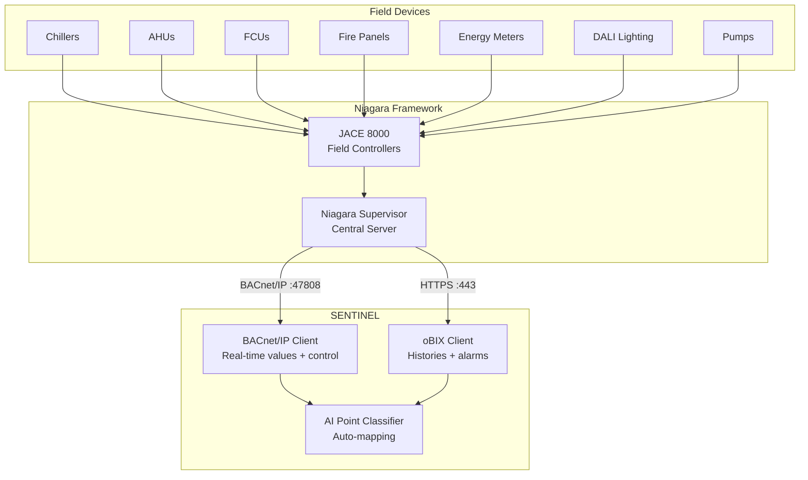
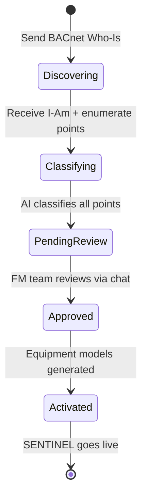
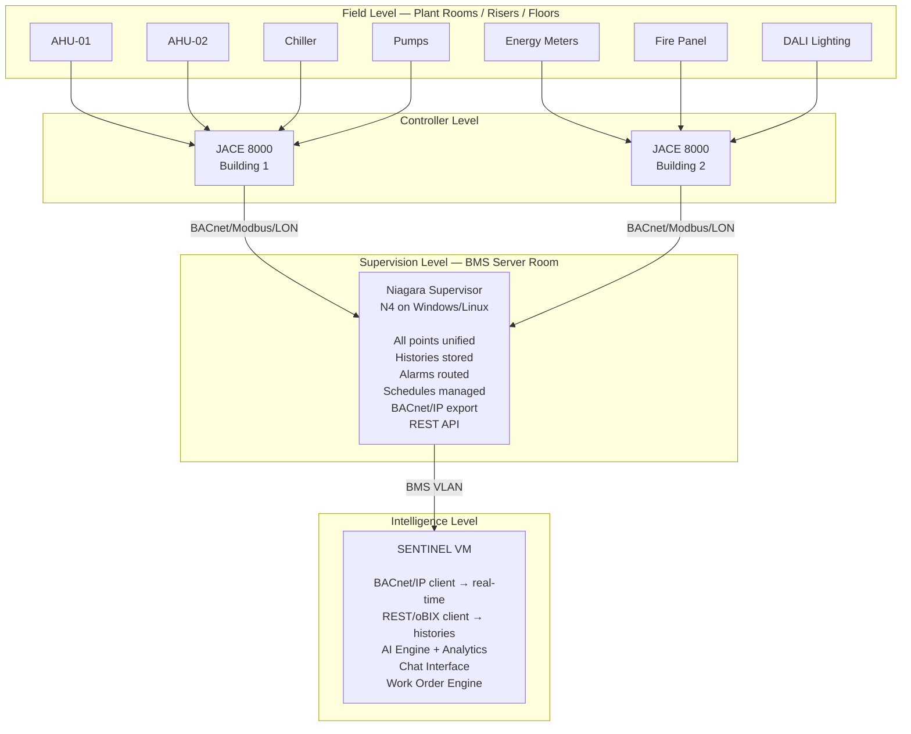

# SENTINEL-Tridium Niagara Integration Guide

Complete integration guide for connecting SENTINEL to Tridium Niagara Framework (JACE 8000 / Supervisor) sites. Covers BACnet/IP real-time data, oBIX historical data and alarms, AI-assisted point discovery, and commissioning workflow.

## Overview

Tridium Niagara is the most widely deployed open integration platform for commercial buildings. It normalises every field protocol (BACnet, Modbus, LonWorks, KNX, DALI) under a single point database, making it the ideal integration target for SENTINEL.

**Key principle:** SENTINEL connects to ONE system (Niagara) instead of dozens of individual devices.



### Why Niagara Sites Are Easy

| What Niagara Already Does | Benefit for SENTINEL |
|---------------------------|---------------------|
| Every device normalised into one point database | Single connection point |
| BACnet, Modbus, LonWorks, KNX, DALI unified | No multi-protocol complexity |
| Every point has a clean address and current value | Direct point discovery |
| History data already being trended | Historical analysis ready |
| Schedules and overrides already work | Schedule management via API |
| Alarm routing already configured | Alarm pipeline accessible |

**Commissioning timeline:**
- Best case (Supervisor with BACnet export): **1-2 days**
- Worst case (older JACEs, no export): **1-2 weeks** (with Niagara engineer)

## Architecture

### Three-Protocol Approach

SENTINEL uses three complementary protocols, each for its strengths:

| Protocol | Library | Port | Use Case | License Required |
|----------|---------|------|----------|-----------------|
| **BACnet/IP** | BAC0 | 47808 | Real-time values, COV subscriptions, control writes | No (built-in) |
| **oBIX** (REST/XML) | requests | 443 | Historical data, alarm history, schedules | Web Services license |
| **Fox over WebSocket** | websockets | 443 | Secure tunnelling (Niagara 4.15+) | No |

**Recommended approach:** BACnet/IP for real-time + oBIX for histories. Fox WebSocket is optional for firewall traversal.

### SENTINEL Service Architecture

```
backend/
├── app/services/niagara/
│   ├── __init__.py               # Package exports
│   ├── bacnet_client.py          # BAC0 wrapper — device discovery, point R/W, COV (~890 lines)
│   ├── bacnet_adapter.py         # DeviceAdapter for BACnet protocol integration
│   ├── obix_client.py            # oBIX API client — histories, alarms, schedules
│   ├── point_discovery.py        # BACnet auto-discovery service (~310 lines)
│   ├── point_classifier.py       # AI-assisted Haystack/Brick classification (~450 lines)
│   └── mapping_service.py        # Point-to-equipment mapping + dual-write (~530 lines)
├── app/models/niagara.py         # Pydantic models (BACnet + oBIX)
├── app/data/niagara/
│   └── haystack_tags.json        # Haystack/Brick ontology tags (16 point types, 12 equipment patterns)
├── app/api/
│   ├── niagara_bacnet.py         # BACnet REST API endpoints (7 endpoints)
│   ├── niagara.py                # oBIX REST API endpoints (5 endpoints)
│   └── niagara_discovery.py      # Discovery & mapping REST API (4 endpoints)
```

### Technology Stack

| Library | Version | Purpose |
|---------|---------|---------|
| **BAC0** | 2025.8.16+ | BACnet/IP client (built on BACpypes3) |
| **BACpypes3** | Latest | BACnet protocol engine (BAC0 dependency) |
| **requests** | Latest | HTTP client for oBIX REST API |
| **websockets** | Latest | Fox over WebSocket (Niagara 4.15+) |
| **pyhaystack** | Latest | Haystack ontology parsing (optional) |

```bash
pip install BAC0==2025.8.16
pip install requests websockets
pip install pyhaystack  # optional, for semantic tagging
```

## Integration Method 1: BACnet/IP

Primary protocol for real-time data and device control. Every JACE and Niagara Supervisor exports points as BACnet objects automatically.

### What You Get via BACnet

- Every point value (read)
- Every writable point (write — setpoints, overrides, commands)
- Alarm subscriptions (COV — Change of Value)
- Trend data (BACnet trending or Niagara history export)
- Schedule objects (read and modify schedules)

### Niagara BACnet Configuration

The Niagara engineer configures BACnet export at:

```
Station → Drivers → BACnetNetwork → LocalDevice
  • Device Instance: 100
  • IP Port: 47808 (default)
  • Object Count: exports all tagged points
```

SENTINEL connects to `<JACE_IP>:47808` and discovers points via BACnet Who-Is / I-Am.

### BAC0 Client Usage

```python
import BAC0

# Initialize BACnet/IP client
bacnet = BAC0.lite(port=47808, ip='localhost')

# Discover devices on network (Who-Is / I-Am)
devices = bacnet.whois()
for device in devices:
    print(f"Found device: {device}")

# Read point list from device
device_id = 1234
object_list = bacnet.read(f'{device_id} objectList')

# Read specific point value
value = bacnet.read(f'{device_id} analogValue,0 presentValue')

# Write to point (Priority 8 = Manual Operator)
bacnet.write(f'{device_id} analogValue,0 presentValue 23.0 - 8')
```

### COV Subscriptions (Real-Time Updates)

BACnet COV (Change of Value) subscriptions push updates when point values change, eliminating the need for polling.

```python
from BAC0.core.devices.cov import COVPointSubscription

def cov_callback(point, value):
    print(f"COV Update: {point} = {value}")
    # Update database, trigger alerts, etc.

# Subscribe to points
cov = COVPointSubscription(
    points=[
        ('192.168.1.100', 'analogValue', 0),
        ('192.168.1.100', 'binaryValue', 1),
    ],
    callback=cov_callback,
    lifetime=60  # seconds — must be renewed before expiry
)
cov.start()
```

**Important:** COV subscriptions have a lifetime and must be renewed before expiry. BAC0 handles this, but verify renewal is working in production.

### Priority Array (Write Operations)

Niagara and BACnet use a 16-level priority array. Higher priority (lower number) wins.

| Priority | Owner | SENTINEL Use |
|----------|-------|-------------|
| 1-2 | Life Safety | Cannot be overridden |
| 3-4 | Emergency | Cannot be overridden |
| 5-6 | Niagara logic | Configurable above/below SENTINEL |
| **8** | **Manual Operator** | **SENTINEL writes here** |
| 16 | Default/Schedule | SENTINEL overrides this |

**Example write operations:**

| Action | BACnet Write |
|--------|-------------|
| Reset chiller fault | `BO:CH01-Reset = 1 @ Priority 8` (auto-releases after 5s) |
| Start AHU fan | `BO:AHU01-SF-CMD = 1 @ Priority 8` |
| Change setpoint | `AV:AHU01-SP = 23.0 @ Priority 8` |
| Override schedule | `AV:AHU01-OCC = 1 @ Priority 8` (auto-expires) |
| Release override | `NULL @ Priority 8` (Niagara resumes schedule) |

**Safety feature:** Niagara's own safety logic at Priority 1-2 always overrides SENTINEL at Priority 8. The Niagara engineer controls what SENTINEL can and cannot touch.

### BACnet/IP Permission Model

Niagara's BACnet export respects its internal permission model:
- Points marked **read-only** in Niagara will reject write commands
- Points marked **writable** accept writes at the specified priority level
- This is a built-in safety feature — the Niagara engineer controls SENTINEL's access

## Integration Method 2: oBIX REST API

Use oBIX for historical data, alarm history, and schedule management. oBIX is Tridium's preferred method for external programmatic access.

### oBIX Endpoint Structure

```
Base URL: https://<JACE_IP>/obix/

Capabilities:
  GET  /obix/config/points/<path>/out/value    → Point values
  POST /obix/config/points/<path>/set          → Set point values
  GET  /obix/histories/<path>                  → Historical data
  GET  /obix/alarms/                           → Alarm history
  GET  /obix/schedules/<path>                  → Schedule objects
```

### Authentication (Niagara 4.9+ Breaking Change)

Niagara 4.9 changed session management. You **must** use `requests.Session()` for proper cookie handling.

```python
import requests
from requests.auth import HTTPBasicAuth

# CORRECT — use Session for cookie handling
session = requests.Session()
login_response = session.post(
    'https://niagara-server/obix/login',
    auth=HTTPBasicAuth('sentinel-service', 'password')
)
# Subsequent requests include session cookie automatically
data = session.get('https://niagara-server/obix/config/points/AHU01/SAT')
```

**Warning sign:** Login returns 200 OK but subsequent requests return 401 Unauthorized. This means session cookies are not being propagated — switch to `requests.Session()`.

### oBIX Client Example

```python
from xml.etree import ElementTree as ET

class ObixClient:
    def __init__(self, base_url, username, password):
        self.base_url = base_url
        self.session = requests.Session()
        self.session.post(
            f"{base_url}/obix/login",
            auth=(username, password)
        )

    def read_point(self, point_path):
        """Read point value via oBIX XML"""
        url = f"{self.base_url}/obix/config/{point_path}"
        response = self.session.get(url)
        root = ET.fromstring(response.content)
        return root.attrib.get('val')

    def read_history(self, history_path, start, end):
        """Read historical trend data"""
        url = f"{self.base_url}/obix/histories/{history_path}"
        response = self.session.get(url, params={
            'start': start,  # ISO 8601
            'end': end
        })
        return self._parse_history_xml(response.content)

    def read_alarms(self, start=None, end=None, limit=100):
        """Read alarm history"""
        url = f"{self.base_url}/obix/alarms/"
        params = {'limit': limit}
        if start: params['start'] = start
        if end: params['end'] = end
        return self.session.get(url, params=params)
```

### When to Use oBIX vs BACnet

| Task | Use BACnet/IP | Use oBIX |
|------|:------------:|:--------:|
| Real-time point values | Yes | - |
| COV subscriptions | Yes | - |
| Control writes | Yes | - |
| Historical trend data | - | Yes |
| Alarm history | - | Yes |
| Schedule management | - | Yes |
| Remote access through firewall | - | Yes |
| Niagara-specific features | - | Yes |

**Best approach:** Use both. BACnet for real-time, oBIX for everything else.

## Integration Method 3: Fox over WebSocket (Niagara 4.15+)

Fox is Niagara's native protocol. Starting with Niagara 4.15 (July 2025), it supports secure WebSocket tunnelling via port 443.

```python
import websockets
import asyncio

async def connect_fox_ws():
    uri = 'wss://niagara-server/foxwss'
    async with websockets.connect(uri) as websocket:
        await websocket.send('fox hello')
        response = await websocket.recv()
        # Subscribe to points...
```

**Status:** Fox over WebSocket is new and the Python implementation is not fully documented. Start with BACnet + oBIX; add Fox when firewall traversal is needed.

**Not recommended:** Fox protocol on port 1911 (proprietary, requires Niagara SDK license).

## Integration Method 4: MQTT (Niagara 4.8+)

Niagara 4.8+ has native MQTT support. Points can publish their values to an MQTT broker.

- Perfect for edge-to-cloud architecture
- SENTINEL can run an MQTT broker (Mosquitto)
- Real-time, lightweight, low bandwidth
- Publish-only by default — configure subscribe for write commands

**Check:** What Niagara version is on the JACEs? If < 4.8, MQTT is not available.

## Point Discovery and Auto-Mapping

SENTINEL's AI-assisted commissioning reduces onboarding from weeks to 1-2 days.

### Discovery Workflow



### Step 1: BACnet Device Discovery

```
Send Who-Is broadcast on BMS VLAN
  → Receive I-Am from Supervisor + each JACE
  → For each device: Read Object List
  → Enumerate every BACnet object (AI, AO, BI, BO, MSV, etc.)
  → Store in SENTINEL point database
```

### Step 2: AI-Assisted Point Classification

SENTINEL's AI reads point names and descriptions, classifying them using Haystack/Brick ontology tags:

| BACnet Object Name | SENTINEL Classification |
|-------------------|------------------------|
| `FAIR-AHU01-SAT` | HVAC > AHU > Supply Air Temp |
| `FAIR-AHU01-RAT` | HVAC > AHU > Return Air Temp |
| `FAIR-AHU01-SF-CMD` | HVAC > AHU > Supply Fan Command |
| `FAIR-AHU01-SF-STS` | HVAC > AHU > Supply Fan Status |
| `FAIR-AHU01-CLG-VLV` | HVAC > AHU > Cooling Valve Position |
| `FAIR-CH01-FAULT` | HVAC > Chiller > Fault |
| `FAIR-CH01-RUN` | HVAC > Chiller > Run Status |
| `FAIR-FZ12-ALM` | Fire > Zone 12 > Alarm |
| `FAIR-MSB01-KW` | Energy > Main Board > Power (kW) |
| `FAIR-WM01-FLOW` | Water > Meter 01 > Flow Rate |

Classification uses:
- **Haystack/Brick ontology tags** for semantic matching
- **Equipment type patterns** (regex for chiller, AHU, FCU, VAV, etc.)
- **Point type inference** (sensor, setpoint, command, status)
- **Confidence scoring** (high = exact match, medium = partial, low = guessed)

### Step 3: Auto-Generate Equipment Models

Related points are grouped into equipment objects:

```
AHU-01 = {supply temp, return temp, fan cmd, fan sts,
           cooling valve, filter DP, setpoint, schedule}

Chiller-01 = {run, fault, supply temp, return temp,
              power, runtime hours}

Fire Zone 12 = {alarm, fault, disabled, detector count}
```

### Step 4: FM Team Review via Chat

SENTINEL presents discovered equipment to the FM team:

> "I found 12 AHUs, 2 chillers, 64 fire zones, 8 energy meters. Here's what I've classified. Please review and correct any misidentified equipment."

Review happens via SENTINEL chat (or Telegram/WhatsApp). The team confirms or corrects, then the system goes live.

### Chat Tools for Discovery

| Tool | Purpose |
|------|---------|
| `discover_niagara_points(device_ip)` | Trigger point discovery |
| `review_point_mapping(mapping_id)` | Get mapping summary |
| `approve_point_mapping(mapping_id)` | Approve and activate |
| `correct_point_classification(point_id, type)` | Manual correction |

## API Endpoints

### BACnet Operations (`/api/niagara/bacnet/`)

| Method | Endpoint | Description |
|--------|----------|-------------|
| POST | `/api/niagara/bacnet/discover` | Discover BACnet devices on network |
| GET | `/api/niagara/bacnet/devices/{id}/points` | Discover all points on device |
| GET | `/api/niagara/bacnet/devices/{id}/points/{type}/{instance}` | Read point value |
| POST | `/api/niagara/bacnet/devices/{id}/points/{type}/{instance}/write` | Write point value with priority |
| POST | `/api/niagara/bacnet/subscribe` | Create COV subscription |
| GET | `/api/niagara/bacnet/subscriptions` | List active COV subscriptions |
| DELETE | `/api/niagara/bacnet/subscribe/{id}` | Cancel subscription |
| GET | `/api/niagara/bacnet/status` | BACnet client status check |

### oBIX Operations (`/api/niagara/obix/`)

| Method | Endpoint | Description |
|--------|----------|-------------|
| POST | `/api/niagara/obix/config` | Configure oBIX connection |
| GET | `/api/niagara/obix/points/{point_path:path}` | Read point via oBIX |
| GET | `/api/niagara/obix/history` | Get historical data (query: point_path, start, end) |
| GET | `/api/niagara/obix/alarms` | Get alarm history (query: start, end, severity, limit) |
| GET | `/api/niagara/obix/status` | Check oBIX connection status |

### Discovery & Mapping

| Method | Endpoint | Description |
|--------|----------|-------------|
| POST | `/api/niagara/discover-and-classify` | Trigger full discovery + AI classification |
| GET | `/api/niagara/mappings/{id}` | Get mapping summary |
| POST | `/api/niagara/mappings/{id}/approve` | Activate mapping |
| POST | `/api/niagara/mappings/{id}/correct` | Manual correction |

## Site Prerequisites

Before SENTINEL can connect, the Niagara engineer must enable/configure the following (typically a 2-4 hour task):

### 1. BACnet/IP Export

- [ ] Enable BACnet server on Supervisor (or each JACE)
- [ ] Assign BACnet Device Instance ID
- [ ] Confirm port 47808 accessible on BMS VLAN
- [ ] Tag/export all relevant points to BACnet
- [ ] Set writable points to appropriate priority
- [ ] Enable COV subscriptions

### 2. Point Naming Convention

Ideal format: `Building-System-Equipment-Point`

```
FAIR-HVAC-AHU01-SupplyTemp
FAIR-FIRE-ZN12-AlarmStatus
FAIR-ELEC-MSB01-kWh
```

If naming is messy (often is), SENTINEL's AI classifier can map them. But clean names = faster commissioning.

### 3. Network Access

- [ ] SENTINEL VM needs IP access to Niagara Supervisor
- [ ] Either: same VLAN with firewall rules
- [ ] Or: routed access (TCP 47808 for BACnet + TCP 443 for REST/oBIX)
- [ ] Static IP for SENTINEL VM
- [ ] Static IP for Niagara Supervisor

### 4. Service Account

- [ ] Create dedicated Niagara user: `sentinel-service`
- [ ] Role: Operator (read + limited write)
- [ ] NOT admin — principle of least privilege
- [ ] Strong password stored in SENTINEL vault
- [ ] Used for oBIX REST API authentication

### 5. History Configuration

- [ ] Confirm critical points have histories enabled
- [ ] Temperature points: 5-15 minute intervals
- [ ] Energy meters: 1 minute intervals
- [ ] Binary status: COV-based (on/off, alarm/normal)
- [ ] History retention: at least 90 days on Niagara (SENTINEL keeps its own long-term copy)

### 6. Alarm Pipeline

Preferred: BACnet COV subscription + REST API backup

Options:
- **Option A:** SENTINEL reads alarms via BACnet events
- **Option B:** Niagara emails alarms, SENTINEL parses
- **Option C:** REST API alarm query (poll every 30s)
- **Option D:** MQTT publish on alarm (if Niagara 4.8+)

## Configuration

### Environment Variables

```bash
# BACnet/IP
NIAGARA_BACNET_PORT=47808          # BACnet/IP port (default)
NIAGARA_BACNET_LOCAL_IP=auto       # Local IP for BAC0

# oBIX REST API
NIAGARA_OBIX_HOST=192.168.1.100   # Niagara Supervisor IP
NIAGARA_OBIX_PORT=443             # HTTPS port
NIAGARA_OBIX_USERNAME=sentinel-service
NIAGARA_OBIX_PASSWORD=<secure>
NIAGARA_OBIX_HTTPS=true           # Use HTTPS (recommended)

# Fox WebSocket (optional, N4.15+)
NIAGARA_FOX_WS_ENABLED=false
NIAGARA_FOX_WS_URL=wss://192.168.1.100/foxwss
```

## Common Pitfalls

### 1. Niagara 4.9+ Authentication Breaking Change

**Problem:** Login returns 200 OK but subsequent requests return 401 Unauthorized.

**Cause:** Tridium changed session management in Niagara 4.9. Session ID cookie is no longer in the first `Set-Cookie` header.

**Fix:** Use `requests.Session()` to handle cookies automatically.

### 2. COV Subscription Timeouts

**Problem:** COV subscriptions stop receiving updates after a few minutes.

**Cause:** Subscriptions have a configurable lifetime and must be renewed before expiry.

**Fix:** Set lifetime, renew at ~80% of interval. BAC0's `COVPointSubscription` handles this with the `lifetime` parameter.

### 3. Priority Array Conflicts

**Problem:** Write commands succeed but values don't change.

**Cause:** Another system is writing at a higher priority level (lower number).

**Fix:** Check priority array before writing. SENTINEL writes at Priority 8; ensure no competing writes at Priority 1-7.

### 4. Point Discovery Timeout on Large Systems

**Problem:** Discovery hangs or takes hours on JACEs with 1000+ points.

**Cause:** Enumerating all BACnet objects serially is slow.

**Fix:** Filter by object type (AI, AO, BI, BO), discover incrementally per device, cache results.

### 5. oBIX XML Parsing Errors

**Problem:** `ParseError` exceptions when reading oBIX responses.

**Cause:** oBIX uses specific XML schema with namespaces and contracts.

**Fix:** Use oBIX-aware parsing, handle the `http://obix.org/ns/1.1` namespace, validate XML before parsing.

## Discovery Questions for New Sites

Before connecting to a client's Niagara installation, gather this information:

### Platform

- [ ] What Niagara version? (4.x? Specifically 4.8+ for MQTT, 4.15+ for Fox WebSocket)
- [ ] JACE 8000 or older JACE 600/700?
- [ ] Is there a central Supervisor or standalone JACEs only?
- [ ] How many JACEs across the portfolio?
- [ ] Who is the Niagara integrator / maintenance contractor?
- [ ] Do they have an active Niagara license (for changes)?

### Points

- [ ] Approximately how many points per building?
- [ ] What subsystems are on Niagara? (HVAC, fire, lighting, meters?)
- [ ] Is the fire panel integrated or standalone?
- [ ] Are energy meters on Niagara or separate?
- [ ] Any DALI lighting integration on Niagara already?
- [ ] Are schedules managed in Niagara?

### Network

- [ ] Is there a dedicated BMS VLAN?
- [ ] Can we get a static IP for SENTINEL on that VLAN?
- [ ] Is BACnet/IP already enabled on the Supervisor?
- [ ] Is the REST API accessible (port 443)?
- [ ] Any VPN/firewall between buildings?

### Remote Access

- [ ] Can the Niagara Supervisor be accessed remotely today?
- [ ] Is there a Niagara Cloud connection (Niagara Cloud Connector)?
- [ ] Does the FM team use the Niagara web UI currently?

### Data

- [ ] Are trend histories enabled on critical points?
- [ ] How much history data is stored? (days/months)
- [ ] Are alarms configured and routed? (email? SMS?)
- [ ] Can we get a point export / CSV of all points?

**The answers determine go-live speed:**
- Best case (Supervisor + BACnet export): 1-2 days
- Worst case (old JACEs, no export): 1-2 weeks with Niagara engineer

## Typical Site Architecture



## Competitive Advantage

### vs. Niagara Web UI Alone

| Capability | Niagara UI | SENTINEL |
|-----------|:----------:|:--------:|
| Point values and graphics | Yes | Yes |
| AI diagnostics ("why is it hot?") | No | Yes |
| WhatsApp/Telegram interface | No | Yes |
| Cross-building portfolio analytics | Limited | Yes |
| Predictive maintenance (ML) | No | Yes |
| Compliance tracking | No | Yes |
| Requires BMS training | Yes | No |
| Natural language queries | No | Yes |

### vs. Building Analytics Platforms (Bueno, CopperTree, SkySpark)

| Capability | Analytics Platforms | SENTINEL |
|-----------|:------------------:|:--------:|
| Analytics dashboards | Yes | Yes |
| Remote control | No (read-only) | Yes |
| Conversational AI interface | No | Yes |
| Work order integration | Limited | Yes |
| Per-point licensing cost | Yes (expensive) | No |

### The Pitch

> "You already invested in Tridium Niagara. That was smart — it normalised your building data. Now SENTINEL sits on top and makes that data actually useful to your FM team, without them needing to open a single Niagara graphic or understand a BACnet address. They just ask questions on WhatsApp."

## Implementation Status

Phase 60 (Tridium Niagara Integration) is **COMPLETE** in v13.0:

| Plan | Description | Wave | Status | Tests |
|------|-------------|------|--------|-------|
| 60-01 | BACnet/IP client (BAC0 wrapper, DeviceAdapter) | Wave 1 | ✅ Complete | 95 |
| 60-02 | oBIX REST API (session auth, XML parsing) | Wave 1 | ✅ Complete | 26 |
| 60-03 | AI-assisted point discovery and auto-mapping | Wave 2 | ✅ Complete | 58 |

**Total: 179 tests, 16 new files, 3 API routers (16 endpoints)**

Completed: 2026-02-04

## References

### Primary Sources

- [BAC0 Documentation](https://bac0.readthedocs.io/en/latest/) — Core BACnet/IP library
- [BAC0 COV Documentation](https://bac0.readthedocs.io/en/latest/cov.html) — Change of Value subscriptions
- [Niagara 4.15 Fox over WebSocket](https://www.tridium.com/us/en/services-support/events/2025/07/2025-07-17-fox-over-websocket) — Official feature announcement
- [Niagara Framework & AI (Tridium 2025)](https://www.tridium.com/content/dam/tridium/en/documents/document-lists/2025-0013-Journey-to-AI-1.pdf)
- [Niagara Cloud Suite APIs (2025)](https://www.tridium.com/content/dam/tridium/en/documents/niagara-forum-2025/developer/tri-NF25_Developer_Getting_Started_with_Niagara_Cloud_APIs.pdf)

### Secondary Sources

- [Python oBIX Tutorial](https://www.cnblogs.com/IUpdatable/p/14052867.html) — Working Python oBIX example
- [NiagaraAX BACnet Guide](https://www.cochranesupply.com/media/assets/product/documents/Tridium/docBacnet.pdf) — BACnet configuration
- [BAC0 on GitHub](https://github.com/ChristianTremblay/BAC0) — Source code and examples

---

*Phase: 60-niagara-integration*
*Document version: 2.0.0*
*Completed: 2026-02-04*
