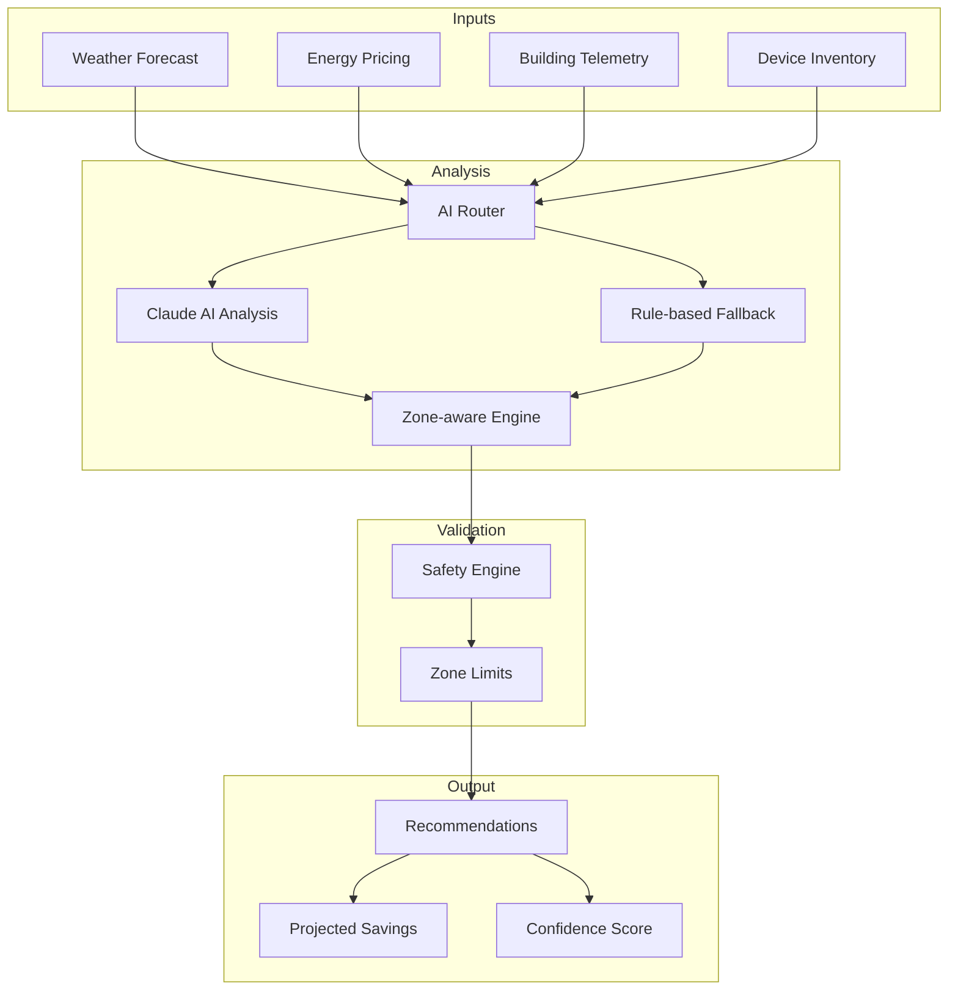

# AI Recommendation System

SENTINEL's AI Recommendation System analyzes building telemetry, weather forecasts, and energy pricing to generate optimal HVAC setpoint recommendations. The system combines Claude AI analysis with rule-based fallbacks and zone-aware optimization for intelligent, context-aware recommendations.

**🎯 Key Feature:** Recommendations are generated **automatically every 10 minutes** without manual intervention. See [Background Recommendation Generation](./background-recommendation-generation.md) for the autonomous scheduling system.

## Overview



## Architecture

### Backend Components

| Component | File | Responsibility |
|-----------|------|----------------|
| **Optimization API** | `backend/app/api/ai_recommendations.py` | REST endpoints for optimization |
| **AI Optimizer Service** | `backend/app/services/ai_optimizer.py` | Core recommendation logic |
| **Claude Service** | `backend/app/services/claude_service.py` | AI analysis integration |
| **Safety Engine** | `backend/app/services/safety_interlocks.py` | Validation |
| **M&V Verification** | `backend/app/services/mv_verification_service.py` | Post-action outcome tracking |
| **Recommendation Scorer** | `backend/app/services/recommendation_scorer.py` | Multi-objective scoring |

### Frontend Components

| Component | File | Responsibility |
|-----------|------|----------------|
| **Optimization Page** | `frontend/src/pages/OptimizationPage.tsx` | Full-page optimization view |
| **Optimization Panel** | `frontend/src/components/OptimizationPanel.tsx` | Three-column layout |
| **Recommendation Modal** | `frontend/src/components/OptimizationRecommendationModal.tsx` | Approval dialog |

---

## Zone-Aware Optimization

### Zone Classification

The system classifies zones by **type**, **priority**, and **exposure** for intelligent recommendations:

#### Zone Types

```python
class ZoneType(Enum):
    EXECUTIVE = "executive"          # Executive offices
    SERVER_ROOM = "server_room"      # Data centers
    MEETING_ROOM = "meeting_room"    # Conference rooms
    BANKING_HALL = "banking_hall"    # Customer areas
    OPEN_OFFICE = "open_office"      # General office
    LOBBY = "lobby"                  # Entrance areas
    PLANT_ROOM = "plant_room"        # Equipment areas
    PARKING = "parking"              # Parking garages
```

#### Zone Priorities

```
P1 (Critical)   → Executive, Server Rooms - Tightest comfort bands, never sacrifice cooling
P2 (High)       → Meeting Rooms - Pre-conditioning before scheduled meetings
P3 (Medium)     → Banking Hall, Lobby - Standard comfort range
P4 (Low)        → Open Office - Can accept wider temperature range
P5 (Lowest)     → Parking, Plant Rooms - Aggressive optimization for energy savings
```

#### Exposure Directions (Southern Hemisphere)

In South Africa, the sun tracks through the **northern** sky. North-facing zones receive maximum direct solar radiation.

```
North-facing → +1.5°C modifier (max solar gain, sun in north sky in SA)
West-facing  → +1.0°C modifier (afternoon heat, 14:00-18:00)
East-facing  → +1.0°C modifier (morning heat, 06:00-10:00)
South-facing → +0.3°C modifier (minimal direct sun, diffuse/reflected only)
Interior     → -0.5°C modifier (less cooling needed)
```

> **Note:** Modifiers only apply when outdoor temp > 25°C and are time-of-day dependent.

### Zone-Specific Setpoint Limits

| Zone Type | Min Temp | Max Temp | Optimization Strategy |
|-----------|----------|----------|-----------------------|
| Server Room | 18°C | 22°C | No optimization (critical cooling) |
| Executive | 21°C | 23°C | Conservative (×0.5 adjustment) |
| Banking Hall | 20°C | 24°C | Standard |
| Meeting Room | 20°C | 24°C | Pre-conditioning enabled |
| Open Office | 20°C | 26°C | Moderate |
| Lobby | 20°C | 26°C | Moderate |
| Plant Room | 16°C | 30°C | Aggressive (×1.5 adjustment) |
| Parking | 10°C | 35°C | Very aggressive |

### Floor Level Adjustments

```
Top floor (FL3+)  → ×1.2 adjustment (roof heat gain = occupants more tolerant, optimize aggressively)
Ground floor      → ×0.9 adjustment (entry infiltration)
Basement (B1)     → ×1.0 adjustment (stable temperature)
```

> **Rationale:** Top floors are already warmer due to roof heat gain. Occupants acclimate to the slightly higher baseline, allowing more aggressive setpoint increases for energy savings.

---

## Recommendation Types

### 1. Zone Temperature Optimization

Adjusts cooling setpoints based on outdoor temperature and zone type:

```python
# Rule: If outdoor > indoor + 3°C, increase cooling setpoint
if temp_diff > 3.0 and indoor_temp < 24.0:
    # Apply zone-aware adjustment to base 1.5°C increase
    adjusted_change = apply_zone_aware_adjustments(device, 1.5, outdoor_temp)

    # Example results:
    # Executive zone:   1.5 × 0.5 = 0.75°C increase (conservative)
    # Open office zone: 1.5 × 1.0 = 1.5°C increase (standard)
    # Plant room:       1.5 × 1.5 = 2.25°C increase (aggressive)
```

### 2. CHW Temperature Optimization

Optimizes chilled water supply temperature for chiller efficiency:

```python
# Rule: If outdoor temp > 28°C, raise CHW setpoint
if outdoor_temp > 28.0:
    # Base increase: 1.5°C (max 9°C to maintain comfort)
    new_chw_temp = min(current_chw_temp + 1.5, 9.0)

    # Result: 7.0°C → 8.5°C for better chiller efficiency
```

### 3. Humidity Optimization

Reduces dehumidification energy when outdoor humidity drops. Includes seasonal guard for South African wet/dry seasons:

```python
# Seasonal guard: SA wet season (Oct-Mar) has high ambient humidity
is_wet_season = current_month in (10, 11, 12, 1, 2, 3)
humidity_threshold = 40.0 if is_wet_season else 50.0  # More conservative in wet season
humidity_cap = 55.0 if is_wet_season else 60.0

# Rule: If humidity < threshold, allow humidity to rise
if humidity < humidity_threshold:
    new_humidity = min(current_humidity + 3.0, humidity_cap)

    # Dry season: 55% → 58% RH (reduces dehumidification load)
    # Wet season: Only triggers below 40%, caps at 55% (prevents mold risk)
```

> **Why seasonal guard?** In Gauteng's humid summers (Oct-Mar), outdoor humidity is already high. Raising the humidity setpoint risks condensation and mold growth. The guard tightens the threshold to 40% and caps at 55% during wet months.

### 4. Fan Speed Optimization

Reduces fan speed when temperature differential is moderate:

```python
# Rule: If temp_diff < 5°C and not executive zone
if temp_diff < 5.0 and zone_type not in [EXECUTIVE, SERVER_ROOM]:
    new_fan_speed = max(current_fan_speed - 10.0, 50.0)

    # Result: 75% → 65% (energy savings while maintaining comfort)
```

---

## AI Analysis Flow

### Claude AI Mode

When Claude API is available, the system generates natural language recommendations:

```python
prompt = f"""You are an expert HVAC optimization engineer. Analyze:

Building: {site['name']} ({site['type']}, {site['sqm']} sqm)
Current: Indoor {indoor_temp}°C, Outdoor {outdoor_temp}°C, Humidity {humidity}%
Weather: {weather_forecast}
Pricing: {energy_prices}
Equipment: {hvac_devices}

Zone-Aware Rules:
- Executive/Server (P1): Maintain tightest comfort, never sacrifice cooling
- South/West-facing: Account for afternoon solar gain (+1-2°C)
- Top floor: Roof heat gain requires lower setpoints
- Load shedding: Prioritize by zone_priority (P1=critical, P5=lowest)

Building Constraints (SAFETY LIMITS):
- CHW temperature: 5-15°C
- Zone temperature: 20-26°C
- Executive zones: 21-23°C
- Server rooms: 18-22°C
- Humidity: 30-65% RH

Provide JSON response with recommendations, projected savings, confidence, reasoning.
"""

response = await claude_service.stream_response([{"role": "user", "content": prompt}])
```

### Rule-Based Fallback

When Claude is unavailable, rule-based optimization provides consistent recommendations:

```python
def _analyze_with_rules(site_id, conditions, weather, prices, devices):
    recommendations = []

    # Rule 1: Zone temperature optimization (zone-aware)
    if temp_diff > 3.0:
        for zone_controller in zone_controllers:
            zone_type = get_zone_type(zone_controller)
            if should_skip_optimization(zone_controller, zone_type):
                continue  # Skip server rooms, critical zones

            adjusted_change = apply_zone_aware_adjustments(
                zone_controller, 1.5, outdoor_temp
            )

            _, max_temp = get_zone_specific_limits(zone_controller, zone_type)
            new_setpoint = min(current_value + adjusted_change, max_temp)

            recommendations.append({
                "equipment_id": zone_controller.id,
                "point_name": "zone_cooling_setpoint",
                "current_value": current_value,
                "recommended_value": round(new_setpoint, 1),
                "reason": f"Increase {adjusted_change:.1f}°C ({zone_type} zone) as outdoor temp rising to {outdoor_temp}°C"
            })

    # Rule 2-4: Humidity, CHW, Fan speed optimizations...
    # [Additional rules]

    # Sort by zone priority (critical zones first)
    recommendations = sort_by_priority(recommendations, devices)

    return OptimizationRecommendation(
        site_id=site_id,
        timestamp=datetime.now().isoformat(),
        recommendations=recommendations,
        projected_savings=calculate_savings(recommendations, prices),
        confidence=max(0.1, 0.7 + (0.05 * len(recs)) - data_quality_penalty),
        reasoning=generate_reasoning(recommendations),
        data_quality={"sources": data_sources, "penalty_applied": penalty},
    )
```

---

## Data Quality & Confidence Scoring

### Sensor-Health Confidence Penalty

When sensor data falls back to hardcoded defaults (22°C indoor, 28°C outdoor, 55% humidity), the system penalizes confidence to prevent acting on assumed data:

| Data Source | Penalty if Defaulted | Rationale |
|-------------|---------------------|-----------|
| Indoor temp | -0.08 | Most critical — wrong temp = wrong setpoint |
| Outdoor temp | -0.06 | Drives rule triggers (temp_diff > 3°C) |
| Occupancy (DALI) | -0.05 | Affects lighting + unoccupied zone rules |
| Humidity | -0.03 | Affects humidity rule only |
| Solar PV | -0.02 | Affects BESS charging decisions |
| BESS | -0.01 | Affects BESS dispatch only |
| **Max total** | **-0.25** | All defaults → confidence 0.7 drops to 0.45 |

Each reading is tracked as `"live"` (from sensor) or `"default"` (hardcoded fallback). The penalty is included in the response `data_quality` field:

```json
{
  "data_quality": {
    "sources": {
      "indoor_temp": "live",
      "outdoor_temp": "default",
      "humidity": "default",
      "occupancy": "live",
      "solar": "unavailable",
      "bess": "unavailable"
    },
    "penalty_applied": 0.12
  }
}
```

### Confidence-Based Tier Routing (Phase 82)

Recommendations are routed to action tiers based on their effective confidence
score and the site's control tier setting. This routing is implemented by
`OptimizationTierRouter` in `backend/app/services/optimization_tier_router.py`.

#### Routing Thresholds

| Confidence | Tier | Enum Value | Behavior |
|------------|------|------------|----------|
| < 0.30 | Blocked | `blocked` | Rejected entirely. Cannot be approved. |
| 0.30 - 0.60 | Advisory (Tier 1) | `tier1_advisory` | Display only, informational. |
| 0.60 - 0.85 | Approval (Tier 2) | `tier2_approval` | Requires human approval before execution. |
| >= 0.85 | Auto-Execute (Tier 3) | `tier3_auto_execute` | Auto-applied when safety passes (in auto_execute mode). |

Thresholds are configurable via environment variables:
- `OPTIMIZATION_TIER_BLOCK_MIN` (default: 0.30)
- `OPTIMIZATION_TIER2_MIN` (default: 0.60)
- `OPTIMIZATION_TIER3_MIN` (default: 0.85)

#### FCU Confidence Cap

FCU (Fan Coil Unit) recommendations have their confidence capped at 0.45
(`OPTIMIZATION_FCU_CONFIDENCE_CAP`), regardless of the model's raw confidence.
This forces all FCU recommendations to tier1_advisory at most, preventing
automatic execution of FCU setpoint changes which carry higher comfort risk.

Example: A model reports 0.92 confidence for an FCU recommendation. The
effective confidence becomes `min(0.92, 0.45) = 0.45`, routing it to
tier1_advisory instead of tier3_auto_execute.

#### Control Tier Execution Matrix

The final action for each recommendation depends on both its routing tier
and the site's control tier:

| Routing Tier | monitor | human_in_loop | auto_execute |
|---|---|---|---|
| Blocked | blocked | blocked | blocked |
| Tier 1 (Advisory) | log_only | advisory | advisory |
| Tier 2 (Approval) | log_only | pending_approval | pending_approval |
| Tier 3 (Auto-Execute) | log_only | pending_approval | auto_execute |

- **monitor**: All recommendations logged but no actions taken.
- **human_in_loop**: Tier 2/3 require approval; Tier 1 is advisory-only.
- **auto_execute**: Tier 3 auto-applies; Tier 2 requires approval; Tier 1 is advisory.

#### M&V Routing Metadata

When M&V verification tasks are created for executed recommendations, they
include routing metadata fields:

| Field | Type | Description |
|-------|------|-------------|
| `routing_tier` | string | The routing tier that was applied (e.g., `tier3_auto_execute`) |
| `control_tier` | string | The site's control tier at execution time |
| `effective_confidence` | float | The confidence score after caps (e.g., FCU cap) |

This metadata allows M&V analysis to correlate prediction accuracy with
routing tier decisions over time.

---

## Measurement & Verification (M&V)

### Overview

After recommendations are applied (auto or approved), the M&V service tracks whether predicted savings match actual energy consumption:

```
Recommendation Applied → Record Verification Task → Wait Measurement Window → Verify → Outcome
```

### Measurement Windows

| System | Window | Rationale |
|--------|--------|-----------|
| Lighting (DALI) | 30 min | Immediate effect |
| BESS dispatch | 15 min | Immediate power effect |
| HVAC setpoint | 2 hours | Thermal response time |
| Chiller CHW temp | 3 hours | Thermal inertia |
| Power equipment | 1 hour | Moderate response |

### Variance Thresholds

| Threshold | Value | Action |
|-----------|-------|--------|
| Warning | >10% variance | Logged, flagged for review |
| Rollback | >25% variance | Rollback recommended |
| Comfort violation | >1.5°C drift from setpoint | Rollback recommended |

### API Endpoints

```bash
# Get M&V verification summary for a site
GET /api/optimization/mv/summary/{site_id}

# Trigger pending verifications (call periodically)
POST /api/optimization/mv/verify
```

### Files

| File | Purpose |
|------|---------|
| `backend/app/services/mv_verification_service.py` | Core M&V service |
| `backend/app/models/outcome.py` | Outcome model (predicted vs actual) |
| `backend/app/data/mv_verifications.json` | Verification task storage |

---

## Monthly Savings Projection

### Schedule-Aware Calculation

Savings projections use actual weekday counts and TOU-weighted rates instead of a static 220h/month:

```python
# Actual weekdays in the month (varies: Feb=20, Jul=23)
weekdays = count_weekdays(year, month)

# Operating hours: 07:00-17:00 (10h/day)
# Peak window:     07:00-10:00 (3h/day, R3.50/kWh)
# Standard window: 10:00-17:00 (7h/day, R2.50/kWh)

total_hours = weekdays * 10
weighted_rate = (peak_hours * 3.50 + standard_hours * 2.50) / total_hours
# → R2.80/kWh weighted average

monthly_savings = savings_per_hour * total_hours
```

| Month | Weekdays | Operating Hours | vs Static 220h |
|-------|----------|-----------------|-----------------|
| Jan 2026 | 22 | 220h | Same |
| Feb 2026 | 20 | 200h | -9% (static overestimates) |
| Jul 2026 | 23 | 230h | +5% (static underestimates) |

---

## Load Shedding Mode

### Priority-Based Optimization

During load shedding, the system applies zone-priority filtering:

```python
def analyze_load_shedding(site_id, stage, current_conditions):
    # Get normal recommendations first
    recommendation = await analyze_building(site_id, current_conditions)

    # Priority threshold by stage
    priority_threshold = {
        1: 4,  # Keep P1-P4, shed P5
        2: 3,  # Keep P1-P3, shed P4-P5
        3: 2,  # Keep P1-P2, shed P3-P5
        4: 1,  # Keep P1 only, shed P2-P5
    }

    max_priority = priority_threshold.get(stage, 3)

    # Filter recommendations based on priority
    filtered_recs = []
    for rec in recommendation.recommendations:
        device = get_device(rec["equipment_id"])
        zone_priority = get_zone_priority(device)

        if zone_priority <= max_priority:
            # Maintain normal comfort
            filtered_recs.append(rec)
        else:
            # More aggressive optimization (double the change)
            modified_rec = rec.copy()
            current = rec["current_value"]
            recommended = rec["recommended_value"]
            change = recommended - current
            modified_rec["recommended_value"] = round(current + (change * 2), 1)
            modified_rec["reason"] = f"[LOAD SHEDDING Stage {stage}] " + rec["reason"]
            filtered_recs.append(modified_rec)

    # Adjust savings (more aggressive = more savings)
    savings_multiplier = 1.0 + (stage * 0.2)  # 1.2x to 1.8x

    return OptimizationRecommendation(
        recommendations=filtered_recs,
        projected_savings=apply_multiplier(recommendation.savings, savings_multiplier),
        reasoning=f"Stage {stage}: Maintaining P1-P{max_priority}. Aggressive on P{max_priority+1}-P5."
    )
```

---

## API Endpoints

### Analyze Building

```bash
POST /api/optimization/analyze
Content-Type: application/json

{
  "site_id": "site-002",
  "current_conditions": {
    "indoor_temp": 22.0,
    "outdoor_temp": 28.0,
    "humidity": 55.0
  },
  "weather_forecast": {
    "high_temp": 32.0,
    "solar_load": 0.7
  },
  "energy_prices": {
    "current_rate": 2.50,
    "period": "standard"
  }
}
```

**Response:**
```json
{
  "success": true,
  "recommendation": {
    "site_id": "site-002",
    "timestamp": "2026-02-02T10:00:00Z",
    "recommendations": [
      {
        "equipment_id": "002-snd-ahu-L11",
        "equipment_name": "AHU L11",
        "point_name": "zone_cooling_setpoint",
        "current_value": 22.0,
        "recommended_value": 23.5,
        "unit": "°C",
        "reason": "Increase 1.5°C (open_office zone, North-facing) as outdoor temp rising to 28°C - reduces cooling load while maintaining comfort"
      }
    ],
    "projected_savings": {
      "energy_kwh": 12.5,
      "cost_zar_per_hour": 31.25,
      "percentage_improvement": 8.5
    },
    "confidence": 0.85,
    "reasoning": "Rising outdoor temperatures (28°C) require proactive optimization. Recommendations include: zone setpoint adjustment. Zone-aware adjustments applied for: open_office zones. All recommendations within safety limits and sorted by zone priority.",
    "data_quality": {
      "sources": {"indoor_temp": "live", "outdoor_temp": "live", "humidity": "default", "occupancy": "live", "solar": "unavailable", "bess": "unavailable"},
      "penalty_applied": 0.06
    }
  },
  "validation": {
    "allowed": true,
    "validation_results": []
  }
}
```

### Approve Recommendations

```bash
POST /api/optimization/approve
Content-Type: application/json
X-User-Id: operator@example.com

{
  "recommendation_id": "rec_20260202_001",
  "site_id": "site-002",
  "setpoints_to_apply": [
    {
      "device_id": "002-snd-ahu-L11",
      "point_name": "zone_cooling_setpoint",
      "value": 23.5
    }
  ]
}
```

**Response:**
```json
{
  "success": true,
  "results": [
    {
      "device_id": "002-snd-ahu-L11",
      "point_name": "zone_cooling_setpoint",
      "success": true,
      "value": 23.5
    }
  ],
  "message": "Applied 1 of 1 setpoints"
}
```

### Get Optimization Status

```bash
GET /api/optimization/status/site-002
```

**Response:**
```json
{
  "site_id": "site-002",
  "site_name": "Sandton City",
  "optimization_enabled": true,
  "optimization_status": "recommendation_pending",
  "optimization_settings": {
    "mode": "supervised",
    "last_analysis": "2026-02-02T10:00:00Z",
    "analysis_interval_minutes": 15
  },
  "last_recommendation": {...},
  "last_optimization": null,
  "optimization_history": [...]
}
```

---

## Configuration

### Optimization Settings

```json
{
  "optimization_enabled": true,
  "optimization_settings": {
    "mode": "supervised",
    "last_analysis": "2026-02-02T10:00:00Z",
    "analysis_interval_minutes": 15
  }
}
```

| Setting | Values | Description |
|---------|--------|-------------|
| `mode` | `supervised` | Requires operator approval before applying |
| `mode` | `automatic` | Auto-applies recommendations (not recommended) |
| `analysis_interval_minutes` | 5-60 | How often to analyze conditions |

### Enable/Disable Optimization

```bash
POST /api/optimization/toggle/{site_id}
Content-Type: application/json

{
  "enabled": true
}
```

---

## Safety Validation

All recommendations pass through safety validation before being applied:

```python
async def validate_recommendation(site_id, recommendation):
    """Validate all recommendations against safety rules."""

    validation_results = []

    for rec in recommendation.recommendations:
        device = get_device(rec["equipment_id"])
        point_name = rec["point_name"]
        value = rec["recommended_value"]

        # Check safety rules
        safety_result = await safety_engine.validate_control(
            device, point_name, value
        )

        validation_results.append({
            "equipment_id": device.id,
            "point_name": point_name,
            "allowed": safety_result["allowed"],
            "reason": safety_result.get("message", ""),
            "warnings": safety_result.get("warnings", [])
        })

    return {
        "allowed": all(r["allowed"] for r in validation_results),
        "validation_results": validation_results
    }
```

---

## Best Practices

### 1. Zone Configuration

Ensure all devices have proper zone metadata:

```python
device = Device(
    id="002-snd-ahu-L11",
    name="AHU L11",
    device_location=DeviceLocation(
        zone="L11 Open Office",
        zone_type=ZoneType.OPEN_OFFICE,
        zone_priority=4,  # P4 (Low)
        exposure=ExposureDirection.SOUTH,
        floor="FL11"
    )
)
```

### 2. Comfort Limits

Set appropriate limits for each zone type:

```python
limits = {
    ZoneType.SERVER_ROOM: (18.0, 22.0),   # Tightest range
    ZoneType.EXECUTIVE: (21.0, 23.0),     # Tight range
    ZoneType.OPEN_OFFICE: (20.0, 26.0),   # Standard range
    ZoneType.PLANT_ROOM: (16.0, 30.0),     # Wide range
    ZoneType.PARKING: (10.0, 35.0),        # Minimal HVAC
}
```

### 3. Review Recommendations

Always review AI recommendations before approval:

- Check if reasoning aligns with conditions
- Verify values are within expected ranges
- Consider current building occupancy
- Account for special events or meetings

### 4. Monitor Results

The M&V verification service automatically tracks actual vs predicted savings:

```python
# M&V service records a verification task when recommendations are applied
# After the measurement window elapses, it compares predicted vs actual

# Manual check:
GET /api/optimization/mv/summary/site-002

# Response includes:
# - average_accuracy: 0.87 (87% prediction accuracy)
# - rollbacks_recommended: 1
# - recent_outcomes: [{predicted: 12.5 kWh, actual: 11.2 kWh, accuracy: 0.90}]

# Trigger pending verifications:
POST /api/optimization/mv/verify
```

---

## Troubleshooting

### Recommendations Blocked by Safety

**Symptom:** Validation fails with `allowed: false`

**Solutions:**
1. Check safety rule limits in `safety_rules.json`
2. Verify recommended values are within range
3. Review interlock conditions
4. Check for conflicting recommendations

### Inaccurate Recommendations

**Symptom:** Recommendations don't match building conditions

**Solutions:**
1. Verify weather forecast data is current
2. Check device telemetry is accurate
3. Review zone classification for correctness
4. Calibrate thermal model parameters

### No Recommendations Generated

**Symptom:** Empty recommendations array

**Solutions:**
1. Check if conditions warrant optimization (temp_diff > 3°C)
2. Verify devices have writable control points
3. Review zone type for skip conditions (server rooms)
4. Check Claude API configuration for AI mode

---

## Related Documents

- [Load Shedding Optimization](../14-south-africa-context/load-shedding-optimization.md) - South African load shedding context
- [Safety Interlocks Engine](../06-safety-compliance/safety-interlocks-engine.md) - Safety validation
- [Hybrid AI Routing](../08-ai-ml/hybrid-ai-routing.md) - Claude vs Ollama routing
- [Device Abstraction Layer](../02-architecture/device-abstraction-layer.md) - Device control

---

## Changelog

| Version | Date | Changes |
|---------|------|---------|
| 2.0.0 | 2026-02-19 | Fixed Southern Hemisphere exposure (NORTH=max gain); top-floor modifier (0.7→1.2x); sensor-health confidence penalty; schedule-aware savings; M&V verification loop; humidity seasonal guard |
| 1.0.0 | 2026-02-02 | Initial documentation |
