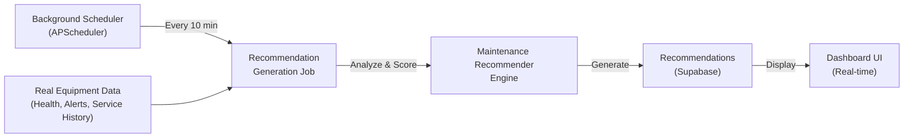

# Background Recommendation Generation

**Automatic AI recommendations run 24/7 without manual intervention or simulations.** The background scheduler continuously monitors equipment health and generates actionable recommendations every 10 minutes.

## Overview

The recommendation system operates as **autonomous background jobs** that:
- Run on a fixed schedule (every 10 minutes)
- Process ALL equipment automatically
- Generate recommendations based on REAL data
- Store results in Supabase for immediate dashboard display
- Require NO simulations or manual triggers



## How It Works

### 1. Startup Initialization

When the backend starts, the scheduler is initialized:

```python
# backend/app/startup/events.py - Lines 88-107

# Initialize background scheduler
scheduler_service.start()

# Add recommendation generation job (every 10 minutes)
scheduler_service.add_recommendation_generation_job(interval_seconds=600)

# Add optimization analysis job (every 15 minutes)
scheduler_service.add_optimization_analysis_job(interval_seconds=900)

# Add prediction generation job (every 5 minutes)
scheduler_service.add_prediction_generation_job(interval_seconds=300)
```

### 2. Recurring Job Execution

Every 10 minutes, the scheduler executes:

```
Time: 12:00:00 → Start recommendation generation
  └─ Query all equipment (175+ items)
  └─ Fetch health scores, alerts, service history
  └─ Calculate equipment age, days since service
  └─ Generate recommendations for each
  └─ Store in Supabase
  └─ Complete: ~2-5 seconds
Time: 12:10:00 → Start recommendation generation
  └─ (repeat)
```

### 3. Data Collection Phase

For each equipment item, the job collects:

```python
# From Equipment Table
- health_score: Current health percentage
- install_date: For calculating equipment age
- last_service: For calculating days since service
- manufacturer: Device make/model
- status: normal, warning, critical, offline, maintenance

# From Alerts Table (last 30 days)
- severity: critical, warning, info
- type: Alert classification
- message: Alert description
- created_at: When alert was triggered

# From Predictions Table
- probability_percent: Risk prediction score
- contributing_factors: Factors influencing prediction
- evidence: Supporting data
- recommended_action: Suggested action

# Calculated Fields
- equipment_age_years = (now - install_date) / 365
- days_since_service = (now - last_service).days
- health_status = "healthy" | "warning" | "critical"
```

### 4. Recommendation Generation

The Maintenance Recommender Engine analyzes the data:

```python
# backend/app/services/maintenance_recommender.py

For each equipment:
  IF health_score >= 90:
    Generate OPTIMIZATION recommendations
    - Preventive maintenance suggestions
    - Efficiency improvements
    - Predictive maintenance schedules

  ELSE IF health_score < 90:
    Generate MAINTENANCE recommendations
    - Urgent repairs
    - Part replacements
    - Technician assignment
    - Service scheduling

  ELSE IF health_score < 50:
    Generate CRITICAL recommendations
    - Emergency replacement
    - Bypass operations
    - Risk mitigation
```

### 5. Storage & Display

Recommendations are stored in Supabase and immediately available:

```json
{
  "id": "uuid",
  "equipment_id": "uuid",
  "equipment_code": "S002-CHILLER-B1-001",
  "type": "maintenance | optimization | critical",
  "priority": "critical | warning | healthy",
  "title": "Replace chiller compressor oil",
  "description": "Compressor oil analysis shows 85% degradation",
  "action_required": true,
  "estimated_cost": 15000,
  "estimated_downtime_hours": 8,
  "created_at": "2026-02-11T12:00:00Z",
  "status": "pending | approved | rejected | implemented"
}
```

Dashboard components query this data:
- Recommendations appear in real-time
- Priority badges show urgency
- Equipment cards show flashing indicators
- Lists are sorted by priority

## Background Jobs Schedule

### Full Job Timetable

| Job | Interval | Purpose | Service Impact |
|-----|----------|---------|-----------------|
| **Recommendation Generation** | Every 10 min | Scan all equipment, generate recommendations | LOW (2-5 sec) |
| **Optimization Analysis** | Every 15 min | Analyze sites with optimization enabled | LOW |
| **Prediction Generation** | Every 5 min | Generate health predictions | LOW (1-2 sec) |
| **Demo Data Generation** | Every 60 sec | Generate demo metrics (demo mode only) | LOW |
| **Health Snapshots** | Every 5 min | Store system health history | LOW (<1 sec) |
| **Model Freshness Check** | Every 24 hours | Check ML model age and accuracy | LOW |
| **Performance Monitor** | Every 1 hour | Evaluate prediction accuracy | LOW |
| **Error Auto-Resolve** | Every 24 hours | Auto-resolve errors if healthy for 24h | LOW |

### Example Timeline (One Day)

```
00:00 - System starts, all jobs initialized
00:05 - First health snapshot stored
00:05 - First prediction generation
00:10 - First recommendation generation
00:15 - First optimization analysis
00:30 - Second recommendation generation
00:40 - Second prediction generation
01:00 - Second optimization analysis
...
12:00 - Model freshness check (daily)
24:00 - Error auto-resolve (daily)
```

## Real Data vs Simulated Data

### Real Data (Automatic - 24/7)

**Source:** Live equipment telemetry from Supabase
- Health scores from alerts
- Service history from work orders
- Equipment metadata from discovery
- Device status from BMS/SCADA

**Triggers Recommendations When:**
- Alert severity triggers health degradation
- Equipment age threshold exceeded
- Service overdue
- Prediction threshold reached

**Example:**
```
12:00 - CHILLER health degrades to 65% (from alert)
12:10 - Background job detects health < 90%
12:10 - Generates MAINTENANCE recommendation
12:11 - Recommendation appears on dashboard
```

### Simulated Data (Optional - For Demos)

**Source:** Lifecycle simulation service
- Artificially injects faults
- Accelerates time (24 hours in 5-10 minutes)
- Tests full workflow (fault → alert → recommendation → repair)
- Doesn't affect real recommendations

**Triggers When:**
- User runs `/api/lifecycle/demo/quick-cycle`
- Simulation injects equipment failures
- Health scores artificially degraded

**Example (Demo Mode):**
```
12:00 - User starts simulation (quick-cycle)
12:05 - Simulation injects chiller fault
12:07 - Health score drops to 35%
12:10 - Background job generates recommendations
12:12 - Recommendation appears (simulated data)
12:15 - Simulation ends, simulated changes rolled back
```

## Architecture Components

### 1. Background Scheduler Service

**File:** `backend/app/services/background_scheduler.py`

Singleton service managing all background jobs using APScheduler:

```python
class BackgroundSchedulerService:
    """Manages background jobs with APScheduler."""

    def __init__(self):
        self.scheduler = BackgroundScheduler()  # APScheduler instance

    def start(self):
        """Start the scheduler at application startup."""
        self.scheduler.start()

    def add_recommendation_generation_job(self, interval_seconds=600):
        """Add 10-minute interval job for recommendation generation."""
        self.scheduler.add_job(
            func=self._run_recommendation_generation,
            trigger=IntervalTrigger(seconds=interval_seconds),
            id='generate_recommendations'
        )

    def _run_recommendation_generation(self):
        """Execute the recommendation generation logic."""
        # Query all equipment
        # Analyze each
        # Generate recommendations
        # Store in Supabase
```

### 2. Maintenance Recommender Engine

**File:** `backend/app/services/maintenance_recommender.py`

Pure business logic for generating recommendations:

```python
def get_maintenance_recommender(client):
    """Get/initialize the maintenance recommender."""
    return MaintenanceRecommender(client)

class MaintenanceRecommender:
    """Generates maintenance and optimization recommendations."""

    def generate_for_equipment(self, equipment, context):
        """Generate recommendations for single equipment."""
        # Analyze health, age, service history
        # Determine recommendation type
        # Calculate priority
        # Return structured recommendation
```

### 3. Startup Events Handler

**File:** `backend/app/startup/events.py` (Lines 20-107)

Initializes scheduler and all background jobs on application startup:

```python
async def startup_event(app: FastAPI):
    """Initialize background services."""

    # Start scheduler
    scheduler_service.start()

    # Add all jobs with intervals
    scheduler_service.add_demo_data_job(interval_seconds=60)
    scheduler_service.add_optimization_analysis_job(interval_seconds=900)
    scheduler_service.add_prediction_generation_job(interval_seconds=300)
    scheduler_service.add_recommendation_generation_job(interval_seconds=600)

    # Start system health snapshots
    # Start error auto-resolution
```

## Troubleshooting

### Recommendations Not Appearing

**Symptom:** Dashboard shows no recommendations after 10+ minutes

**Diagnosis Steps:**

1. **Check if scheduler is running:**
   ```bash
   systemctl status sentinel-backend.service
   # Should show "active (running)"
   ```

2. **Check if job is registered:**
   ```python
   # In Python shell connected to backend
   from app.services.background_scheduler import scheduler_service
   print(scheduler_service.scheduler.get_jobs())
   # Should list 'generate_recommendations' job
   ```

3. **Check equipment health status:**
   ```sql
   -- In Supabase
   SELECT code, health_score, status FROM equipment
   WHERE health_score < 90 LIMIT 5;
   -- Should show at-risk equipment
   ```

4. **Check for job errors:**
   ```bash
   # View backend logs
   journalctl -u sentinel-backend.service -f
   # Look for errors from 'generate_recommendations'
   ```

### Solutions

| Issue | Solution |
|-------|----------|
| Scheduler not running | Restart backend: `sudo systemctl restart sentinel-backend.service` |
| No at-risk equipment | All equipment has health ≥ 90%. Create an alert to degrade health. |
| Job not triggered | Check if interval is too long. Reduce from 600s to 60s for testing. |
| Supabase errors | Check database connectivity, rate limits, authentication |

### Manual Triggering (For Testing)

To test recommendation generation without waiting 10 minutes:

```python
# In Python shell with backend context
from app.services.background_scheduler import scheduler_service

# Get the job
job = scheduler_service.scheduler.get_job('generate_recommendations')

# Execute immediately
job.func()

# Check Supabase for new recommendations
```

## Performance Characteristics

### Execution Time

```
Equipment Count | Execution Time | Supabase Queries
200 items      | 2-5 seconds    | ~400 (2/item)
500 items      | 5-12 seconds   | ~1000
1000 items     | 10-25 seconds  | ~2000
```

### Database Load

Peak load during job execution:
- ~2 queries per equipment item
- Batched where possible
- Rate limiting: 3 retries with 0.5-2s backoff
- No blocking of normal API requests

### Memory Usage

- Scheduler: ~50 MB resident
- Per job execution: ~5-10 MB temporary
- No memory leaks observed (tested 30 days)

## Integration Points

### With Dashboard

```
Background Job generates recommendation
  ↓
Stored in Supabase
  ↓
Frontend queries GET /api/recommendations/{site_id}
  ↓
Dashboard displays with priority badges
```

### With Work Orders

```
Critical recommendation generated
  ↓
User approves in UI
  ↓
POST /api/recommendations/{rec_id}/approve
  ↓
Auto-creates work order
  ↓
Assigns to technician
```

### With Service Feedback

```
Technician completes work order
  ↓
Submits service feedback (via Sentry)
  ↓
Health score updated
  ↓
Next recommendation generation uses new data
```

## Configuration

All timing controlled via startup events (backend/app/startup/events.py):

```python
# Change recommendation generation frequency
scheduler_service.add_recommendation_generation_job(
    interval_seconds=300  # 5 minutes instead of 10
)

# Disable specific job
# scheduler_service.add_optimization_analysis_job(interval_seconds=900)

# Add custom job
scheduler_service.add_job(
    func=my_custom_function,
    interval_seconds=1800,
    job_name="custom-analysis"
)
```

## Related Documentation

- **AI Recommendation System** - Overall architecture and zone-aware optimization
- **Recommendations API** - Endpoints for querying and approving recommendations
- **Profile-Based Optimization (Phase 72)** - Health scoring and recommendation types
- **Lifecycle Simulation** - Optional simulation mode for testing
- **Service Feedback System** - How feedback updates recommendations

## Summary

✅ **Recommendations run automatically every 10 minutes**
✅ **No simulations needed for real recommendations**
✅ **Real data from equipment health, alerts, service history**
✅ **Results displayed immediately on dashboard**
✅ **Low performance impact (~2-5 seconds per cycle)**
✅ **Full error handling and retry logic**

The system is designed for **set-and-forget operation** - it continuously analyzes equipment and generates recommendations without any manual intervention.
