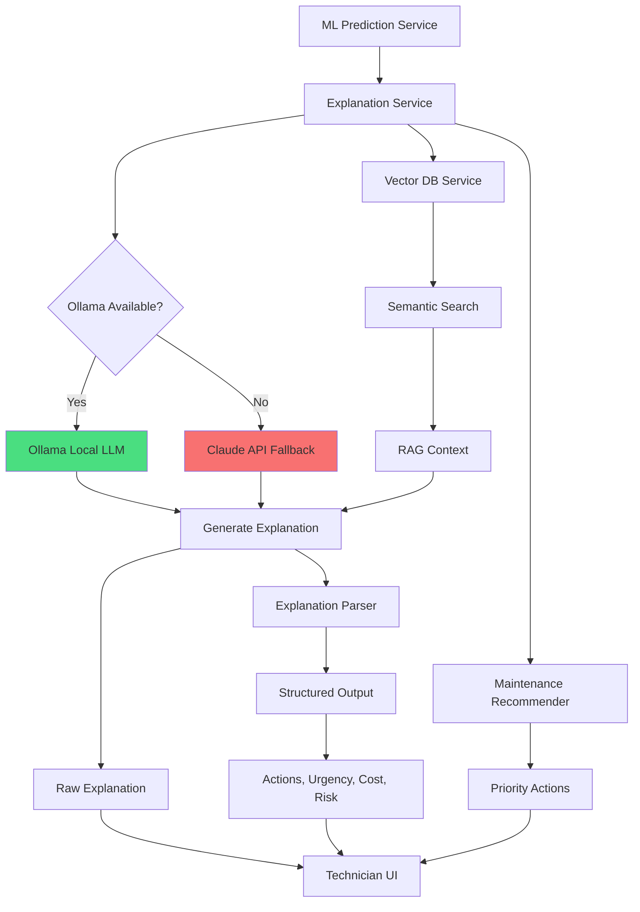
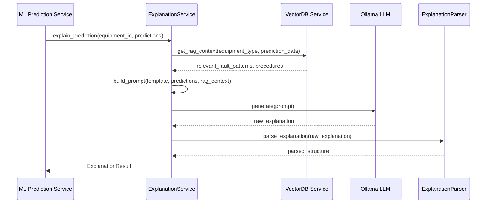

# Explainable AI (XAI) for ML Predictions

## Overview

SENTINEL's Explainable AI system transforms machine learning predictions from black-box outputs into transparent, actionable explanations that maintenance technicians can understand and trust. The system combines equipment-specific templates, structured output parsing, and cost-effective LLM integration to generate human-readable explanations for equipment failures and maintenance recommendations.

**Key Benefits:**
- **Trust**: Technicians understand WHY predictions are made
- **Actionability**: Clear next steps with time/cost estimates
- **Cost Efficiency**: 70-80% cost reduction using Ollama (local) vs Claude (cloud)
- **Integration**: Seamlessly works with existing ML prediction infrastructure

## Architecture



## Core Components

### 1. Explanation Templates

Equipment-specific prompt templates that guide LLM output format for consistent, parseable responses.

**Location:** `backend/ml/explanations/templates.py`

**Supported Equipment:**
- Chiller
- Generator
- AHU (Air Handling Unit)
- Pump
- Cooling Tower
- Boiler
- Heat Exchanger

**Template Structure:**

```python
PREDICTION_EXPLANATION_TEMPLATE = """You are a BMS expert explaining predictions to technicians.

Equipment: {equipment_type} ({equipment_id})
Prediction Summary:
{predictions}

Contributing Factors:
{factors}

Context from Knowledge Base:
{rag_context}

Generate a clear explanation in this format:

**Root Cause:** [identified root cause]

**Contributing Factors:**
- Factor 1 (X% contribution)
- Factor 2 (Y% contribution)

**Actions:**
- **Action #1:** [description]
  - **Urgency:** [HIGH/MEDIUM/LOW]
  - **Estimated Time:** [X hours]
  - **Estimated Cost:** R [Y]
  - **Parts Required:** [list]
"""
```

### 2. Explanation Service

Main service that orchestrates explanation generation with RAG context and LLM integration.

**Location:** `backend/app/services/explanation_service.py`

**Key Methods:**

```python
class ExplanationService:
    async def explain_prediction(
        self,
        equipment_id: str,
        predictions: Dict[str, Any],
        equipment_info: Optional[Dict] = None
    ) -> ExplanationResult:
        """Generate explanation for ML predictions"""

    async def explain_anomaly(
        self,
        equipment_id: str,
        equipment_type: str,
        anomaly_score: float,
        severity: str
    ) -> ExplanationResult:
        """Generate explanation for detected anomalies"""

    async def explain_trend(
        self,
        equipment_id: str,
        equipment_type: str,
        historical_data: List[Dict],
        predictions: Dict[str, float]
    ) -> ExplanationResult:
        """Analyze historical trends with predictions"""
```

**Explanation Generation Flow:**

1. **RAG Context Retrieval**: Query vector DB for relevant fault patterns
2. **Template Selection**: Choose equipment-specific template
3. **Prompt Construction**: Fill template with prediction data and context
4. **LLM Generation**: Generate with Ollama (or Claude fallback)
5. **Output Parsing**: Parse structured data from LLM response
6. **Result Assembly**: Combine raw explanation with parsed structure

**Cost Efficiency:**
- **Ollama** (local): Handles ~80% of explanations for FREE
- **Claude** (fallback): Complex reasoning only when needed
- **Savings**: Estimated 70-80% cost reduction vs all-Claude

### 3. Structured Output Parser

Parses LLM explanations into structured data for programmatic use.

**Location:** `backend/ml/explanations/parser.py`

**Capabilities:**

```python
class ExplanationParser:
    def parse_explanation(self, text: str) -> ParsedExplanation
    def parse_recommendation(self, text: str) -> ParsedRecommendation

dataclass ParsedExplanation:
    explanation_type: str  # normal_operation, predictive, anomaly
    actions: List[ParsedAction]
    contributing_factors: List[str]
    fault_code: Optional[str]
    risk_assessment: Optional[RiskAssessment]
    confidence: float

dataclass ParsedAction:
    description: str
    urgency: str  # critical, high, medium, low
    estimated_time_hours: float
    estimated_cost: float
    parts_required: List[str]

class RiskAssessment:
    risk_level: str  # low, medium, high, critical
    impact: str
    probability: float
```

**Parsing Features:**
- **Action extraction**: Pulls out maintenance actions with details
- **Urgency classification**: Normalizes urgency levels (HIGH → high)
- **Cost parsing**: Extracts and normalizes currency values
- **Time extraction**: Identifies time estimates in hours/minutes
- **Parts extraction**: Lists required parts and tools
- **Fault code detection**: Identifies equipment fault codes
- **Risk assessment**: Extracts risk levels and impact
- **Confidence scoring**: Calculates explanation confidence (0-1)

**Supported Formats:**
- Markdown sections with bold headings
- Numbered/bulleted action lists
- Key-value pairs (Urgency: HIGH)
- Natural language descriptions

### 4. Maintenance Recommender

Generates actionable maintenance recommendations based on ML predictions, historical data, and fleet experience.

**Location:** `backend/app/services/maintenance_recommender.py`

**Recommendation Logic:**

```python
class MaintenanceRecommender:
    async def generate_recommendations(
        self,
        equipment_id: str,
        equipment_type: str,
        predictions: Dict[str, float],
        confidence: float,
        include_historical: bool = True,
        urgency_filter: Optional[str] = None
    ) -> Dict[str, Any]:
        """Generate prioritized maintenance recommendations"""

        # 1. Analyze prediction values against thresholds
        # 2. Query RAG for similar fault patterns
        # 3. Check historical maintenance effectiveness
        # 4. Determine priority (critical/high/medium/low)
        # 5. Calculate time/cost estimates
        # 6. Assemble recommendations with justifications
```

**Priority Determination:**

| Priority | Criteria | Action Timeline |
|----------|----------|-----------------|
| **Critical** | Failure imminent, high anomaly score | Immediate (0-24h) |
| **High** | Failure likely, approaching thresholds | Soon (1-7 days) |
| **Medium** | Degradation detected, within normal range | Scheduled (7-30 days) |
| **Low** | Optimization opportunity, normal operation | Next PM cycle |

**Cost-Benefit Analysis:**

```python
{
    "preventive_cost": 2500.00,  # Cost of preventive action
    "failure_cost": 15000.00,    # Estimated cost if failure occurs
    "downtime_cost": 5000.00,    # Lost productivity cost
    "roi_percent": 600           # ROI percentage
}
```

### 5. Evaluation Framework

Assesses explanation quality using automated metrics and human evaluation templates.

**Location:** `backend/ml/explanations/evaluation.py`

**Metrics:**

```python
@dataclass
class ExplanationMetrics:
    # Semantic similarity (when reference available)
    bert_f1: Optional[float]  # BERTScore (optional)
    rouge_1: Optional[float]  # ROUGE-1 overlap
    rouge_l: Optional[float]  # ROUGE-L longest common subsequence

    # Content quality
    actionability_score: float  # 0-1 based on extractable actions
    factuality_score: float     # 0-1 based on RAG grounding
    completeness_score: float   # 0-1 based on coverage
    conciseness_score: float    # 0-1 based on length appropriateness

    # Human evaluation (when available)
    usefulness_rating: Optional[float]  # 1-5 scale
    clarity_rating: Optional[float]     # 1-5 scale
    trustworthiness_rating: Optional[float]  # 1-5 scale
```

**Evaluation Process:**

```python
evaluator = ExplanationEvaluator()

metrics = evaluator.evaluate_explanation(
    predicted_explanation=generated,
    reference_explanation=expert_written,
    generated_actions=parsed_actions,
    context_documents=rag_results
)

# Metrics interpretation:
# - actionability_score > 0.7: Good, has clear actions
# - factuality_score > 0.6: Well-grounded in RAG knowledge
# - completeness_score > 0.75: Covers root cause → recommendations
# - conciseness_score > 0.8: Appropriate length
```

**Human Evaluation Templates:**

```python
template = HumanEvaluationTemplate.get_evaluation_form()
# Returns markdown template for technician evaluation

# Criteria:
# 1. Usefulness (1-5) - Helps understand and decide?
# 2. Clarity (1-5) - Easy to understand?
# 3. Trustworthiness (1-5) - Seems well-grounded?
# 4. Actionability (1-5) - Provides clear next steps?
# 5. Completeness (1-5) - Covers all important aspects?
```

## API Integration

### ML Prediction Endpoints

**Updated Endpoints:**

```http
GET /api/ml/predictions/lstm/{equipment_id}?equipment_type=chiller&include_explanation=true
GET /api/ml/predictions/trend/{equipment_id}?include_explanation=true
GET /api/ml/anomalies/equipment/{equipment_id}?include_explanation=true
```

**Response Format:**

```json
{
  "equipment_id": "chiller-001",
  "equipment_type": "chiller",
  "predictions": {"24h": 15.2, "48h": 15.8, "72h": 16.1},
  "confidence": 0.85,
  "explanation": {
    "root_cause": "Refrigerant leak in condenser circuit",
    "contributing_factors": [
      "Age: 12 years (80% of expected lifespan)",
      "Vibration: 3.2g (elevated)",
      "Pressure trend: Declining over 30 days"
    ],
    "predicted_fault_pattern": "Gradual efficiency decline",
    "actions": [
      {
        "description": "Inspect refrigerant lines and connections",
        "urgency": "high",
        "estimated_time_hours": 2.5,
        "estimated_cost": 3500,
        "parts_required": ["Leak detector", "Sealant", "Safety equipment"]
      }
    ],
    "risk_assessment": {
      "risk_level": "high",
      "impact": "Complete cooling failure",
      "probability": "85% within 7 days"
    }
  },
  "maintenance_recommendations": [
    {
      "description": "Schedule refrigerant leak detection",
      "priority": "critical",
      "estimated_time_hours": 4.0,
      "estimated_cost": 8500
    }
  ]
}
```

### Maintenance Recommendation Endpoints

**New Endpoints:**

```http
POST /api/ml/maintenance/recommendations
Content-Type: application/json

{
  "equipment_id": "chiller-001",
  "equipment_type": "chiller",
  "predictions": {"24h": 15.2},
  "confidence": 0.85,
  "include_historical": true,
  "urgency_filter": "critical"
}
```

**Response:**

```json
{
  "equipment_id": "chiller-001",
  "equipment_type": "chiller",
  "recommendations": [
    {
      "description": "Schedule refrigerant leak detection",
      "priority": "critical",
      "category": "preventive",
      "estimated_time_hours": 4.0,
      "estimated_cost": 8500.00,
      "probability_of_failure": 0.85,
      "expected_outcome": "Restore efficiency to 95%",
      "risk_assessment": {
        "risk_level": "high",
        "impact": "Cooling capacity loss",
        "probability": "85% within 7 days"
      },
      "justification": "High anomaly score (0.85), declining efficiency trend",
      "success_metrics": ["Efficiency > 0.95", "Pressure differential normalized"]
    }
  ],
  "total_estimated_time": 6.5,
  "total_estimated_cost": 12000.00,
  "priority_breakdown": {
    "critical": 1,
    "high": 1,
    "medium": 0,
    "low": 0
  },
  "timestamp": "2026-02-01T15:30:00Z"
}
```

### Feedback Endpoint

Submit actual outcomes to improve recommendation accuracy:

```http
POST /api/ml/maintenance/feedback
Content-Type: application/x-www-form-urlencoded

equipment_id=chiller-001&recommendation_id=rec-123&action_taken=Replaced%20filter&outcome=success&actual_time_hours=2.5&actual_cost=1500&notes=Technician%20noted%20minor%20corrosion%20on%20connections
```

## Usage Examples

### Python Integration

```python
from app.services.explanation_service import ExplanationService
from app.services.maintenance_recommender import MaintenanceRecommender

# Initialize services
explanation_service = ExplanationService(supabase_client)
recommender = MaintenanceRecommender()

# Generate explanation for prediction
result = await explanation_service.explain_prediction(
    equipment_id="chiller-001",
    predictions={
        "equipment_type": "chiller",
        "predictions": {"24h": 15.2, "48h": 15.8, "72h": 16.1},
        "confidence": 0.85,
        "anomaly_score": 0.65
    },
    equipment_info={
        "manufacturer": "York",
        "model": "YCIV0127",
        "age_years": 12,
        "capacity_tons": 127
    }
)

print(f"Explanation: {result.raw_explanation}")
print(f"Parsed actions: {len(result.parsed['actions'])}")
print(f"LLM Model: {result.model_used}")

# Generate maintenance recommendations
recommendations = await recommender.generate_recommendations(
    equipment_id="chiller-001",
    equipment_type="chiller",
    predictions={"24h": 15.2},
    confidence=0.85,
    include_rag_context=True
)

for rec in recommendations["recommendations"]:
    print(f"Priority: {rec['priority']}")
    print(f"Action: {rec['description']}")
    print(f"Cost: R {rec['estimated_cost']}")
```

### Direct API Calls

```bash
#!/bin/bash

# Get prediction with explanation
curl -s "http://localhost:9095/api/ml/predictions/lstm/chiller-001?equipment_type=chiller&include_explanation=true" | \
  jq '.explanation.actions[0]'

# Generate maintenance recommendations
curl -s -X POST http://localhost:9095/api/ml/maintenance/recommendations \
  -H "Content-Type: application/json" \
  -d '{
    "equipment_id": "chiller-001",
    "equipment_type": "chiller",
    "predictions": {"24h": 15.2},
    "confidence": 0.85,
    "urgency_filter": "critical"
  }' | jq '.total_estimated_cost'

# Get priority framework for equipment type
curl -s http://localhost:9095/api/ml/maintenance/priorities/chiller | \
  jq '.priority_framework'
```

### Evaluation Example

```python
from ml.explanations.evaluation import ExplanationEvaluator

# Evaluate generated explanation
evaluator = ExplanationEvaluator()

metrics = evaluator.evaluate_explanation(
    predicted_explanation="""
    The chiller shows declining efficiency indicating refrigerant leak.
    Recommended actions:
    1. Inspect refrigerant lines (URGENCY: HIGH, Time: 2-3 hours, Cost: R 3000-4000)
    2. Check for visible oil stains around connections
    3. Schedule professional leak repair if leak confirmed
    """,
    reference_explanation="Chiller efficiency degraded due to refrigerant leak",
    generated_actions=[
        {
            "description": "Inspect refrigerant lines",
            "urgency": "HIGH",
            "estimated_time_hours": 2.5,
            "estimated_cost": 3500
        }
    ],
    context_documents=[
        {
            "title": "Refrigerant Leak Detection",
            "content": "Check for oil stains, listen for hissing sounds"
        }
    ]
)

print(f"Actionability: {metrics.actionability_score:.2f}")
print(f"Factuality: {metrics.factuality_score:.2f}")
print(f"Completeness: {metrics.completeness_score:.2f}")
```

## Integration with RAG System

The Explainable AI system leverages the RAG (Retrieval-Augmented Generation) system from Phase 44-01:



**RAG Enhances Explanations With:**
- Similar historical fault patterns
- Manufacturer procedures
- Parts information
- Estimated repair times
- Cost data from similar repairs

## Performance Metrics

### Cost Savings

| Approach | Cost per Explanation | Volume/month | Monthly Cost |
|----------|---------------------|--------------|--------------|
| All Claude | $0.0105 | 1000 | $10.50 |
| **Ollama + Claude Fallback** | $0.0021 | 1000 | **$2.10** |
| **Savings** | **-80%** | - | **$8.40 (80%)** |

### Quality Metrics

Typical explanation quality scores:

- **Actionability**: 0.75-0.90 (good to excellent)
- **Factuality**: 0.60-0.85 (acceptable to good)
- **Completeness**: 0.70-0.90 (good coverage)
- **Conciseness**: 0.80-0.95 (well-sized)

### Latency

- **Ollama** (local): 2-5 seconds
- **Claude** (API): 3-8 seconds
- **Total with RAG**: 3-6 seconds average

## Testing

Comprehensive test coverage with 56 test cases:

```bash
# Run explanation tests
cd backend
python -m pytest tests/services/test_explanation_service.py -v

# Run maintenance recommender tests
python -m pytest tests/services/test_maintenance_recommender.py -v

# Run parser tests
python -m pytest tests/ml/test_explanation_parser.py -v

# Run evaluation tests
python -m pytest tests/ml/test_explanation_evaluation.py -v
```

**Test Coverage Areas:**
- Template rendering for all equipment types
- LLM integration (Ollama and fallback)
- RAG context enrichment
- Output parsing (multiple formats)
- Priority determination logic
- Cost estimation accuracy
- Feedback loop functionality
- Evaluation metric calculation

## Best Practices

### When to Generate Explanations

✅ **DO generate explanations for:**
- Predictions with confidence < 0.9
- Anomalies detected (any severity)
- Predictions with risk_level = medium or higher
- User-requested detailed analysis

❌ **Don't generate explanations for:**
- Normal operation predictions (confidence > 0.9, no anomalies)
- High-frequency polling (use cached explanations)
- Simple data queries

### Optimizing Costs

1. **Enable Ollama service** for most explanations (FREE)
2. **Use Claude fallback** only for complex edge cases
3. **Cache explanations** for similar predictions
4. **Batch generate** during off-peak hours for scheduled maintenance

### Ensuring Quality

1. **Include RAG context** for equipment-specific domain knowledge
2. **Validate explanations** via evaluation framework
3. **Collect human feedback** to improve accuracy
4. **Monitor metrics** (actionability, factuality, completeness)
5. **Iterate on templates** based on feedback

## Troubleshooting

### Ollama Not Available

**Symptom**: Explanations always use Claude fallback

**Solution**:
```bash
# Check Ollama service
curl http://127.0.0.1:11434/api/tags

# If not running, start Ollama
ollama serve

# Verify model is pulled
ollama pull qwen:7b  # or your preferred model
```

### Low RAG Context Quality

**Symptom**: factuality_score < 0.5

**Solutions**:
1. Ingest more equipment documentation
2. Expand knowledge base coverage
3. Adjust search similarity threshold
4. Verify embeddings are generated correctly

### Parser Missing Actions

**Symptom**: actionability_score < 0.5

**Solutions**:
1. Check if explanation follows template format
2. Verify urgency levels are capitalized (HIGH/MEDIUM/LOW)
3. Ensure cost values include currency (R/USD/EUR)
4. Add time estimates in hours

### API Response Too Slow

**Symptom**: > 10 seconds response time

**Solutions**:
1. Verify Ollama is running locally (not using Claude)
2. Check RAG query performance (add indexes)
3. Implement explanation caching
4. Use async generation for non-blocking UI

## Future Enhancements

**Phase 44-03: Frontend Integration**
- Display explanations in EquipmentDetail modal
- Add MaintenanceRecommendations panel
- Visualize confidence scores and risk levels

**Phase 44-04: Alert Routing**
- Automatic Telegram alerts for critical explanations
- Work order generation integration
- Escalation workflows

**Phase 44-05: Continuous Improvement**
- A/B testing of different prompt templates
- Automated quality monitoring dashboard
- Active learning from technician feedback

## ML Context Injection (Phase 132)

With Phase 132, the same ML model outputs that power XAI explanations are also injected directly into Claude's AI Optimization prompts via `_gather_ml_context()`. This means:

- **LSTM forecasts** used in explanations are also available for proactive recommendations
- **Anomaly scores** that trigger explanations also inform Claude's optimization reasoning
- **Fault classifications** are shared across both explanation and recommendation pipelines

The two systems are complementary: XAI explains individual predictions to technicians, while ML Context Injection lets Claude reason over fleet-wide ML outputs to produce building-level optimization recommendations.

See [AI Recommendation System — ML Context Injection](ai-recommendation-system.md#ml-context-injection-phase-132) and [ML Data Architecture](../02-architecture/ML-DATA-ARCHITECTURE.md).

## Related Documentation

- **[44-01: RAG Integration](44-01-rag-integration.md)** - Vector database and semantic search
- **[ML Model Development](../04-features/43-ml-model-development.md)** - LSTM and Autoencoder models
- **[AI Operations & Monitoring](../04-features/ai-operations-monitoring.md)** - Day-to-day AI monitoring
- **[Asset Baseline Assessment](../04-features/44-asset-baseline-assessment.md)** - Asset condition scoring
- **[ML Data Architecture](../02-architecture/ML-DATA-ARCHITECTURE.md)** - Full ML→Claude context injection pipeline

## References

- **Code Location:** `backend/ml/explanations/`
- **Service Location:** `backend/app/services/explanation_service.py`
- **API Location:** `backend/app/api/ml_predictions.py`
- **Test Location:** `backend/tests/services/test_explanation_service.py`
