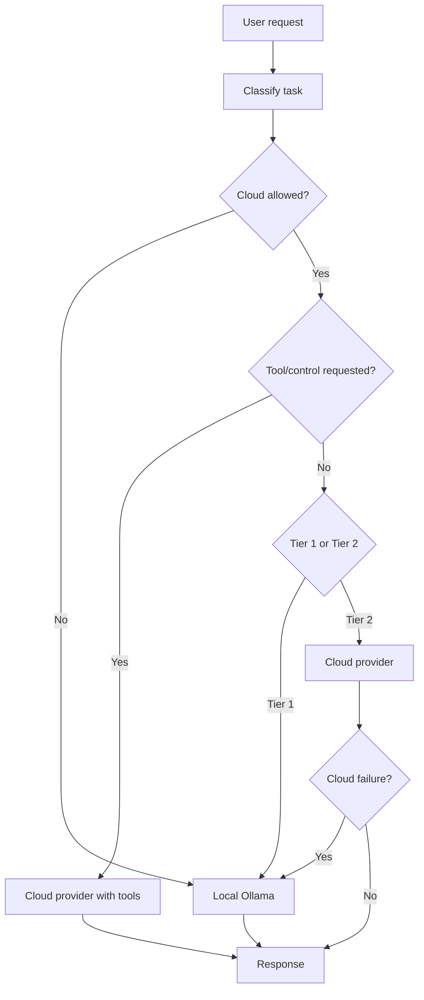

# Hybrid AI Routing

SENTINEL routes AI requests between configured cloud providers, with optional local routing policies per site.

The routing layer now enforces POPIA cross-border controls:

- Cloud routing is blocked when `cross_border_transfer` consent is missing.
- Requests can be forced local per-site via Settings policy.
- Tool/control operations are cloud-only and are disabled in forced-local mode.

## Runtime flow



## Providers and models

### Local (optional)

| Model | Purpose |
|---|---|
| `llama3.2:1b` | Fast lookups (optional path) |
| `phi3:mini` | Balanced local reasoning (optional path) |

### Cloud (configurable)

| Provider | Model setting |
|---|---|
| Anthropic | `claude_model` |
| OpenAI | `openai_model`, `openai_model_heavy` |
| Z.ai | `zai_model` |
| Xiaomi | `xiaomi_model` |

Active provider is selected with `ai_cloud_provider` (`anthropic`, `openai`, `zai`, `xiaomi`).

## POPIA cross-border gate

Cloud processing requires explicit consent when `popia_require_cross_border_consent=true`.

Gate implementation:

- Consent check helper: `backend/app/services/popia_consent_guard.py`
- Chat routing enforcement: `backend/app/api/chat.py`, `backend/app/api/hybrid_chat.py`
- Core router enforcement: `backend/app/services/hybrid_ai_service.py`

Behavior:

- If consent exists: normal hybrid routing.
- If consent is missing/withdrawn: local-only execution.
- If cloud is selected but blocked: no cloud escalation is attempted.

## Safety and tool-calling behavior

Tool/control execution is treated as safety-critical and remains cloud-path only.

If routing is forced local (consent block, local-only mode, or no cloud credentials):

- `use_tools` is disabled.
- Query still executes locally for advisory text responses.
- Control/tool actions are not attempted.

## Configuration

Set in `backend/app/config/settings.py` and environment:

```bash
# Routing
AI_CLOUD_PROVIDER=anthropic      # anthropic | openai | zai | xiaomi
LOCAL_AI_ONLY=false              # true forces global local-only mode

# Anthropic
ANTHROPIC_API_KEY=...
CLAUDE_MODEL=claude-3-5-haiku-latest

# OpenAI
OPENAI_API_KEY=...
OPENAI_MODEL=gpt-4.1-nano
OPENAI_MODEL_HEAVY=gpt-4.1-mini

# Z.ai
ZAI_API_KEY=...
ZAI_MODEL=GLM-4.5-Air

# POPIA
POPIA_REQUIRE_CROSS_BORDER_CONSENT=true
```

## API touchpoints

- `POST /api/chat`
- `POST /api/hybrid-chat`
- `POST /api/chat/local` (local endpoint)
- `GET /api/chat/status?site_id=<site>` (includes effective site AI policy)
- Related privacy controls: `docs/03-api-reference/privacy-api.md`

## Site-scoped AI Runtime Policy

Admins can set per-site AI runtime policy in Settings:

- `chat_local_ai_only`
- `allow_tool_calling`
- `show_recommendations_in_shadow`
- `monthly_budget_zar`
- `hard_cap_enforced`

Endpoints:
- `GET /api/settings/ai-policy/{site_id}`
- `PUT /api/settings/ai-policy/{site_id}`

Behavior impact:
- Force local for selected sites without changing global mode.
- Disable tool-calling for selected sites.
- Hide/show recommendations in `shadow_live`.
- Block paid chat execution when hard-cap budget is exceeded.

## Observability

Track these signals for routing governance:

- Local vs cloud route counts
- Consent-blocked cloud attempts
- Tool-request blocked due to local-only mode
- Cloud failure fallback count
- Per-provider error rates (Anthropic, Z.ai)

## Operational notes

1. For GPU SBC deployments, run `LOCAL_AI_ONLY=true` to match production topology.
2. In hybrid dev mode, keep consent gating enabled to test POPIA behavior early.
3. Validate both paths in CI: cloud-enabled and consent-blocked local-only.

## Related documents

- `docs/03-api-reference/privacy-api.md`
- `docs/compliance/popia-compliance-register.md`
- `docs/09-security/consent-and-privacy.md`
