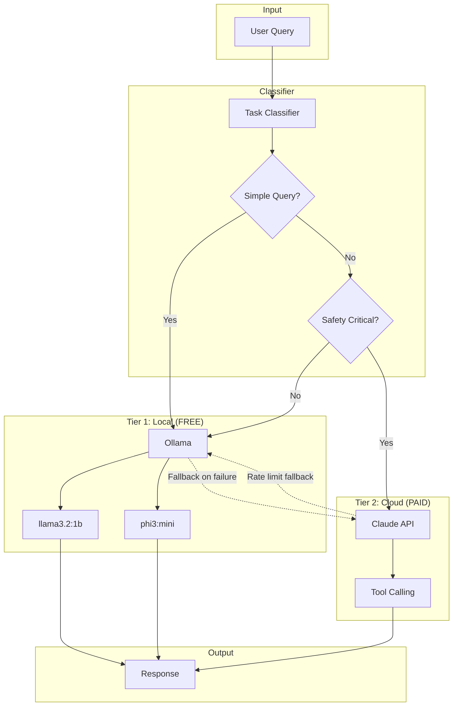

# Hybrid AI Routing

SENTINEL uses a two-tier AI architecture that routes queries to either local Ollama models (free) or cloud Claude (paid) based on task complexity. This achieves approximately 40% cost savings while maintaining high-quality responses for complex operations.

## Overview



## Routing tiers

### Tier 1: Local Ollama (FREE)

Simple lookups, data queries, and straightforward requests are handled locally:

| Pattern | Example | Model |
|---------|---------|-------|
| Status queries | "What's the status of Chiller 1?" | llama3.2:1b |
| Equipment lists | "List all equipment at Gateway Centre" | llama3.2:1b |
| Data retrieval | "Show me the temperature in Zone A" | phi3:mini |
| Health checks | "Get the health score for Building 1" | phi3:mini |
| Simple lookups | "Who stocks Carrier parts?" | llama3.2:1b |

**Cost**: $0.00 per query

### Tier 2: Cloud Claude (PAID)

Complex reasoning, control actions, and safety-critical operations use Claude:

| Pattern | Example | Reason |
|---------|---------|--------|
| Diagnosis | "Why is the chiller running hot?" | Complex reasoning |
| Recommendations | "Recommend optimization for load shedding" | Multi-factor analysis |
| Control actions | "Set temperature to 22°C" | Safety critical |
| Troubleshooting | "Troubleshoot the AHU fault" | Domain expertise |
| Analysis | "Analyze energy consumption trends" | Complex reasoning |

**Cost**: ~$0.01 per query (varies by response length)

## Task classification

The `classify_task` method analyzes queries to determine routing:

```python
def classify_task(self, message: str) -> Dict[str, Any]:
    """
    Classify task complexity and route to appropriate model.

    Returns:
        Dict with 'provider', 'model', 'reason', 'estimated_cost', 'tier'
    """
    message_lower = message.lower()

    # Tier 1: Simple lookups (Ollama - FREE)
    simple_patterns = [
        r'^what does error code',
        r'^what\'?s? the status of',
        r'^who stocks',
        r'^list (all )?equipment',
        r'^show me',
        r'^get (me )?(the )?health',
        r'^how many',
    ]

    if any(re.match(pattern, message_lower) for pattern in simple_patterns):
        return {
            "provider": "ollama",
            "model": "llama3.2:1b",
            "reason": "Simple lookup/retrieval",
            "estimated_cost": 0.0,
            "tier": 1
        }

    # Tier 2: Complex reasoning (Claude - paid)
    complex_patterns = [
        r'^why (is|does|are)',
        r'^diagnose',
        r'^analyze',
        r'^recommend',
        r'^optimize',
        r'^predict',
        r'^troubleshoot',
        r'root cause',
    ]

    if any(re.search(pattern, message_lower) for pattern in complex_patterns):
        return {
            "provider": "anthropic",
            "model": settings.claude_model,
            "reason": "Complex reasoning required",
            "estimated_cost": 0.0105,
            "tier": 2
        }

    # Tier 2: Control actions (Claude - paid, safety critical)
    control_patterns = [
        r'^turn (on|off)',
        r'^set .* to',
        r'^adjust ',
        r'^control ',
    ]

    if any(re.search(pattern, message_lower) for pattern in control_patterns):
        return {
            "provider": "anthropic",
            "model": settings.claude_model,
            "reason": "Control action (safety critical)",
            "estimated_cost": 0.0105,
            "tier": 2
        }

    # Default: Try Ollama first
    return {
        "provider": "ollama",
        "model": "phi3:mini",
        "reason": "Default to local (can escalate)",
        "estimated_cost": 0.0,
        "tier": 1
    }
```

## Fallback mechanisms

### Ollama → Claude escalation

When Ollama fails, queries automatically escalate to Claude:

```python
async def query_ollama(
    self,
    message: str,
    model: str = "llama3.2:1b",
    escalate_on_fail: bool = True
) -> str:
    try:
        async with httpx.AsyncClient(timeout=30.0) as client:
            response = await client.post(
                self.ollama_url,
                json={"model": model, "prompt": message, "stream": False}
            )
            response.raise_for_status()
            return response.json().get("response", "")

    except Exception as e:
        logger.error(f"Ollama query failed: {e}")
        if escalate_on_fail:
            logger.info("Escalating to Claude due to Ollama failure")
            return await self._query_claude_fallback(message)
        raise
```

### Claude → Ollama fallback (rate limit)

When Claude hits rate limits, queries fall back to Ollama:

```python
async def _try_claude_with_fallback(
    self,
    message: str,
    include_building_context: bool = True
) -> AsyncGenerator[str, None]:
    try:
        async for chunk in claude_service.stream_response(
            [{"role": "user", "content": message}],
            include_building_context=include_building_context
        ):
            yield chunk

    except RateLimitError as e:
        logger.warning(f"Claude rate limit hit: {e}")
        self.claude_rate_limited = True
        self.rate_limit_time = time.time()

        # Fall back to Ollama
        response = await self.query_ollama(
            message,
            model=self.ollama_models["balanced"],
            escalate_on_fail=False  # Don't escalate back to Claude
        )

        yield f"[Claude rate limited - using local model] {response}"
```

### Rate limit cooldown

After hitting a rate limit, Claude is avoided for a cooldown period:

```python
def _should_use_claude(self) -> bool:
    """Check if Claude is available (not in cooldown)."""
    if not self.claude_rate_limited:
        return True

    time_since_limit = time.time() - self.rate_limit_time
    if time_since_limit > self.cooldown_period:  # 60 seconds
        self.claude_rate_limited = False
        return True

    logger.info(f"Claude in cooldown for {self.cooldown_period - int(time_since_limit)}s more")
    return False
```

## Configuration

### Environment variables

```bash
# Backend .env
ANTHROPIC_API_KEY=sk-ant-...        # Required for Claude
CLAUDE_MODEL=claude-sonnet-4-20250514  # Claude model to use
OLLAMA_BASE_URL=http://localhost:11434  # Ollama server URL
```

### Ollama models

The service uses two Ollama models:

| Model | Purpose | Parameters | Speed |
|-------|---------|------------|-------|
| `llama3.2:1b` | Fast lookups | 1B | Very fast |
| `phi3:mini` | Balanced queries | 3.8B | Fast |

Install models with:

```bash
ollama pull llama3.2:1b
ollama pull phi3:mini
```

### Tuning classification

Modify pattern lists in `classify_task` to adjust routing:

```python
# Add more patterns for Tier 1 (local)
simple_patterns = [
    r'^what does error code',
    r'^what\'?s? the status of',
    # Add custom patterns here
    r'^find the',
    r'^where is',
]

# Add more patterns for Tier 2 (Claude)
complex_patterns = [
    r'^why (is|does|are)',
    r'^diagnose',
    # Add custom patterns here
    r'^explain how',
    r'^compare',
]
```

## API usage

### Hybrid chat endpoint

```bash
# Simple query (routes to Ollama)
curl -X POST http://localhost:9095/api/hybrid-chat \
  -H "Content-Type: application/json" \
  -d '{"message": "What is the status of Chiller 1?"}'

# Complex query (routes to Claude)
curl -X POST http://localhost:9095/api/hybrid-chat \
  -H "Content-Type: application/json" \
  -d '{"message": "Why is the chiller running above setpoint?"}'
```

Response includes routing metadata:

```json
{
  "response": "Chiller 1 is currently running with...",
  "routing": {
    "provider": "ollama",
    "model": "llama3.2:1b",
    "reason": "Simple lookup/retrieval",
    "tier": 1,
    "estimated_cost": 0.0
  }
}
```

### Streaming responses

Both tiers support streaming via SSE:

```python
async def stream_response(
    self,
    message: str,
    use_tools: bool = False
) -> AsyncGenerator[str, None]:
    """Stream response from appropriate AI model."""

    routing = self.classify_task(message)

    # Tool calling forces Claude (safety critical)
    if use_tools:
        async for chunk in claude_service.stream_response_with_tools(
            [{"role": "user", "content": message}]
        ):
            yield chunk
        return

    # Route based on classification
    if routing["provider"] == "ollama":
        response = await self.query_ollama(message, routing["model"])
        yield response
    else:
        async for chunk in self._try_claude_with_fallback(message):
            yield chunk
```

## Cost analysis

### Example monthly breakdown

For a building with 500 daily queries:

| Query Type | Daily Count | Tier | Cost/Query | Daily Cost |
|------------|-------------|------|------------|------------|
| Status checks | 200 | 1 | $0.00 | $0.00 |
| Data queries | 150 | 1 | $0.00 | $0.00 |
| Diagnostics | 100 | 2 | $0.01 | $1.00 |
| Control actions | 50 | 2 | $0.01 | $0.50 |

**Monthly cost**: ~$45 (vs ~$75 all-Claude approach)

**Savings**: 40%

### Monitoring costs

Track routing decisions to understand cost distribution:

```python
# Log routing decisions
logger.info(
    f"Routing decision: provider={routing['provider']}, "
    f"model={routing['model']}, "
    f"reason={routing['reason']}, "
    f"tier={routing['tier']}"
)
```

## Tool calling

Tool calling (MCP) always uses Claude for safety:

```python
# Force Claude for tool calling
if use_tools:
    logger.info("Tool calling enabled, using Claude")
    try:
        async for chunk in claude_service.stream_response_with_tools(
            [{"role": "user", "content": message}]
        ):
            yield chunk
        return
    except RateLimitError:
        yield "[Claude rate limited] Cannot perform tool-based actions right now."
        return
```

This ensures:
- Control actions are validated by Claude's reasoning
- Safety-critical operations don't rely on smaller local models
- Tool execution has proper context awareness

## Best practices

### 1. Keep simple queries simple

Write queries that match Tier 1 patterns for cost efficiency:

```python
# Good (Tier 1 - free)
"What is the status of Chiller 1?"
"List all equipment at Gateway Centre"
"Show temperature in Zone A"

# Expensive (Tier 2 - paid)
"Can you tell me about the current operational status of the chiller unit?"
"I'd like to understand what equipment we have"
```

### 2. Use explicit control language

For safety-critical actions, use explicit patterns that route to Claude:

```python
# Good (routes to Claude)
"Set temperature to 22°C"
"Turn off Chiller 1"
"Adjust brightness to 80%"

# Ambiguous (may route to Ollama)
"Make it cooler"
"Change the settings"
```

### 3. Monitor fallback frequency

High fallback rates indicate issues:

- **High Ollama → Claude**: Ollama may be down or overloaded
- **High Claude → Ollama**: Rate limits hit, consider caching

### 4. Cache frequent queries

Implement caching for repeated queries:

```python
from functools import lru_cache

@lru_cache(maxsize=100)
def get_cached_response(query_hash: str) -> Optional[str]:
    # Return cached response if available
    ...
```

## Troubleshooting

### Ollama not responding

1. Check Ollama is running: `curl http://localhost:11434/api/tags`
2. Verify models are installed: `ollama list`
3. Check service logs: `journalctl -u ollama`

### Claude rate limits

1. Check cooldown status in logs
2. Increase cooldown period if needed
3. Consider implementing request queuing

### Poor routing decisions

1. Review classification patterns
2. Add missing patterns for common queries
3. Log and analyze misrouted queries

### Slow responses

1. Check Ollama model size (use smaller models for speed)
2. Verify network connectivity to Claude API
3. Monitor response times and adjust timeouts

## Related documents

- [System Overview](../02-architecture/system-overview.md) - Overall architecture
- [MCP Tools Reference](../03-api-reference/mcp-tools-reference.md) - Tool calling integration
- [Claude Integration](claude-integration.md) - Direct Claude API usage
