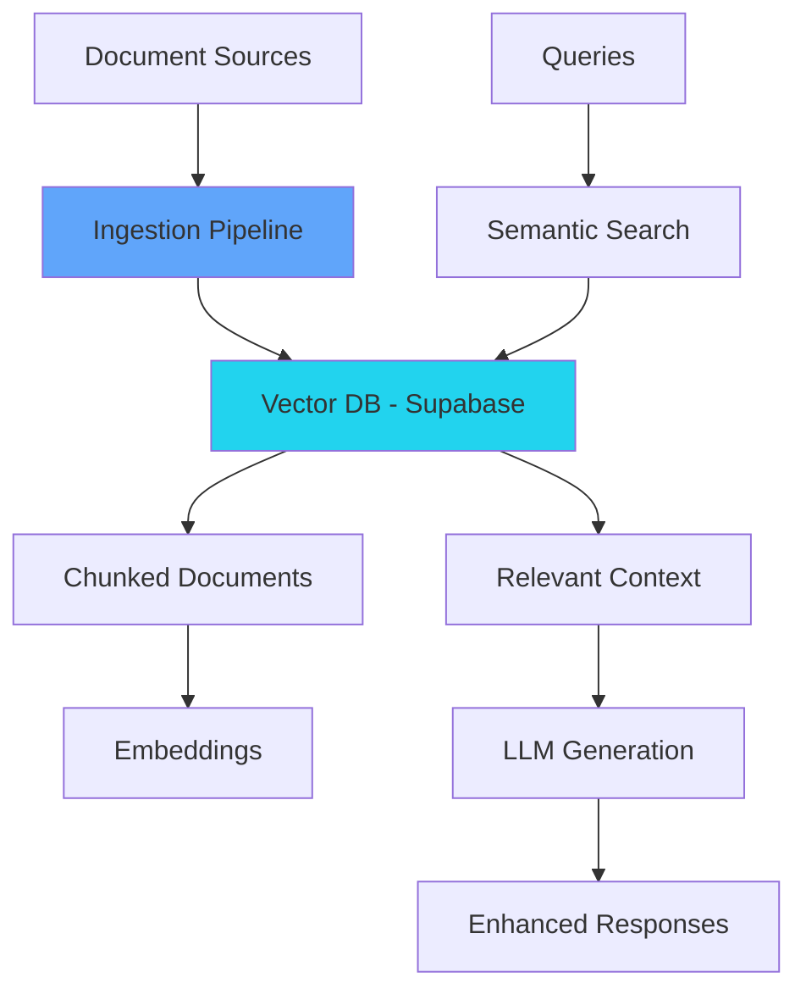

# RAG Integration Overview (Phase 44-01)

## Overview

Phase 44-01 implemented a Retrieval-Augmented Generation (RAG) system for SENTINEL using Supabase with the pgvector extension. This provides semantic search capabilities over equipment documentation, enabling context-aware AI explanations and recommendations.

## Architecture



## Components

### 1. Vector Database Service

**Location:** `backend/app/services/vector_db.py`

Supabase pgvector wrapper providing:
- Document storage with embeddings
- Semantic similarity search
- Metadata filtering
- Relationship tracking

### 2. Embedding Service

**Location:** `backend/app/services/embedding_service.py`

Handles text embedding generation using:
- **Default**: `all-MiniLM-L6-v2` (384 dimensions)
- **Optional**: `multilingual-e5-large` (1024 dimensions)
- Equipment text preprocessing with metadata

### 3. RAG Service

**Location:** `backend/app/services/rag_service.py`

Main RAG orchestration service:
- Multi-document query routing
- Relevance scoring and ranking
- Context assembly for LLMs
- Relationship graph building

### 4. Document Ingestion

**Location:** `backend/scripts/ingest_rag_knowledge.py`

Batch and streaming ingestion pipeline supporting:
- Equipment manuals (PDF/text)
- Maintenance procedures
- Fault pattern documentation
- Parts catalogs
- Knowledge templates

## Database Schema

### Core Tables

**`rag_documents`**
- Document metadata and chunks
- pgvector embeddings (384-1024 dimensions)
- Equipment type and categories
- Source tracking

**`rag_document_relationships`**
- Knowledge graph connections
- Related document links
- Historical pattern associations

### Knowledge Types

- `fault_patterns` - Known equipment failures
- `maintenance_procedures` - Step-by-step guides
- `parts_information` - Bill of materials
- `troubleshooting_guides` - Diagnostic procedures
- `manufacturer_specs` - Technical specifications

## API Endpoints

**Semantic Search:**
```http
GET /api/rag/search?q=fan%20vibration&equipment_type=ahu&limit=5
```

**Document Ingestion:**
```http
POST /api/rag/ingest
{
  "documents": [...],
  "mode": "batch|streaming"
}
```

**Ingestion Status:**
```http
GET /api/rag/status/{task_id}
```

**Context Retrieval:**
```http
GET /api/rag/context/{equipment_type}
```

## Usage in Explainable AI

The RAG system integrates with Explainable AI (Phase 44-02):

```python
# Query for relevant fault patterns
results = await rag_service.search_faults(
    query="chiller high discharge temperature",
    equipment_type="chiller",
    limit=5
)

# Get maintenance procedures
procedures = await rag_service.search_procedures(
    query="refrigerant leak detection",
    equipment_type="chiller"
)

# Rich context for LLM explanations
context = await vector_db.get_rag_context(
    equipment_type=equipment_type,
    query_data=prediction_summary
)
```

## Current Knowledge Base

**Equipment Coverage:**
- Chillers (York, Carrier)
- AHUs (Carrier, Trane)
- Boilers (Cleaver-Brooks)
- Cooling Towers (Marley)
- Pumps (Armstrong)
- VFDs (ABB)
- FCUs (Carrier)
- BMS Controllers (Johnson Controls, Honeywell)

**Document Statistics:**
- Total documents: 18
- Knowledge entries: 18 (with embeddings)
- Search threshold: 0.2 (tuned for broader matches)

**Example Queries:**
- "chiller high pressure" → High Pressure Shutdown (0.438)
- "fan vibration" → Fan Vibration Diagnosis (0.697)
- "filter replacement" → Filter Replacement Procedure (0.672)

## Configuration

**Environment Variables:**
```bash
# Supabase Configuration
SUPABASE_URL=<your-supabase-url>
SUPABASE_KEY=<your-supabase-key>

# Embedding Configuration
EMBEDDING_MODEL=all-MiniLM-L6-v2
EMBEDDING_DIMENSIONS=384

# Ingestion Settings
DEFAULT_CHUNK_SIZE=1000
DEFAULT_CHUNK_OVERLAP=200
```

**Ollama Setup:**
```bash
# Install Ollama
curl -fsSL https://ollama.ai/install.sh | sh

# Start service
ollama serve

# Pull models
ollama pull all-minilm:l6-v2  # For embeddings
ollama pull qwen:7b           # For generation
```

## Integration Benefits

### With Explainable AI
- Context-aware explanations
- Grounded in actual equipment data
- Historical fault pattern matching
- Procedure and parts recommendations

### With Maintenance System
- Semantic search for similar issues
- Fleet learning across equipment
- Knowledge sharing between sites
- Continuous improvement

## Best Practices

### Document Ingestion
- Break long documents into logical chunks (1000 tokens)
- Include equipment metadata in chunk headers
- Use consistent equipment naming
- Validate embeddings after ingestion

### Query Optimization
- Include equipment type in queries
- Use specific technical terms
- Filter by knowledge type when relevant
- Tune similarity threshold (0.2-0.5 range)

### Knowledge Maintenance
- Regular document updates as new versions available
- Add technician notes and lessons learned
- Maintain parts database with current pricing
- Archive outdated procedures

## Troubleshooting

**Low Search Quality:**
- Check embedding dimensions match (384d)
- Increase similarity threshold to 0.3
- Add more specific equipment context
- Verify documents are properly chunked

**Missing Knowledge:**
- Ingest more equipment documentation
- Add field service bulletins
- Include technician-generated content
- Expand knowledge type coverage

**Performance Issues:**
- Add pgvector indexes
- Limit result sets (top-k = 5-10)
- Cache frequent queries
- Use approximate nearest neighbor search

## Next Steps

**Phase 44-02 Integration:**
- Query RAG during explanation generation
- Cache context with predictions
- Expand knowledge base continuously
- Track context relevance metrics

**Future Enhancements:**
- Multi-modal embeddings (text + diagrams)
- Knowledge graph expansion
- Cross-lingual support
- Real-time knowledge updates

## Evolution: Hybrid Knowledge Layer

The current RAG system indexes SENTINEL system documentation for demo/Q&A. The planned **Hybrid Knowledge Layer** extends this to combine:

1. **Document RAG** (this system) -- extended with MRI Evolution facility documents via Google Drive intake
2. **Asset Knowledge Graph** (Brick ontology) -- equipment relationships, vendors, contracts, locations
3. **Live Telemetry** (SIMBIOT) -- current sensor readings, alarms, ML model outputs

The context assembly engine (`hybrid_query_service.py`) will merge all three layers into a single context payload for AI agents, enabling questions like "the generator alarmed -- who is the vendor and what did the last inspection find?"

See:
- **[Hybrid Knowledge Layer](../02-architecture/hybrid-knowledge-layer.md)** -- Full architecture
- **[Brick Ontology Layer](../02-architecture/brick-ontology-layer.md)** -- Asset graph design
- **[Drive Intake Pipeline](../05-integrations/drive-intake-pipeline.md)** -- MRI document ingestion

## Related Documentation

- **[Explainable AI](explainable-ai.md)** - Uses RAG for context
- **[Supabase Schema](../../supabase/migrations/023_pgvector_rag_schema.sql)** - Database implementation
- **[Embedding Service](../app/services/embedding_service.py)** - Text embeddings
- **[Vector DB Service](../app/services/vector_db.py)** - Supabase wrapper
- **[Hybrid Knowledge Layer](../02-architecture/hybrid-knowledge-layer.md)** - Planned context assembly
- **[Drive Intake Pipeline](../05-integrations/drive-intake-pipeline.md)** - Planned document intake from Drive

## References

- **pgvector Documentation**: https://github.com/pgvector/pgvector
- **Supabase AI/ML Guide**: https://supabase.com/docs/guides/ai
- **Sentence Transformers**: https://www.sbert.net/
- **Ollama**: https://ollama.ai/
