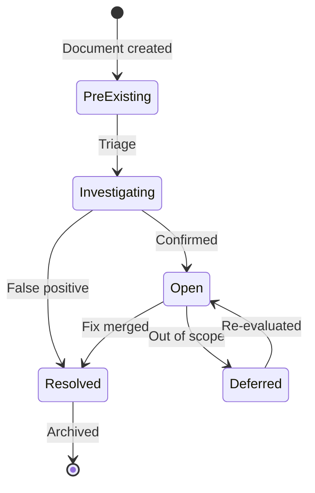

# Known Issues

Documented pre-existing issues not introduced by any recent phase.  
Do not misattribute to future phases.

---

## Pre-Existing (as of 2026-04-18)

| ID | File | Issue | Severity | Status | Introduced By |
|----|------|-------|----------|--------|---------------|
| KI-001 | `backend/tests/services/test_email_intake_agent.py` | `AttributeError: module 'app.api.hvac' has no attribute 'router'` — `building.py:63` included non-existent `hvac.router` | Major | ✅ Fixed 2026-04-18 | Pre-existing |
| KI-002 | `backend/app/startup/events.py:72` | `ruff F823` — undefined name (pre-existing) | Minor | ✅ Fixed 2026-04-18 (not reproduced in current ruff) | Pre-existing |

---

## Resolved

_(moved here when closed)_
