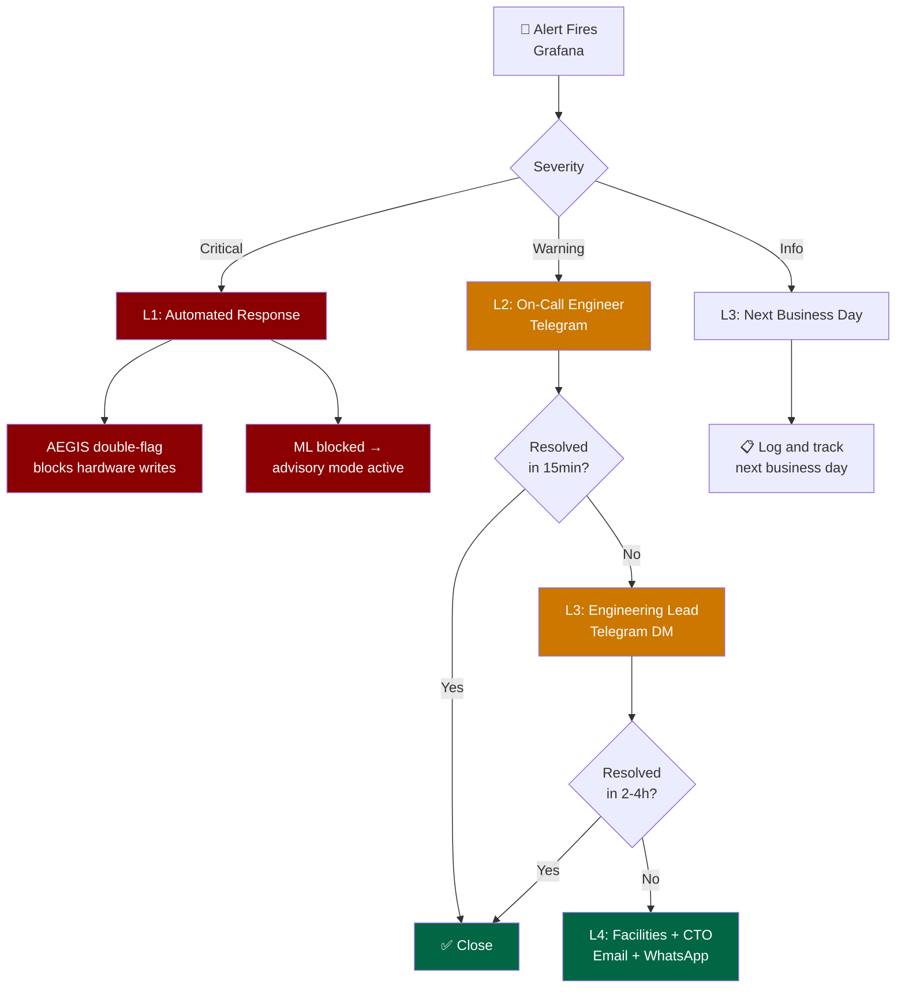

# Alert Escalation SOP

## Overview

SENTINEL emits Prometheus alerts via Grafana. This document defines the
severity taxonomy, escalation chain, and on-call procedures.

## Severity Definitions

| Severity | Definition | Response SLA |
|----------|------------|-------------|
| **Critical** | Active safety violation, AEGIS engaged, ML inference completely blocked | 15 minutes |
| **Warning** | Data freshness violation, shadow mode degraded, prediction quality below threshold | 1 hour |
| **Info** | Routine operational events, mode transitions | Next business day |

## Escalation Chain

### Level 1 - Automated Response (0-15 min)

Automated systems act without human intervention:
- Safety violations -> AEGIS double-flag blocks all hardware writes
- ML inference blocked -> advisory mode activates, recommendations still generated

### Level 2 - On-Call Engineer (15 min - 2 hours)

Notified via Telegram (primary, via Sentry gateway bot):

*WhatsApp/Twilio — pending wiring (see contact_points.yaml).*

| Alert | On-Call Action |
|-------|----------------|
| `DataFreshnessViolation` | Check BMS connectivity; verify data pipeline; check Supabase `log_sources` |
| `ShadowModeDegraded` | Check SentinelDataSync heartbeat; verify integration_repository connectivity |
| `AegisModeEngaged` | Assess building state; prepare manual override if needed |
| `SafetyViolationAlert` | Identify equipment; engage facilities manager |

### Level 3 - Engineering Lead (2-4 hours)

If Level 2 unresolved:
- Telegram message to Engineering Lead (direct bot DM or escalation group)
- Engineering Lead assesses scope and coordinates fix

### Level 4 - Head of Facilities + CTO (4+ hours)

Business impact:
- Building systems operating in degraded mode
- SENTINEL advisory only, no automated control
- Notify building management via email (sentinel-email-exec) and direct WhatsApp

## On-Call Rotation

On-call schedule managed via the Sentry Telegram bot escalation group.

Current rotation: See Sentry configuration.

*Note: PagerDuty and Slack are NOT used at FNB REMS. WhatsApp/Twilio is pending wiring.*

## Alert Reference

| Alert Name | Source | Severity | SLO |
|------------|--------|----------|-----|
| `DataFreshnessViolation` | sentinel_data_sync | Warning | < 4h |
| `ShadowModeDegraded` | shadow_mode_polling | Warning | < 1h |
| `SafetyViolationAlert` | safety_interlocks | Critical | < 15m |
| `AegisModeEngaged` | aegis_service | Critical | < 15m |
| `LLMJudgeLowScore` | llm_judge_loop | Warning | < 4h |

## Grafana Dashboard

Alert status: https://grafana.internal/d/sentinel-alerts

## Contacts

| Role | Name | Contact |
|------|------|---------|
| On-Call Engineer | Sentry Telegram bot | Via `sentinel-telegram` contact point |
| Engineering Lead | | Telegram DM |
| Facilities Manager | | WhatsApp (pending) |
| Executive Stakeholders | | Email via `sentinel-email-exec` |

## Grafana Contact Points

Alert routing configured in `infrastructure/grafana/provisioning/alerting/contact_points.yaml`:

| Contact Point | Type | Status |
|---------------|------|--------|
| `sentinel-telegram` | Telegram (Sentry gateway bot) | **ACTIVE** — primary |
| `sentinel-whatsapp` | WhatsApp/Twilio | **PENDING** — not wired |
| `sentinel-email-exec` | Email | **ACTIVE** — executive stakeholders |

*Slack and PagerDuty are NOT used at FNB REMS — see contact_points.yaml for commented-out entries.*

## Document History

| Date | Change | Author |
|------|--------|--------|
| 2026-04-18 | Initial version -- Phase 189 G8 | SENTINEL Architecture |
