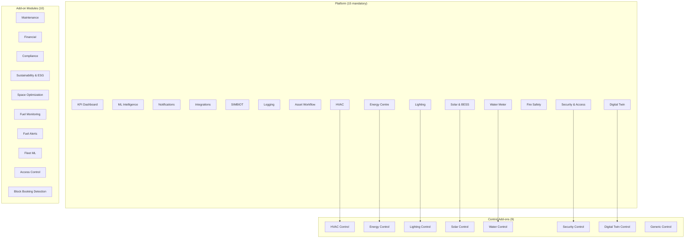

# Module Matrix Contract

This document is the canonical module contract used for planning and implementation alignment.

## Authoritative Sources

- Backend enum universe: `backend/app/models/module_registry.py` (`ModuleType`)
- Backend non-deactivatable rules: `backend/app/services/module_registry_service.py`
- API projection: `GET /api/modules/available` from `MODULE_DEFINITIONS`
- Frontend module type union: `frontend/src/lib/moduleRegistry.ts` (`ModuleType`)
- Frontend mandatory list: `frontend/src/lib/mandatoryModules.ts`

## Module Architecture

## Official Module Matrix (34 Types)

### Platform (15, always on — mandatory)

| Module ID | Description | Non-deactivatable |
|-----------|---|---:|
| `kpi` | KPI Dashboard & scorecards | Yes |
| `ml` | AI & ML intelligence | Yes |
| `notifications` | Alert delivery (Telegram, email, SMS) | Yes |
| `integrations` | BMS connectivity & health monitoring | Yes |
| `simbiot` | BMS onboarding & point mapping | Yes |
| `logging` | Audit trail, equipment diagnostics, event logs | Yes |
| `assets` | Asset lifecycle management | Yes |
| `hvac` | HVAC monitoring & zone control | Yes |
| `energy` | Energy Centre monitoring | Yes |
| `lighting` | Lighting control & DALI | Yes |
| `solar` | Solar & BESS monitoring | Yes |
| `water` | Water consumption & leak monitoring | Yes |
| `fire` | Fire safety (read-only) | Yes |
| `security` | Access control & CCTV | Yes |
| `digital_twin` | 3D/2D spatial visualization | Yes |

### Building System Control Add-ons (9)

| Module ID | Description | Controls |
|-----------|---|---|
| `hvac_control` | HVAC control features | Setpoints, scheduling, automation |
| `energy_control` | Energy control | Peak shaving, load shedding, generator |
| `lighting_control` | Lighting control | DALI scenes, daylight harvesting |
| `solar_control` | Solar/BESS control + AEGIS | AEGIS dispatch, BESS arbitrage |
| `water_control` | Water control | Valve automation, leak response |
| `security_control` | Security control | Door lock commands, access schedules |
| `digital_twin_control` | Digital Twin write actions | Write from twin interface |
| `control` | Generic Control | Master gate for all write operations |

### Add-on Modules (10)

| Module ID | Description |
|-----------|---|
| `maintenance` | Work order lifecycle, scheduling, dispatch |
| `financial` | Contracts, profitability, budget, SLA, billing |
| `compliance` | Carbon Tax, Green Star, SANS, ESG |
| `sustainability` | Carbon tracking, ESG reporting |
| `space_optimization` | Ghost booking, right-sizing, focus rooms |
| `fuel_monitoring` | Diesel/fuel tank monitoring, theft detection |
| `fuel_alerts` | Fuel event notifications (theft, leak, low) |
| `fleet_ml` | Cross-portfolio analytics & benchmarking |
| `access` | Access control, badge readers, occupancy |
| `block_booking` | Meeting room block booking detection |

## Key Rules

1. **No cascade dependencies.** Each control add-on is independent.
2. **Monitoring always on.** Base modules are always active; control toggles gate write features.
3. **Fire has no control toggle.** Fire safety is always read-only.
4. **Fuel Alerts requires Fuel Monitoring.** `fuel_alerts` depends on `fuel_monitoring`.
5. **Control requires advisory+ phase.** Toggles disabled in shadow/advisory mode.
