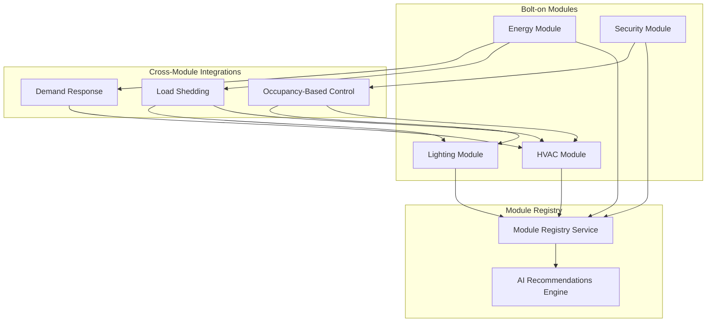

# Bolt-on Module Registry

The SENTINEL Module Registry enables a modular architecture where building subsystems operate as standalone "bolt-on" modules that automatically integrate when multiple modules are activated together.

## Overview



## Available Modules

| Module | ID | Description | Key Capabilities |
|--------|-----|-------------|------------------|
| **HVAC** | `hvac` | Heating, ventilation, air conditioning | Zone control, AHU monitoring, chiller control, comfort analysis |
| **Energy** | `energy` | Energy centre & power distribution | Generator SCADA, ATS monitoring, power metering, UPS monitoring, SLD visualization |
| **Security** | `security` | Access control & CCTV | Door access, CCTV integration, occupancy tracking, intrusion detection |
| **Lighting** | `lighting` | DALI lighting control | Luminaire control, scene management, daylight harvesting, emergency lighting |
| **Fire** | `fire` | Fire & life safety (read-only) | Alarm monitoring, damper positions, HVAC shutdown |
| **Access** | `access` | Access control standalone | Door status, badge events, after-hours scheduling |

## Cross-Module Integrations

When multiple modules are active, integrations are automatically created:

| Integration ID | Source → Target | Trigger | Action |
|----------------|-----------------|---------|--------|
| `hvac_energy_loadshed` | Energy → HVAC | ATS on generator | Increase setpoints by 2°C |
| `hvac_energy_demand` | Energy → HVAC | Peak demand warning | Pre-cool then reduce load |
| `energy_lighting_loadshed` | Energy → Lighting | ATS on generator | Reduce lighting 50% |
| `security_hvac_occupancy` | Security → HVAC | Zone occupancy change | Adjust zone setpoint |
| `security_lighting_occupancy` | Security → Lighting | Zone occupancy change | Adjust lighting level |

## Architecture

### Backend Components

```
backend/app/
├── models/
│   └── module_registry.py      # Module types, capabilities, integration definitions
├── services/
│   └── module_registry_service.py  # Module activation, AI recommendations
├── api/
│   └── modules.py              # REST API endpoints
└── data/
    └── modules/
        └── site_modules.json   # Per-site module configurations
```

### Frontend Components

```
frontend/src/
├── lib/
│   └── moduleRegistry.ts       # API client and TypeScript types
├── contexts/
│   └── ModuleContext.tsx       # React context for module state
└── components/
    └── modules/
        ├── ModularDashboard.tsx      # Dynamic module dashboard loading
        ├── ModuleSelector.tsx        # Activate/deactivate modules UI
        ├── AIRecommendationsPanel.tsx # Unified AI recommendations
        └── IntegrationStatusBar.tsx  # Active integrations display
```

## API Reference

### List Available Modules

```http
GET /api/modules/available
```

Response:
```json
[
  {
    "module_type": "energy",
    "name": "Energy Centre",
    "version": "1.0.0",
    "description": "Generator, power metering, UPS, and electrical distribution monitoring",
    "capabilities": [
      {"id": "generator_scada", "name": "Generator SCADA", "description": "..."},
      {"id": "ats_monitoring", "name": "ATS Monitoring", "description": "..."}
    ],
    "integrates_with": ["hvac", "security", "lighting"],
    "ai_features": ["generator_predictive", "load_shedding_optimization"]
  }
]
```

### Activate Module

```http
POST /api/modules/activate
Content-Type: application/json

{
  "site_id": "sandton",
  "site_name": "Sandton Data Centre",
  "module_type": "hvac",
  "config": {
    "zone_control": true,
    "comfort_analysis": true
  }
}
```

Response:
```json
{
  "instance_id": "sandton-hvac-abc123",
  "site_id": "sandton",
  "module_type": "hvac",
  "status": "active",
  "activated_at": "2026-01-31T10:00:00Z",
  "health_score": 100.0
}
```

### Get Integration Summary

```http
GET /api/modules/site/{site_id}/integration
```

Response:
```json
{
  "site_id": "sandton",
  "site_name": "Sandton Data Centre",
  "active_modules": [
    {"type": "energy", "name": "Energy Centre", "health": 95.0, "status": "active"},
    {"type": "hvac", "name": "HVAC Control", "health": 98.0, "status": "active"}
  ],
  "active_integrations": [
    {
      "id": "hvac_energy_loadshed",
      "name": "HVAC Load Shedding",
      "description": "Reduce HVAC load when on generator power",
      "source": "energy",
      "target": "hvac"
    }
  ],
  "potential_integrations": [
    {
      "id": "security_hvac_occupancy",
      "name": "Occupancy-Based HVAC",
      "requires_module": "security"
    }
  ],
  "ai_enabled": true,
  "pending_recommendations": 3
}
```

### Get AI Recommendations

```http
GET /api/modules/site/{site_id}/recommendations?modules=energy,hvac&priorities=high,critical
```

Response:
```json
[
  {
    "recommendation_id": "rec-abc123",
    "timestamp": "2026-01-31T10:30:00Z",
    "source_module": "energy",
    "recommendation_type": "cross_system",
    "priority": "high",
    "title": "Load Shedding - HVAC Optimization",
    "description": "Mains power unavailable. Recommend reducing HVAC load to extend generator runtime.",
    "confidence": 0.92,
    "related_modules": ["hvac"],
    "auto_actionable": true,
    "acknowledged": false,
    "resolved": false
  }
]
```

### Deactivate Module

```http
POST /api/modules/site/{site_id}/deactivate/{module_type}
```

## React Integration

### ModuleProvider Setup

Wrap your application with the `ModuleProvider`:

```tsx
import { ModuleProvider } from '@/contexts/ModuleContext';

function App() {
  return (
    <ModuleProvider initialSiteId="sandton" initialSiteName="Sandton Data Centre">
      <ModularDashboard siteId="sandton" />
    </ModuleProvider>
  );
}
```

### Using Module Hooks

```tsx
import {
  useModules,
  useModuleActive,
  useCriticalRecommendations,
  useCrossSystemRecommendations
} from '@/contexts/ModuleContext';

function Dashboard() {
  // Full module management
  const {
    activeModules,
    activateModule,
    deactivateModule,
    recommendations,
    integrationSummary
  } = useModules();

  // Check if specific module is active
  const isEnergyActive = useModuleActive('energy');

  // Get critical recommendations across all modules
  const criticalRecs = useCriticalRecommendations();

  // Get cross-system recommendations
  const crossSystemRecs = useCrossSystemRecommendations();

  // Activate a module
  const handleActivate = async () => {
    await activateModule('security', { occupancy_tracking: true });
  };

  return (
    <div>
      {isEnergyActive && <EnergyCentreDashboard />}
      {criticalRecs.length > 0 && <AlertBanner count={criticalRecs.length} />}
    </div>
  );
}
```

### ModularDashboard Component

The `ModularDashboard` automatically loads active module dashboards:

```tsx
import { ModularDashboard } from '@/components/modules';

function BuildingView() {
  return (
    <ModularDashboard
      siteId="sandton"
      siteName="Sandton Data Centre"
      showModuleSelector={true}
      showRecommendations={true}
    />
  );
}
```

## Adding a New Module

### 1. Define Module Type

Add to `backend/app/models/module_registry.py`:

```python
class ModuleType(str, Enum):
    # ... existing types
    SOLAR = "solar"

MODULE_DEFINITIONS[ModuleType.SOLAR] = ModuleDefinition(
    module_type=ModuleType.SOLAR,
    name="Solar PV",
    version="1.0.0",
    description="Solar photovoltaic monitoring and optimization",
    capabilities=[
        ModuleCapability("inverter_monitoring", "Inverter Monitoring", "Monitor inverter status"),
        ModuleCapability("production_tracking", "Production Tracking", "Track energy production"),
    ],
    integrates_with=[ModuleType.ENERGY, ModuleType.HVAC],
    telemetry_points=["pv_power_kw", "battery_soc", "grid_export_kw"],
    ai_features=["production_forecasting", "battery_optimization"]
)
```

### 2. Define Integrations

```python
INTEGRATION_DEFINITIONS["solar_energy_export"] = {
    "name": "Solar Export Optimization",
    "description": "Optimize grid export based on tariff periods",
    "source": ModuleType.SOLAR,
    "target": ModuleType.ENERGY,
    "trigger": "tou_period_change",
    "action": "adjust_export_limit",
}
```

### 3. Create Frontend Dashboard

Create `frontend/src/components/solar/SolarDashboard.tsx`:

```tsx
export function SolarDashboard({ siteId }: { siteId: string }) {
  // Dashboard implementation
}
```

### 4. Register in ModularDashboard

Add lazy import in `ModularDashboard.tsx`:

```tsx
const SolarDashboard = lazy(() =>
  import('../solar/SolarDashboard').then(m => ({ default: m.SolarDashboard }))
);

// In getModuleDashboard function:
case 'solar':
  return <SolarDashboard siteId={siteId} />;
```

## AI Recommendations

### Recommendation Types

| Type | Description |
|------|-------------|
| `optimization` | Performance or efficiency improvement |
| `maintenance` | Preventive or predictive maintenance |
| `alert` | Immediate attention required |
| `cross_system` | Involves multiple modules |
| `predictive` | AI-predicted future issue |

### Priority Levels

| Priority | Color | Description |
|----------|-------|-------------|
| `critical` | Red | Immediate action required |
| `high` | Amber | Attention needed soon |
| `medium` | Blue | Schedule for review |
| `low` | Gray | Informational |

### Adding Recommendations from Modules

Modules can add recommendations via the API or directly:

```python
from app.services.module_registry_service import module_registry
from app.models.module_registry import AIRecommendation, ModuleType, RecommendationType, RecommendationPriority

recommendation = AIRecommendation(
    recommendation_id=f"gen-health-{uuid.uuid4().hex[:8]}",
    timestamp=datetime.utcnow().isoformat(),
    source_module=ModuleType.ENERGY,
    recommendation_type=RecommendationType.MAINTENANCE,
    priority=RecommendationPriority.HIGH,
    title="Generator Battery Degradation",
    description="Generator 2 battery voltage trending below threshold. Schedule replacement.",
    confidence=0.87,
    related_modules=[],
    telemetry_context={"battery_voltage": 24.8, "threshold": 25.0},
    auto_actionable=False
)

module_registry.add_recommendation("sandton", recommendation)
```

## Configuration

### Site Module Configuration

Stored in `backend/app/data/modules/site_modules.json`:

```json
{
  "sandton": {
    "site_id": "sandton",
    "site_name": "Sandton Data Centre",
    "active_modules": [
      {
        "instance_id": "sandton-energy-001",
        "site_id": "sandton",
        "module_type": "energy",
        "status": "active",
        "activated_at": "2026-01-15T08:00:00Z",
        "config": {
          "generator_scada": true,
          "predictive_maintenance": true
        },
        "health_score": 95.0
      }
    ],
    "cross_module_links": [
      {
        "link_id": "sandton-hvac_energy_loadshed",
        "source_module": "energy",
        "target_module": "hvac",
        "integration_type": "hvac_energy_loadshed",
        "enabled": true
      }
    ],
    "ai_enabled": true,
    "auto_integration": true
  }
}
```

## Troubleshooting

### Module Not Activating

1. Check site configuration exists in `site_modules.json`
2. Verify module type is valid (see `ModuleType` enum)
3. Check backend logs for activation errors

### Integrations Not Creating

1. Ensure `auto_integration` is `true` for the site
2. Verify both modules are active
3. Check integration definition exists in `INTEGRATION_DEFINITIONS`

### Recommendations Not Appearing

1. Check `ai_enabled` is `true` for the site
2. Verify module is generating recommendations
3. Check recommendation filters (module, priority)

## Related Documentation

- [Energy Centre Integration](../07-integrations/energy-centre.md)
- [Generator SCADA](../07-integrations/generator-scada.md)
- [Load Shedding Optimization](../14-south-africa-context/load-shedding-optimization.md)
