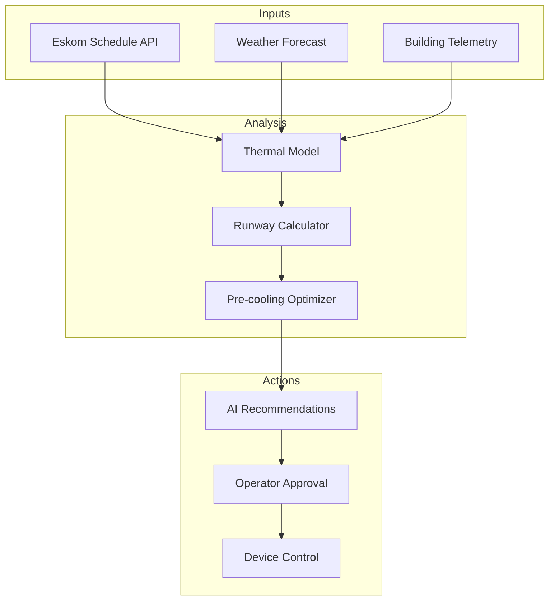
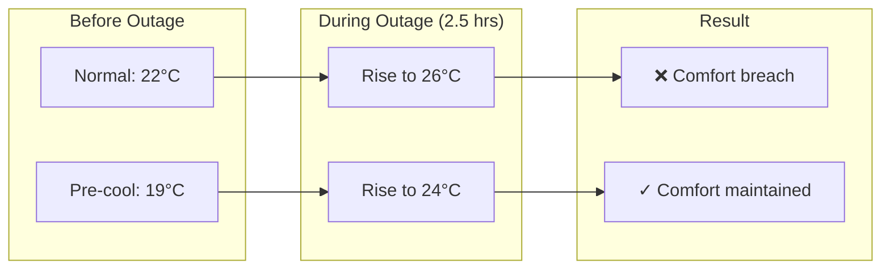
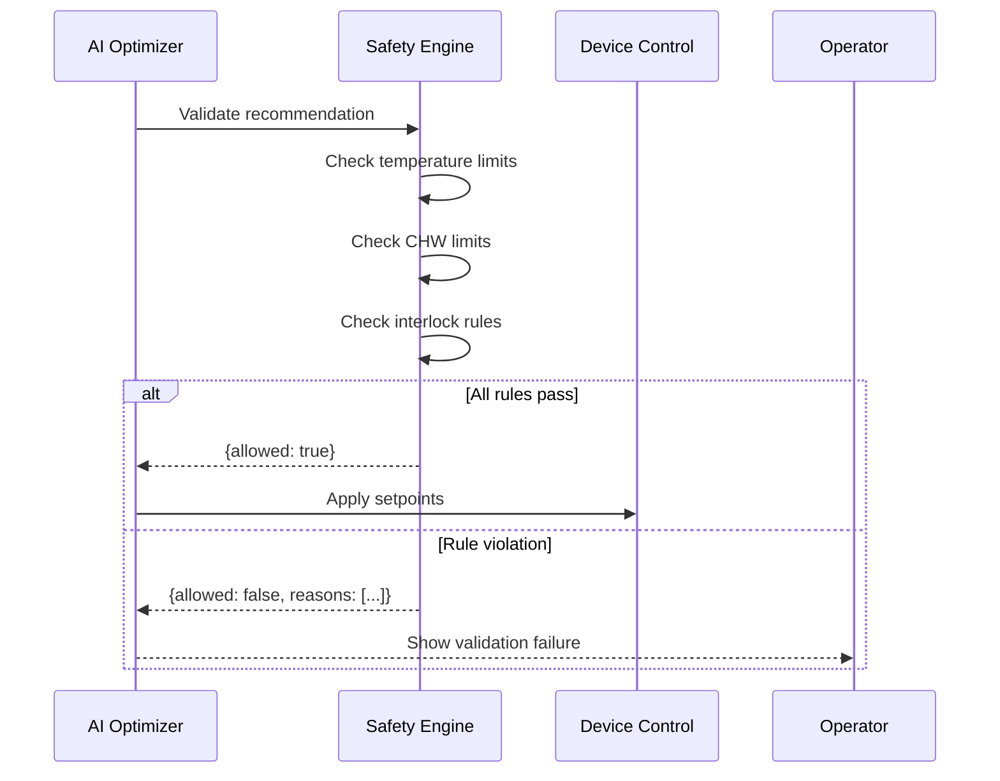

# Load Shedding Optimization

SENTINEL provides intelligent HVAC optimization for South African buildings affected by Eskom load shedding. The system calculates thermal runway, recommends pre-cooling strategies, and helps maintain occupant comfort during power outages.

## Overview

Load shedding presents unique challenges for building management:

- **Unpredictable schedules**: Stages change with little notice
- **Comfort impact**: Buildings heat up rapidly without cooling
- **Energy costs**: Recovery after outages is expensive
- **Tenant satisfaction**: Uncomfortable conditions affect productivity

SENTINEL addresses these through:



## Load shedding schedule integration

### Eskom status endpoint

SENTINEL tracks current load shedding stage and forecasted schedules:

```bash
# Get current Eskom status
curl http://localhost:9095/api/optimization/eskom-status
```

Response:
```json
{
  "current_stage": 4,
  "updated_at": "2026-01-30T14:00:00Z",
  "next_stages": [
    {"stage": 4, "start_time": "14:00", "end_time": "16:00"},
    {"stage": 4, "start_time": "16:00", "end_time": "18:00"},
    {"stage": 2, "start_time": "18:00", "end_time": "20:00"}
  ],
  "area_schedules": {
    "site-001": [
      {"stage": 4, "start_time": "16:00", "end_time": "18:30"}
    ]
  }
}
```

### Site-specific schedules

Get load shedding schedule for a specific building:

```bash
# Get schedule for Gateway Theatre
curl http://localhost:9095/api/optimization/eskom-status/site-001
```

Response:
```json
{
  "site_id": "site-001",
  "site_name": "Gateway Theatre",
  "current_stage": 4,
  "schedules": [
    {"stage": 4, "start_time": "16:00", "end_time": "18:30"}
  ],
  "next_outage": {
    "stage": 4,
    "start_time": "16:00",
    "end_time": "18:30"
  }
}
```

## Thermal model

### Core concepts

The thermal model predicts how building temperature changes during outages based on:

| Parameter | Description | Typical Range |
|-----------|-------------|---------------|
| Thermal mass | Building's ability to store heat | 0.6-0.9 |
| Insulation factor | How well building retains temperature | 0.4-0.8 |
| Internal heat gain | Heat from people, equipment, lighting | 0.3-0.7 |
| Outside temperature | Ambient conditions | 20-40°C |
| Solar load | Direct sun exposure factor | 0.0-1.0 |

### Thermal runway calculation

Thermal runway = minutes until building temperature exceeds comfort limit:

```python
def calculate_thermal_runway(
    current_temp: float,      # Current inside temperature (°C)
    comfort_limit: float,     # Maximum acceptable temperature (°C)
    building_params: Dict,    # Building thermal characteristics
    weather_forecast: Dict    # Weather conditions
) -> int:
    """
    Calculate minutes until comfort breach.

    Physics model:
    temperature_change = (outside_temp - inside_temp) × heat_transfer_coefficient
                       + internal_heat_gain

    Returns minutes until building reaches comfort_limit.
    """
```

### Example calculation

```bash
# Calculate thermal runway for Gateway Theatre
curl "http://localhost:9095/api/optimization/thermal-runway?site_id=site-001&current_temp=22.4&comfort_limit=26.0"
```

Response:
```json
{
  "site_id": "site-001",
  "site_name": "Gateway Theatre",
  "current_temperature": 22.4,
  "comfort_limit": 26.0,
  "thermal_runway_minutes": 87,
  "comfort_breach_time": "2026-01-30T15:27:00Z",
  "calculation_method": "thermal_model",
  "building_params": {
    "thermal_mass": 0.8,
    "insulation_factor": 0.6,
    "internal_heat_gain": 0.5
  },
  "weather_forecast": {
    "outside_temp": 32.0,
    "solar_load": 0.7,
    "humidity": 65
  }
}
```

### Building profiles

SENTINEL includes pre-configured profiles for common South African buildings:

| Building | Thermal Mass | Insulation | Heat Gain | Notes |
|----------|--------------|------------|-----------|-------|
| Gateway Theatre | 0.8 | 0.6 | 0.5 | Concrete, moderate insulation |
| Sandton City | 0.7 | 0.7 | 0.6 | Modern office, good insulation |
| Centurion Mall | 0.9 | 0.5 | 0.7 | Older building, high occupancy |

## Pre-cooling strategy

### How pre-cooling works

Pre-cooling lowers building temperature before a scheduled outage, providing thermal "buffer":



### Pre-cooling benefits

The `calculate_precooling_benefit` function estimates additional runway from pre-cooling:

```python
def calculate_precooling_benefit(
    building_params: Dict,
    pre_cooling_temp: float,      # Target pre-cool temperature (°C)
    pre_cooling_duration: int     # Pre-cooling time (minutes)
) -> int:
    """
    Calculate additional thermal runway minutes from pre-cooling.

    Benefits depend on:
    - Building thermal mass (higher = stores more "coolth")
    - Insulation factor (better = longer retention)
    - Pre-cooling depth (how far below normal)
    - Pre-cooling duration (how long to stabilize)

    Returns additional minutes of runway.
    """
```

### Typical results

| Building Type | Normal Runway | With Pre-cooling | Benefit |
|---------------|---------------|------------------|---------|
| High thermal mass | 90 min | 145 min | +55 min |
| Moderate | 75 min | 115 min | +40 min |
| Low thermal mass | 60 min | 85 min | +25 min |

## AI optimization workflow

### 1. Analyze conditions

Request AI analysis of current building state:

```bash
curl -X POST http://localhost:9095/api/optimization/analyze \
  -H "Content-Type: application/json" \
  -d '{
    "site_id": "site-001",
    "current_conditions": {
      "inside_temp": 22.4,
      "outside_temp": 32.0,
      "humidity": 65
    },
    "weather_forecast": {
      "high_temp": 35.0,
      "solar_load": 0.8
    }
  }'
```

Response:
```json
{
  "success": true,
  "recommendation": {
    "id": "rec_20260130_001",
    "site_id": "site-001",
    "confidence": 0.87,
    "rationale": "Load shedding scheduled 16:00-18:30. Pre-cooling recommended to maintain comfort.",
    "setpoint_changes": [
      {
        "device_id": "001-gwc-ahu-001",
        "device_name": "AHU-1",
        "point_name": "cooling_setpoint",
        "current_value": 22.4,
        "recommended_value": 19.0,
        "reason": "Pre-cool for load shedding"
      },
      {
        "device_id": "001-gwc-chiller-001",
        "device_name": "Chiller 1",
        "point_name": "chw_setpoint",
        "current_value": 7.0,
        "recommended_value": 6.0,
        "reason": "Lower CHW for deeper pre-cooling"
      }
    ],
    "projected_savings": {
      "energy_kwh": 45.0,
      "cost_zar": 125.0,
      "comfort_benefit": "Maintains 24°C vs 27°C during outage"
    },
    "timing": {
      "start_pre_cooling": "14:30",
      "outage_start": "16:00",
      "outage_end": "18:30",
      "recovery_complete": "19:00"
    }
  },
  "validation": {
    "allowed": true,
    "warnings": [],
    "reasons": []
  }
}
```

### 2. Review and approve

Operators review recommendations in the dashboard and approve:

```bash
curl -X POST http://localhost:9095/api/optimization/approve \
  -H "Content-Type: application/json" \
  -H "X-User-Id: operator@example.com" \
  -d '{
    "recommendation_id": "rec_20260130_001",
    "site_id": "site-001",
    "setpoints_to_apply": [
      {
        "device_id": "001-gwc-ahu-001",
        "point_name": "cooling_setpoint",
        "value": 19.0
      },
      {
        "device_id": "001-gwc-chiller-001",
        "point_name": "chw_setpoint",
        "value": 6.0
      }
    ]
  }'
```

Response:
```json
{
  "success": true,
  "results": [
    {
      "device_id": "001-gwc-ahu-001",
      "point_name": "cooling_setpoint",
      "success": true,
      "value": 19.0
    },
    {
      "device_id": "001-gwc-chiller-001",
      "point_name": "chw_setpoint",
      "success": true,
      "value": 6.0
    }
  ],
  "message": "Applied 2 of 2 setpoints"
}
```

### 3. Monitor status

Check optimization status for a site:

```bash
curl http://localhost:9095/api/optimization/status/site-001
```

Response:
```json
{
  "site_id": "site-001",
  "site_name": "Gateway Theatre",
  "optimization_enabled": true,
  "optimization_status": "optimized",
  "optimization_settings": {
    "mode": "supervised",
    "last_analysis": "2026-01-30T14:30:00Z",
    "analysis_interval_minutes": 15
  },
  "last_optimization": "2026-01-30T14:35:00Z",
  "optimization_history": [
    {
      "timestamp": "2026-01-30T14:35:00Z",
      "action": "approved",
      "result": "success",
      "user": "operator@example.com",
      "details": {
        "recommendation_id": "rec_20260130_001",
        "setpoints_applied": 2
      }
    }
  ]
}
```

## Safety integration

### Pre-cooling limits

Pre-cooling recommendations are validated against safety rules:

| Limit | Minimum | Maximum | Reason |
|-------|---------|---------|--------|
| Zone temperature | 16°C | 28°C | Occupant comfort |
| CHW setpoint | 5°C | 12°C | Prevent freeze damage |
| Pre-cool duration | 30 min | 120 min | Energy efficiency |

### Validation flow



## Best practices

### 1. Start pre-cooling early

Begin pre-cooling 60-90 minutes before scheduled outage:

| Building Type | Pre-cool Start | Reason |
|---------------|----------------|--------|
| High thermal mass | 90 min | Needs time to cool mass |
| Moderate | 60 min | Balance energy and comfort |
| Low thermal mass | 45 min | Cools quickly but loses quickly |

### 2. Don't over-cool

Aggressive pre-cooling wastes energy:

```
❌ Pre-cool to 16°C = 3x energy cost, minimal extra benefit
✓ Pre-cool to 19°C = 1.5x energy cost, significant benefit
```

### 3. Monitor weather

Hot, sunny days require more aggressive strategies:

| Conditions | Strategy |
|------------|----------|
| Cool, cloudy | Light pre-cooling (1-2°C below normal) |
| Warm, sunny | Moderate pre-cooling (2-3°C below normal) |
| Hot, sunny | Aggressive pre-cooling (3-4°C below normal) |

### 4. Track actual vs predicted

Compare thermal model predictions with actual performance:

```python
# After outage, compare prediction vs reality
actual_breach_time = measure_actual_breach()
predicted_breach_time = thermal_model_prediction

accuracy = 1 - abs(actual - predicted) / predicted
# Aim for >85% accuracy
```

## Troubleshooting

### Comfort breach despite pre-cooling

1. Check if pre-cooling started on time
2. Verify CHW setpoint was actually lowered
3. Check for unexpected heat loads (large gatherings, sun exposure)
4. Review building thermal parameters for accuracy

### Recommendations blocked by safety

1. Check safety rule limits
2. Verify recommended values are within range
3. Review interlock conditions
4. Consider adjusting safety rules if overly restrictive

### Thermal model inaccuracy

1. Calibrate building parameters with actual measurements
2. Update weather forecast integration
3. Account for internal heat variations (occupancy, equipment)
4. Consider seasonal adjustments

## API reference

| Endpoint | Method | Description |
|----------|--------|-------------|
| `/api/optimization/eskom-status` | GET | Get current load shedding status |
| `/api/optimization/eskom-status/{site_id}` | GET | Get site-specific schedule |
| `/api/optimization/thermal-runway` | GET | Calculate thermal runway |
| `/api/optimization/analyze` | POST | Analyze and get recommendations |
| `/api/optimization/approve` | POST | Apply approved recommendations |
| `/api/optimization/status/{site_id}` | GET | Get optimization status |
| `/api/optimization/toggle/{site_id}` | POST | Enable/disable optimization |

## Related documents

- [Safety Interlocks Engine](../06-safety-compliance/safety-interlocks-engine.md) - Safety validation for pre-cooling
- [Hybrid AI Routing](../08-ai-ml/hybrid-ai-routing.md) - AI analysis capabilities
- [Audit Logging](../06-safety-compliance/audit-logging.md) - Optimization action logging
