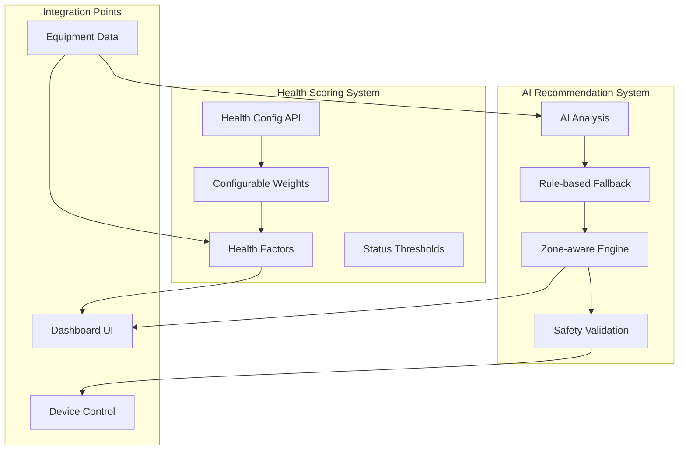

# Documentation Summary - AI Recommendation & Health Systems

## Created Documents

### 1. AI Recommendation System
**Location:** `docs/08-ai-ml/ai-recommendation-system.md`

Comprehensive documentation covering:
- Architecture (Backend/Frontend components)
- Zone-aware optimization (Zone types, priorities, exposure)
- Recommendation types (Zone temp, CHW, Humidity, Fan speed)
- AI analysis flow (Claude mode + Rule-based fallback)
- Load shedding mode (Priority-based optimization)
- API endpoints (Analyze, Approve, Status)
- Safety validation
- Best practices & troubleshooting

### 2. Health Scoring System
**Location:** `docs/04-features/health-scoring-system.md`

Comprehensive documentation covering:
- Health factor calculation (Age, Service, Runtime, Faults)
- Health status classification (normal/warning/critical)
- Health threshold configuration (Per-equipment-type)
- API endpoints (Get/Update config, Get equipment health)
- Configuration management (Adding types, modifying weights)
- Frontend configuration editor
- Integration with equipment data
- Best practices & troubleshooting

---

## System Overview



---

## Quick Reference

### AI Recommendation Endpoints

| Endpoint | Method | Purpose |
|----------|--------|---------|
| `/api/optimization/analyze` | POST | Generate recommendations |
| `/api/optimization/analyze-load-shedding` | POST | Load-shedding-aware recommendations |
| `/api/optimization/approve` | POST | Apply recommendations |
| `/api/optimization/status/{site_id}` | GET | Get optimization status |
| `/api/optimization/toggle/{site_id}` | POST | Enable/disable optimization |

### Health Scoring Endpoints

| Endpoint | Method | Purpose |
|----------|--------|---------|
| `/api/health-config` | GET | List all configurations |
| `/api/health-config/{type}` | GET | Get equipment type config |
| `/api/health-config/{type}` | PUT | Update configuration |
| `/api/equipment/{id}/health` | GET | Get equipment health |

---

## Key Files

### Backend
- `backend/app/api/optimization.py` - Optimization API
- `backend/app/api/health_config.py` - Health config API
- `backend/app/services/ai_optimizer.py` - AI optimizer service
- `backend/app/services/health_threshold_service.py` - Health threshold service
- `backend/app/data/health_calculation_config.json` - Health thresholds

### Frontend
- `frontend/src/pages/OptimizationPage.tsx` - Optimization page
- `frontend/src/components/OptimizationPanel.tsx` - Optimization UI
- `frontend/src/components/Dashboard.tsx` - Health score display

---

## Configuration Examples

### Health Configuration (Chiller)

```json
{
  "equipment_type": "chiller",
  "weights": {
    "age": 0.25,
    "service": 0.30,
    "runtime": 0.25,
    "fault_history": 0.20
  },
  "thresholds": {
    "expected_life_years": 15,
    "service_interval_days": 90,
    "expected_runtime_hours": 60000
  }
}
```

### Zone Configuration (for AI Recommendations)

```python
Device(
    id="002-snd-ahu-L11",
    name="AHU L11",
    device_location=DeviceLocation(
        zone_type=ZoneType.OPEN_OFFICE,
        zone_priority=4,  # P4
        exposure=ExposureDirection.SOUTH,
        floor="FL11"
    )
)
```

---

## Status: ✅ Complete

All systems are now fully documented:

- ✅ AI Recommendation System - Complete with zone-aware optimization
- ✅ Health Scoring System - Complete with configurable thresholds
- ✅ Integration documentation - API endpoints and data flow
- ✅ Best practices - Configuration and troubleshooting guides
- ✅ Updated docs README - New documents indexed

---

## Related Documents

- [Load Shedding Optimization](14-south-africa-context/load-shedding-optimization.md) - South African context
- [Safety Interlocks Engine](06-safety-compliance/safety-interlocks-engine.md) - Safety validation
- [Device Abstraction Layer](02-architecture/device-abstraction-layer.md) - Device model
- [Asset Baseline Assessment](04-features/44-asset-baseline-assessment.md) - Condition monitoring
